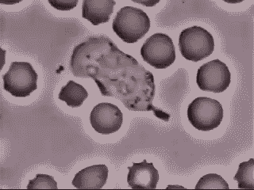
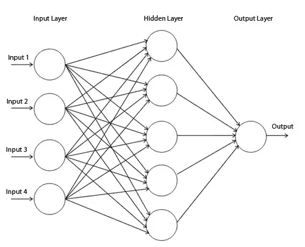

# 我们美丽的免疫系统在运行——模拟一个交互式神经网络

> 原文：<https://medium.com/coinmonks/our-beautiful-immune-system-in-action-modeling-an-interactive-neural-network-1abdb40a868c?source=collection_archive---------2----------------------->

White Blood Cell chasing and consuming a Bacterial Organism

继续我上一篇[文章](/@npattarone/emulating-gene-expression-in-prokaryotes-using-a-javascript-neural-network-fa61ceaa3ab6)的相关话题，我想介绍一个我做的小模拟，关于我们的白细胞如何追逐外部威胁，比如细菌。你可以在这里找到回购[。](https://github.com/npattarone/lymphocytes-and-bacterias)

# 基础知识

尽管很复杂，但我们的免疫系统可以用不同而迷人的方式追踪威胁，使用不同类型的白细胞，将它们分别放在几种方法上来做到这一点。

我简单模拟的基础是:

*   *细菌* **逃离白细胞**
*   *白细胞* **追逐细菌留下的化学痕迹**

实际上，这部分是正确的。我没有在代码上使用化学痕迹，因为这将导致主要的奉献和开发，这不是本教程的重点。比方说，我只让细菌随机运动，然后让它们从白细胞运动中学习，知道那些是它们不想去或不想去的地方。

# 该项目

如果你想了解更多关于神经网络的知识，你可以访问这个[教程](http://stevenmiller888.github.io/mind-how-to-build-a-neural-network/)，它包含了关于学习过程如何在神经网络内部发生的完整而详细的解释。

我使用了 *synaptic.js* 库，一个优秀的 javascript 库来开始这个主题的工作。它有一个很棒的 [wiki](https://github.com/cazala/synaptic/wiki) ,里面有一些例子，你可以基于这些例子进行自己的开发，最重要的是，它们真的很容易理解。

对于这个特殊的项目，我与建筑师对象一起工作。它允许您创建多层感知器，也称为前馈神经网络。它们由一系列层组成，每一层都与下一层完全相连。

Perceptron

因此，对于我们的情况，我们将需要两个不同的神经网络，用不同的数据进行训练。首先，我们有一种特殊的白细胞，即**淋巴细胞**；还有**细菌**本身。快速看一下下面的代码，但是不要太担心不同的值(你可以以后再玩；) ).

如你所见，它们都声明了一个**感知器**，具有不同的输入、隐藏和输出层值。让我们稍微修改一下:

*淋巴细胞*只定义 **3 输出**(也定义*细菌*)。你能想象为什么吗？让我们试着通过想象现实生活中实际发生的事情来抽象出我们的发展目标。淋巴细胞在我们的身体上自由地“随机”移动，每当细菌破坏环境时，它就会成为白细胞的目标，朝着它移动，以便“吃掉它”。好，基本上它会动，对吗？。

我的意图是让这变得更容易，并思考一个 ***2D 世界*** 上的动作。换句话说，我们将使用 ***向量*** (天啊！)和由 ***x*** 和 ***y*** 组成的坐标轴的值只有*。*

回到问题的核心，这个数字 **3** 代表将*淋巴细胞*(或*细菌*)移向特定位置所需的预期值，在训练结束时，我们的网将“出汗”出所有的值，预期值:淋巴细胞的细菌位置，以及淋巴细胞远离*细菌的位置*。很简单！

现在，看看我们的世界定义…

当然是细菌和淋巴细胞的集合！因此，请记住这一点，因为这是正确训练我们的网络的最重要的理解。这里我选择添加 **10 淋巴细胞**和 **2 菌苗**。因此，为了使输入对我们的任何有机体都有意义和正确，我们需要使用:它们的*(分解为 x 和 y 值)和它们的 ***速度*** (也分解 x 和 y 上的向量)来训练我们的网络。*

*因此，对于*淋巴细胞神经网络*，我们将有 **2 个分量用于位置**和 **2 个分量用于速度**，给我们总共 *4 个值乘以 2 个细菌等于* ***8*** 。*

*同样对于**细菌**， *4 个数值乘以 10 个淋巴细胞等于* ***40。****

*除了知道 *x* 和 *y* 值，我们还需要一个*角度*(咄！当然我记得高中的代数)，它决定了向量的方向。我们试图从这些价值观中“学习”,换句话说，训练我们的神经网络，让它尽可能准确地知道如何达到目标。*

*这里有几件事值得一提:*

1.  *这个神经网络以一种内聚的方式工作，这意味着每一组有机体都粘在一起。想象一个排的士兵行进到他们的敌人被设置路障的特定地点；他们必须在团队中工作，联合起来，这样他们才能尽可能的有效。*

*a) **细菌**“粘在一起”在这个特殊的练习中，这样可以更容易地在画布上描绘出来。我鼓励你在这一点上努力，让它变得更有趣:)，并尝试编码一组非依赖型细菌。*

*b) **淋巴细胞**也一样，然而在现实生活的例子中，它们实际上遵循化学轨迹。我们可以认为它们在我们体内随机传播，当突然遇到其中一个轨迹时，它们会立即开始跟随它。因此，让它们一起工作可能有一定的意义，但这也是出于实际原因。*

## *给我看看《T4 的汗水》*

1.  *让我们仔细看看训练过程，从 ***淋巴细胞*** 开始。*

*这段代码属于我们的 ***world.js*** 文件。首先，我们遍历淋巴细胞集合，在每个循环中，我们遍历细菌集合，并将它们的*位置*和*速度值*存储在一个数组中。接下来，我们用这个阵列来训练每个淋巴细胞，把网络“喂”到它应该移动的地方。此外，我们定义了一个学习率，可以修改它来“玩”网络行为的快慢/难易/快慢/错误。*

****目标*** 变量掌握着我之前所说的衔接。上面你可以快速浏览一下它是如何工作的。在负责基于属于我们世界的细菌定义和计算位置的几个函数后面(你可以在 GitHub 的项目源代码中更深入地查看它们)，它检索内聚值，从而允许淋巴细胞群*将*粘在一起，此外，跟随它们的*目标*，细菌。*

*最后，循环过程在画布上画出我们淋巴细胞的位置。细菌训练过程也遵循这一逻辑，但在学习向何处移动时略有不同。*

*2.*

***如果你想一会儿，你就会意识到这里发生了什么。 ***细菌*** 不想靠近淋巴细胞吧？所以它们的输入不能是淋巴细胞的位置，这导致我们除了淋巴细胞以外的任何位置。代码上写的差不多:我们用*随机位置和速度*训练我们的细菌网络，然后*去除*那些属于*淋巴细胞*的细菌。正因为如此，我们可能以少于 40 个输入*(因为我们的细菌网络需要被训练)结束，所以我们继续生成随机输入，直到达到 40 个。然后，我们把这些值输入网络，并把它画在画布上。****

****Sorry for the horrible resolution :)****

****就是这样！:)****

****希望你能像我写这篇文章时一样喜欢它！这个项目有大量的工作、改变、修改或游戏。让我知道进展如何！如果你真的喜欢它，请不要忘记鼓掌，这样每个人都可以享受它:)****