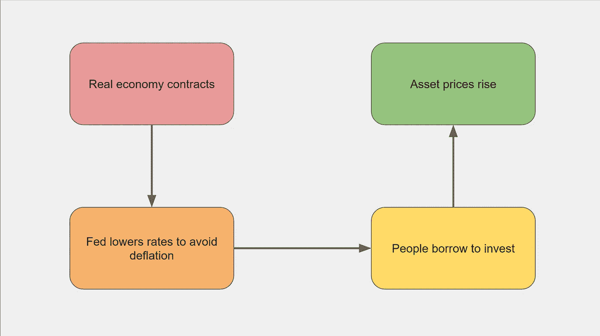

# 我们的狗屁经济完蛋了。

> 原文：<https://medium.com/coinmonks/our-bullshit-economy-is-doomed-48e45c70bbda?source=collection_archive---------2----------------------->

## 我们完全，罗圈腿，菲利普斯头拧。

听说过那个从摩天大楼上掉下来的家伙吗？在他走过每一层楼的时候，他不停地对自己说:到目前为止一切都好……到目前为止一切都好……――拉海雷

谷歌新闻(Google news)的一条通知中，标题不请自来地出现在我的屏幕上:*股市因刺激计划的希望而创下新高。*

*低能儿，*我心想。他们还是不明白。尽管实体经济疲软，但他们仍然认为股市(或比特币，或[住房](https://austingmackell.medium.com/how-a-basic-income-could-lower-housing-costs-2b1f1bb1cc28))很高。如果尽管出现了收缩，但它现在做得如此之好，想象一下当主街起死回生时，它会做得有多好？

但是华尔街高涨是因为实体经济的疲软。如果病毒消退，如果实体经济开始真正繁荣(两大如果)，那么美联储——与通胀目标一致——将不得不提高利率。新增贷款将会放缓，那些借钱投资的人需要开始增加还款。突然，熊会咆哮，廉价债务推动的贪婪狂欢会惊恐地嘎然而止。

当然，一些公司将受益于刺激计划导致的大众消费的增加。这将允许他们支付更高的股息，理论上允许他们的股东支付这些还款。但是一切都必须排列得恰到好处。被餐馆重新雇用的最低工资/小费工人都必须出去购买特斯拉，或者至少餐馆老板会这样做，假设特斯拉甚至能够满足这一增长的需求，以证明该股票的飙升价格是合理的。也许吧。随着向网上零售的转移被证明是永久性的，亚马逊的销售额也许会增加。但是*信号提前*呢？埃隆·马斯克在推特上发布了一款同名的加密聊天应用后，这家医疗保健公司的股价上涨了超过[6000 个百分点](https://qz.com/1956105/elon-musks-tweet-about-signal-boosts-shares-of-the-wrong-company/)？比特币呢？会不会突然开始分红？

这些投资的核心吸引力从来都不是回报，而是股本增长。股本的问题在于，你实际上不能花掉它，也不能用它来偿还银行。你必须销售才能做到这一点。这很好，只要有新的买家，但如果 QE 和低利率消失，这些买家将不复存在。就这样，噗的一声，所有的收益都没了。

或者更糟糕的是，他们没有，因为利率保持在低水平，因为实体经济继续在产能不足的情况下运行，“K 形复苏”继续，这意味着富人越来越富，而中产阶级停滞不前，下层阶级不稳定。那么，这种调整最终将是完全不同的政治性调整，而非经济性调整，这可能会更加可怕。

现在的情况是，华尔街*对主街*，这种情况已经持续了一段时间。央行分别于上世纪 80 年代和 90 年代引入的紧缩思维和通胀目标的结合，打乱了股市和实体经济之间本已脆弱的关系。

它是这样运作的:尽管生产率不断提高，但政府削减支出并抑制工资增长，因此经济转向通缩螺旋。在中央银行的步骤中，降低利率和购买经济中的多余债务，然后*瞧*，通货膨胀保持在正区域。在杠杆投资的支持下，股市上涨，现金匮乏的中产阶级家庭说服自己，他们实际上是实体百万富翁。他们任由信用卡被撕毁(或用自己的资产抵押借款来消费)，在一段时间内，这是件好事。但是越来越多的人——那些从未有机会获得资产的人——被越来越远地抛在后面。

如果政府介入财政方面的事情，以提高那些留下来的人的消费能力(并帮助中产阶级偿还信用卡还款)，那么我们将看到真正的通胀压力，利率——根据独立央行的技术官僚信仰——将会回升，给资产市场带来厄运。

## 我们是如何陷入这种危险的僵局的？

这与银行和货币在经济中的基本作用有关。主流经济学家、政治家、媒体和投资者[刻意忽略的东西](https://www.unprecedentedtimesmagazine.com/why_economists_are_wrong_about_economics)。

当利率上升时，资金更快地从经济中流出，回到金融部门，新的资金需要以新贷款的形式向相反的方向流动。我们的狗屁经济依赖于不断增长的债务水平，依赖于愿意承担这些债务的更大的傻瓜。

当音乐停止的时候，有人会被留下来收拾烂摊子。时间越长，包就越大。越多的“夫妻”投资者通过 gamestonks 或基于智能手机的加密交易应用程序或定价过高的投资物业参与进来，他们的臭粪便份额就越大。

因此，如果拜登政府确实履行了对民主党伯尼派的承诺，他们不仅会削弱华尔街的支持者，还会削弱郊区中产阶级的高端，这是他们刚刚从共和党手中赢得的核心投票群体。

不管怎样，除非我们的领导人接受激进的新思维，否则痛苦即将到来。

或许有可能解决问题，避免痛苦，平衡资产价格的缓慢下跌与收入和支出的增加，但这需要一个真正理解问题的政府。反过来，这将要求许多地位高的人承认他们错了，并采纳新的想法。在事情从令人担忧变成灾难之前，这似乎不太可能发生。在那之前，这将是一个“到目前为止一切都好…到目前为止一切都好…”

> 加入 Coinmonks [电报集团](https://t.me/joinchat/EPmjKpNYwRMsBI4p)，了解加密交易和投资

## 另外，阅读

*   什么是[闪贷](https://blog.coincodecap.com/what-are-flash-loans-on-ethereum)？
*   最好的[密码交易机器人](/coinmonks/crypto-trading-bot-c2ffce8acb2a) | [网格交易](https://blog.coincodecap.com/grid-trading)
*   [3 商业评论](/coinmonks/3commas-review-an-excellent-crypto-trading-bot-2020-1313a58bec92) | [Pionex 评论](/coinmonks/pionex-review-exchange-with-crypto-trading-bot-1e459d0191ea) | [Coinrule 评论](https://blog.coincodecap.com/coinrule-review-a-perfect-trading-bot)
*   [AAX 交易所评论](/coinmonks/aax-exchange-review-2021-67c5ea09330c) | [德里比特评论](/coinmonks/deribit-review-options-fees-apis-and-testnet-2ca16c4bbdb2) | [FTX 交易所评论](/coinmonks/ftx-crypto-exchange-review-53664ac1198f)
*   [n ave 零点回顾](/coinmonks/ngrave-zero-review-c465cf8307fc) | [Phemex 回顾](/coinmonks/phemex-review-4cfba0b49e28) | [PrimeXBT 回顾](/coinmonks/primexbt-review-88e0815be858)
*   [Bybit 交易所评论](/coinmonks/bybit-exchange-review-dbd570019b71) | [Bityard 评论](https://blog.coincodecap.com/bityard-reivew) | [CoinSpot 评论](https://blog.coincodecap.com/coinspot-review)
*   [3 commas vs crypto hopper](/coinmonks/3commas-vs-pionex-vs-cryptohopper-best-crypto-bot-6a98d2baa203)|[赚取加密利息](/coinmonks/earn-crypto-interest-b10b810fdda3)
*   最好的比特币[硬件钱包](/coinmonks/the-best-cryptocurrency-hardware-wallets-of-2020-e28b1c124069?source=friends_link&sk=324dd9ff8556ab578d71e7ad7658ad7c) | [BitBox02 回顾](/coinmonks/bitbox02-review-your-swiss-bitcoin-hardware-wallet-c36c88fff29)
*   [总帐 vs n 平均](https://blog.coincodecap.com/ngrave-vs-ledger) | [总帐 nano s vs x](https://blog.coincodecap.com/ledger-nano-s-vs-x)
*   [加密副本交易平台](/coinmonks/top-10-crypto-copy-trading-platforms-for-beginners-d0c37c7d698c) | [比特码副本交易](https://blog.coincodecap.com/bityard-copy-trading)
*   [Vauld Review](https://blog.coincodecap.com/vauld-review)|[you hodler Review](/coinmonks/youhodler-4-easy-ways-to-make-money-98969b9689f2)|[BlockFi Review](/coinmonks/blockfi-review-53096053c097)
*   最好的[加密税务软件](/coinmonks/best-crypto-tax-tool-for-my-money-72d4b430816b) | [硬币追踪评论](/coinmonks/cointracking-review-a-reliable-cryptocurrency-tax-software-5114e3eb5737)
*   最佳[加密借贷平台](/coinmonks/top-5-crypto-lending-platforms-in-2020-that-you-need-to-know-a1b675cec3fa) | [杠杆令牌](/coinmonks/leveraged-token-3f5257808b22)
*   [莱杰纳米 S vs 特雷佐 one vs 特雷佐 T vs 莱杰纳米 X](https://blog.coincodecap.com/ledger-nano-s-vs-trezor-one-ledger-nano-x-trezor-t)
*   [block fi vs Celsius](/coinmonks/blockfi-vs-celsius-vs-hodlnaut-8a1cc8c26630)|[Hodlnaut Review](https://blog.coincodecap.com/hodlnaut-review)
*   [Bitsgap 评审](https://blog.coincodecap.com/bitsgap-review) | [Quadency 评审](/coinmonks/quadency-review-a-crypto-trading-automation-platform-3068eaa374e1) | [Bitbns 评审](https://blog.coincodecap.com/bitbns-review)
*   [埃利帕尔泰坦评论](/coinmonks/ellipal-titan-review-85e9071dd029) | [赛克斯斯通评论](https://blog.coincodecap.com/secux-stone-hardware-wallet-review)
*   [DEX Explorer](https://explorer.bitquery.io/ethereum/dex)|[w](https://explorer.bitquery.io/graphql)|[local bitcoins 评论](https://blog.coincodecap.com/localbitcoins-review)
*   最佳[区块链分析](https://bitquery.io/blog/best-blockchain-analysis-tools-and-software)工具| [赚比特币](https://blog.coincodecap.com/earn-bitcoin)
*   加密套利指南:新手如何赚钱
*   最佳[加密制图工具](/coinmonks/what-are-the-best-charting-platforms-for-cryptocurrency-trading-85aade584d80) | [最佳加密交易所](/coinmonks/crypto-exchange-dd2f9d6f3769)
*   [如何在印度购买比特币](https://blog.coincodecap.com/buy-bitcoin-app-india)？
*   [印度比特币交易所](/coinmonks/bitcoin-exchange-in-india-7f1fe79715c9) | [比特币储蓄账户](https://blog.coincodecap.com/bitcoin-savings-account)
*   了解比特币最好的[书籍有哪些？](/coinmonks/what-are-the-best-books-to-learn-bitcoin-409aeb9aff4b)

> [直接在您的收件箱中获得最佳软件交易](/coinmonks/newsletters/coinmonks)

