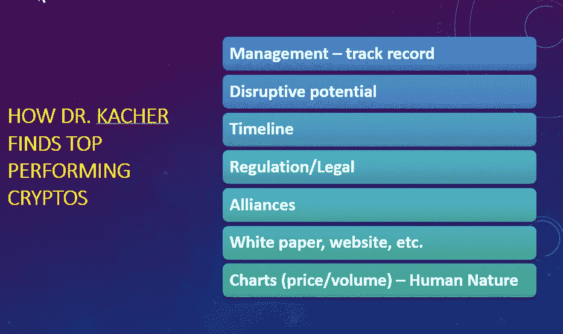

# 我们的主要选择是击中靶心

> 原文：<https://medium.com/coinmonks/our-main-picks-are-hitting-bullseyes-fe7d7e26e733?source=collection_archive---------5----------------------->

Image courtesy of BullsEye Crypto

克利斯·凯驰博士

如果你在谷歌上搜索我的名字，你会看到我被称为股票市场奇才，这是基于我在[毕马威会计师事务所核实过的记录](https://bit.ly/2BsswED)，以及我在书籍(Wiley & Sons 是我的主要出版商)和文章(MarketWatch，Forbes，Technical Analysis of Stocks&Commodities，等等)方面的大量出版物。在市场传奇人物威廉·奥尼尔精心挑选的投资组合经理团队中，我是表现最好的。我的奥尼尔 AUM 成长为低 9 位数。

也就是说，密码空间在所有空间中具有最高的风险/回报特征，甚至让 20 世纪 90 年代后期的网络公司相形见绌。在 2013 年初，我设计了一些指标，我将继续改进这些指标，以便我可以继续识别比特币的主要顶部和底部，有时直到出现高潮顶部或大规模投降的那一天。

**自 2013 年:**
2013 年 1 月 8 日:重大买入信号
2013 年 4 月 10 日:重大卖出信号
2013 年 10 月 14 日:重大买入信号
2013 年 12 月 11 日:重大卖出信号
2015 年 1 月 15 日:重大买入信号
2018 年 1 月 30 日:重大卖出信号
2019 年 3 月 18 日:重大买入信号

我的实际交易和/或各种出版物的时间戳市场需求支持了上述观点。我的指标是在回溯测试的基础上追溯到 2011 年，而上述市场电话都是实时完成的。回溯测试总是高度可疑的，除非被实时证明。

由于我总是关注质量而不是数量，我在去年多次提到的三种加密货币，如下所示，代表了我持有的大部分。

chain LINK(LINK):2019 年 4 月 2 日，我在 LINK 上发出了第一个[买入信号。**截至 2020 年 2 月 20 日:+723.0%。LINK 已经与包括谷歌、甲骨文、微软、英特尔和思科系统在内的大多数大公司达成了交易。它的市值目前约为 14 亿美元，是第 12 大硬币。鉴于其先发优势、网络效应和正在进行的交易，其市值可能会轻松飙升 10 倍，达到 140 亿美元。它的杀手锏是它的去中心化的神谕，使得链上和链下的区块链之间能够沟通。Oracles 充当代理来验证现实世界的数据，并准备将其记录在区块链的智能合同中。Chainlink 将智能合约与现实世界的数据、事件和支付联系起来，旨在 PayPal 和 Visa 等支付服务、汇丰银行和富国银行等银行以及以太坊和比特币等区块链之间建立桥梁。区块链互操作性是区块链未来成功的关键。**](https://www.virtueofselfishinvesting.com/reports/view/crypto-report-additional-names-4-2-19)

金恩(ENJ):2019 年 3 月 1 日，我在 ENJ 发出了第一个[买入信号。**截至 2020 年 2 月 20 日:+93.6%。** ENJ 对数字游戏项目进行代币化，并在区块链上开发游戏，玩家可以在这里对资产和角色进行代币化。由于游戏是分散的，数字物品和角色在所有游戏平台上都有价值。自 2019 年 12 月 6 日与微软](https://www.virtueofselfishinvesting.com/reports/view/crypto-report-top-performers-binance-bnb-maker-mkr-enjin-enj-and-theta-theta)达成[协议以来，ENJ 一直在发呆。ENJ 有可能成为不可替代的代币(NFT)市场的主导力量。](https://www.coindesk.com/microsoft-teams-up-with-enjin-to-offer-crypto-collectible-rewards)

第三个硬币是比特币(BTC)，因为比特币是战胜任何特定周期(包括牛市和熊市)的硬币。下面我给出物质原因。

2019 年，我买了 12 个硬币，我把它们减少到 7 个，这对我们的会员来说继续表现出色。投资的一个关键是，在削减或直接出售实力较弱的姐妹公司的同时，将资本注入表现出色的公司。[这是我推荐给会员的当前硬币列表](https://www.virtueofselfishinvesting.com/reports/filtered/crypto-picks?p=1&categories=cr)。

事实上，聚合到正确的名字需要更深入的分析。

在我自己的投资组合中，自 2019 年初以来，我多次购买了 BTC、林克和 ENJ。由于我的金字塔战略和价格表现，它们是我管理的投资组合中目前最大的三只股票。在我写这篇文章的时候，我总共拥有 7 枚硬币，但我现在关注的是几枚表现优于比特币的硬币。在 Vitalik Buterin 最近关于 ETH 2.0 的声明之后，Ethereuem 看起来更有前途。在此之前，有许多错误的信息提出了材料延迟，至少到 2021 年。事实上，ETH 将在今年和明年继续显著发展。

竞争对手 Tezos (XTZ)一直是表现最好的公司之一，因为其可扩展性超过了 ETH，而其自校正协议和链上治理使其能够管理网络修改，如可扩展性的改善。

我经常不止一次购买表现出色的硬币，同时减少表现落后的硬币的风险。力量产生力量。随着时间的推移，有机效应是资本集中到表现更好的硬币上，目的是大幅击败比特币，就像我在 2013 年和 2017 年的牛市中所做的那样。

我的策略简单来说就是:

加密货币的不对称是独一无二的。在牛市中，10 倍的收益是标准的，而 100 倍的收益是可能的。如果你坐在 9 个死了的硬币上，并且 1 个硬币是 10 英镑，你仍然不亏不赚。在实践中，由于仍然有很高的相关性，如果买对了名字，10 倍者比零倍者更有优势。

在上世纪 90 年代末，网络公司经历了一场巨大的冲击，但这是由于机构蜂拥而至。加密领域尚未出现这种情况，因为 2017 年是由散户资金推动的。在当前的牛市中，机构极有可能成为下一轮加密牛市的重要因素。随着比特币在 2018 年 12 月触底，我们已经进入牛市 15 个月了，因此鉴于无数的顺风和历史的指引，比特币和最佳替代硬币的牛市活动肯定还会持续一两年。

以下是比特币背后的几个顺风例子。我在 2017 年 11 月在日内瓦举行的金融科技大会上的主题演讲中做出的 100 万美元/BTC 的预测仍然基于比特币的历史价格趋势和顺风的数量:

关于**比特币(BTC)** 的说明:我的指标，其中一些显示在上面的图表中，已经在几周或更短的时间内预测了比特币的每一个主要顶部和底部，有时甚至是一天。2018 年 1 月 30 日，由于我的 metrics 在比特币中发出了一个主要的卖出信号，我个人在这一天出售了我所有的加密货币。然后我在 2018 年晚些时候才买了币安(BNB)。**我 2018 年的业绩是 2018 年上涨，而 2018 年的加密基金业绩中值是:-46% (** [**来源**](https://www.pwc.com/gx/en/financial-services/fintech/assets/pwc-elwood-2019-annual-crypto-hedge-fund-report.pdf) **)。**我们随后于 2019 年 3 月 18 日在 GBTC 发出[买入信号。](https://www.virtueofselfishinvesting.com/reports/view/vosi-voodoo-tm-report-the-demise-of-bitcoin-and-crypto-mania)

**我买卖的几个例子:**

当努里埃尔·鲁比尼等“思想(较少)领袖”宣称比特币没有价值时，我在各种公开发表的文章[这里](https://www.virtueofselfishinvesting.com/reports/view/crypto-report-nouriel-roubini-vs-blockchain-total-ko)和[这里](https://www.virtueofselfishinvesting.com/reports/view/premarket-pulse-7-15-19-the-dominant-left-vs-fiats-woes)和[这里](https://www.virtueofselfishinvesting.com/reports/view/market-lab-report-1-to-10-000-000-in-10-years-a-1-000-000-000-gain)以及这张幻灯片中反驳了这些观点:

最终，加密/区块链空间才刚刚开始。以下是区块链和互联网的时间对比:

我们将进入一个新时代。系好安全带。

**由克利斯·凯驰博士的** [**汉斯数码接入**](https://hansedigitalaccess.com) **、KJA 数码投资和** [**美德自私投资**](http://www.selfishinvesting.com/)

**(͡:B ͜ʖ ͡:B)**

> [直接在您的收件箱中获得最佳软件交易](https://coincodecap.com/?utm_source=coinmonks)

