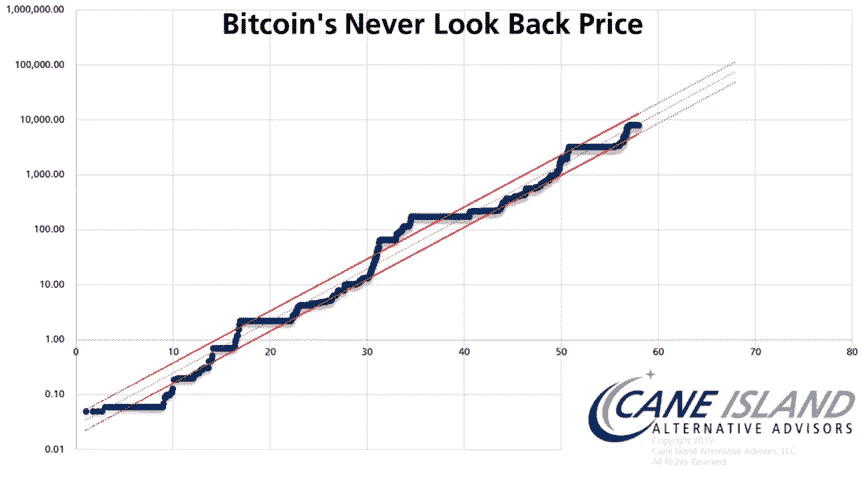
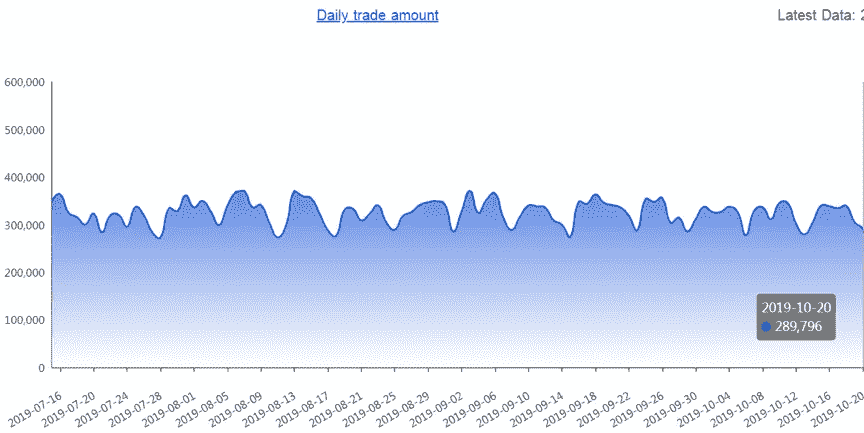
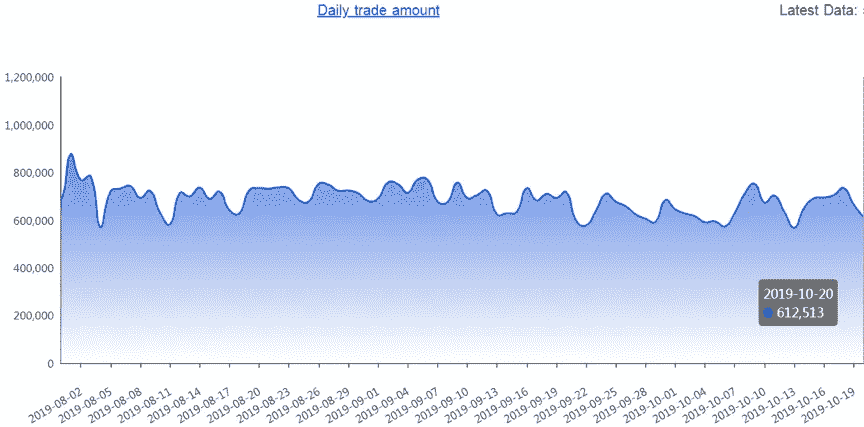
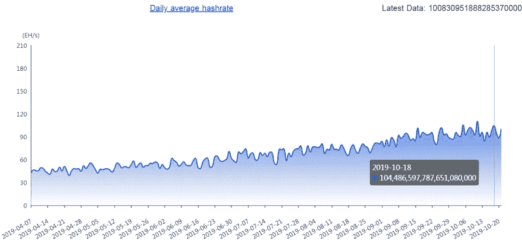
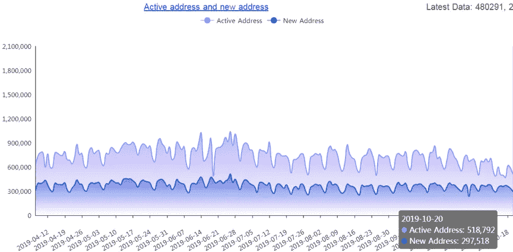
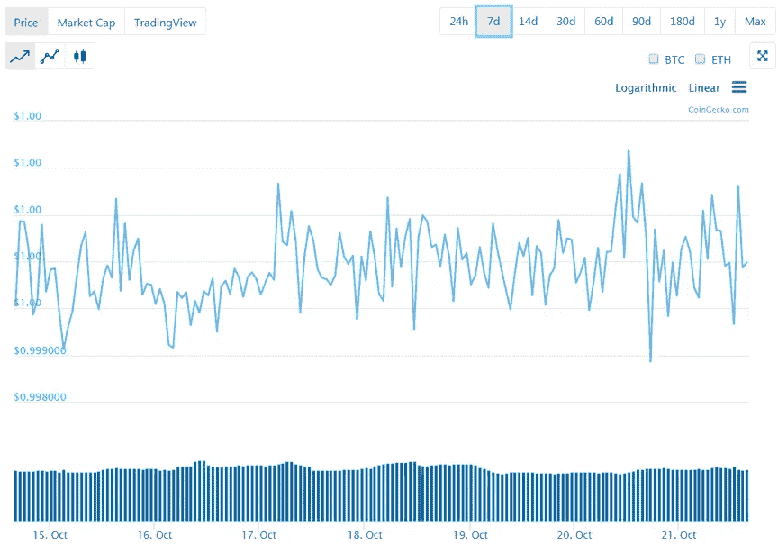
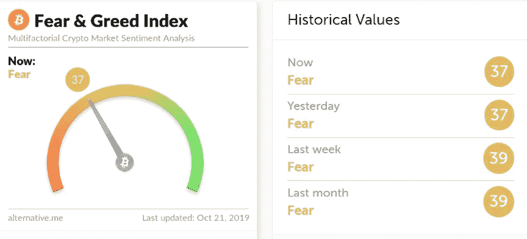
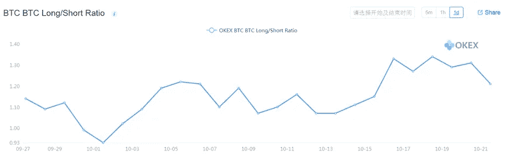

# 我们对比特币永不回头价格的看法，比特币价格分析

> 原文：<https://medium.com/coinmonks/our-take-on-bitcoins-never-look-back-price-bitcoin-price-analysis-22f26f8967ea?source=collection_archive---------1----------------------->

上周，我们根据对比特币每日交易量的分析得出结论，比特币将继续经历市场修正。我们的预测大体上是正确的。在我们继续本周的分析之前，让我们回顾一下比特币价格的总体趋势。

最近，有一个关于比特币“永不回头”(NLB)价格的图表。NLB 的计算方法如下:对于比特币存在的每个给定日期，画出该点与今天之间的最低价格。例如，以 2010 年 7 月 19 日为起始日期，此后记录的最低价格是 2010 年 7 月 25 日的 0.05 美元。水平刻度上的 10 实际上是指第 100 天，20 到第 400 天，70 到第 4900 天或 2023 年 12 月 28 日。

我们从图表中注意到两条规则。规则一，过去 10 年，比特币 NLB 的整体上升趋势从未改变。第二条规则，尽管 NLB 很难准确预测，但随着时间的推移，越来越多的证据支持第二条规则。

以图表中水平刻度上的 34–41 为例。2010 年 7 月 19 日(即 2013 年 9 月至 2015 年 2 月)之后 1160 至 1680 天的 31 至 41 日 NLB 为 200 美元。从我们现在的立场来看，比特币价格回到 200 美元的可能性非常小。

根据这一趋势，我们预测目前比特币的 NLB 为 3000 美元。在 2010 年 7 月 19 日之后的 36000 天，即 2020 年 3 月至 7 月间，这一数字将升至 1 万美元。让我们拭目以待。

# **日交易量——比特币**

Source: Tokenview

上周的日交易量为 32.1 万，与前一周的数字相似。自 2018 年 2 月以来，每日交易量一直在缓慢增长。它显示了比特币的核心价值，是比特币价格的根本支撑。从目前缓慢的交易量来看，比特币将继续出现调整。

# **每日交易量-以太坊**

Source: Tokenview

以太坊和比特币在市场上的相互影响越来越强。从本周开始，我们将把以太坊的日交易量纳入我们的分析。以太坊上周的交易量平均为 67.9 万笔，与前一周相比增长了 1.8%。

# 日平均散列率

Source: Tokenview

比特币的哈希速率最高为 104.5EH/s，最低为 88.8EH/s。计算能力(也称为挖掘哈希速率)是一个关键的市场指标，因为它说明了网络交易需求。自去年以来，它一直在稳步上升，这为比特币的价值奠定了基础。对于主流的矿用钻机来说，比特币目前的价格还没有达到停工价，仍然给矿商带来了不错的利润。

# 活动地址和新地址

Source: Tokenview

活动地址是指每天使用的唯一“发件人”或“收件人”地址的数量。新地址是指每天用于首次交易的地址数量。我们看到活动地址减少了 22%。新地址的数量大致保持不变。

# USDT 快照

Source: CoinGecko

USDT 基本保持不变。我们没有看到交易量有太大变化。

# 恐惧和贪婪指数(FGI)

Source: Alternative.me

FGI 指数为 37，这意味着市场继续显示出恐惧情绪。

FGI 考察了六个不同的因素来给投资者情绪打分，分数范围从零到 100——分别是极度恐惧到极度贪婪:市场波动性(25%) +市场动量(25%) +社交媒体趋势(15%) +市场调查(15%) +比特币在市场中的比例(10%) +谷歌趋势(10%)。

# 多头/空头头寸比率

Source: OKEx

多空持仓比在 1.21，一个相对平衡的数字。

拥有证券的“多头”头寸意味着你拥有该证券。投资者保持“多头”证券头寸，期望股票在未来会升值。“多头”头寸的反义词是“空头”。“空头”头寸通常是卖出你并不拥有的股票。卖空的投资者认为股票价格会下跌。在合约市场中，多头和空头的总头寸是相等的。每一个多头都有一个空头。如果多空持仓比高，那么说明做多的人比做空的人少。根据我们的经验，如果比率太高，我们很可能会看到 PBX 或股票暴跌。

总的来说，所有的基本指数都显示出稳定的趋势。他们没有变得更好或更坏。我们预计市场将出现小幅调整。

在撰写本文时，比特币的价格为 8190 美元。