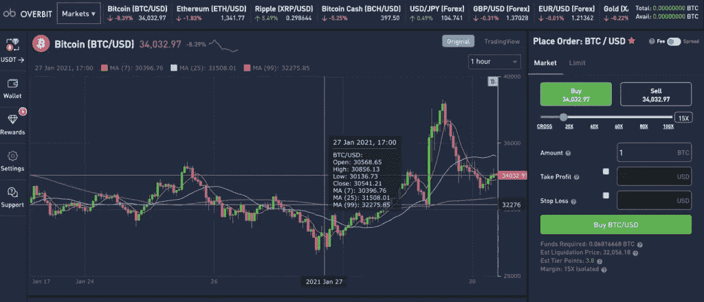
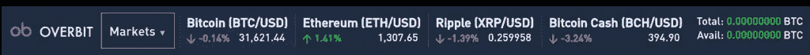
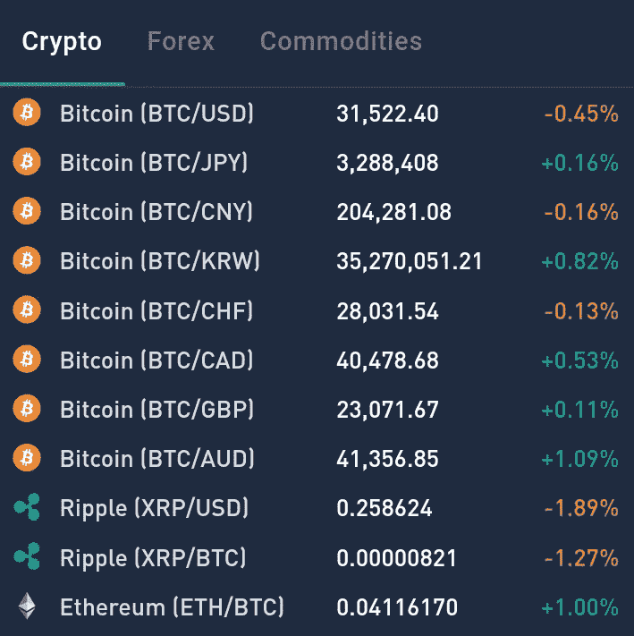
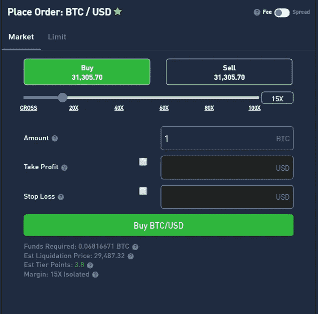
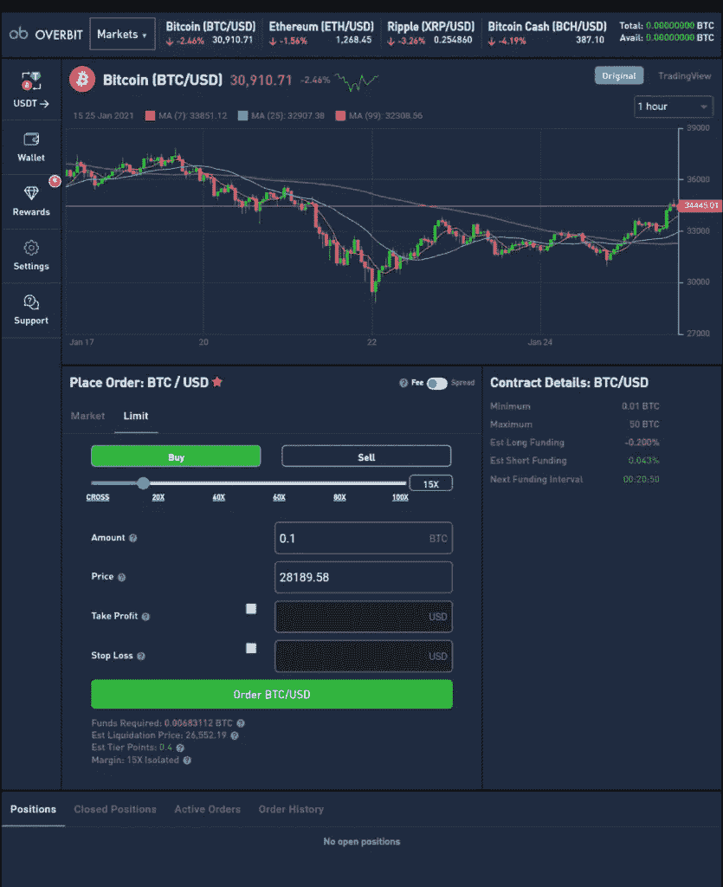

# Overbit Review 2021:安全吗？

> 原文：<https://medium.com/coinmonks/overbit-review-9446ed4f2188?source=collection_archive---------1----------------------->

Overbit Review

这篇文章将回顾 [Overbit](https://blog.coincodecap.com/go/overbit) ，这是一个不断增长的加密货币交易所，拥有众多的交易机会。 [Overbit](https://blog.coincodecap.com/go/overbit) 的交易经验从替代硬币延伸到外汇和金属，允许跨市场交易。艾伯顿贸易有限公司是母公司，于 2019 年推出了 [Overbit](https://blog.coincodecap.com/go/overbit) 。这家公司的总部在塞舌尔。

# 摘要

*   [Overbit](https://blog.coincodecap.com/go/overbit) 提供跨市场交易机会，同时仍然使用[比特币](https://blog.coincodecap.com/a-candid-explanation-of-bitcoin)作为底层资产。
*   对选定的加密货币提供 100 倍的杠杆，对外汇提供 500 倍的杠杆。
*   提供杠杆交易和保证金交易选项
*   为您提供隔离保证金和交叉保证金之间的选择。
*   奖励可以兑换比特币的等级积分。
*   存款或取款不收取任何费用。
*   可以为每个未结头寸选择费用或差价。
*   通过将每笔存款存储在一个[冷钱包](https://blog.coincodecap.com/different-types-of-crypto-wallets)中以及通信的 SSL 加密来实现军用级别的安全性。

# Overbit 怎么入门？

以下是开始使用[超位](https://blog.coincodecap.com/go/overbit)的步骤。

## **记账**

访问 [Overbit](https://blog.coincodecap.com/go/overbit) 官网后点击 [**报名**](https://blog.coincodecap.com/go/overbit) 。输入详细信息以创建帐户。最重要的是，如果你能在网站上建立双因素认证，那将是最好的。 [Overbit](https://blog.coincodecap.com/go/overbit) 将为您提供一个二维码，您必须在谷歌认证器或任何 2FA 提供商内扫描该二维码。这将确保您的帐户是安全的。

## **存款**

转到您的仪表板，然后单击存款按钮。BTC 和 USDT 是唯一用于存款的加密货币。存款之后，你就可以开始交易了。

## **KYC 上**[超位 ](https://blog.coincodecap.com/go/overbit)

即使你可以用一个电子邮件地址和存款开始交易，你也必须满足 KYC 的要求。只有在这一步之后，您才能取款。你需要提供你的照片身份证，地址，地址证明，电话号码和出生日期。这将导致您的帐户验证。

## **取款**

一旦你的账户被验证，你就可以取款了。BTC 和 USDT 是唯一可以用于取款的加密货币。不需要设置最低取款金额。

# 超额交易

Overbit Crypto Trading Interface

检查仪表板并选择顶部的任何乐器。[加密](https://blog.coincodecap.com/tag/crypto)、外汇或黄金是可用的选项。你也可以用英镑、欧元和日元来交易黄金或美元。

Overbit Review: Markets

你可以在这张图表上看到所有的当前价格。此外，您可以自定义图表，也可以在屏幕右侧浏览这些价格。因此，你将能够同时跟随许多乐器。

Overbit current Price

# 如何在 Overbit 上交易？

1.  选择买入或卖出订单
2.  选择你交易的杠杆数量
3.  填写订单详细信息，如止损单、限价和数量。
4.  当你点击买入 XBT/美元按钮时，交易就完成了。
5.  这个平台不提供任何双重确认。所以，要极其讲究细节。

# 订单类型

市价单和限价单都可以在[超盘](https://blog.coincodecap.com/go/overbit)时生成。所需资金的数量将永远为你所用。这取决于你打算使用的杠杆。

# 超额杠杆交易

杠杆使你能够交易借来的资金或投资于自由市场。这个特征为交易者创造了交易大量资金的机会。[出价过高](https://blog.coincodecap.com/go/overbit)提供的杠杆确实很高。它对选定的加密货币提供 100 倍的杠杆作用，对外汇提供 500 倍的杠杆作用。

# 保证金交易

你可以用借来的资本抵你现有的资产来增加你的购买力。因此，保证金交易使你能够在不拥有资产的情况下扩大你的潜在利润。

# 交叉边缘和孤立边缘

[Overbit](https://blog.coincodecap.com/go/overbit) 让您在两种模式之间进行选择；孤立边缘和交叉边缘。这种选择可以最小化短期利润策略和长期利润策略的风险。因此，它确保你的安全，从被清算。

[Overbit](https://blog.coincodecap.com/go/overbit) 有独特的奖励制度。每一次你开始交易，你都会得到积分作为奖励。收集到足够多的 TPs 后，就可以用它们来认领比特币了。您可以查看您的仪表板和奖励部分，了解您的 TPs 余额。

交易的名义价值决定了你将获得的 TPs。例如，你开了一个名义价值为 1 BTC 的头寸。你将获得 3.8 TPs。一次可以兑换 1000 TPs。1000 英镑可兑换 0.060 BTC 或等值的 USDT 货币。更多层级点数将导致更高的每层级点数 BTC 或 USDT。

# 过度审查:安全性

[夸大其词](https://blog.coincodecap.com/go/overbit)声称暗示“军事级安全”办公室不储存任何密码。每一笔客户存款都存放在冰冷的钱包里。

通过 Overbit 进行的通信完全是 SSL 加密的。

此外，您必须在首次登录后设置[双因素认证](https://en.wikipedia.org/wiki/Multi-factor_authentication)。您还必须通过平台查看您的活动日志。设置关闭、登录、清算以及执行交易的通知是非常重要的。你必须确保你能控制你的账户。

# 超额审查:存款和取款费

你可以将[比特币](https://blog.coincodecap.com/a-candid-explanation-of-bitcoin)存入你的账户，不收取任何费用。

取款也不收任何费用，除了网费，目前网费是 0.002 XBT。

每次开仓和平仓时， [Overbit](https://blog.coincodecap.com/go/overbit) 会从头寸的名义价值中收取一定百分比的费用。费用为 0.075 BTC/美元。

# 超额的流动性

[Overbit](https://blog.coincodecap.com/go/overbit) 建立了一套独特的系统来增加流动性。当交易在 P2P 基础上不匹配时，他们会利用各种流动性池。他们与世界上一些最好的交易所建立了市场关系。这确保了交易的及时执行和公平的市场价格。因此，你可以在指定的价格上无滑动地进出市场。这适用于加密、外汇和金属市场。

# 在 Overbit 上展开

您可以为每个未结头寸选择费用或差价。一个交易对的买价和卖价之间的差额就是市场价差。

交易者也可以通过在[超额出价](https://blog.coincodecap.com/go/overbit)上应用市场价差来开仓。

美元/BTC 的利差为 0.15%。即使在波动的时期，利差也是一样的，根本波动不了。

# 超位支持的加密货币对

[Overbit](https://blog.coincodecap.com/go/overbit) 支持 8 种主要加密货币。以下是 Overbit 支持的加密货币:BTC、ETH、EOS、XRP、BCH、NEO、LTC、ADA。

# 过度评论:用户体验

Overbit : Trading crypto on Tablet

如您所见，这种布局很容易理解和遵循。在顶部，这个平台有所有的交易对。所以，你可以在给定货币和加密货币之间切换。您可以在图表的左侧找到“奖励”标签。

你可以看到仪表板，以检查您的当前帐户余额很快。交易图也可以定制趋势线和指标。

值得注意的是[的 Overbit](https://blog.coincodecap.com/go/overbit) 与其竞争对手相比有着独特的布局。该布局与[交易视图](https://blog.coincodecap.com/go/tradingview)的完美结合为专业交易者提供了无缝体验。

该网站有多种语言版本，如英语、中文、越南语、日语、土耳其语和韩语。

# 超额客户支持

该平台提供全天候实时聊天选项。各种选项如[电报](https://t.me/OfficialOverbit)、[推特](https://twitter.com/officialoverbit/)、[脸书](https://www.facebook.com/Overbit1/)、 [Reddit](https://www.reddit.com/r/Overbit/) 和电子邮件也是可用的。

# 过度评论:利弊

## 赞成的意见

*   **无交易费用**
*   外汇和黄金的跨市场交易机会
*   易于使用的界面
*   每次开仓交易后的奖励
*   通过电子邮件或聊天全天候联系

## 骗局

*   这个平台非常新
*   仅有 8 种加密货币可供选择
*   不允许来自朝鲜、新加坡、塞舌尔、克里米亚和塞瓦斯托波尔、苏丹、叙利亚、古巴、伊朗和美国的申请人。

# 超额审查:结论

然而，Overbit 是一个相当新的加密货币交易所，但新手和专家交易者都可以享受到 [Overbit](https://blog.coincodecap.com/go/overbit) 的无缝体验。该平台提供了外汇和加密的高杠杆。此外，创新的奖励系统使用户赚取额外的比特币。

# Overbit 常见问题(FAQ)

开始超买交易需要最低存款额吗？

是的，你必须支付最初的贸易保证金。所以，你必须存足够的钱来支付同样的费用。例如，如果你以 30 倍的杠杆交易 BTC/美元，最小数量是 0.01 BTC。

出价过高能提供多大的杠杆作用？

[Overbit](https://blog.coincodecap.com/go/overbit) 对选定的加密货币提供 100 倍杠杆，对外汇提供 500 倍杠杆。

**法定货币可以存入 Overbit 吗？**

[Overbit](https://blog.coincodecap.com/go/overbit) 不接受法定货币。Tether (USDT)和比特币(BTC)是唯一被接受的加密货币。

**有哪些市场可以进行超额交易？**

你可以在这个平台上交易外汇、加密货币和金属。

**over bit 以何种方式存储比特币？**

你可以在这个平台上交易外汇、加密货币和金属。

**over bit 以何种方式存储比特币？**

多签名冷钱包存储所有比特币。 [Overbit](https://blog.coincodecap.com/go/overbit) 不用热钱包。

*最初发表于 2021 年 1 月 30 日*[*https://blog.coincodecap.com*](https://blog.coincodecap.com/overbit-review)T22。