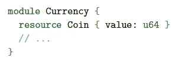

# Move 编程语言概述

> 原文：<https://medium.com/coinmonks/overview-of-move-programming-language-a860ffd8f55d?source=collection_archive---------0----------------------->

[https://swarajyamag.com/business/explained-facebooks-libra-the-new-global-cryptocurrency](https://swarajyamag.com/business/explained-facebooks-libra-the-new-global-cryptocurrency)

这是脸书的 Libra 区块链发布的描述 Move 语言特性的技术论文的摘要。

**主要特点**

随着像 Solidity 这样的当前区块链语言对生态系统造成的众所周知的问题，对一种安全*和灵活*的新语言的需求已经势在必行。Move 编程语言将这些作为其实现的主要特性。如文中所述，任何管理数字资产的语言，无论是创建、转移还是销毁，都必须强化两个主要属性:**

1.  *稀缺性——就区块链技术而言，这无非是避免双重支出攻击，并且限制资产的创建。*
2.  *访问控制—根据所有权维护数字资产的所有权信息和权限。*

*Move 通过为系统中的所有资源包含一个类型系统来强加这些属性。和资源自动包含在访问控制特权中。*

***与现有语言的比较***

*与现有的区块链语言有一些主要差异，这使得 Move 成为未来实现的可行语言。*

*   *默认情况下，数字资产没有强制类型系统。例如:比特币/以太。*
*   *单一的稀缺资产在整个语言中就像以太一样被表现出来。任何定制资产，如 ERC20 令牌，都需要检查构建令牌的程序员指定的安全属性。*
*   *访问控制策略也嵌入在语言语义中。没有简单的方法将它扩展到定制资产。*
*   *尤其是比特币——无法定义自定义数据类型或过程。比特币脚本尚未完成。*

***考虑的设计目标***

*   *一级资源——在 Move 中，任何自定义资产都可以声明为一个*资源类型*，这使得它是安全的，并且在默认情况下访问受到控制。类似以太坊的智能合约，Move 有*模块*，是包含资源、其他类型、过程的代码块。这两个主要组件增强了数据抽象的强大功能。资源在模块内部是透明的，对于模块外部的调用是不透明的。资源的一个重要特征是—资源永远不能被复制或隐式丢弃，只能在存储位置之间移动。下面是一个模块声明示例:*

**

*Snippet representing module and resource relationship ([https://developers.libra.org/docs/move-paper](https://developers.libra.org/docs/move-paper))*

*   *灵活性——每个 Libra 事务都将包含一个*事务脚本*。事务脚本用于在模块中进行调用和调用过程。它是一个包含可定制事务和任意代码的主过程。一个脚本可以调用多个过程。直到现在，设计目标使得 Move 看起来非常类似于面向对象编程语言。这可以归因于模块/资源/过程- >类/对象/方法之间的相同关系。*
*   *安全性——为了加强这种语言的安全性，必须研究三个主要部分——类型、资源和内存。总的来说，有两种方法似乎是通用的，要么是编译时检查，要么是汇编级的运行时检查。随着 Move 的出现，一种介于上述两种方法之间的新方法应运而生，即类型化字节码，它比汇编语言更高级，比源语言更低级。一个*字节码验证器*，在模块发布之前检查链上的安全属性。一旦通过验证，*字节码解释器*就会执行代码。这与 JVM (Java 虚拟机)和 CLR(公共语言运行时)使用的过程非常相似。*
*   *可验证性——即使 Move 支持所有安全属性的在线验证。这对于利用率很高的区块链来说并不理想。因此，Move 也支持离线静态验证工具，这将降低在线验证的复杂性。在这种假设下，有三种设计决策需要考虑:*无动态调度*(避免复杂的调用图构造，调用位置可以静态确定)*有限可变性*(使用类似 C++的引用类型，一点最多允许一个可变引用)*模块化*(模块可以隔离进行功能验证)。*

***高级概述***

*Move 是一种基于堆栈的语言。它的工作方式类似于所有基于堆栈的语言，在执行操作时进行推送和弹出。根据执行模型，每个帐户(256 位地址)可以有零个或多个模块以及一个或多个资源类型。帐户最多只能有一种特定类型的资源。如果需要，可以创建包含相同类型的多个资源实例的自定义资源类型。*

*任何声明为资源的变量都会与一些内置的限制相关联。资源只能移动，不能复制。它们只能在声明它们的模块中创建或销毁。一旦一种资源被用完，它就可以被第二次使用——这是避免双重花费的一个主要因素。资源必须准确地移动一次——这有助于在验证过程中识别被开发人员遗忘的任何悬空资源。*

*模块也有一些限制。不要被遗忘！！任何模块都可以对内部引用的资源进行操作。它们只能写入或引用其他模块的值，但不能创建或销毁资源。具体来说，他们只能对其他模块资源执行“*move”*操作。*

*该语言还附带了许多内置函数，允许获取对资源值的引用或破坏资源。内置的只能在当前模块中声明的资源上使用。因此，如果开发人员忘记声明一个过程来使用内置引用资源的值，那么该资源将无法查看或更改。*

***移动语言的组件***

*在这里，我想提一下语言的组成部分。*

1.  *类型—支持基本类型，如布尔、地址(256 位)、无符号整数(64 位)和固定大小的字节数组。*
2.  *Struct —两种类型:*种类*(资源)和*无限制*(通用结构)*。**
3.  *过程——可以是*公共的*或*内部的方法。默认情况下，模块依赖是非循环的，这避免了重入攻击。**
4.  *字节码检验器——在模块发布前检查安全属性的关键组件。所有的 Move 程序在部署到网络上之前都必须通过验证程序。在验证过程中有多个阶段:控制图构造、堆栈平衡检查(确保在所有操作之后堆栈的大小不被修改)、类型检查、种类或资源检查、引用检查和与全局状态的链接(检查声明是否与它们的用法相匹配)。*
5.  *字节码解释器——验证完成后，程序通过解释器执行。这个流程与前面提到的 JVM 和 CLR 非常相似，传统的程序员也能理解这个过程。使用*“气体”*参数对程序的执行进行计量，类似于以太坊。这将保证任何无限循环的执行。*
6.  *移动虚拟机—虚拟机的过程类似于任何其他区块链。这在提到的另一篇技术论文中有详细的介绍。但总结起来，块包含多个事务，每个事务被执行以产生事务效果。事务效果用于生成更新的全局状态。这就造成了效果和状态转换之间的分离。*

*一般来说，这种语言被设计成支持并行执行。*

***未来工作***

*论文中提到了多项未来工作。以下是亮点:*

1.  *使用 Move 实现账户、Libra 币、Libra 储备管理、验证管理、交易费管理、冷钱包等。,*
2.  *额外的面向对象编程语言特性，如多态、集合和事件等。,*
3.  *Move 的源语言。*
4.  *语言和自动化形式验证工具的逻辑规范。*
5.  *Libra 用户之外的第三方模块发布支持(这将为广泛的用例铺平道路)。*

***总结***

*即使看了这篇论文，我仍有许多问题没有回答。例如，我还不确定模块是如何非循环的，或者将全局存储存储为树比存储为图更有帮助。我将继续关注报纸的下一个版本。*

*总的来说，看看目前 Move 的规格，我觉得区块链不再处于萌芽阶段。它正处于青少年时期。此外，我确实明白天秤座从当前区块链的经历中学到了多少。他们的提议非常超前，我真的希望通过正确的使用案例，他们的 Libra 硬币可能会很快成为一种常规的通用货币。*

> *[在您的收件箱中直接获得最佳软件交易](https://coincodecap.com/?utm_source=coinmonks)*

**