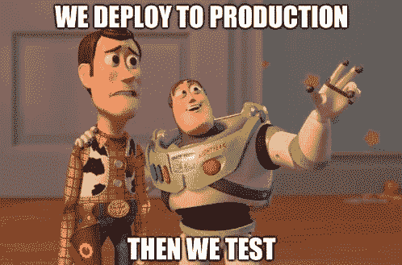

# 最新 TzKT 索引器和 API 更新概述

> 原文：<https://medium.com/coinmonks/overview-of-the-latest-tzkt-indexer-and-api-updates-243de9dc9cba?source=collection_archive---------3----------------------->

***TL；DR；****TzKT 索引器和 API 的新版本带来了非常详细和准确的 Tezos 烘焙数据，并且已经* [*可供在 staging 环境*](https://staging.api.tzkt.io/) *中测试。新版本将于下周投入生产。如果您的服务或应用程序使用 TzKT API，请注意重大变更部分。*

几个月前，我们发布了带有自己的 API 的 TzKT 索引器的“v1-preview”版本，它展示了高稳定性和相当好的性能以及低资源消耗。今天，TzKT API 每天成功处理来自世界各地的超过 200，000 个请求。

唯一让它不够完美的是缺乏烘焙相关的数据，如烘焙权和赌注奖励。现在，经过几个月的努力，我们很自豪地宣布一个重大更新，使所有的烘焙材料都可以通过我们的 API 获得。

在本帖中，我们将浏览这些变化，并重点关注关键特性。

# 烘焙权

首先，我们添加了历史和未来烘焙和批准权限的索引，以便在每个周期开始时，TzKT 索引器从节点获取可用权限，然后跟踪它们的状态，哪些权限已实现，哪些权限未实现，等等。注意:索引器存储未来烘焙权限的优先级最高为 8，以优化存储使用，而不是像其他索引器那样为 64。

> 有趣的事实:许多人错误地认为只有 64 个块优先级…实际上并不是这样。块优先级没有最大值，因此您可以将优先级[设置为 1000](https://mainnet-tezos.giganode.io/chains/main/blocks/960000/helpers/baking_rights?level=970000&max_priority=1000) 或[设置为 10，000](https://mainnet-tezos.giganode.io/chains/main/blocks/960000/helpers/baking_rights?level=970000&max_priority=10000) 或更多。

有默认索引:按级别，按周期，按周期和贝克，涵盖了最常见的用例。因此，通过指定这些参数，可以显著缩短响应时间:

*   [/v1/权利？level={level}](https://staging.api.tzkt.io/v1/rights?level=960000)
*   [/v1/权利？周期={cycle}](https://staging.api.tzkt.io/v1/rights?cycle=230)
*   [/v1/权利？贝克= {贝克}](https://staging.api.tzkt.io/v1/rights?cycle=230&baker=tz1WnfXMPaNTBmH7DBPwqCWs9cPDJdkGBTZ8)

## 未覆盖的权利

TzKT 索引器的一个独特功能是烘焙权限状态处理，以及对错过特定烘焙或认可权限的原因的附加分析。

TzKT 索引器将错过的权利分为两类:错过的和未覆盖的。如果一个面包师由于缺少债券(例如，当他过度授权时)而错过了阻止或背书，则那些权利被标记为未覆盖，否则，如果面包师没有明显的原因(例如，由于网络问题)而错过了阻止或背书，则那些权利被标记为实际错过。

## 公平效率

将烘焙权利分为未覆盖的和错过的允许进行更准确的面包师分析，并建立更公平的基于效率的指标。

> 所有现有效率指标的问题是，它们对过度授权的面包师完全不公平。例如，如果一个面包师有两倍于锁定能力的锁定余额，他将获得两倍的烘焙权利。但他的债券只能覆盖其中的一半，因此另一半将被跳过，尽管贝克节点一切正常，但贝克的效率将为 50%。TzKT 索引器解决了这个问题。

# 赌注奖励

我们已经为所有活跃的面包师和授权者增加了循环统计的索引，包括烘焙权利、赌注奖励、债券使用等的摘要。都在一个地方。该统计数据也非常详细([参见 API 文档中的完整字段描述](https://staging.api.tzkt.io/#operation/Rewards_GetBakerRewardsByCycle))。越多的细节，越多的用例，越多的各种服务和应用可以建立在其上，越复杂的支付方案可以被 Tezos bakers 使用。

值得注意的是 TzKT 索引器如何处理错过的奖励。它与现有的 API(如 tzstats)有很大不同。例如，如果 Baker0 跳过了一个优先级为 0 的块(预期奖励为 40 tez)，而 Baker1 烘焙了这个优先级为 1 的块(由于优先级较低，奖励为~26 tez)，tzstats 将显示 Baker0 错过了 26 tez 奖励，因为实际块奖励为 26。老实说，我们不同意这种做法。

在处理错过的奖励时，TzKT 确实回答了这样一个问题“如果没有错过区块或背书，一个面包师会赚多少钱？”。在上面的例子中，如果 Baker0 没有错过方块，他将得到 40 tez，而不是 26 tez，因此错过的奖励实际上是 40 tez。我们认为，这是对一个面包师在一切顺利的情况下能挣多少钱的更准确的估计。

此外，错过的区块可能导致较少的背书奖励，并且错过的背书可能导致较少的区块奖励。这一点也考虑在内。

贝克奖励:

*   [/v1/rewards/bakers/{地址}](https://staging.api.tzkt.io/v1/rewards/bakers/tz1WnfXMPaNTBmH7DBPwqCWs9cPDJdkGBTZ8)
*   [/v1/rewards/bakers/{ address }/{ cycle }](https://staging.api.tzkt.io/v1/rewards/bakers/tz1WnfXMPaNTBmH7DBPwqCWs9cPDJdkGBTZ8/230)

委托人奖励:

*   [/v1/奖励/委托人/{地址}](https://staging.api.tzkt.io/v1/rewards/delegators/KT1WrmdxQaoQMoNTUmt2sfUyhJsPEGcDsVDZ)
*   [/v1/奖励/委托人/{地址}/{周期}](https://staging.api.tzkt.io/v1/rewards/delegators/KT1WrmdxQaoQMoNTUmt2sfUyhJsPEGcDsVDZ/230)

## 奖励分成

终于！我们实现了一个 TzScan 的奖励分割的工作模拟，它完全符合面包师和支付工具的需求。此外，我们还做得更好、更详细、更准确。

此外，我们为奖励分割中的所有委托人添加了“清空”标志，该标志指示委托人是否被清空(从节点上下文中删除)以及是否应该被重新分配。这有助于确定支付交易是否会消耗 0.257 tez 分配费，而无需提出额外的请求和单独检查每个委托人。

*   [/v1/奖励/分成/{baker}/{cycle}](https://staging.api.tzkt.io/v1/rewards/split/tz1WnfXMPaNTBmH7DBPwqCWs9cPDJdkGBTZ8/230)

# 快照

显然，我们已经添加了帐户快照索引。但是，所有快照仅存储最后 13 个周期(在 mainnet 中)，对于较旧的周期，只有选定的快照可用。这使我们能够显著优化存储利用率。

实际上，我们可以存储更少的数据:只有 PRESERVED_CYCLES + 2，因为我们知道“在任何时候，外壳都不会隐式地接受一个分支，该分支的分叉点在过去的循环中多于 PRESERVED_CYCLES ”,并且在循环 N 的开始，从循环 N - 2 中获取快照。这实际上意味着最大 mainnet 回滚是 5 个周期，对于拍摄快照来说还要多 2 个周期，因此我们需要至少存储最后 7 个周期的快照。然而，在这个阶段，我们为了调试的目的存储了更多的数据。

TzKT API 没有为访问选定的快照提供单独的端点，因为现有的端点已经可以做到这一点。例如，可以通过以下方式访问特定委托人的快照:

*   [/v1/rewards/delegates/{ address }？选择=循环、平衡、烘焙](https://staging.api.tzkt.io/v1/rewards/delegators/KT1WrmdxQaoQMoNTUmt2sfUyhJsPEGcDsVDZ?select=cycle,balance,baker)

# 周期

我们还添加了周期数据，包括一个简短的总结，比如在特定的周期中有多少面包师在工作，有多少面包卷参与了烘焙权利的分配，有多少技术开发中心被授权，等等。

在我们看来，最有趣的事情是总的面包卷数，因为与特定面包师的面包卷数一起，它允许估计诸如历史容量、运气比率等指标。

*   [/v1/周期数](https://staging.api.tzkt.io/v1/cycles)

# 重大变化

幸运的是，只有一个突破性的变化，与“select”查询参数有关。

> 通过指定该参数，用户可以只请求所需的数据。这大大减少了网络流量和响应时间，因为 SQL 查询可能包含更少的连接。

在当前版本中"选择"参数仅在"值"模式下有效:

**？选择=循环，平衡** = > [10，1234]

在新版本中,“选择”参数已扩展为“字段”模式，这是一种默认模式:

字段模式:**？选择=循环，平衡** = > {“循环”:10，“平衡”:1234 }

价值观模式:**？select.values=cycle，balance** = > [10，1234]

所以，为了重现先前的行为”？select= "应替换为"？select.values= "。

此外，已经删除了不推荐使用的参数 **"n"** 和 **"p"** ，如文档中所述:“不推荐使用的参数。将在下一版本中删除。

# 暂存环境

我们决定在部署到生产环境之前运行一个试运行环境。这允许提前测试最新的特性和更新客户端应用程序，这样 API 中的突破性变化就不会影响生产环境。

这里有 staging API:[https://staging.api.tzkt.io/](https://staging.api.tzkt.io/)，可以随便玩玩。任何反馈都将不胜感激！

下周，我们计划为所有支持的 Tezos 网络部署新版本。

*最初发表于 2020 年 5 月 27 日*[*https://baking-bad.org*](https://baking-bad.org/blog/2020/05/27/overview-of-the-latest-tzkt-indexer-and-api-updates/)*，在那里你可以找到文章的完整版本。*

> [直接在您的收件箱中获得最佳软件交易](https://coincodecap.com/?utm_source=coinmonks)

# 联系我们

随意问任何问题。[烘焙不好](https://baking-bad.org/docs)团队随时乐意帮忙！

**邮件:**[*hello@baking-bad.org*](mailto:hello@baking-bad.org)

**碎碎念:**[*【https://twitter.com/TezosBakingBad】*](https://twitter.com/TezosBakingBad)

**电报:**

***懈怠:**[*https://tezos-dev.slack.com/archives/CV5NX7F2L*](https://tezos-dev.slack.com/archives/CV5NX7F2L)*