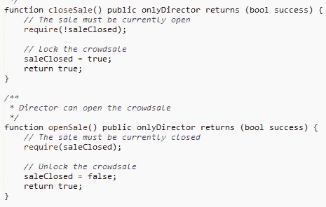
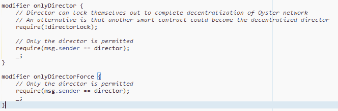
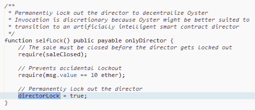
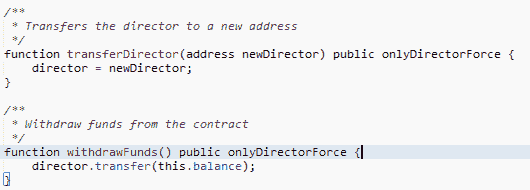
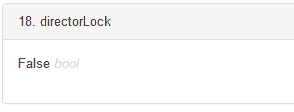

# 牡蛎“黑客”及其对我们的启示

> 原文：<https://medium.com/coinmonks/oyster-hack-and-what-we-can-learn-from-it-87f786eec97f?source=collection_archive---------4----------------------->

# 发生了什么事？

在 2018 年 10 月 29 日，约 400 万枚 PRL 代币从代币合同中铸造出来，并被送往 KuCoin 兑现，随后导致价格暴跌和代币交易暂停。这种“入侵”只能由团队成员完成

# 牡蛎连接是一个内部工作

嗯，我不能说我了解团队结构或产品，这也不是重点。可以说，这可能发生在任何人身上，我愿意将怀疑的好处扩展到团队，并将此称为由持有导演地址私钥的单个恶意演员进行的行为。无论如何，人们不应该如此轻率地挥舞“S”字。

# 一个适合大老鼠的小洞

首先，让我们看一下代码，好吗？

代码可以在这里找到:[https://ethers can . io/address/0x 1844 b 21593262668 b 7248d 0 f 57 a 220 ca ABA 46 ab 9 #代码](https://etherscan.io/address/0x1844b21593262668b7248d0f57a220caaba46ab9#code)

上面我们可以看到 **closeSale** 和 **openSale** 都使用了 **onlyDirector** 函数修饰符。 **onlyDirector** 函数修饰符里面是什么？

似乎只有**director**被另一个名为 **directorLock 的布尔值控制。**

好的，看起来当调用 **selfLock** 时 **directorLock** 将被设置为真。

什么是 **onlyDirectorForce** ？让我们看看它用在哪里。

看来**只有导演力**才能**调动导演**和**撤资**又名乙醚。

一切似乎都很好，让我检查一下令牌合同中的变量。

啊哦。

# 下雨时，倾盆大雨

因此，我们知道，由于 **selfLock** 从未被调用，所以控制器从未被锁定， **openSale** 仍然可以被所有者调用。我们还可以看到 **transferDirector** 是开放的，供 Director 账户随时调用。

我们这个恶毒的小知情人，我以后称他为虫尾巴，首先开了一个账户，并在里面装满了乙醚。不是很多，但也足够了。

问题地址[https://ethers can . io/address/0x 0001 ee 57 bb 28415742248d 946d 35 c 7 f 87 cf D5 a 54](https://etherscan.io/address/0x0001ee57bb28415742248d946d35c7f87cfd5a54)

然后，虫尾巴使用原来的董事钱包调用 **transferDirector** ，并用以太将董事职位转移到他的地址..[https://ethers can . io/tx/0x1ea 00178 c 70 ca 6 C1 cc 2d 020939831d 1393 a5 fcf 6154495395 a 074 e 19 e 0 e 70 f 9](https://etherscan.io/tx/0x1ea00178c70ca6c1cc2d020939831d1393ac5fcf6154495395a074e19e0e70f9)

凭借他新获得的权力，虫尾巴现在调用**openSale**[https://ethers can . io/tx/0x 2321 e 305 c 20 f 45429 f 11045 b 9235 e 9 bbd 66 b 17 BAC ede 173 ca 86144 AC 5533d 3 BF](https://etherscan.io/tx/0x2321e305c20f45429f11045b9235e9bbd66b17bacede173ca86144ac5533d3bf)并允许任何向合同发送乙醚的人以 5000PRL/ETH 的价格接收令牌。

所以现在虫尾巴发送乙醚到合同，得到 5000 PRL，然后调用 **withdrawFunds** 将资金撤回到他的地址，重复这个过程多次。与此同时，他把多余的 PRL 送到交易所，卖给瑞士联邦理工学院，撤回 BTC(也许还有瑞士联邦理工学院)，并(可能)改变他的战利品袋，在任何人准备好与他的卑鄙行径作斗争之前确保他的利润。[https://etherscan.io/txs?a = 0x 0001 e 57 bb 28415742248d 946d 35 c 7 f 87 cf d5a 54](https://etherscan.io/txs?a=0x0001ee57bb28415742248d946d35c7f87cfd5a54)

虫尾巴从中赚了多少钱？仅这个恶意地址就铸造了大约 400 万个 PRL 令牌，这还没有考虑到他可能有其他帐户(也可能没有)。这大约是 400 万枚免费铸造给虫尾巴的代币。如果他能以 0.25 美元的价格卖掉他所有的代币，那就接近 150 万美元，假设他能收回代币(很可能不能，必须考虑到市场下滑)。下面的链接确实说明了他在停职前只能提取大约 30 万美元)。你可以在这里阅读更多关于团队和交换的故事[https://oysterprotocol.com/oyster-update/](https://oysterprotocol.com/oyster-update/)

# 犯错是人之常情；坚持错误是愚蠢的。

如果你不从中吸取教训，错误只是错误。下一次有抱负的智能合同程序员可以做些什么来避免这种情况？

1.  类似总监的职能和类似管理员的职能的角色应该分开，这样就不会有一个人控制整个合同。这也可以通过管理销售和跟踪的多个智能合同来实现，这些合同可能由其他帐户拥有。
2.  董事职位可以委托给另一个 smart 合同，以确保实际的权力下放。在执行任何董事职能之前，新的智能合同将需要多个签名。
3.  directorLock 不应该完全依赖于 **selfLock** ，而应该是另一个由时间戳控制的修饰符。(例如，6 个月后自动锁定)。
4.  在 PRL 的特殊情况下，众筹合同不应重新启动。这也可以用时间戳等来管理。

我们可以看到这并不是一个真正的 bug。正是董事职位从未被锁定的事实导致了这种情况的发生。一个逻辑和假设上的错误。不幸的是，还需要董事职位来控制智能合约中的跟踪机制，这使得它太重要了，不能禁用。这个代码有一个糟糕的设计，后来被它的创造者利用来快速赚钱。

代码是故意恶意设计的吗？也许吧。谁知道虫尾巴在想什么？

也许最大的错误是认为不管环境如何，人类都是廉洁的。在一个充满骗局的空间里，当成千上万的美元在他们眼前晃来晃去的时候，我们没有奢侈去假设其他人的良好意图。极其高效的资金流动、巧合的时间安排以及行动的果断性，都表明这是一个预谋好的精心策划的计划，早在几周前就已经计划好了，几个月前就已经构思好了。

这是项目可能发生的最糟糕的事情吗？不，说实话远非如此。如果 PRL 是一个合法的项目，我认为该团队可以从事件中反弹和恢复，尽管品牌名称本身不会没有一点损伤。

"要有一个好的敌人，选择一个朋友:他知道在哪里打击."

# 词汇表

原导演地址:0x2da 59901939682 eab 8887 EDB 0 FD 1c e 4299072265

令牌合同地址:0x 1844 b 21593262668 b 7248 d0f 57 a 220 ca ABA 46 ab 9

恶意导演转移 tx hash:0 x1ea 00178 c 70 ca 6 C1 cc 2d 020939831d 1393 C5 fcf 6154495395 a 074 e 19 E0 e 70 f 9

恶意钱包:0x 0001 ee 57 bb 28415742248d 946d 35 c 7 f 87 cf D5 a 54

# 放弃

我在牡蛎珍珠没有投资，这篇文章纯粹是出于教育目的，我绝不是在宽恕剥削者的所作所为，我也不是说这个项目是一个骗局，我也不是想 FUD 你心爱的项目。做好自己的尽职调查。

# 链接

牡蛎网站:【https://oysterprotocol.com/ 

团队更新:[https://oysterprotocol.com/oyster-update/](https://oysterprotocol.com/oyster-update/)

这篇文章最初发布在[https://celebrus advisory . com/oyster-pearl-hack-tiny-hole-for-a-big-rat/](https://celebrusadvisory.com/oyster-pearl-hack-tiny-hole-for-a-big-rat/)上，点击这里阅读更多区块链相关文章。

> [直接在您的收件箱中获得最佳软件交易](https://coincodecap.com/?utm_source=coinmonks)

