# 加密货币的市盈率

> 原文：<https://medium.com/coinmonks/p-e-ratio-for-cryptocurrencies-63dad08d26fc?source=collection_archive---------0----------------------->

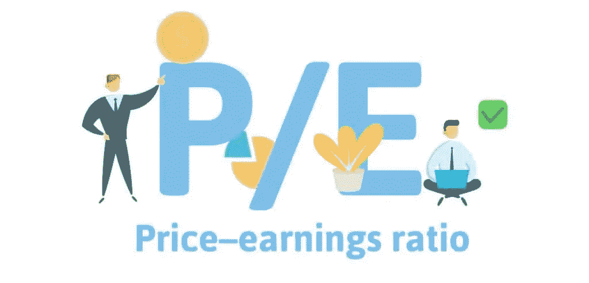

Image: Prime Investors

# 传统金融中的市盈率是多少？

市盈率(P/E Ratio)是一家公司的股票价格与[每股收益(EPS)](https://corporatefinanceinstitute.com/earnings-per-share-eps-formula) 的关系。这是一个受欢迎的比率，让投资者更好地了解公司的[价值](https://corporatefinanceinstitute.com/resources/knowledge/finance/fair-value/)。市盈率显示了市场的预期，是你每单位[当前收益](https://corporatefinanceinstitute.com/resources/knowledge/accounting/what-is-net-income/)(或未来收益，视情况而定)必须支付的价格。

在评估一家公司的股票时，收益很重要，因为投资者想知道一家公司的盈利能力如何，以及它未来的盈利能力如何。此外，如果公司没有增长，当前的收益水平保持不变，P/E 可以解释为公司偿还每股所付金额所需的年数。

# 市盈率公式

**市盈率=每股股价/每股收益**

> 在此访问实时模板表

# 市盈率是否适用于加密货币？

是的，我们可以计算分散交易所的市盈率，这些交易所通过发行 DEX 代币来奖励流动性提供者。

**分散交易所** ( **DEX** )是[加密货币交易所](https://en.wikipedia.org/wiki/Cryptocurrency_exchange)的一种，它允许直接[点对点](https://en.wikipedia.org/wiki/Peer-to-peer) [加密货币](https://en.wikipedia.org/wiki/Cryptocurrency)交易在[在线](https://en.wikipedia.org/wiki/Online)安全地进行，而不需要[中介](https://en.wikipedia.org/wiki/Intermediary)。

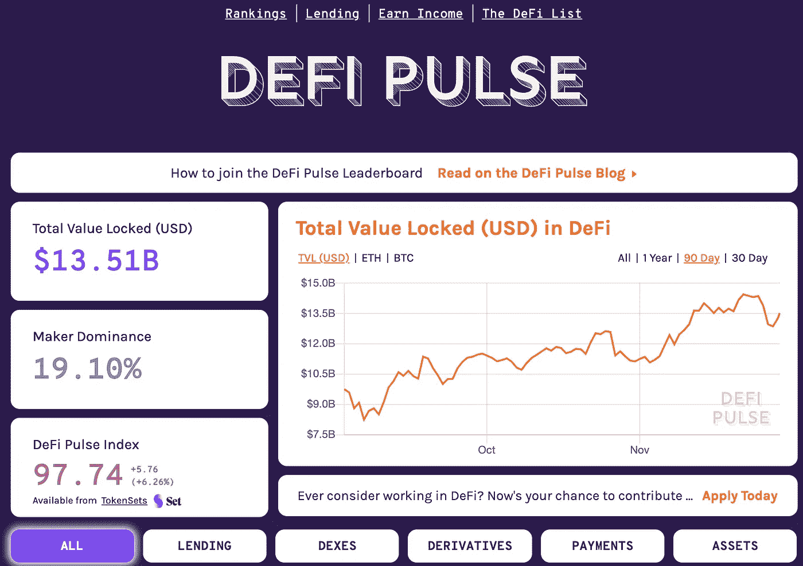

Source: [https://defipulse.com/](https://defipulse.com/)

**DEX 流动性提供商** **是将代币存入智能合约并收取代币池作为回报的用户(参见 DEX 收取的费用)**。这些资金池代币跟踪流动性提供者在总储备中的份额，并可以随时交易基础资产。“流动性提供者”本质上是**与“做市商”的同义词。他们的功能是通过提供股票池**来促进加密货币的交易，这样买家和卖家就可以轻松地进行交易，而不必找到其他个人交易者并与之交易。换句话说，它们使证券具有“流动性”。

# 市盈率公式会是什么样的？

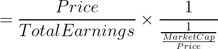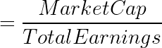

# 在哪里

**总收益= 24 小时年化交易量 x 流动性提供者接受利率**

# 获得总收入

## 24 小时指数交易量(美元)

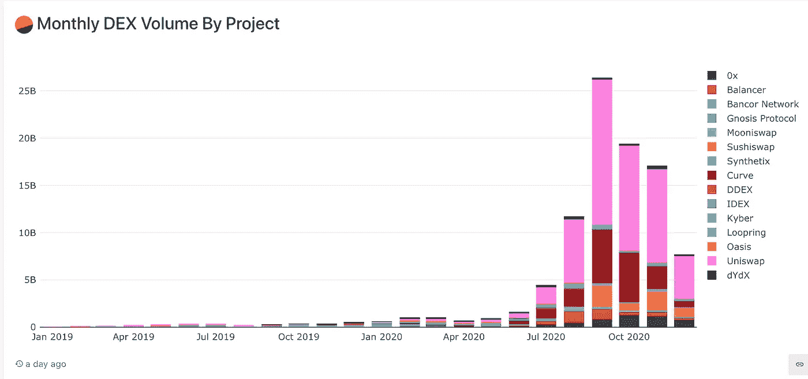

Source: [Dune Analytics](https://explore.duneanalytics.com/queries/1847/source#3259) Monthly DEX volumes

自 2019 年以来，分散交易所的月度交易量大幅增长。

DEX 交易所通过收取交易总量(美元)的一小部分费用来获得报酬。

## **流动性提供者的接受者利率**

做市商收取费用的主要目的是刺激交易所内的交易活动，从理论上来说，通过向公司提供发布订单的激励来促进交易。

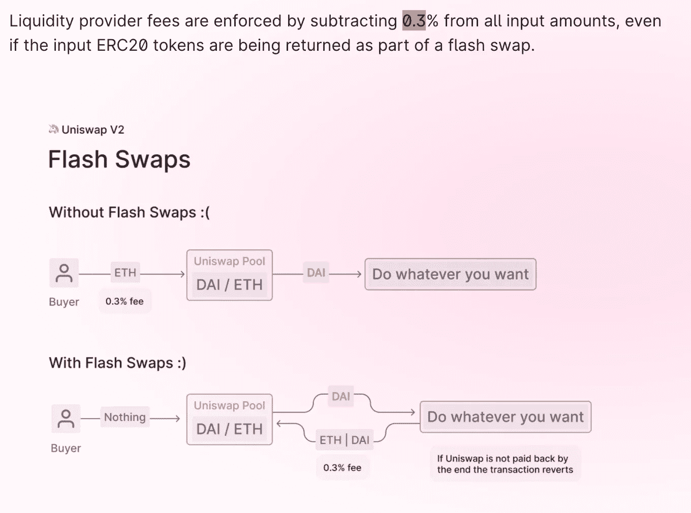

Source: [Uniswap](https://uniswap.org/blog/uniswap-v2/) Liquidity provider fees

例如 **Uniswap** 对所有交易收取 0.30%的费用，这笔费用将被加入储备池。当流动性提供者烧掉他们的池代币以收回他们在总储备中的股份时，他们会收到按比例分配的他们下注时累积的总费用。

这 0.30%的费用代表了接受者的比率。每个 DEX 交易所都有自己的薪酬方案。

# 结果

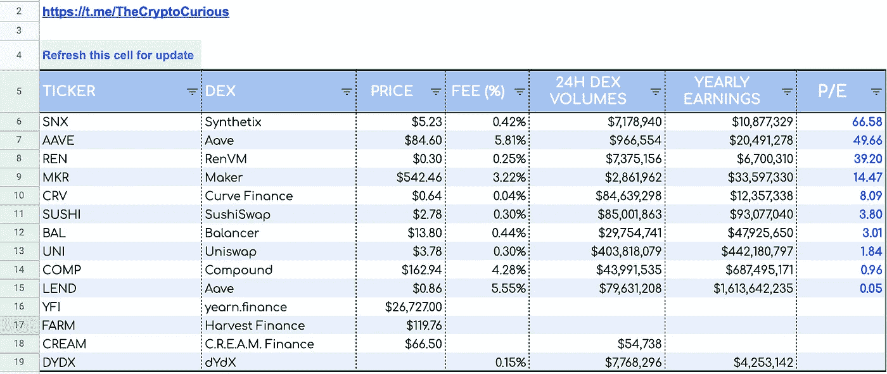

P/E data analytics computed in Google Sheets, price, taker’s fee, 24h DEX volumes, total earnings and P/E

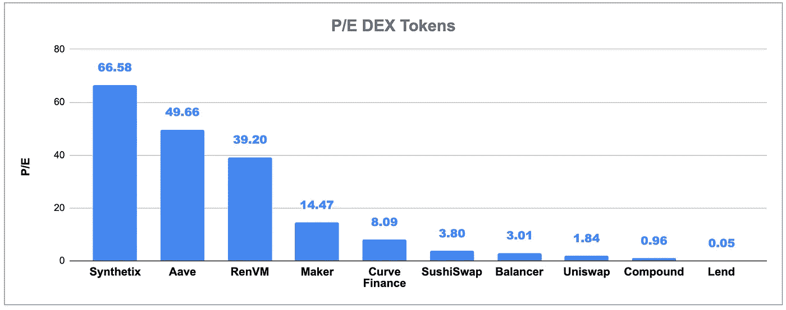

Source Google Sheet: 24h DEX P/Es

## 高市盈率——合成

高市盈率股票通常被认为是成长型股票。这预示着积极的未来表现，投资者对未来收益增长有更高的期望，并愿意为此支付更多。不利的一面是，成长型股票的波动性通常更高，这给公司带来了很大的压力，要求它们采取更多措施来证明自己的估值更高。因此，投资成长型股票更有可能被视为高风险投资。**市盈率高的股票也可以认为估值过高。**

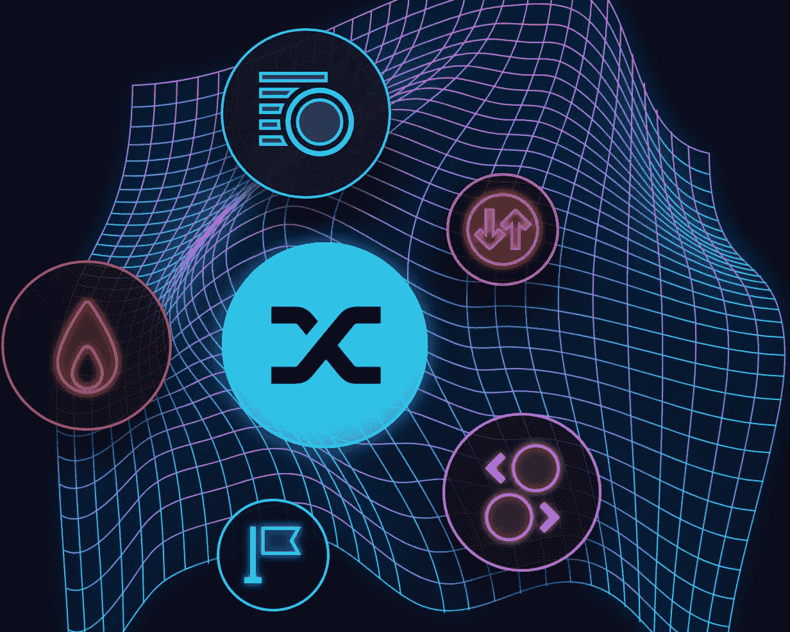

Source : [https://www.synthetix.io/](https://www.synthetix.io/)

[**# Synthetix**](https://twitter.com/hashtag/Synthetix?src=hashtag_click)**的市盈率最高，因为它的年化交易量(每日 800 万美元)最低，费用为 0.41%，高于其他指数。**

Synthetix 是以太坊上的衍生品流动性协议，支持合成资产的发行和交易。每个合成资产(或 Synth)都是一个跟踪外部资产价格的 ERC20 令牌。它由 Synthetix 网络令牌(SNX)的值支撑。SNX 充当抵押品；铸造合成器需要标上 SNX 的比例值。赌注者因支持系统而获得奖励，按比例分享系统中活动产生的费用。

## 低市盈率— UNISWAP

市盈率低的公司通常被认为是价值股。这意味着它们被低估了，因为它们的股价相对于基本面来说较低。这种错误定价将是一笔大买卖，会促使投资者在市场修正之前买入股票。当这种情况发生时，投资者会因股价上涨而获利。分散交换中锁定的总价值

[**#Uniswap**](https://twitter.com/hashtag/SushiSwap?src=hashtag_click) **，市盈率最低，因为其年化交易量最高(每日 3.44 亿美元)**

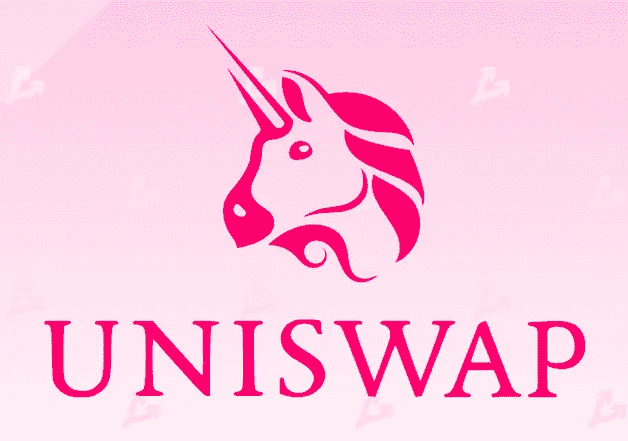

Source : [https://uniswap.org/](https://uniswap.org/)

[Uniswap](https://coinmarketcap.com/exchanges/uniswap-v2/) 是一种流行的分散式交易协议，因其在促进分散式金融( [DeFi](https://coinmarketcap.com/alexandria/article/what-is-decentralized-finance) )令牌的自动化交易中的作用而闻名。通过使做市过程自动化，该协议通过限制风险和降低各方成本来激励活动。该机制还取消了对用户的身份要求，从技术上讲，任何人都可以为任何一对代币创建流动性池。

根据 Uniswap 的说法，创建他们的治理令牌(UNI)是为了“正式将 Uniswap 作为公有和自我可持续的基础设施，同时继续认真保护其坚不可摧和自主的品质。”

**从纯分析的角度来看，即使 UNI 持有者没有直接从收益中受益，他们也有动力确保 Uniswap 成为市场上最具竞争力的 DEX，这使 UNI 令牌与 SNX 令牌相比具有相对竞争优势。**未来的治理，如提议对协议进行更改、就是否实施他人建议的更改进行辩论和投票，将比 P/E 指标发挥更大的作用。

***本研究无意为任何个人或任何特定的证券或投资产品提供特定的建议或推荐。它只是为了提供有关财务评估指标的培训。***

## [方法:在 Google 表单中获取 DEX 数量和费用](https://docs.google.com/spreadsheets/d/190CBcTbslEb9s8acBpmdxi37MNJgWuxD7RWIHNiC22g/edit?usp=sharing)

*   **24h 指数成交量**

如果您希望检索任何分散交易所的最新 24 小时交易量($)，您将需要使用**cryptodexcolume()公式**。它将为您提供下图所示的体积。

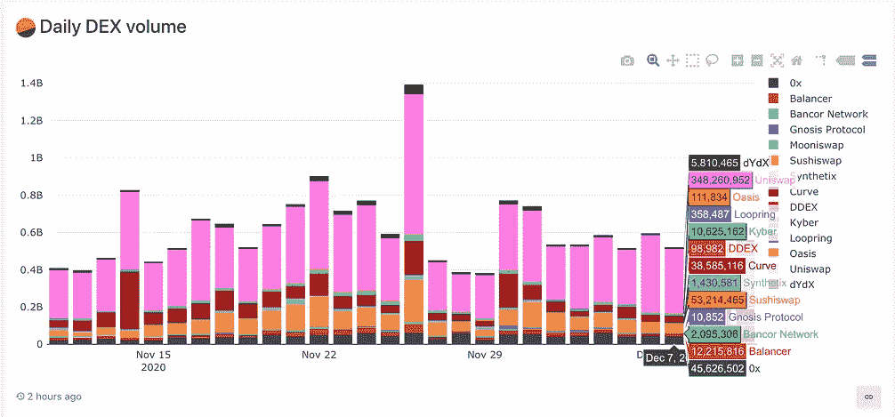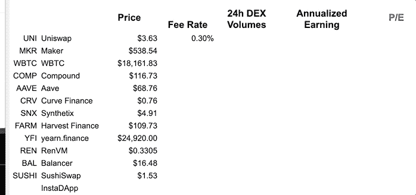

24h DEX Volume **Dune Analytic**s Left — **Google** Personalized Formula Right

语法: **CRYPTODEXVOLUME(DEX ticker，[可选刷新属性])**

***第一个参数:*** *您要从中获取 24 小时 DEX 成交量的加密货币行情，例如 UNI。* ***2rd 参数*** *一个可选的固定单元格用于自动刷新数据，此参数*

*   **流动性提供者的接受者利率**

如果您希望检索任何分散交易所收取的%费用，您将需要使用 **CRYPTODEXFEE()公式**。它会让你得到接受者的费用，如下图所示。

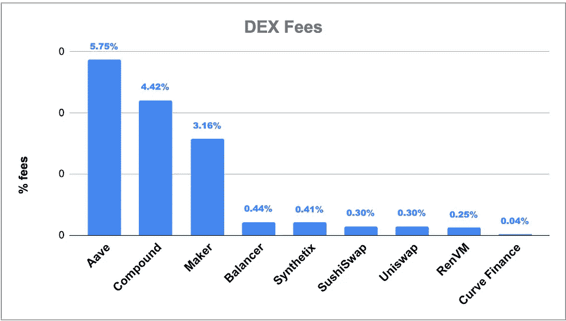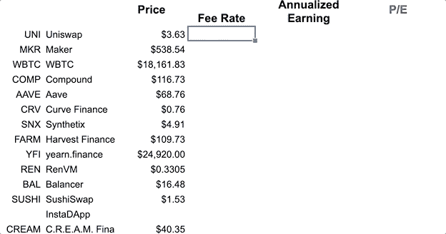

Left **Taker’s Rate for Liquidity Providers —** Right **=CRYPTODEXFEE(“UNI”)** gets Uniswap’s charged transaction fee

语法: **CRYPTODEXFEE(DEX ticker，[可选刷新属性])**

***第 1 个参数:*** *您要从中获取 DEX 费用的加密货币报价机，例如 UNI。* ***2rd 参数*** *一个可选的固定单元格用于自动刷新数据，此参数*

这是正在进行的工作。如果你发现错误，请不要犹豫让我知道。非常欢迎反馈。一个 [*电报聊天*](https://t.me/TheCryptoCurious) *也可供支持。如果这个项目为你增加了任何价值，或者正在你的谷歌表单上寻找个性化编码，请不要犹豫，留下你的信息。*

*所表达的观点仅供一般参考，是* ***而非*** *旨在为任何个人或任何特定的证券或投资产品提供具体的* ***建议*** *或推荐。它只是为了提供关于* ***金融*** *行业的教育。*

非常感谢你花时间阅读这篇文章。

在这个充满挑战的时代，照顾好你自己和你的家人！节日快乐！

## 另外，阅读

*   [密码交易机器人](/coinmonks/crypto-trading-bot-c2ffce8acb2a)
*   [Uniswap API](https://bitquery.io/blog/uniswap-pool-api) —如何获取 Uniswap 数据？
*   [AAX 交易所审核](/coinmonks/aax-exchange-review-2021-67c5ea09330c) |推荐代码、交易费用、利弊
*   [德里比特评论](/coinmonks/deribit-review-options-fees-apis-and-testnet-2ca16c4bbdb2) |选项、费用、API 和 Testnet
*   [FTX 密码交易所评论](/coinmonks/ftx-crypto-exchange-review-53664ac1198f)
*   [Bybit 交换审查](/coinmonks/bybit-exchange-review-dbd570019b71)
*   最好的比特币[硬件钱包](/coinmonks/the-best-cryptocurrency-hardware-wallets-of-2020-e28b1c124069?source=friends_link&sk=324dd9ff8556ab578d71e7ad7658ad7c)
*   [密码本交易平台](/coinmonks/top-10-crypto-copy-trading-platforms-for-beginners-d0c37c7d698c)
*   [bits gap vs 3 commas vs quad ency](https://blog.coincodecap.com/bitsgap-3commas-quadency)
*   最好的[加密税务软件](/coinmonks/best-crypto-tax-tool-for-my-money-72d4b430816b)
*   [最佳加密交易平台](/coinmonks/the-best-crypto-trading-platforms-in-2020-the-definitive-guide-updated-c72f8b874555)
*   最佳加密贷款平台
*   [莱杰纳米 S vs 特雷佐 one vs 特雷佐 T vs 莱杰纳米 X](https://blog.coincodecap.com/ledger-nano-s-vs-trezor-one-ledger-nano-x-trezor-t)
*   [block fi vs Celsius](/coinmonks/blockfi-vs-celsius-vs-hodlnaut-8a1cc8c26630)vs Hodlnaut
*   Bitsgap 评论——一个轻松赚钱的加密交易机器人
*   为专业人士设计的加密交易机器人
*   [PrimeXBT 审查](/coinmonks/primexbt-review-88e0815be858) |杠杆交易、费用和交易
*   [alt ready 审查](https://blog.coincodecap.com/altrady-reivew)
*   [埃利帕尔泰坦评论](/coinmonks/ellipal-titan-review-85e9071dd029)
*   [赛克斯·斯通评论](https://blog.coincodecap.com/secux-stone-hardware-wallet-review)
*   [BlockFi 审查](/coinmonks/blockfi-review-53096053c097) |赚取高达 8.6%的加密利息
*   [开发人员的最佳加密 API](/coinmonks/best-crypto-apis-for-developers-5efe3a597a9f)
*   [最佳区块链分析工具](https://bitquery.io/blog/best-blockchain-analysis-tools-and-software)
*   [加密套利](/coinmonks/crypto-arbitrage-guide-how-to-make-money-as-a-beginner-62bfe5c868f6)指南:新手如何赚钱
*   顶级[比特币节点](https://blog.coincodecap.com/bitcoin-node-solutions)提供商
*   最佳[加密制图工具](/coinmonks/what-are-the-best-charting-platforms-for-cryptocurrency-trading-85aade584d80)
*   了解比特币的[最佳书籍有哪些？](/coinmonks/what-are-the-best-books-to-learn-bitcoin-409aeb9aff4b)

> [直接在您的收件箱中获得最佳软件交易](/coinmonks/newsletters/coinmonks)

