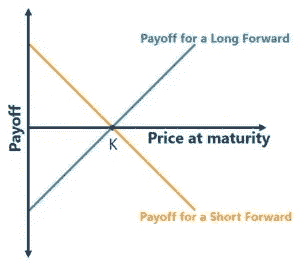

# P2P 比特币结算衍生品:远期合约

> 原文：<https://medium.com/coinmonks/p2p-bitcoin-settled-derivatives-forward-contracts-94d48b909b94?source=collection_archive---------5----------------------->

# 远期合同介绍

[远期合同](https://en.wikipedia.org/wiki/Forward_contract)是双方在未来特定时间以预定价格购买或出售资产的[衍生产品](https://en.wikipedia.org/wiki/Derivative_(finance))。远期是对冲波动性的一种非常常见的工具。因此，使用美元远期合约的人可以对冲美元对比特币汇率的波动。

[The payoff diagram of a forward contract](https://corporatefinanceinstitute.com/resources/knowledge/finance/forward-contract/)

例如，Alice 与 Bob 签订了一份美元远期合约。Alice 同意从现在起一个月后从 Bob 处购买 5000 美元，每比特币 100 美元(即每美元 100，000 satoshi (=0.01 比特币))。

Alice 是一名矿工，必须每月支付电费，她希望降低波动风险。这份合同到期时，她将有权获得 5000 美元，不管当时的比特币汇率如何。Bob 是一名交易员，从事这一合约是作为一种投机手段，期望比特币价格上涨并扭亏为盈。

他们同意用比特币结算合同。双方将以比特币的形式向对方支付约定价格和市场价格之间的差额。因此，如果比特币的美元价值贬值(即比特币价格下跌)，鲍勃将向爱丽丝支付差额。同样的，如果比特币升值，爱丽丝也要付给鲍勃。

# 比特币的美元远期合约

有了这种远期合约，价格波动风险得到了缓解，但它引入了交易对手风险。Alice 或 Bob 可能在合同到期时不履行合同并拒绝付款。

我们使用比特币智能合约分两步实施合约:

1.  爱丽丝和鲍勃各锁定 50 个比特币(5000 * 0.01 比特币/美元)进入以下合约。抵押品不需要第三方托管人。
2.  当合约到期时，甲骨文公布现货价格，抵押品可以使用公布的价格分割。因为任何一方都不能欺骗，所以交易对手的风险降低了。

[Forward Contract](https://github.com/sCrypt-Inc/boilerplate/tree/master/contracts/forward.scrypt)

智能合约中的甲骨文使用[拉宾签名](https://xiaohuiliu.medium.com/access-external-data-from-bitcoin-smart-contracts-2ecdc7448c43)来签署价格馈送(第 29 行)和 [OP_PUSH_TX](https://xiaohuiliu.medium.com/op-push-tx-3d3d279174c1) 来分割抵押品 100 个比特币。

合同到期时有三种可能:

1.  价格等于 100K sats 美元(即每比特币 100 美元)。第 38 行的收益是 0。爱丽丝和鲍勃各拿回 50 个比特币。
2.  价格高于 100K sats 美元。比如 200k sats/美元(即比特币价格降至 50 美元)。Bob 要付给 Alice *5000 * (200K -100K) = 5 亿 sats = 5 比特币*。爱丽丝得到 55 个比特币，鲍勃得到 45 个。
3.  价格低于 100K sats/美元。比如是 50K sats/美元(即比特币价格涨到 200 美元)。爱丽丝要付给鲍勃*5000 *(100K-50K)= 2.5 亿 sats = 2.5 比特币*。爱丽丝得到 47.5 个比特币，鲍勃得到 52.5 个。

## 讨论

我们只实施了基本的智能合约作为概念验证。有许多方法可以使它更实用，我们列举了其中的一些。

*   最大敞口:当价格升至 110 万沙特/美元时(比特币价格降至 90.9 美元)。鲍勃应该付给爱丽丝 *5000 * (1100K -100K) = 5000 万萨特= 50 个比特币。*如果价格进一步上涨，鲍勃无法用 50 个比特币作为抵押品支付全额。需要更多的抵押品来抵御更大的波动风险。
*   用美元结算:当比特币上有美元代币时，合同可以用美元结算，而不是比特币。也可以使用美元作为抵押品。
*   万无一失:如果 oracle 没有发布所需的价格数据，我们可以在智能合约中添加一个公共函数，让 Alice 和 Bob 都签名以取回他们的抵押品。
*   多个 oracle:为了降低恶意 Oracle 的风险，可以使用多个 Oracle。

# 摘要

我们展示了一份比特币结算的美元远期合约。它可以很容易地扩展到任何需要根据外部未来价值分割比特币计价资金的金融工具。

基础资产可以是任何东西，比如黄金、小麦或石油。只要有一个 oracle 发布价格，就可以使用上面的智能合约建立远期合约。

[1]这种类型的远期被称为[无本金交割远期](https://www.dripcapital.com/en-us/resources/blog/what-is-a-forward-contract#10)。