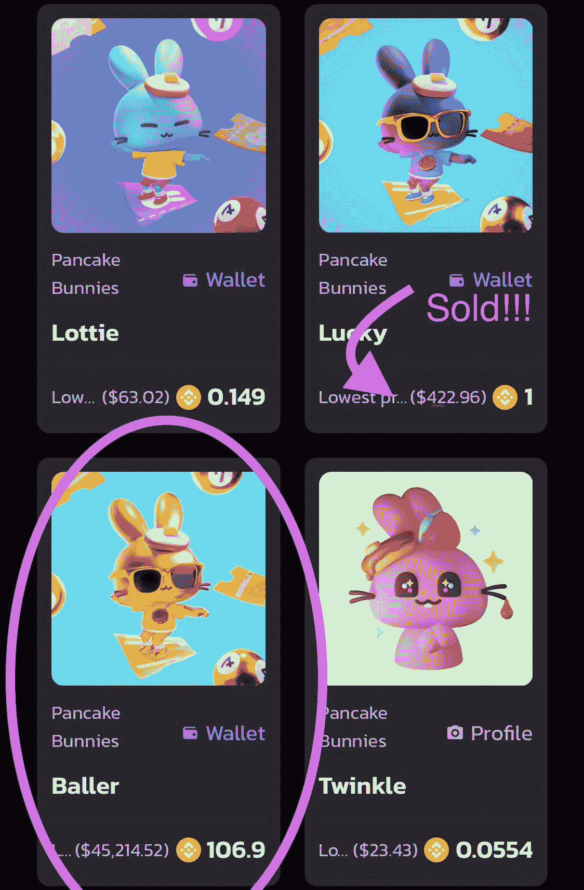

# 煎饼 NFTs——我是信徒！

> 原文：<https://medium.com/coinmonks/pancake-nfts-im-a-believer-993ef44460d4?source=collection_archive---------2----------------------->

Non-Fungible Tokens, or NFT’s, have value because they are rare and unique. Some NFT’s are static still images, while others are dynamic moving images. Others yet can be enhanced or upgraded by action or inaction of the owner.

首先，我一直非常怀疑有人愿意花大价钱买一张照片。好吧，我在你面前谦卑自己…

[***Pancakeswap***](https://pancakeswap.finance/)已经进入了不可替换的令牌 NFT 世界，你现在可以用 NFT 的交换 Pancakeswap NFT 的(暂时)。正如许多人已经知道的那样，随着艺术家甚至拍卖行允许并以数百万美元的价格出售 NFT 的作品，NFT 的趋势越来越强劲！一些…