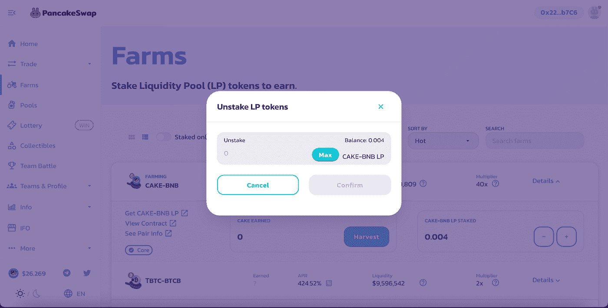
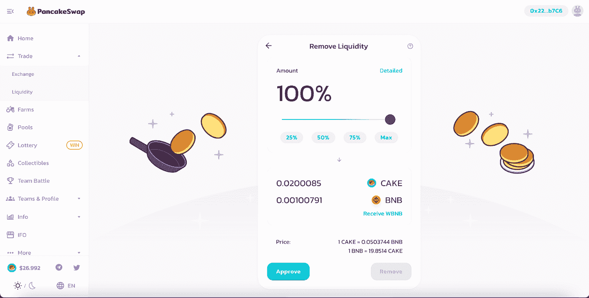

# PancakeSwap v2 更新:如何拆分流动性池

> 原文：<https://medium.com/coinmonks/pancakeswap-v-2-update-how-to-unstake-liquidity-pool-f0032cbca3a5?source=collection_archive---------1----------------------->

亲爱的南瓜们:

如你所知，Pumpy 正在与币安智能链生态系统中的其他项目积极合作，例如 PancakeSwap。目前，PancakeSwap 正在准备一次重大更新:他们将把我们目前的两个智能合同迁移到新的升级合同。换句话说，他们正在创建一套新的 LP 令牌，我们的农场和交易所将开始支持新类型，而不是旧类型。这很好，因为这实际上意味着协议的一个新版本(v.2)。

> 交易新手？试试[加密交易机器人](/coinmonks/crypto-trading-bot-c2ffce8acb2a)或者[复制交易](/coinmonks/top-10-crypto-copy-trading-platforms-for-beginners-d0c37c7d698c)

在 PancakeSwap 升级过程中，池的预期产出可能会发生变化。在这方面，我们编写了一个简短的 10 步指南，指导如何拆分流动性池(LP)。这是:

1.在令牌数据透视表的 Farms 部分，选择拆分所需的流动性对。

2.选择它并打开附加信息后，单击“-”

3.将出现“取消堆叠 LP 令牌”窗口，您需要在其中指定要取消堆叠的令牌的数量。

4.按“确认”, MetaMask 将显示以确认操作，再次按“确认”。

5.完成后，转到流动性部分。此部分将显示您下注的前一对流动性代币。

6.选择此对并单击“删除”；然后出现窗口，指示“拆分”的令牌数。

7.将数量设置为最大，然后按“批准”；您将看到一个元蒙版窗口。点击“签名”。

8.之后，解锁“移除”按钮以执行最后的操作并拆分流动性令牌。按下它。

9.按“确认”。

10.您会收到一条消息，表明交易已经发送，过一段时间您会收到返回的令牌。

**PancakeSwap v . 2 更新**

由于几乎所有 PancakeSwap 池的迁移都已完成，您可以创建一个 v2 池—为此，您需要转到 LP 迁移菜单。

Pumpy 中 v2 池的标记目前正在开发中——我们将很快添加它。

感谢您使用 Pumpy。我们有宏大的发展计划，请在 [Twitter](https://twitter.com/pumpyfarm) 上关注我们，并加入我们的[电报聊天](https://t.me/pumpyfarm)。

Pumpy 是一个产量优化平台，专注于为 DeFi 用户提供经验最佳间隔的自动复合产量，同时通过久经考验的智能合同代码和一流的产量优化策略来集中天然气成本。

> 加入 Coinmonks [电报频道](https://t.me/coincodecap)和 [Youtube 频道](https://www.youtube.com/c/coinmonks/videos)获取每日[加密新闻](http://coincodecap.com/)

## 另外，阅读

*   [复制交易](/coinmonks/top-10-crypto-copy-trading-platforms-for-beginners-d0c37c7d698c) | [加密税务软件](/coinmonks/crypto-tax-software-ed4b4810e338)
*   [网格交易](https://coincodecap.com/grid-trading) | [加密硬件钱包](/coinmonks/the-best-cryptocurrency-hardware-wallets-of-2020-e28b1c124069)
*   [密码电报信号](http://Top 4 Telegram Channels for Crypto Traders) | [密码交易机器人](/coinmonks/crypto-trading-bot-c2ffce8acb2a)
*   [币安交易机器人](/coinmonks/binance-trading-bots-d0d57bb62c4c) | [OKEx 评论](/coinmonks/okex-review-6b369304110f) | [阿塔尼评论](https://coincodecap.com/atani-review)
*   [最佳加密交易信号电报](/coinmonks/best-crypto-signals-telegram-5785cdbc4b2b) | [MoonXBT 评论](/coinmonks/moonxbt-review-6e4ab26d037)
*   如何在 Bitbns 上购买柴犬(SHIB)币？ | [买弗洛基](https://coincodecap.com/buy-floki-inu-token)
*   [CoinFLEX 评论](https://coincodecap.com/coinflex-review) | [AEX 交易所评论](https://coincodecap.com/aex-exchange-review) | [UPbit 评论](https://coincodecap.com/upbit-review)
*   [十大最佳加密货币博客](https://coincodecap.com/best-cryptocurrency-blogs) | [YouHodler 评论](https://coincodecap.com/youhodler-review)
*   [最佳加密交易所](/coinmonks/crypto-exchange-dd2f9d6f3769) | [最佳加密交易所](/coinmonks/bitcoin-exchange-in-india-7f1fe79715c9)
*   面向开发者的最佳加密 API
*   最佳[密码借贷平台](/coinmonks/top-5-crypto-lending-platforms-in-2020-that-you-need-to-know-a1b675cec3fa)
*   [免费加密信号](/coinmonks/free-crypto-signals-48b25e61a8da) | [加密交易机器人](/coinmonks/crypto-trading-bot-c2ffce8acb2a)
*   [杠杆代币](/coinmonks/leveraged-token-3f5257808b22)终极指南