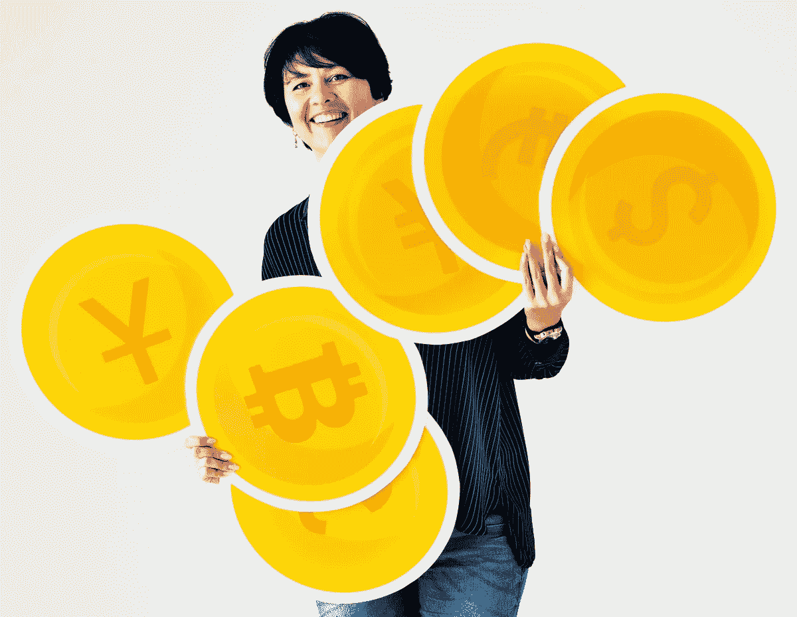
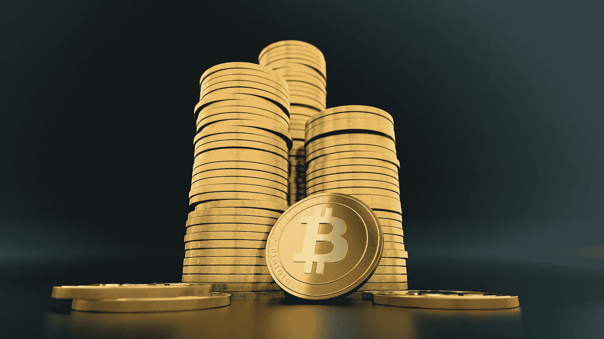
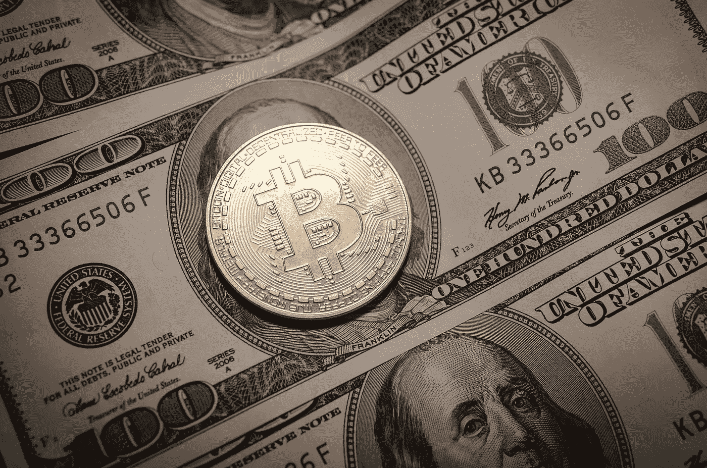

# 纸币还是比特币？

> 原文：<https://medium.com/coinmonks/paper-money-or-bitcoin-c90eda5ea7c3?source=collection_archive---------10----------------------->

A Woman carrying different currency coins.

大多数人希望他们有更多的钱。你在街上问的关于他们生活目标的问题，十个人中有八到九个人会说他们想变得富有。

因此，主流媒体充斥着个人一夜暴富的故事也就不足为奇了。

这是一个有效的销售策略，因为每个人都想发现成功的秘密。我不打算在这篇文章中透露任何秘方，因为我确信没有任何秘方。

然而，我希望你考虑一下，如果有一大笔钱，你会做什么。你认为你可以在任何你想要的时候好好利用它吗？

你受制于金融业一系列过时的规章制度。

你的弟弟被困在异乡。现在是周六晚上 6 点。尽管你在洛杉矶，他还是从香港打电话给你。他现在急需 15000 美元。你努力工作，结果积累了一大笔财富。因此，你可以帮助他。

你给他寄钱是因为他是你哥哥，而且情况紧急。

你将会有一个糟糕的惊喜。首先，你的银行在星期六和星期天关门。周末不对金融业开放。你转到香港至少要等到星期一。你已经浪费了将近 36 个小时的生命。

You worked hard for your money, and now you can’t spend it anytime you want?

这是一周的第一天。你会想掉包的。你的银行的网页界面不会让你，因为总额太高。因此，你需要拜访当地的分公司。分行通知您，考虑到涉及的金额，您必须提供文件来支持资金转账。

你什么意思？你辛辛苦苦挣来的钱，现在却不能想花就花？

可以肯定地说那不是真的。有什么问题？因为这不是你的钱，这就是原因。只有遵守现有的货币金融体系规范，你的钱才是你的。个人的最大利益往往与这些人为的规定相冲突。

目前的制度不能满足现代世界的要求，更不用说未来的要求了。

这种资金转移的理由将需要许多小时，如果不是几天。因为你的兄弟姐妹在地球的另一边需要帮助并不能成为一个足够好的借口。贷方很有可能会询问他在日本使用资金的意图。如果你拒绝这个提议，你会有麻烦的。对此我深信不疑。

即使你同意，也很有可能会被批评。当你筹集了大量资金，并打算将资金汇往海外时，银行不喜欢这样。对他们来说不太合适。

你最早可以在下一周的星期五寄钱。你已经被为期六天的错觉打击了。由于 SWIFT 银行间支付系统国际银行转账需要 4 到 5 天，您的兄弟将在最多 10 到 15 天内收到他急需的 15K 美元。

你可能认为我太戏剧化了，无法把我的论点讲清楚。这种情况每年都会发生在数百个人身上，这是一个悲剧。

在目前的体制下，你无法控制自己的财务

这是值得思考的。当你不能控制你的钱时，它并不像你想象的那样有用。

因为现有的制度，你无法控制你的努力所得到的回报。如果你想出于自己的原因使用你的钱，你就没那么幸运了，因为私人银行家已经完全控制了你的财务。

Governments have the power to impose censorship on you.

政府有权对你进行审查。

最后，由央行官员引发的货币通胀会让你的储蓄贬值。他们的大部分时间都花在创造更多的法定货币上，这是荒谬的。自从现行体制在 1971 年 8 月建立以来，他们拥有不受制约的权力，损害了世界大多数人口的繁荣，然而他们似乎并不介意。

> **另请参见:** [8 种最佳加密货币，让你在这波牛市中投资](https://asedeyhotnaija.com/8-best-cryptocurrencies-to-put-your-money-in-this-bull-run/)

现有制度必须无限期保留。

有了比特币，你可以随时收回你的权威，做任何你想做的事情。

另一方面，你必须寻找摆脱这种永无止境的贫困循环的方法。为了帮助解决这个问题，数字货币比特币应运而生。在像我们这样不可预测的环境中，比特币通过向消费者提供独特的保证，将控制权还给他们。

一个系统性的货币政策，保护你免受人类的非理性和随之而来的腐败。市场上总会有 2100 万台的限量供应。你不能被领导审查。当你在比特币网络上投入时间和精力时，回报归你所有。

任何时候你想怎么做都是你的事。换句话说，你说了算。

最重要的是，你可以随时使用比特币。你兄弟的请求将在星期六下午 6 点为你准备好，所以请那时做好。他会在几分钟内收到他要求的钱。在这个艰难的时刻，你可以帮助他。

目前的系统不能让你做到这一点。

你将最终能够享受你的血汗钱转换成比特币后，你成为该资产的实际所有者。对你来说，钱将是帮助你实现目标的工具，而不是目的本身。

在那之后，你将有按照自己的规则生活的自由。

[*加拿大提供投资比特币的交易所交易基金*](https://sammaiyaki.medium.com/canada-offers-exchange-traded-funds-etfs-that-invest-in-bitcoin-40f55c00399)

> 加入 Coinmonks [电报频道](https://t.me/coincodecap)和 [Youtube 频道](https://www.youtube.com/c/coinmonks/videos)了解加密交易和投资

## 另外，阅读

*   [3 商业评论](/coinmonks/3commas-review-an-excellent-crypto-trading-bot-2020-1313a58bec92) | [Pionex 评论](https://blog.coincodecap.com/pionex-review-exchange-with-crypto-trading-bot) | [Coinrule 评论](/coinmonks/coinrule-review-2021-a-beginner-friendly-crypto-trading-bot-daf0504848ba)
*   [莱杰 vs n rave](/coinmonks/ledger-vs-ngrave-zero-7e40f0c1d694)|[莱杰 nano s vs x](/coinmonks/ledger-nano-s-vs-x-battery-hardware-price-storage-59a6663fe3b0) | [币安评论](/coinmonks/binance-review-ee10d3bf3b6e)
*   [Bybit 交易所评论](/coinmonks/bybit-exchange-review-dbd570019b71) | [Bityard 评论](https://blog.coincodecap.com/bityard-reivew) | [CoinSpot 评论](https://blog.coincodecap.com/coinspot-review)
*   [3 commas vs crypto hopper](/coinmonks/3commas-vs-pionex-vs-cryptohopper-best-crypto-bot-6a98d2baa203)|[赚取秘密利息](/coinmonks/earn-crypto-interest-b10b810fdda3)
*   最好的比特币[硬件钱包](/coinmonks/hardware-wallets-dfa1211730c6) | [BitBox02 回顾](/coinmonks/bitbox02-review-your-swiss-bitcoin-hardware-wallet-c36c88fff29)
*   [BlockFi vs 摄氏度](/coinmonks/blockfi-vs-celsius-vs-hodlnaut-8a1cc8c26630) | [Hodlnaut 审核](/coinmonks/hodlnaut-review-best-way-to-hodl-is-to-earn-interest-on-your-bitcoin-6658a8c19edf) | [KuCoin 审核](https://blog.coincodecap.com/kucoin-review)
*   [Bitsgap 审查](/coinmonks/bitsgap-review-a-crypto-trading-bot-that-makes-easy-money-a5d88a336df2) | [Quadency 审查](/coinmonks/quadency-review-a-crypto-trading-automation-platform-3068eaa374e1) | [Bitbns 审查](/coinmonks/bitbns-review-38256a07e161)
*   [Stackedinvest 审查](https://blog.coincodecap.com/stackedinvest-review) | [北海巨妖审查](/coinmonks/kraken-review-6165fc1056ac) | [期货交易机器人](/coinmonks/futures-trading-bots-5a282ccee3f5)
*   最佳[加密借贷平台](/coinmonks/top-5-crypto-lending-platforms-in-2020-that-you-need-to-know-a1b675cec3fa) | [杠杆令牌](/coinmonks/leveraged-token-3f5257808b22)
*   最佳[加密制图工具](/coinmonks/what-are-the-best-charting-platforms-for-cryptocurrency-trading-85aade584d80) | [最佳加密交易所](/coinmonks/crypto-exchange-dd2f9d6f3769)
*   [比特币基地僵尸工具](/coinmonks/coinbase-bots-ac6359e897f3) | [AscendEX 审查](/coinmonks/ascendex-review-53e829cf75fa) | [OKEx 交易僵尸工具](/coinmonks/okex-trading-bots-234920f61e60)
*   [如何在印度购买比特币？](/coinmonks/buy-bitcoin-in-india-feb50ddfef94) | [瓦济克斯评论](/coinmonks/wazirx-review-5c811b074f5b)
*   [隐翅虫替代品](/coinmonks/cryptohopper-alternatives-d67287b16d27) | [HitBTC 审查](/coinmonks/hitbtc-review-c5143c5d53c2)
*   [折叠 App 审核](https://blog.coincodecap.com/fold-app-review) | [Kucoin 交易机器人](/coinmonks/kucoin-trading-bot-automate-your-trades-8cf0ca2138e0) | [Probit 审核](https://blog.coincodecap.com/probit-review)
*   [如何匿名购买比特币](https://blog.coincodecap.com/buy-bitcoin-anonymously) | [比特币现金钱包](https://blog.coincodecap.com/bitcoin-cash-wallets)
*   [币安 vs FTX](https://blog.coincodecap.com/binance-vs-ftx) | [最佳(SOL)索拉纳钱包](https://blog.coincodecap.com/solana-wallets) | [喜美元点评](https://blog.coincodecap.com/hi-dollar-review)