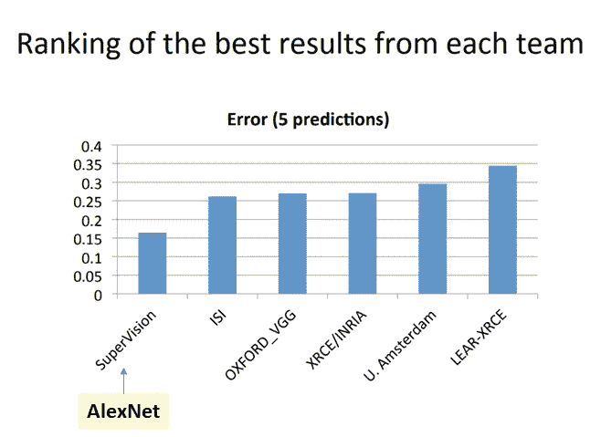
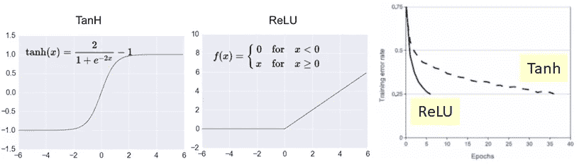
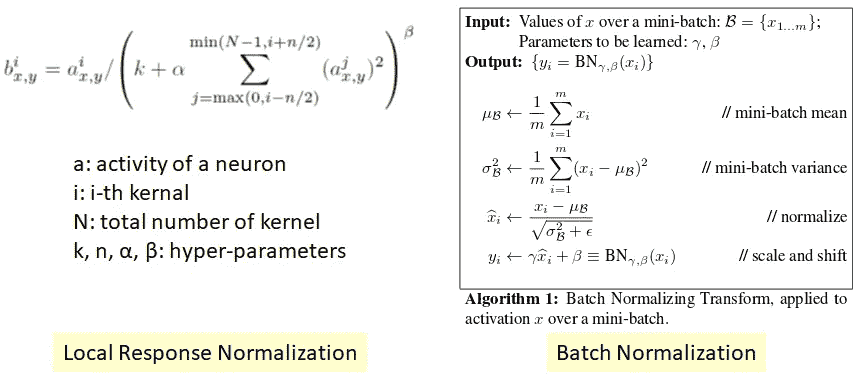
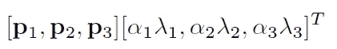
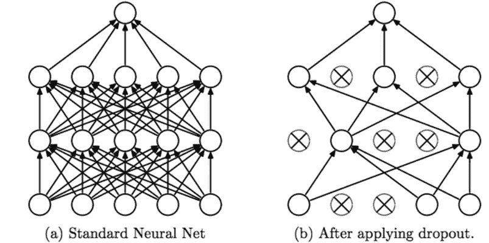
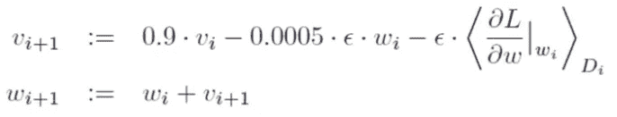
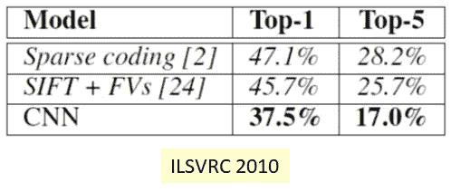
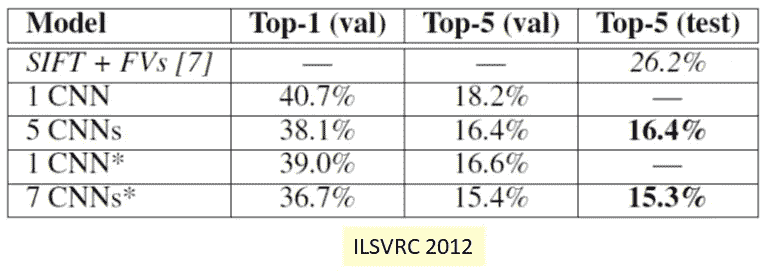
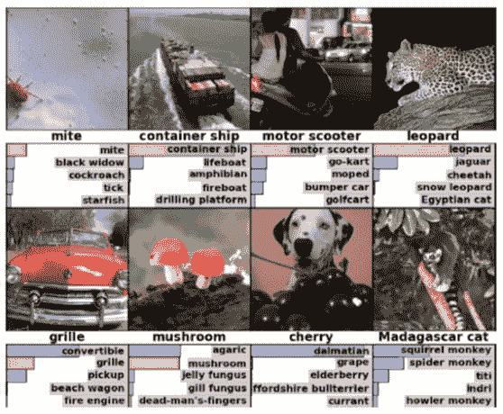
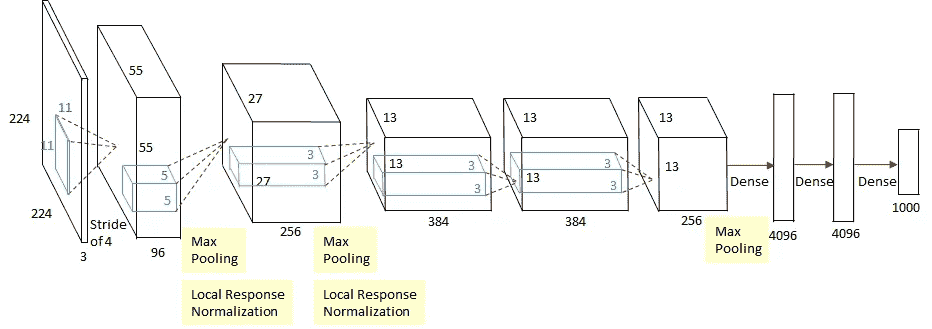

# 回顾:AlexNet，CaffeNet——2012 年 ILSVRC(图像分类)获奖者

> 原文：<https://medium.com/coinmonks/paper-review-of-alexnet-caffenet-winner-in-ilsvrc-2012-image-classification-b93598314160?source=collection_archive---------0----------------------->

在这个故事中， **AlexNet** 和 **CaffeNet** 被回顾。AlexNet 是 ILSVRC ( [**ImageNet 大规模视觉识别竞赛**](http://www.image-net.org/challenges/LSVRC/) **) 2012** 的**冠军，这是一项图像分类竞赛。**

这是 2012 年 NIPS 的一篇论文，来自辛顿教授的小组，在我写这篇文章的时候，引用了大约 28000 次。在深度学习方面有了**的本质突破，大幅降低了 ILSVRC 2012** 的错误率，如下图所示。因此，这是一篇必读的论文！！( [Sik-Ho Tsang](https://medium.com/u/aff72a0c1243?source=post_page-----b93598314160--------------------------------) @中)

ImageNet 是一个数据集，包含超过 1500 万张带有标签的高分辨率图像，大约有 22，000 个类别。ILSVRC 在 1000 个类别中的每个类别中使用大约 1000 个图像的 ImageNet 子集。总的来说，大约有 120 万幅训练图像、50，000 幅验证图像和 150，000 幅测试图像。

**AlexNet, the winner in ILSVRC 2012 image classification with remarkable lower error rate**

A.对于 **AlexNet** ，我们将涵盖:

1.  **建筑**
2.  **ReLU(整流线性单元)**
3.  **多个 GPU**
4.  **局部反应正常化**
5.  **重叠池**
6.  **数据扩充**
7.  **辍学**
8.  **学习参数的其他细节**
9.  **结果**

B.对于 **CaffeNet** ，它只是一个**单 GPU 版本的 AlexNet** 。由于通常情况下，人们只会有一个 GPU，CaffeNet 是一个模拟 AlexNet 的单 GPU 网络。在这个故事的结尾，我们也会谈到这一点。

通过浏览每个组件，我们可以知道每个组件的重要性。其中一些现在已经没什么用了。但它们确实激发了其他网络的发明。

# **A. AlexNet**

## 1.体系结构

**AlexNet**

AlexNet 包含**八层**:

输入:227×227×3 的输入图像(文中和图中提到了 224×224×3 的大小，但后来指出应该是 227，或者在第一次卷积时填充了 224×224×3。)

**第 1 层:卷积层:2 组 48 个核，大小 11×11×3
(步距:4，填充:0)**输出 55×55 ×48 特征图×2 组
然后 **3×3 重叠最大池(步距:2)** 输出 27×27 ×48 特征图×2 组
然后**局部响应归一化** 输出 27×27 ×48 特征图×2 组

**第二:卷积层:2 组 128 个大小为 5×5×48 的核
(步距:1，填充:2)** 输出 27×27 ×128 个特征映射×2 组然后 **3×3 重叠最大池(步距:2)** 输出 13×13 ×128 个特征映射×2 组
然后**局部响应归一化** 输出

**第三:卷积层:2 组 192 个大小为 3×3×256 的核
(步距:1，pad: 1)** 输出 13×13 ×192 个特征图×2 组

**第四:卷积层:2 组 192 个大小为 3×3×192 的核
(stride: 1，pad: 1)** 输出 13×13 ×192 个特征图×2 组

**第 5:卷积层:256 个大小为 3×3×192 的核
(步距:1，填充:1)** 输出 13×13 ×128 个特征图×2 组
然后 **3×3 重叠最大池(步距:2)** 输出 6×6 ×128 个特征图×2 组

**第六层:** 4096 神经元的全连接(密集)层

**第 7 层:** 4096 神经元的全连接(密集)层

**第 8 层:** 全连接(密集)层输出 1000 个神经元(既然有 1000 个类)
**Softmax** 用于计算损耗。

总共有 6000 万个参数需要训练！！！

## 2.热卢

**Activation function**

在 Alexnet 之前，使用的是 Tanh。 **ReLU 是 AlexNet 中介绍的。**
**ReLU 比 Tanh** 快 6 倍达到 25%的训练错误率。

## 3.**多个 GPU**

目前使用的是 NVIDIA GTX 580 GPU，只有 3GB 内存。因此，我们可以在架构中看到，它们分成两条路径，并使用 2 个 GPU 进行卷积。内部通信只发生在一个特定的卷积层。

**因此，使用 2 个 GPU，是由于内存问题，而不是为了加快训练过程。**

全网**与只有一半内核**(只有一条路径)的网相比， **Top-1 和 top-5 错误率分别降低 1.7%和 1.2%。**

## **4。本地响应标准化**

**Normalization**

**在 AlexNet 中，使用局部响应归一化**。正如我们在方程中看到的，它不同于批量归一化。标准化有助于加速收敛。现在使用批量规范化，而不是使用局部响应规范化。

**通过局部响应归一化，前 1 名和前 5 名错误率分别降低了 1.4%和 1.2%。**

## **5。重叠池**

重叠池是跨度小于内核大小的池，而非重叠池是跨度等于或大于内核大小的池。

**通过重叠池，前 1 名和前 5 名的错误率分别降低了 0.4%和 0.3%。**

## **6。数据扩充**

数据扩充的两种形式。

**首先:图像平移和水平反射(镜像)**

从一幅 256×256 加上水平反射的图像中提取随机的 224×224。训练集的大小增加了 2048 倍。这可以通过以下方式计算:

通过图像转换:(256–224)= 32 = 1024

水平反射:1024 × 2 = 2048

在测试时，使用四个角点补片加上中心补片及其对应的水平反射(共 10 个补片)进行预测，并对所有结果取平均值，得到最终的分类结果。

**第二:改变强度**

在训练集上执行 PCA。对于每个训练图像，添加数量:

**Quantity of intensity altered**

其中 pi 和λi 分别是 RGB 像素值的 3×3 协方差矩阵的第 I 个特征向量和特征值，αi 是均值为 0、标准差为 0.1 的随机变量。

**通过数据扩充增加训练集的规模，Top-1 错误率降低了 1%以上。**

## **7。辍学**

**Dropout**

在使用丢弃的层中，在训练期间，每个神经元都有可能不对前馈传递做出贡献并参与反向传播。因此，每个神经元可以有更大的机会被训练，而不是太依赖于一些非常“强”的神经元。

在测试期间，不会出现辍学现象。

**在 AlexNet 中，概率 0.5 用于前两个全连接层。丢弃是一种减少过拟合的正则化技术。**

## 8.**学习参数的其他细节**

批量:128
动量 v: 0.9
重量衰减:0.0005
学习率ϵ: 0.01，验证错误率停止改善时手动减少 10，减少 3 倍。

**The update of momentum v and weight w**

120 万幅图像的训练集。网络被训练大约 90 个周期。在两个英伟达 GTX 580 3GB GPU 上运行五到六天。

## 9.结果

**Error Rate in ILSVRC 2010**

**对于 ILSVRC 2010，AlexNet 获得了前 1 名和前 5 名的错误率，分别为 37.5%和 17.0%，优于其他方法。**

**没有通过数据增强对十个补丁的十个预测**进行平均， **AlexNet 只得到前 1 名和前 5 名的错误率，分别为 39.0%和 18.3%。**

**Error Rate in ILSVRC 2012**

通过 **1 AlexNet (1 CNN)** ，验证错误率为 **18.2%** 。

通过**平均来自 5 个 AlexNet (5 个 CNN)**的预测，错误率降低到 **16.4%** 。这是一种已经在 LeNet 中用于数字分类的增强技术。

通过**在 AlexNet (1 CNN*)** 上多加一层卷积层，验证错误率降低到 **16.6%** 。

通过**对 2 个修改后的 AlexNet 和 5 个原始 AlexNet (7 个 CNNs*)** 的预测进行平均，验证错误率降低到 **15.4%** 。

**Some Top-5 results by AlexNet**

# B.卡芬内

**CaffeNet 是 AlexNet** 的 1-GPU 版本。该架构是:

**CaffeNet**

我们可以看到，AlexNet 中的 2 条路径合并成了一条路径。

值得注意的是，对于早期版本的 CaffeNet，池化和规范化层的顺序是颠倒的，这是偶然的。但是在 Caffe 提供的 CaffeNet 的当前版本中，它已经为 Caffenet 提供了池化和规范化层的正确顺序。

逐一考察每一个成分，就可以知道每一个成分的有效性。: )

有兴趣的话，还有一个关于使用 Nvidia-Docker 和 Caffe 的 [CaffeNet 快速设置教程](/@sh.tsang/very-quick-setup-of-caffenet-alexnet-for-image-classification-using-nvidia-docker-2-0-c3b75bb8c7a8)【3】。

# 参考

1.  【2012 NIPS】【Alex net】
    [使用深度卷积神经网络的 ImageNet 分类](https://papers.nips.cc/paper/4824-imagenet-classification-with-deep-convolutional-neural-networks.pdf)
2.  【2014 ACM MM】【CaffeNet】
    [Caffe:用于快速特征嵌入的卷积架构](https://ucb-icsi-vision-group.github.io/caffe-paper/caffe.pdf)
3.  [使用 Nvidia-Docker 2.0+CUDA+cud nn+Jupyter Notebook+Caffe 快速设置 CaffeNet (AlexNet)进行图像分类](/@sh.tsang/very-quick-setup-of-caffenet-alexnet-for-image-classification-using-nvidia-docker-2-0-c3b75bb8c7a8)
4.  ils vrc
    ImageNet 大型视觉识别比赛

> 加入 Coinmonks [电报频道](https://t.me/coincodecap)和 [Youtube 频道](https://www.youtube.com/c/coinmonks/videos)获取每日[加密新闻](http://coincodecap.com/)

## 另外，阅读

*   [复制交易](/coinmonks/top-10-crypto-copy-trading-platforms-for-beginners-d0c37c7d698c) | [加密税务软件](/coinmonks/crypto-tax-software-ed4b4810e338)
*   [网格交易](https://coincodecap.com/grid-trading) | [加密硬件钱包](/coinmonks/the-best-cryptocurrency-hardware-wallets-of-2020-e28b1c124069)
*   [密码电报信号](http://Top 4 Telegram Channels for Crypto Traders) | [密码交易机器人](/coinmonks/crypto-trading-bot-c2ffce8acb2a)
*   [最佳加密交易所](/coinmonks/crypto-exchange-dd2f9d6f3769) | [印度最佳加密交易所](/coinmonks/bitcoin-exchange-in-india-7f1fe79715c9)
*   开发人员的最佳加密 API
*   最佳[密码借贷平台](/coinmonks/top-5-crypto-lending-platforms-in-2020-that-you-need-to-know-a1b675cec3fa)
*   杠杆代币的终极指南