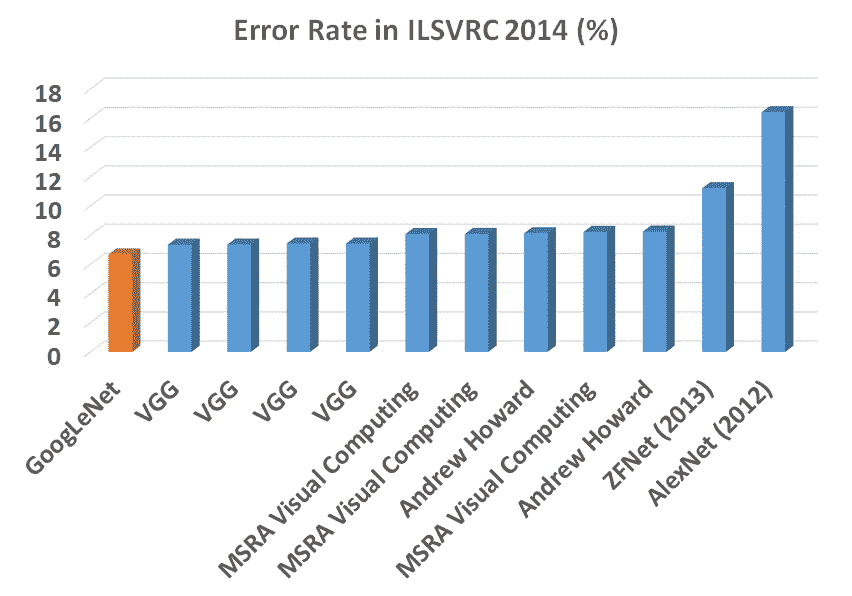
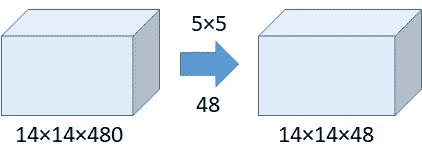
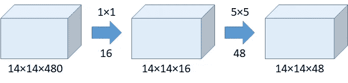
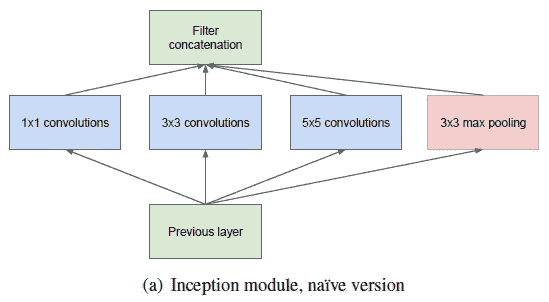
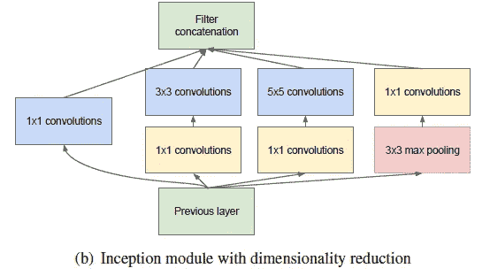
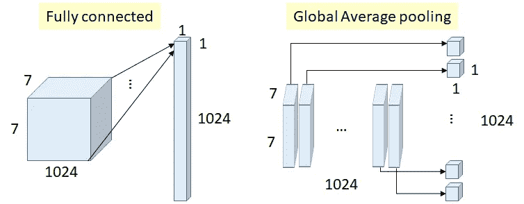
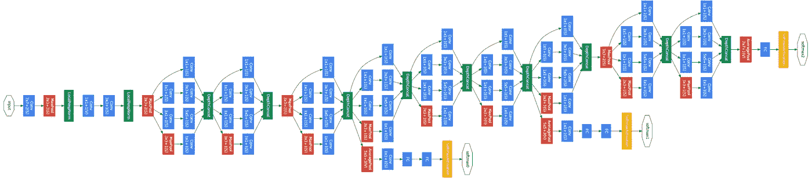
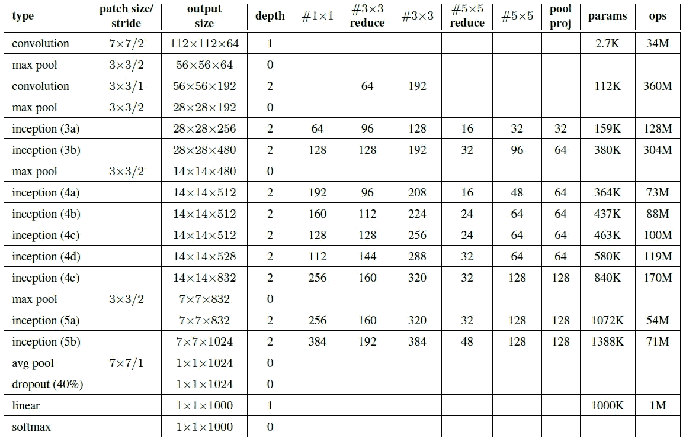
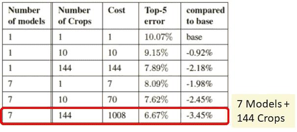
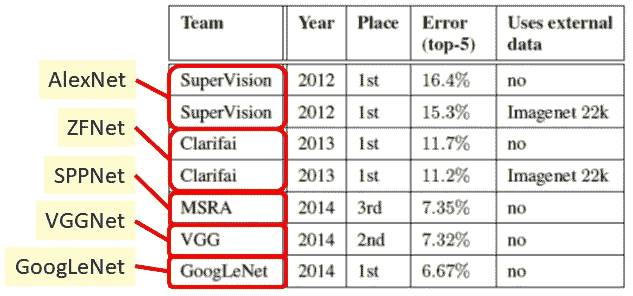

# 评论:Google net(Inception v1)——2014 年 ILSVRC(图像分类)获奖者

> 原文：<https://medium.com/coinmonks/paper-review-of-googlenet-inception-v1-winner-of-ilsvlc-2014-image-classification-c2b3565a64e7?source=collection_archive---------0----------------------->

在这个故事中， **GoogLeNet [1]** 被回顾，它是图像分类竞赛 **ILSVRC (** [**ImageNet 大规模视觉识别竞赛**](http://www.image-net.org/challenges/LSVRC/) **) 2014** 的冠军，比 ZF net(2013 年的冠军)【2】和 AlexNet(2012 年的冠军)【3】都有显著的提升，并且相对于 VGGNet(2014 年的亚军)【4】

从“ **GoogLe** Net”这个名字，我们已经知道它来自 GoogLe。而“Goog **LeNet** ”也包含了“LeNet”一词，以此向颜乐存教授的 LeNet [5]致敬。这是一篇 **2015 年 CVPR** 的论文，有**大约 9000 次引用**当我在写这个故事的时候。( [Sik-Ho Tsang](https://medium.com/u/aff72a0c1243?source=post_page-----c2b3565a64e7--------------------------------) @中)

它也被称为 **Inception v1** ，因为后来还有 v2、v3 和 v4。

**ILSVRC 2014 Error Rate (%)**

本文中的网络架构与 VGGNet、ZFNet 和 AlexNet 有很大不同。在网络中间包含 **1×1 卷积**。并且**全局平均池**在网络末端使用，而不是使用全连接层。这两种技术来自另一篇论文《网络中的网络》(NIN) [6]。另一种被称为**初始模块**的技术是对相同的输入使用不同大小/类型的卷积，并堆叠所有的输出。

作者还提到“**盗梦空间**”这个名字的想法来自 NIN 和下面一个著名的互联网模因:**我们需要更深入**。

**WE NEED TO GO DEEPER**

ImageNet 是一个数据集，包含超过 1500 万张带有标签的高分辨率图像，大约有 22，000 个类别。ILSVRC 在 1000 个类别中的每个类别中使用大约 1000 个图像的 ImageNet 子集。总的来说，大约有 120 万幅训练图像、50，000 幅验证图像和 100，000 幅测试图像。

# 我们将涵盖的内容:

1.  **1×1 卷积**
2.  **初始模块**
3.  **全球平均池**
4.  **整体架构**
5.  **用于训练的辅助分类器**
6.  **测试细节**

# **1。1×1 卷积**

1×1 卷积是由 NIN [6]引入的。ReLU 使用 1×1 卷积。因此，最初，NIN 使用它来引入更多的非线性以增加网络的表示能力，因为 NIN 的作者认为数据是非线性形式的。**在 GoogLeNet 中，使用 1×1 卷积作为降维模块来减少计算量。通过减少计算瓶颈，可以增加深度和宽度。**

我举一个简单的例子来说明这一点。假设我们需要执行 5×5 卷积**而不使用 1×1 卷积**，如下所示:

**Without the Use of 1×1 Convolution**

**运算次数=(14×14×48)×(5×5×480)= 112.9 米**

**使用 1×1 卷积:**

**With the Use of 1×1 Convolution**

**1×1 的运算次数=(14×14×16)×(1×1×480)= 1.5M
5×5 的运算次数=(14×14×48)×(5×5×16)= 3.8M**
**总运算次数= 1.5M + 3.8M = 5.3M
远小于 112.9M！！！！！！！！！！！！！！！**

实际上，上面的例子是在初始阶段(4a)对 **5×5 conv 的计算。**

(我们可能认为，当维度降低时，实际上我们正在以非线性的方式进行从高维到低维的映射。相比之下，对于 PCA，它执行线性降维。)

因此，**与没有 1×1 卷积的情况相比，在不增加运算次数的情况下** **就可以建立起初始模块！**

> **1×1 卷积可以帮助减少模型大小，这也可以在某种程度上帮助减少过拟合问题！！**

# **2。初始模块**

初始模块(原始版本，无 1×1 卷积)如下所示:

**Inception Module (Without 1×1 Convolution)**

以前，如 AlexNet 和 VGGNet，每层的 conv 大小是固定的。

现在， **1×1 conv** 、 **3×3 conv** 、 **5×5 conv** 、 **3×3 最大合并**对之前的输入一起完成，在输出时再次叠加在一起。**当图像进入时，尝试不同大小的卷积以及最大池。然后提取不同种类的特征。**

之后，不同路径的所有特征图被连接在一起作为下一个模块的输入。

但是，如果没有上面的 1×1 卷积，我们可以想象运算的次数有多大！

**Inception Module (With 1×1 Convolution)**

因此，1×1 卷积被插入到初始模块中用于降维！

# **3。全球平均池**

**Fully Connected Layer VS Global Average Pooling**

以前，**全连接(FC)层**用于网络末端，比如在 AlexNet 中。所有输入都连接到每个输出。

**以上重量(连接)数= 7×7×1024×1024 = 51.3 米**

**在 GoogLeNet 中，全球平均池(global average pooling)几乎在网络** **的末端使用，通过平均每个特征图从 7×7 到 1×1，如上图所示。**

**重量数= 0**

作者发现，从 FC 层转移到**平均池提高了前 1 名的准确度约 0.6%。**

这是 NIN [6]的想法，它不容易过度拟合。

# **4。整体架构**

了解了如上所述的基本单元后，我们就可以讨论整体网络架构了。

**GoogLeNet Network (From Left to Right)**

**一共 22 层！**

和之前的 AlexNet，ZFNet，VGGNet 相比已经是很深度的机型了。(但和后来发明的 ResNet 比起来没那么深。)并且我们可以看到**有许多连接在一起的初始模块可以更深入。**(中间有一些中间的 softmax 分支，我们将在下一节描述它们。)

下面是每一层的参数细节。我们实际上可以扩展 1×1 卷积的例子来自己计算运算次数。:)

**Details about Parameters of Each Layer in GoogLeNet Network (From Top to Bottom)**

# **5。用于训练的辅助分类器**

如我们所见，在中间有一些中间 softmax 分支**,它们仅用于训练。这些分支是辅助分类器，包括:**

5×5 平均池(步幅 3)
1×1 Conv (128 个过滤器)
1024 FC
1000 FC
soft max

损失被添加到总损失中，权重为 0.3。

作者声称它可以用于解决梯度消失问题，还提供正则化。

并且它不用于测试或推理时间。

# 6。测试细节

7 个谷歌网用于集合预报。这已经是 LeNet，AlexNet，ZFNet，VGGNet 的一种助推方式了。

**多尺度** **测试**使用方法与 VGGNet 一样，尺寸更短，为 256、288、320、352。(4 个刻度)

**使用多作物测试**，相同的想法，但与 AlexNet 稍有不同，且比 Alex net 更复杂。

首先，对于每个刻度，它需要左、中、右或上、中、下的正方形(3 个正方形)。然后，对于每个正方形，裁剪 4 个角和中心以及调整大小的正方形(6 次裁剪),并生成相应的翻转(2 个版本)。

总数为 **4 个比例×3 个正方形×6 个裁剪×2 个版本=144 个裁剪/图像**

Softmax 概率是所有作物的平均值。

**Ablation Study**

**用 7 个模型+ 144 种作物，前 5 位误差为 6.67%。**

与 1 个模型+ 1 个作物相比，从 10.07%下降了很多。

由此我们可以看出，**除了网络设计**，其他东西如**集合方法、多尺度和多作物方法也是降低错误率的关键！！！**

实际上，这些技术在本文中并不是全新的！

**Comparison with State-of-the-art Approaches**

**最后，GoogLeNet 胜过之前的其他深度学习网络**，在 ILSVRC 2014 中胜出。

稍后，我将回顾其他深度学习网络以及 inception 版本。如果感兴趣，也请访问 LeNet [7]、AlexNet [8]、ZFNet [9]和 VGGNet [10]的评论。

# 参考

1.  【2015】【CVPR】【谷歌网】
    [用回旋更深入](https://www.cs.unc.edu/~wliu/papers/GoogLeNet.pdf)
2.  【2014 ECCV】【ZFNet】
    [可视化和理解卷积网络](https://cs.nyu.edu/~fergus/papers/zeilerECCV2014.pdf)
3.  【2012 NIPS】【Alex net】
    [使用深度卷积神经网络的 ImageNet 分类](https://papers.nips.cc/paper/4824-imagenet-classification-with-deep-convolutional-neural-networks.pdf)
4.  【2015 ICLR】【VGGNet】
    [用于大规模图像识别的极深度卷积网络](https://arxiv.org/pdf/1409.1556)
5.  [1998 年 Proc。IEEE] [LeNet-1，LeNet-4，LeNet-5，Boosted LeNet-4]
    [基于梯度的学习应用于文档识别](http://yann.lecun.com/exdb/publis/pdf/lecun-01a.pdf)
6.  【2014 ICLR】【宁】
    [中网](https://arxiv.org/pdf/1312.4400.pdf)
7.  [审查 LeNet-1、LeNet-4、LeNet-5、Boosted LeNet-4(图像分类)](/@sh.tsang/paper-brief-review-of-lenet-1-lenet-4-lenet-5-boosted-lenet-4-image-classification-1f5f809dbf17)
8.  [2012 年 ILSVRC(图像分类)获奖者 AlexNet、CaffeNet 点评](/coinmonks/paper-review-of-alexnet-caffenet-winner-in-ilsvrc-2012-image-classification-b93598314160)
9.  [2013 年 ILSVRC(图像分类)获奖者 ZFNet 点评](/coinmonks/paper-review-of-zfnet-the-winner-of-ilsvlc-2013-image-classification-d1a5a0c45103)
10.  [VG gnet 回顾——ils VLC 2014(影像分类)亚军](/coinmonks/paper-review-of-vggnet-1st-runner-up-of-ilsvlc-2014-image-classification-d02355543a11)

> 加入 Coinmonks [电报频道](https://t.me/coincodecap)和 [Youtube 频道](https://www.youtube.com/c/coinmonks/videos)获取每日[加密新闻](http://coincodecap.com/)

## 另外，阅读

*   [密码电报信号](http://Top 4 Telegram Channels for Crypto Traders) | [密码交易机器人](/coinmonks/crypto-trading-bot-c2ffce8acb2a)
*   [复制交易](/coinmonks/top-10-crypto-copy-trading-platforms-for-beginners-d0c37c7d698c) | [加密税务软件](/coinmonks/crypto-tax-software-ed4b4810e338)
*   [网格交易](https://coincodecap.com/grid-trading) | [加密硬件钱包](/coinmonks/the-best-cryptocurrency-hardware-wallets-of-2020-e28b1c124069)
*   [印度的加密交易所](/coinmonks/crypto-exchange-dd2f9d6f3769) | [印度的加密应用](/coinmonks/buy-bitcoin-in-india-feb50ddfef94)
*   开发人员的最佳加密 API
*   最佳[加密贷款平台](/coinmonks/top-5-crypto-lending-platforms-in-2020-that-you-need-to-know-a1b675cec3fa)