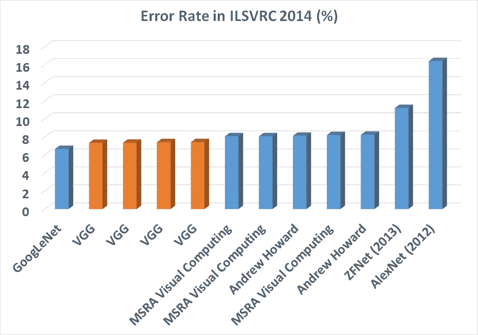
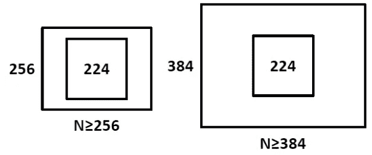
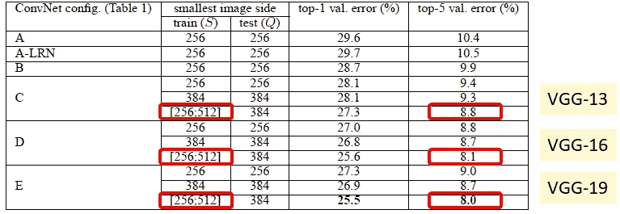

# 点评:VGGNet—ils vrc 2014 亚军(图像分类)，冠军(本地化)

> 原文：<https://medium.com/coinmonks/paper-review-of-vggnet-1st-runner-up-of-ilsvlc-2014-image-classification-d02355543a11?source=collection_archive---------0----------------------->

本故事中， **VGGNet [1]** 回顾。VGGNet 是牛津大学的 VGG ( [视觉几何组](http://www.robots.ox.ac.uk/~vgg/))发明的，虽然 VGGNet 是**亚军**，而不是分类任务的 **ILSVRC (** [**ImageNet 大规模视觉识别竞赛**](http://www.image-net.org/challenges/LSVRC/) **) 2014 的冠军，相比 ZF net(2013 年的冠军)【2】和 AlexNet(2012 年的冠军)【3】有了显著的提升。而 GoogLeNet 是 ILSVLC 2014 的获奖者，我后面也会讲到。)尽管如此， **VGGNet 还是击败了 GoogLeNet，在 ILSVRC 2014 中拿下了本地化任务。****

而且是**第一年有深度学习模型获得 10%以下的错误率。**最重要的是**在 VGGNet 之上或基于 VGGNet 的 3×3 conv 理念**有许多其他模型用于其他目的或其他领域。这就是为什么我们需要了解 VGGNet！这也是为什么当我写这个故事时，这是一篇 2015 年 ICLR 论文被引用超过 14000 次**。( [Sik-Ho Tsang](https://medium.com/u/aff72a0c1243?source=post_page-----d02355543a11--------------------------------) @中)**

****

****ILSVRC 2014 Ranking [4]****

**通常，人们只谈论 VGG-16 和 VGG-19。我将通过烧蚀研究来谈谈
**VGG 11 号、VGG 11 号(LRN)、VGG 13 号、VGG 16 号(Conv1)、VGG 16 号和 VGG 19 号**。**

****密集测试**，通常被忽略，**也会被覆盖。****

**ImageNet 是一个数据集，包含超过 1500 万张带有标签的高分辨率图像，大约有 22，000 个类别。ILSVRC 在 1000 个类别中的每个类别中使用大约 1000 个图像的 ImageNet 子集。总的来说，大约有 130 万幅训练图像、50，000 幅验证图像和 100，000 幅测试图像。**

****

****ILSVRC****

# **我们将涵盖的内容:**

1.  ****使用 3×3 滤镜**代替大尺寸滤镜(如 11×11、7×7)**
2.  ****VGG-16** 和 **VGG-19** 基于烧蚀研究
    (也包括 VGG-11、VGG-11 (LRN)、VGG-13、VGG-16 (Conv1)。)**
3.  ****多尺度训练****
4.  ****多尺度测试****
5.  ****密集测试****
6.  ****模型融合****
7.  ****VGGNet 和 GoogLeNet 的比较****
8.  ****本地化任务****

# ****1。3×3 过滤器的使用****

****

****2 layers of 3×3 filters already covered the 5×5 area****

****使用 2 层 3×3 滤光片，实际上已经覆盖了上图中的 5×5 区域**。**使用 3 层 3×3 的滤光片，实际上已经覆盖了 7×7 的有效面积。**因此，AlexNet [3]中的 11×11 和 ZFNet [2]中的 7×7 这样的大尺寸滤镜确实是不需要的。(如果有兴趣，请去我关于 ZFNet[5]和 AlexNet[6]的故事。)**

**另一个原因是**的参数数量较少。**假设每层只有 1 个滤波器，输入端有 1 层，排除偏差:**

****1 层 11×11 滤镜**，参数个数= **11×11=121
5 层 3×3 滤镜**，参数个数= **3×3×5=45
参数个数减少 63%****

****1 层 7×7 滤镜**，参数个数=**7×7 = 49
3**3 层 3×3 滤镜，参数个数=**3×3 = 27
参数个数减少 45%****

**通过使用 **1 层 5×5 滤波器**，参数数= 5**×5 = 25
T30 通过使用 **2 层 3×3 滤波器**，参数数= **3×3+3×3=18
参数数减少 28%******

**网络越大，对训练图像的需求就越大。还有消失梯度问题。但消失梯度问题在 ResNet [9]中通过跳过连接得到了某种程度的解决。**

****学习的参数**越少，**收敛越快**越好，**减少过拟合问题**。**

# ****2。基于消融研究的 VGG-16** 和 VGG-19**

****

****Different VGG Layer Structures Using Single Scale (256) Evaluation****

**为了获得最佳的深度学习层结构，进行了烧蚀研究，如上图所示。**

1.  **首先， **VGG-11 已经获得了 10.4%的错误率**，和 ILSVRC 2013 中的 ZFNet 差不多。VGG-11 被设定为基准。**
2.  ****VGG-11 (LRN)获得 10.5%的错误率，是 AlexNet 建议的增加局部反应归一化(LRN)** 操作的一种。通过比较 VGG-11 和 VGG-11 (LRN)，错误率没有提高，这意味着 LRN 是无用的。事实上，LRN 在后来的深度学习网络中已经不再使用，取而代之的是批量归一化(BN)。**
3.  ****VGG-13** **获得 9.9%的错误率，这意味着额外的 conv 有助于分类精度**。**
4.  ****VGG-16 (Conv1)获得 9.4%的错误率，这意味着额外的三个 1×1 conv 层有助于分类精度**。 **1×1 conv 实际上有助于增加决策函数的非线性。**在不改变输入输出维度的情况下， **1×1 conv 在做同样高维的投影映射。**这项技术在一篇名为“网络中的网络”的论文[7]中是必不可少的，在 Google net[8](2014 年 ILSVRC 的获奖者)和 ResNet[9](2015 年 ILSVRC 的获奖者)中也是如此。我将在未来更多地谈论 GoogLeNet 和 ResNet 评论故事。**
5.  ****VGG-16 获得 8.8%的错误率，这意味着深度学习网络仍在通过增加层数来改善。****
6.  ****VGG-19 获得 9.0%的错误率，这意味着深度学习网络没有通过增加层数来改善。因此，作者停止添加图层。****

**通过观察逐层叠加，我们可以观察到 **VGG-16 和 VGG-19 开始收敛**，精度提升变慢。当人们谈论 VGGNet 时，他们通常会提到 VGG-16 和 VGG-19。**

# ****3。多尺度训练****

**由于对象在图像中具有不同的尺度，**如果我们只在相同的尺度下训练网络，对于具有其他尺度的对象，我们可能会错过检测或者具有错误的分类。为了解决这个问题，作者提出了多尺度训练。****

**对于**单尺度训练**，图像以等于 256 或 384 的较小尺寸缩放，即 **S=256 或 384。**由于网络只接受 224×224 的输入图像。缩放后的图像将被裁剪为 224×224。其概念如下:**

****

****Single-Scale Training with S=256 and S=384****

**对于**多尺度训练**，图像以较小的尺寸进行缩放，范围等于 256 到 512，即**S =【256；512]** ，然后裁剪成 224×224。因此，**在 S** 、**的范围内，我们将不同的缩放对象输入到网络中进行训练。****

****

****Multi-Scale Training Results****

****通过使用多尺度训练**，我们可以想象**对于不同物体尺寸的测试图像物体更加准确。****

****VGG-13** 将错误率从 9.4%/9.3%降至 **8.8%。
VGG-16** 将错误率从 8.8%/8.7%降至 **8.1%。
VGG-19** 将错误率从 9.0%/8.7%降至 **8.0%。****

# **4.**多尺度测试****

**类似于多尺度训练，**多尺度测试**也可以降低错误率，因为我们不知道测试图像中对象的大小。如果我们**将测试图像缩放到不同的尺寸**，我们就可以**增加正确分类的几率**。**

****

****Multi-Scale Testing Results****

**通过使用多尺度测试而不是单尺度训练，降低了错误率。
相比单尺度训练单尺度测试，**

****VGG-13** 将错误率从 9.4%/9.3%降至 **9.2%。
VGG-16** 将错误率从 8.8%/8.7%降至 **8.6%。
VGG-19** 将错误率从 9.0%/8.7%降至 8.7/8.6 **%。****

****通过使用多尺度训练和测试**，降低了错误率**。** 与只进行多尺度测试相比，**

****VGG-13** 将差错率从 9.2%/9.2%降至 **8.2%，
VGG-16** 将差错率从 8.6%/8.6%降至 **7.5%，
VGG-19** 将差错率从 8.7%/8.6%降至 7**5%，****

# **5.密集(卷积化)测试**

**测试时，在 **AlexNet** 中，裁剪图像的 **4 个角和中心以及它们的**水平翻转**进行测试，即 **10 次测试**。并且输出概率向量被相加或平均以获得更好的结果。****

**VGGNet 与培训中的不同，如下所示:**

****

****VGGNet During Testing****

**第一个 FC 被替换为 7×7 conv。
第二个和第三个 FC 被替换为 1×1 conv。
这样，所有的 FC 层都被 conv 层取代。**

**测试时，在 **VGGNet** 中，测试图像直接通过 VGGNet，得到一个类得分图。该类得分图被空间平均为固定大小的向量。**

****

****Workflow of VGGNet Testing****

**如果我们也包括水平翻转，只有 2 次测试。**

****

****Dense (VGGNet), Multi-crop (Approach by AlexNet), Dense+Multi-crop (Both)****

****通过对密集和多作物结果进行平均，VGG-16 和 VGG-19 的误差率降低到 7.2%和 7.1%。****

# ****6。模型融合****

****

****Fusion All Techniques Mentioned Above****

**通过结合 VGG-16 和 VGG-19 加上多尺度训练、多尺度测试、多作物和密集，错误率降低到 6.8%。**

# ****7。VGGNet 和 GoogLeNet 的比较****

****

****Comparison Between VGGNet and GoogLeNet****

**与**使用 7 网的 GoogLeNet】具有 6.7%** 的**错误率相比，**使用 2 网**的 VGGNet，加上多尺度训练、多尺度测试、多作物和密集具有 6.8%** 的**错误率，具有竞争力。****

****只有 1 网**， **VGGNet 有 7.0%的错误率**，比 **GoogLeNet 好，GoogLeNet 有 7.9%的错误率**。**

**然而，**在 ILSVRC 2014 提交时，VGGNet 只有 7.3%的错误率，目前获得亚军。****

# **8.本地化任务(帖子更新于 2018 年 9 月 2 日)**

**对于定位任务，边界框由存储其中心坐标、宽度和高度的四维向量表示。因此，逻辑回归目标被欧几里德损失代替，这惩罚了预测的边界框参数与地面真实的偏差。**

**可以选择边界框预测是在所有类之间共享(**单类回归，SCR** )还是特定于类(**每类回归，PCR** )。在前一种情况下，最后一层是 **4-D** ，而在后一种情况下是 **4000-D** (因为数据集中有 1000 个类)。**

****

****Localization Results****

**如上图， **PCR 优于 SCR。**和**微调所有层比只微调第一和第二 FC 层更好**。上述结果仅通过使用中心裁剪获得。**

****

****Multi-Scale Training and Testing****

**通过前几节刚刚描述的**多次训练和测试**，前 5 名的**定位误差降低到 25.3%。****

****

****Comparison with state-of-the-art results****

****如上图所示，VGGNet 甚至超过了 GoogLeNet** ，并且**赢得了 ILSVRC 2014** 的本地化任务。**

****

****VOC 2007, 2012 and Caltech 101 and 256 Dataset Results****

****VGGNet 在 VOC 2007、2012 和 Caltech 256 数据集上的结果最好。**在加州理工 101 数据集上也有**的竞争结果。****

**我将介绍 GoogLeNet [8]、ResNet [9]等用于图像分类的工具。
敬请关注。**

# **参考**

1.  **【2015 ICLR】【VGGNet】
    [用于大规模图像识别的极深度卷积网络](https://arxiv.org/pdf/1409.1556)**
2.  **【2014 ECCV】【ZFNet】
    [可视化和理解卷积网络](https://cs.nyu.edu/~fergus/papers/zeilerECCV2014.pdf)**
3.  **【2012 NIPS】【Alex net】
    [使用深度卷积神经网络的 ImageNet 分类](https://papers.nips.cc/paper/4824-imagenet-classification-with-deep-convolutional-neural-networks.pdf)**
4.  **ILSVRC 2014 排名
    [http://www . image-net . org/challenges/ls vrc/2014/results # cls loc](http://www.image-net.org/challenges/LSVRC/2014/results#clsloc)**
5.  **[ZFNet 综述—2013 年度 ILSVRC(图像分类)获奖者](/coinmonks/paper-review-of-zfnet-the-winner-of-ilsvlc-2013-image-classification-d1a5a0c45103)**
6.  **[AlexNet，CaffeNet 综述 ILSVRC 2012(图像分类)获得者](/coinmonks/paper-review-of-alexnet-caffenet-winner-in-ilsvrc-2012-image-classification-b93598314160)**
7.  **【2014 ICLR】
    [网络中的网络](https://arxiv.org/pdf/1312.4400.pdf)**
8.  **【2015 CVPR】【谷歌在线】
    [回旋更深](https://www.cs.unc.edu/~wliu/papers/GoogLeNet.pdf)**
9.  **【2016 CVPR】【ResNet】
    [图像识别的深度残差学习](https://www.cv-foundation.org/openaccess/content_cvpr_2016/papers/He_Deep_Residual_Learning_CVPR_2016_paper.pdf)**

> **加入 Coinmonks [电报频道](https://t.me/coincodecap)和 [Youtube 频道](https://www.youtube.com/c/coinmonks/videos)获取每日[加密新闻](http://coincodecap.com/)**

## **此外，请阅读**

*   **[密码电报信号](http://Top 4 Telegram Channels for Crypto Traders) | [密码交易机器人](/coinmonks/crypto-trading-bot-c2ffce8acb2a)**
*   **[拷贝交易](/coinmonks/top-10-crypto-copy-trading-platforms-for-beginners-d0c37c7d698c) | [密码税务软件](/coinmonks/crypto-tax-software-ed4b4810e338)**
*   **[网格交易](https://coincodecap.com/grid-trading) | [加密硬件钱包](/coinmonks/the-best-cryptocurrency-hardware-wallets-of-2020-e28b1c124069)**
*   **[密码交换](/coinmonks/crypto-exchange-dd2f9d6f3769) | [印度密码应用](/coinmonks/buy-bitcoin-in-india-feb50ddfef94)**
*   **[开发人员的最佳加密 API](/coinmonks/best-crypto-apis-for-developers-5efe3a597a9f)**
*   **最佳[密码借出平台](/coinmonks/top-5-crypto-lending-platforms-in-2020-that-you-need-to-know-a1b675cec3fa)**
*   **[杠杆令牌](/coinmonks/leveraged-token-3f5257808b22)终极指南**
*   **[八大加密附属计划](https://coincodecap.com/crypto-affiliate-programs) | [eToro vs 比特币基地](https://coincodecap.com/etoro-vs-coinbase)**
*   **[币安期货交易](https://coincodecap.com/binance-futures-trading)|[3 commas vs Mudrex vs eToro](https://coincodecap.com/mudrex-3commas-etoro)**
*   **[如何购买 Monero](https://coincodecap.com/buy-monero) | [IDEX 评论](https://coincodecap.com/idex-review) | [BitKan 交易机器人](https://coincodecap.com/bitkan-trading-bot)**
*   **[尤霍德勒 vs 科恩洛 vs 霍德诺特](/coinmonks/youhodler-vs-coinloan-vs-hodlnaut-b1050acde55a) | [Cryptohopper vs 哈斯博特](https://coincodecap.com/cryptohopper-vs-haasbot)**