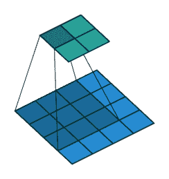
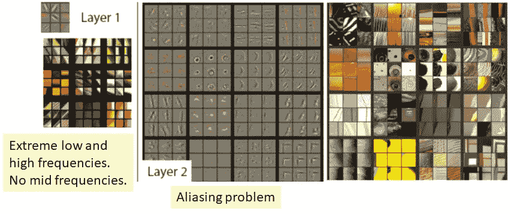

# 回顾:ZFNet——2013 年国际影像分类奖得主

> 原文：<https://medium.com/coinmonks/paper-review-of-zfnet-the-winner-of-ilsvlc-2013-image-classification-d1a5a0c45103?source=collection_archive---------0----------------------->

**在这个故事中，ZFNet [1]被回顾。ZFNet 是 ILSVRC (** [**ImageNet 大规模视觉识别竞赛**](http://www.image-net.org/challenges/LSVRC/) **) 2013 的一种获胜者，这是一个图像分类竞赛，与 ILSVRC 2012 的获胜者 AlexNet [2]相比有显著的改进。**

**ILSVRC Ranking**

有些人/文章认为 ZFNet 不是冠军，这个结论可能来自于 ILSVRC 的排名，如上所示。然而，Clarifai 是由 ZFNet 的作者泽勒创立的公司。此外，根据 [ImageNet 大规模视觉识别挑战](https://arxiv.org/abs/1409.0575)，它提到:

> “共有 24 支队伍参加了 ILSVRC2013 比赛，而前三年总共只有 21 支队伍。继 2012 年基于深度学习的方法获得成功之后，2013 年的绝大多数参赛作品在提交材料中使用了深度卷积神经网络。**分类任务的获胜者是 Clarifai** ，将几个大型深度卷积网络平均在一起。**使用(泽勒和弗格斯，2013 年)**、…”的可视化技术选择网络架构

上文中引用的参考文献(泽勒和弗格斯，2013 年)是 ZFNet。由此，正式宣布 ZFNet 胜出！

这是一篇 **2014 年 ECCV** 的论文，在我写这篇文章的时候有超过 **4000 次引用**。这是一篇重要的论文，它教导我们在深层可视化 CNN 内核。( [Sik-Ho Tsang](https://medium.com/u/aff72a0c1243?source=post_page-----d1a5a0c45103--------------------------------) @中)

ImageNet 是一个数据集，包含超过 1500 万张带标签的高分辨率图像，约有 22，000 个类别。 ILSVRC 使用 ImageNet 的一个子集，每个子集包含 1000 个类别中的大约 1000 幅图像。总的来说，大约有 130 万幅训练图像、50，000 幅验证图像和 100，000 幅测试图像。

**15 millions of images**

# 关于排名的一些事实

**ILSVRC2013 Ranking [3]**

2013 年，ZFNet 是由罗布·弗格斯博士和他的博士生马修·泽勒博士在 NYU 发明的。(LeNet 的发明者 Yann LeCun 教授也来自 NYU。因此，他们也感谢 LeCun 教授在论文致谢部分的讨论。)这就是为什么它被称为 ZFNet，基于他们的姓氏，泽勒和弗格斯，2014 年 ECCV 的论文称为“**可视化和理解卷积网络**”[1]。严格来说，ZFNet 实际上并不是 ILSVLC 2013 的赢家。相反，Clarifai 是当时新成立的公司，是 ILSVLC 2013 图像分类的获胜者。泽勒也是 Clarifai 的创始人兼首席执行官。

如上图所示， **ZFNet 与 ILSVRC 2012 中的获胜者 AlexNet [2]相比，图像分类错误率有了显著的提高。**clari fai 相对于 ZFNet 只有很小的改进。(有关排名的更多详细信息，请访问[3]。)尽管如此，当我们在谈论 ILSVLC 2013 获胜者的深度学习网络时，我们通常谈论的是 ZFNet [1]。

# 我们将涵盖的内容

卷积网络如何以及为什么能够表现得如此之好一直是个谜。很多时候，我们只能靠直觉解释或者经验实验来推理。在这个故事中，我将介绍 ZFNet 如何可视化卷积网络。通过可视化卷积网络，ZFNet 通过微调 2012 年发明的 AlexNet，成为 ILSVLC 2013 在图像分类方面的赢家。因此，涵盖的部分包括:

1.  **解除可视化技术**
2.  **各层可视化**
3.  **基于可视化结果对 AlexNet 的修改**
4.  **实验结果**
5.  **结论**

# **1。可视化的 Deconvnet 技术**

The Process to Deconv a Deep Layer

我们应该知道，深度学习框架的一个标准步骤是要有一系列的 **Conv >整流(激活函数)>池化**。为了可视化深层特征，我们需要一组 decovnet 技术来反转上述动作，以便我们可以在像素域中可视化该特征。

## 1.1.取消排队

**Unpooling**

最大汇集运算是不可逆的，但是我们可以通过记录每个汇集区域内最大值的位置来获得近似的逆运算，如上图所示。

## 1.2.**整流(激活功能)**

因为 ReLU 被用作激活函数，而 ReLU 是保持所有值为正值，同时使负值变为零。在逆向操作中，我们只需要再次执行 ReLU 即可。

## **1.3。德孔夫**

**Conv (Blue is input, cyan is output)**

**Deconv (Blue is input, cyan is output)**

做解卷积运算，确实是 conv 的一个转置版本。

# **2。各层可视化**

**Layer 1 and Layer 2**

通过使用 deconv 技术，在随机选择的特征图中显示了每个图层的前 9 个激活模式。并且**在层 1 和层 2** 中观察到两个问题。

**(i)第 1 层的滤波器是极高和极低频率信息的混合**，几乎不覆盖中频。如果没有中频，就会产生连锁效应，深度特征只能从极高和极低频率的信息中学习。

**(ii)第 2 层显示由第 1 层卷积中使用的大步幅 4 引起的混叠伪像**。**采样频率过低时会出现混叠。**

**Layer 3**

让我们再观察 3 层。

**第三层开始学习一些通用模式，**比如网格模式，和文本模式。

**Layer 4 and Layer 5**

**第 4 层显示出显著的变化，并且更具有类别特异性**，例如狗的脸和鸟的腿。

**第 5 层显示具有显著姿态变化的整个对象**，例如键盘和狗。

# **3。基于可视化结果对 AlexNet 的修改**

**ZFNet**

为了便于比较，ZFNet 被重绘为与 AlexNet 相同的样式。为了解决在第 1 层和第 2 层观察到的两个问题，ZFNet 做了两处修改。(要阅读 AlexNet 评论，请访问[4]。)

## **(i)将第一层过滤器尺寸从 11x11 减小到 7x7。**

## **(ii)使卷积的第 1 层步幅为 2，而不是 4。**

**Layer 1: (a) More mid-frequencies in ZFNet, (b) Extremely low and high frequencies in AlexNet**

**Layer 2: (c) Aliasing artifacts in AlexNet and (d) much cleaner features in ZFNet**

# **4。实验结果**

## 4.1.基于烧蚀研究的改进 ZFNet

**Ablation Study**

**The Modified ZFNet based on Ablation Study**

也有关于去除或调整层消融研究。**改进的 ZFNet 在 top-5 验证错误上可以获得 16.0%。**

## 4.2.与最先进方法的比较

**Error Rate (%)**

**通过使用 AlexNet，top-5 验证错误率为 18.1%。**

**使用 ZFNet，前 5 名验证错误率为 16.5%** 。我们可以得出结论，基于可视化的修改是必要的。

**通过使用来自(a)的 5 个 ZFNet 和来自(b)的 1 个修改的 ZFNet，top-5 验证错误率为 14.7%。这又是一种已经在 LeNet 和 AlexNet 中使用的 boosting 技术。(请访问[5]和[4]了解更多关于升压技术的信息。)**

## 4.3.还测试了其他相对较小的数据集

**Caltech 101 (83.8 to 86.5 mean accuracy)**

**Caltech 256 (65.7 to 74.2 mean accuracy)**

**PASCAL 2012 (79.0 mean accuracy)**

从上面的表中，我们可以看到，在没有使用 ImageNet 图像对 ZFNet 进行预训练的情况下，即从头开始训练 ZFNet，准确性较低。**在预训练的 ZFNet 之上进行训练(微调)，准确率高得多。这意味着经过训练的过滤器被推广到不同的图像，而不仅仅是 ImageNet 的图像。**

特别是对于加州理工学院 101 和加州理工学院 256 数据集，ZFNet 有压倒性的结果。

对于 PASCAL 2012，PASCAL 图像可以包含多个对象，与 ImageNet 中的图像相比，与自然有很大不同。因此，精度稍低，但仍可与最先进的方法相媲美。

# 5.结论

虽然以前只能观察到浅层特征，但本文提供了一种在像素域观察深层特征的有趣方法。

通过逐层可视化卷积网络，ZFNet 调整了 AlexNet 的滤波器大小或步幅等层超参数，并成功降低了错误率。

为了更好地了解深度学习，了解最新的方法非常重要。我会写更多的故事。

敬请关注！！！

# 参考

1.  【2014 ECCV】【ZFNet】
    [可视化和理解卷积网络](https://cs.nyu.edu/~fergus/papers/zeilerECCV2014.pdf)
2.  【2012 NIPS】【Alex net】
    [使用深度卷积神经网络的 ImageNet 分类](https://papers.nips.cc/paper/4824-imagenet-classification-with-deep-convolutional-neural-networks.pdf)
3.  ILSVRC 2013 排名  [http://www . image-net . org/challenges/ls vrc/2013/results . PHP # cls](http://www.image-net.org/challenges/LSVRC/2013/results.php#cls)
4.  [回顾 AlexNet，CaffeNet——2012 年 ILSVRC(图像分类)获奖者](/coinmonks/paper-review-of-alexnet-caffenet-winner-in-ilsvrc-2012-image-classification-b93598314160)
5.  [LeNet-1、LeNet-4、LeNet-5、Boosted LeNet-4 的回顾(图像分类)](/@sh.tsang/paper-brief-review-of-lenet-1-lenet-4-lenet-5-boosted-lenet-4-image-classification-1f5f809dbf17)

> 加入 Coinmonks [电报频道](https://t.me/coincodecap)和 [Youtube 频道](https://www.youtube.com/c/coinmonks/videos)获取每日[加密新闻](http://coincodecap.com/)

## 另外，阅读

*   [复制交易](/coinmonks/top-10-crypto-copy-trading-platforms-for-beginners-d0c37c7d698c) | [加密税务软件](/coinmonks/crypto-tax-software-ed4b4810e338)
*   [网格交易](https://coincodecap.com/grid-trading) | [加密硬件钱包](/coinmonks/the-best-cryptocurrency-hardware-wallets-of-2020-e28b1c124069)
*   [密码电报信号](http://Top 4 Telegram Channels for Crypto Traders) | [密码交易机器人](/coinmonks/crypto-trading-bot-c2ffce8acb2a)
*   [最佳加密交易所](/coinmonks/crypto-exchange-dd2f9d6f3769) | [印度最佳加密交易所](/coinmonks/bitcoin-exchange-in-india-7f1fe79715c9)
*   [币安 vs Bitstamp](https://coincodecap.com/binance-vs-bitstamp) | [Bitpanda vs 比特币基地 vs Coinsbit](https://coincodecap.com/bitpanda-coinbase-coinsbit)
*   [如何购买 Ripple (XRP)](https://coincodecap.com/buy-ripple-india) | [非洲最好的加密交易所](https://coincodecap.com/crypto-exchange-africa)
*   [非洲最佳加密交易所](https://coincodecap.com/crypto-exchange-africa) | [胡交易所评论](https://coincodecap.com/hoo-exchange-review)
*   [eToro vs 罗宾汉](https://coincodecap.com/etoro-robinhood)|[MoonXBT vs by bit vs Bityard](https://coincodecap.com/bybit-bityard-moonxbt)
*   开发人员的最佳加密 API
*   最佳[密码借贷平台](/coinmonks/top-5-crypto-lending-platforms-in-2020-that-you-need-to-know-a1b675cec3fa)
*   [免费加密信号](/coinmonks/free-crypto-signals-48b25e61a8da) | [加密交易机器人](/coinmonks/crypto-trading-bot-c2ffce8acb2a)
*   [杠杆代币](/coinmonks/leveraged-token-3f5257808b22)终极指南