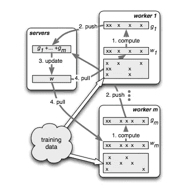
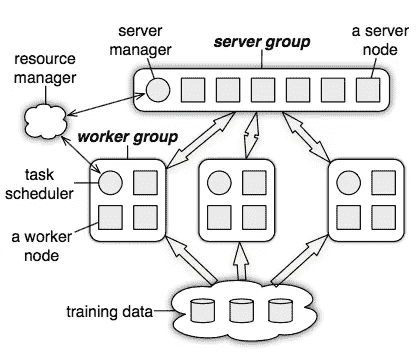
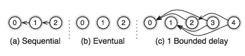
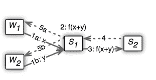

# 用于分布式机器学习的参数服务器

> 原文：<https://medium.com/coinmonks/parameter-server-for-distributed-machine-learning-fd79d99f84c3?source=collection_archive---------0----------------------->

## 介绍

很多机器学习问题依赖大量数据进行训练，然后进行推理。互联网规模的大公司用万亿字节或千兆字节的数据进行训练，并从中创建模型。这种模型由权重组成，这些权重将针对大多数情况下的推断误差进行优化。权重/参数的数量达到数十亿到数万亿的数量级。在这样的大模型中，在一台机器上同时进行学习和推理是不可能的。拥有一个可用于分布式学习和推理的框架是很有用的。由于参数需要在多个节点之间共享和更新，这些节点使用这些参数来执行和完善它们的计算，当涉及到共享时，这些大量的参数会成为瓶颈。共享在带宽、顺序 ML 算法的同步、具有高达 10%的高故障率的商用机器上的容错方面是昂贵的。 [Parameter sever](https://www.cs.cmu.edu/~muli/file/parameter_server_osdi14.pdf) 提出了一个新的框架来应对这些挑战和构建分布式机器学习算法。

## 主要设计理念

为了应对上一节提到的挑战，参数服务器提出了以下设计要求:

1.  高效通信:异步任务模型和 API，可以减少 ML 算法的整体网络带宽
2.  灵活的一致性模型:宽松的一致性有助于降低同步的成本。它还允许开发人员在算法收敛和系统性能之间进行选择。
3.  增加资源的灵活性:允许增加更多的容量，而无需重新启动整个计算。
4.  高效的容错:考虑到高故障率和大量数据，如果机器故障不是灾难性的，允许在几秒钟内快速恢复任务。
5.  易用性:构建 API 以支持 ML 结构，如稀疏向量、矩阵或张量。

## 分布式机器学习算法的示例

一个经典的监督最大似然问题包括在给定一组训练数据的情况下优化一个代价函数。在许多样本上改变和调整成本函数，以便减少或最小化预测误差。为了调整模型或减少误差，计算偏导数/梯度。这些梯度有助于在正确的方向上移动权重，以最小化误差。

对于“d”维特征向量，该模型试图使用以下公式来预测先前未见过的 x 的结果:对于每个 i=1 到 d，∑xi * wi。为了确保该模型相对较好地概括(即，它不仅仅在训练数据上表现良好)，将正则化分量添加到预测函数中。所以上面提到的函数变成了∑xi * wi + ƛ*Norm(w).这里，ƛ用于惩罚在训练数据中发现的权重。这个增加的术语稍微削弱了学习到的权重，因此避免了过度拟合，并有助于对以前未见过的数据进行概括。出于本文的目的，了解用于成本最小化或正则化的确切函数就没那么有趣了。本文更侧重于该框架的系统方面。

让我们看看分布式随机梯度下降如何解决上述预测算法。下图描述了迭代算法并行化工作的高级流程:

Distributed training algorithm

该系统由一些服务器节点和工作节点组成。每个工作者节点加载一些数据子集，不同的工作者加载不同的样本。每个工人计算本地数据的梯度以优化损失函数。然后，每个工作者将这些部分梯度发送到服务器节点。服务器节点聚集从许多工作者节点接收的那些梯度。一旦服务器节点完成，工作节点可以从服务器节点获取新的可用权重集，并再次执行梯度计算。大部分时间花在计算工人的 g1，g2，…，gm 梯度上。这些是使用*转置(X) * w* 计算的。如果 w 在几十亿到几万亿的数量级，这种计算在任何单个节点上都是不可行的。但是每个节点只处理数据子集的一个好的副作用是，它们只需要对应于该数据的权重，例如，如果试图预测用户点击广告的可能性，那么诸如“正则化”之类的词就不那么有趣了，并且大多数工作人员根本不会为其更新权重。如上图所示，在给定的节点上，只有 x 的特征存在/与点积相关的权重(w)需要发送到工作节点(参见每个工作节点上的 x 列和稀疏权重向量中的相应 w)。

在高层次上，每个*工作者*的算法如下所示:

1.  对每个工人，计算数据子集的梯度(偏导数)
2.  将这个部分渐变推到服务器上
3.  当服务器准备就绪时，从服务器获取新的权重集

在每个*服务器*上:

1.  合计所有“m”个工人的梯度，例如 g = ∑ gi
2.  新权重=旧权重-学习率* (g + ƛ*Norm(old_weights))

## 体系结构

High level architecture

ParameterServer 由服务器组组成，以便于在系统中运行多种算法。服务器组中的每个服务器节点负责密钥空间/数据的一个分区。服务器可以相互通信以迁移/复制数据，从而实现可扩展性和可用性。服务器管理器负责维护服务器组的一致视图。它执行活性检查，并将密钥空间的所有权分配给每个服务器节点。

通常为一个应用程序分配一个工作组。多个工作者节点构成了工作者组，这些工作者组与服务器组进行通信，以获取参数和推送梯度，如上一节所述。工人团体不需要互相交流。调度程序查看工人组并给他们分配任务。通常，同一工作节点通过在同一数据集上运行迭代算法来利用本地存储的数据。参数名称空间可用于在多个工作组之间进一步并行化工作。此外，相同的参数命名空间可以在多个组之间共享:一个典型的例子是一个组支持实时推理，而其他工作组可以支持模型的开发和共享参数的更新。

让我们看看构建这个架构所需的一些原语

## 键值 API

撰写本文时，现有系统使用键-值对来传递共享参数。这方面的一个例子是特征 id 及其权重。传统上，这是使用 memcached 或其他一些键值存储实现的。重要的是，值大多是一些线性代数原语，如向量或矩阵，能够优化这些结构上的操作是有用的。典型的运算有点积、矩阵乘法、L-2 范数等。因此，保持键值语义并将值作为向量，矩阵对于优化最常见的 ML 操作是有用的。

## 基于范围的推和拉

正如前面算法中提到的，从服务器节点提取的权重和梯度被推送到服务器节点。支持基于范围的推和拉将优化网络带宽使用。因此，系统支持 w.push(R，destination)，w.pull(R，destination)来拉取数据。在这两种情况下，对应于范围 R 中的键的值被从目的节点推入和拉出。将 R 设置为单个键，给出了简单的键值读写语义。因为梯度 g 与 w 共享相同的密钥，所以可以使用 w.push(R，g，destination)将局部梯度推到目的地。

## 异步任务和依赖性

任务可以被认为是 RPC。任何推或拉请求都可以是任务，正在执行的远程函数也可以是任务。任务本质上通常是异步的，并且程序/应用可以在发出任务之后继续执行。一旦接收到(键，值)对中的响应，任务就可以被标记为完成。只有当给定任务所依赖的所有子任务都返回时，才能将任务标记为已完成。任务依赖关系有助于实现应用程序的整体控制流。

## 灵活的一致性模型

从上面的模型可以看出，任务是并行运行的，并且通常在远程节点上运行。因此，在不同任务之间存在数据依赖的情况下，最终可能会提取旧版本的数据。在机器学习中，有时选择旧的权重或不太旧的权重，而不是最近的权重，不会太不利。Parameterserver 让实现者选择他们所追求的一致性模型。如下图所示，支持三种类型的一致性模型。在顺序一致性中，所有任务都是一个接一个地执行的。在最终的一致性中，所有的任务并行开始，最终汇合。在有界延迟中，只要任何在“t”时间之前开始的任务已经完成，任务就开始，下图 c 显示有界延迟为 1。

Consistency models

## 实施细节

**向量时钟:**为了容错和恢复，系统中需要一些时间戳。参数服务器使用矢量时钟来建立系统中事件的某种顺序。基于节点数量(m)和参数数量(p ),即 O(m * p ),矢量时钟可能很昂贵。考虑到系统中的大量参数，这可能非常大。由于大多数操作可以使用范围来完成，每个范围可以分配一个向量时钟，而不是每个 ket 都有一个。如果系统中有 r 个唯一范围，那么复杂度可以通过这种机制进一步降低，即 O(m * r)。系统最初仅从 m 个时钟开始，因此属于该节点的整个密钥空间具有一个向量时钟。这可能会减慢恢复过程。因此，当系统中创建更多的范围时，更新的矢量时钟被分配给这些范围分区。

**消息:**系统中的消息表示为(VectorClock(R)，R 中的所有键和值)。由于在数据密集型 ML 应用中通信可能很繁忙，因此可以通过缓存来减少带宽。在迭代算法中，相同的密钥被多次传递，因此节点可以缓存密钥。在迭代过程中，这些值还可能包含许多未更改的值，因此可以有效地压缩。ParameterServer 使用[快速压缩](https://en.wikipedia.org/wiki/Snappy_(compression))来有效压缩大量的零。

**一致散列:**一致散列用于在系统中轻松添加和删除新节点。散列环上的每个服务器节点负责一些密钥空间。keyspace 的分区和所有权由服务器管理器管理。

**复制:**由邻居节点完成复制。每个节点复制它的 k 个邻居节点的密钥空间。负责密钥空间的主机通过同步通信与保存副本的邻居进行协调。每当 master 拉出键范围，它将被复制到它的邻居。当工作者将数据推送到服务器时，直到数据被复制到从属服务器，任务才被确认为完成。很明显，如果每次推拉都这样做的话，这可能会非常麻烦。因此，系统还允许在聚合一定量的数据后进行复制。下图显示了这种聚合。s1 和 s2 之间只交换一条复制消息。它发生在 x 和 y 都被推送到 S1 之后，接着是 S1 上的函数计算任务，然后是复制的最后一条消息，之后确认(4，5a，5b)流回 worker1 和 worker2 以完成任务。

Replication after aggregation

**服务器节点管理:**能够通过向系统添加新的服务器节点来进行扩展是非常有用的。发生这种情况时，服务器管理器会为新节点分配一个密钥空间。该密钥空间可以来自某个节点，该节点在重负载服务器节点的密钥空间分裂之前或通过分裂该节点而终止。然后，这个新节点从 k 个邻居中拉出它负责的密钥空间和副本作为从节点。一般来说，可能需要两阶段提取来提取在被这个新节点提取时被覆盖的数据。然后，服务器管理器将这个所有权分配消息广播给环上的其他节点，这些其他服务器节点可以根据这个新的所有权分配来缩减它们的密钥空间使用。对于离开的节点，服务器管理器将把密钥空间分配给一些新的进入节点。服务器管理器通过心跳来维护节点健康。

**worker nodes:** 添加一个新的 Worker node 相对简单一些。任务计划程序为工作节点分配一个数据范围。这个新节点将从 NFS 或其他工人那里获取数据。然后，调度程序将此消息广播给其他工作人员，以便其他工作人员可以通过放弃一些培训数据来回收一些空间。当工作节点离开时，是否恢复数据取决于数据的大小，由算法的所有者决定。

## 结论

本文展示了分布式机器学习的一些重要概念。从系统的角度来看，本文很好地利用了一致性散列等技术。基于范围的通信和支持消息传递的原生 ML 结构似乎是构建高效 ML 框架的一个很好的见解。

> [在您的收件箱中直接获得最佳软件交易](https://coincodecap.com/?utm_source=coinmonks)

