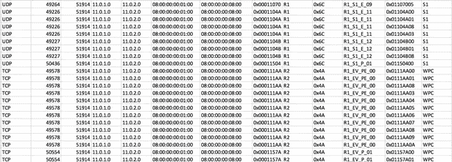

# 使用 Python 将电子表格解析成 JSON 文件

> 原文：<https://medium.com/coinmonks/parsing-a-spreadsheet-into-a-json-file-using-python-6118f5c70bd3?source=collection_archive---------1----------------------->

作者[艾莎·阿尤布](https://medium.com/u/4bfaec1d4bb0?source=post_page-----6118f5c70bd3--------------------------------)，[阿比尔·阿尔舒巴特](https://medium.com/u/3c06fe5de28b?source=post_page-----6118f5c70bd3--------------------------------)

以下文章解释了如何将. csv 文件和. xls 文件中的数据解析为。使用 python 的 json 文件，具有多级依赖性。

# 传递 CSV 文件

我们首先准备了一个包含大量冗余数据的 CSV 电子表格，我们将用嵌套的 json 格式表示这些数据。



.csv file with multipe redundant data

我们希望通过创建多个嵌套级别来表示这些数据，因此我们的结构是:

*帧将包含 Id、名称、使用的协议和多个数据段。*

*一个段将包含一个段 Id、名称、src/dest 端口和多个数据包。*

*数据包将包含数据包 id、src/dest MAC、src/dest IP 和接收者。*

## 现在我们已经准备好了数据，我们将开始编写 Python 脚本:

我们将从导入与文件格式交互所需的库开始

```
import csv, json
```

然后我们将使用内置函数 **open()** 打开 csv 文件

```
f = open( 'filename.csv', 'rU' )
```

**DictReader()** 将加载。csv 文件。我们将使用**字段名**属性为电子表格的每一列添加一个适当的字段名。

```
reader = csv.DictReader( f, fieldnames = ("Protocol","Source Port","Destination Port","Source IP", "Destination IP", "Source MAC", "Destination MAC", "segment ID", "Frame name", "Frame ID", "segment name", "packet ID", "Receivers"))
```

然后我们将创建两个列表，list **store** 将收集我们将要解析的对象。至于 list **framenames** ，这将帮助我们跟踪我们的对象列表中存储了什么。

```
store = []
framenames = []
```

我们将通过添加第一级缩进(frame)来开始解析。在浏览整个表单时，我们将在**框架**级别创建一个对象，并添加框架内容，但我们将保持**段列表**为空，因为它将填充下一级缩进。

```
# Store frame names in a listfor row in reader:
   frame = {"FrameName":row["Frame name"],
   "FrameID": row["Frame ID"],
   "protocol": row["Protocol"],
   "segments":[]}
```

之后，我们将检查该帧是否已被添加到**帧名**列表中。如果该框架的名称不在列表中，那么我们将把它添加到列表中。然后，我们将新的**帧**对象添加到我们的**存储**列表中，以添加到我们的 json 文件中。

```
 if row["Frame name"] not in framenames:
      framenames.append(row["Frame name"])
      store.append(frame)
```

对于我们的第二级缩进，我们将创建一个 **segment** 对象，并添加带有 **""** 值的 **segmentname** 属性

```
# Create Objects for Frames, segments and packets
segment = {"segmentName": "" }
```

现在，我们将循环遍历存储在第一个缩进中的**帧**，在每个帧中，我们将重新打开电子表格来遍历这些行，并在该帧中找到下一个**段**。

```
for frame in store:
   f = open( csvfile, 'rU' )
   reader = csv.DictReader( f, fieldnames = ( "Protocol","Source Port","Destination Port","Source IP", "Destination IP", "Source MAC", "Destination MAC", "segment ID","Frame name", "Frame ID", "segment name", "packet ID", "Receivers"))
```

因此，如果新的段名与框架的段名不匹配，我们将向该框架添加一个新的段对象及其所有属性

```
for row in reader:
      if frame["FrameName"] == row["Frame name"]:
         if segment["segmentName"] != row["segment name"]:
            segment = {
            "segmentID":row["segment ID"],
            "segmentName": row["segment name"],
            "srcPort":row["Source Port"],
            "destPort":row["Destination Port"],
            "packets":[{
                "packetID":row["packet ID"],
                "Receivers":row["Receivers"],
                "destIP":row["Destination IP"],
                "destMAC":row["Destination MAC"],
                "srcIP": row["Source IP"],
                "srcMAC":row["Source MAC"]
            }]
         }
```

然后将 segment 对象添加到 frame 对象中，完成我们的第二级缩进。

```
 frame["segments"].append(segment)
```

否则，我们将创建一个数据包对象并填充其属性。之后，我们将把数据包对象添加到段对象中，这样我们就有了第三个缩进层次。

```
 else:
            packet = {
            "packetID":row["packet ID"],
            "Receivers":row["Receivers"],
            "destIP":row["Destination IP"],
            "destMAC":row["Destination MAC"],
            "srcIP": row["Source IP"],
            "srcMAC":row["Source MAC"]
            }
            segment["packets"].append(packet)
```

最后，为了以 JSON 格式存储数据，我们将创建一个 JSON 文件

```
# Save the JSON
f = open( 'data.json', 'w')
```

并使用函数 **json.dumps** 将 list **store** 的内容写入其中

```
out = json.dumps(store, indent=4)
f.write(out)
```

# 解析 Excel 文件

解析 excel 表格的步骤与解析 csv 文件的步骤几乎相同，除了一些我们将详细讨论的不同之处

我们的数据将与。csv 文件，文件格式除外；会的。xls 格式


.xls file with redundant data

在我们的脚本中，我们将导入所需的库来与新的文件格式进行交互

```
import xlrd
```

然后我们将使用函数 **xlrd.open_workbook()** 打开 Excel 文件

```
book = xlrd.open_workbook('xlsfile.xls')
```

之后，我们将使用函数 **sheet_by_index()** 选择包含我们数据的工作表

```
sh1 = book.sheet_by_index(0)
```

同样，我们将创建两个列表，list **store** 将收集我们将要解析的对象。和 **framenames** ，这个列表将帮助我们跟踪我们的对象列表中存储了什么。

```
store = []
framenames = []
```

我们将通过添加第一级缩进(框架)来开始解析。浏览表单时，我们将检查**帧**是否已被添加到我们的列表**帧名**中。如果该框架的名称不在列表中，那么我们将添加它。然后，我们将在帧级别创建一个对象并添加其内容，但是我们将保持**段**的列表为空，因为它将被填充到下一级缩进中。最后，我们将把新的 frame 对象添加到我们的 **store** 列表中，该列表将被添加到我们的 json 文件中。

```
# Store frame names in a list
for rx in range(1, sh1.nrows):
   if sh1.row(rx)[8].value not in framenames:
      framenames.append(sh1.row(rx)[8].value)
      frame = {
        "frameName": sh1.row(rx)[8].value,
        "frameID": sh1.row(rx)[9].value,
        "protocol": sh1.row(rx)[0].value,
        "segments":[]
      }
      store.append(frame)
```

对于第二级缩进，我们将创建一个 segment 对象，并添加值为 **""** 的 **segment** name 属性。

```
segment = {"segmentName": "" }
```

然后，我们将遍历存储在第一个缩进中的帧，在每一帧中，我们将重读电子表格以遍历行并找到帧中的下一段。

```
for frame in store:
   for rx in range(1, sh1.nrows):
      if frame["frameName"] == sh1.row(rx)[8].value:
```

因此，如果新的段名与对象的段名不匹配，我们将添加一个新的段对象及其所有属性

```
 if segment["segmentName"] != sh1.row(rx)[10].value:
            segment = {
            "segmentID":sh1.row(rx)[7].value,
            "segmentName": sh1.row(rx)[10].value,
            "srcPort":int(sh1.row(rx)[1].value),
            "destPort":int(sh1.row(rx)[2].value),
            "packets":[{
               "packetID":sh1.row(rx)[11].value,
               "Receivers":sh1.row(rx)[12].value,
               "srcMAC": sh1.row(rx)[5].value,
               "srcIP": sh1.row(rx)[3].value,
               "destIP":sh1.row(rx)[4].value,
               "destMAC":sh1.row(rx)[6].value
               }]
            }
```

然后将 segment 对象添加到 frame 对象，并完成第二级缩进。

```
 frame["segments"].append(segment)
```

否则，我们将创建一个数据包对象并填充其属性。之后，我们将把数据包对象添加到段对象中，这样我们就有了第三个缩进层次。

```
 else:
           packet = {
           "packetID":sh1.row(rx)[11].value,
           "Receivers":sh1.row(rx)[12].value,
           "srcMAC": sh1.row(rx)[5].value,
           "srcIP": sh1.row(rx)[3].value,
           "destIP":sh1.row(rx)[4].value,
           "destMAC":sh1.row(rx)[6].value
        }
        segment["packets"].append(packet)
```

最后，为了以 JSON 格式存储数据，我们将创建一个 JSON 文件

```
# Save the JSONf = open( 'data.json', 'w')
```

并使用函数 **json.dumps** 将 list store 的内容写入其中

```
#rewrite JSON
out = json.dumps(store, indent=4)
f.write(out)
```

正如我们所看到的，解析过程是非常直接的，但是当您有大量的冗余数据时，您需要能够理解它们是如何连接的，以及您的代码可以在不中断的情况下处理到什么级别的缩进。

要访问完整的 Python 脚本，请访问:[https://github.com/aiayoub/Spreadsheet-Parser.git](https://github.com/aiayoub/Spreadsheet-Parser.git)


> 加入 Coinmonks [电报频道](https://t.me/coincodecap)和 [Youtube 频道](https://www.youtube.com/c/coinmonks/videos)获取每日[加密新闻](http://coincodecap.com/)

## 此外，请阅读

*   [拷贝交易](/coinmonks/top-10-crypto-copy-trading-platforms-for-beginners-d0c37c7d698c) | [密码税务软件](/coinmonks/crypto-tax-software-ed4b4810e338)
*   [网格交易](https://coincodecap.com/grid-trading) | [加密硬件钱包](/coinmonks/the-best-cryptocurrency-hardware-wallets-of-2020-e28b1c124069)
*   [印度最佳密码交易所](/coinmonks/crypto-exchange-dd2f9d6f3769) | [印度最佳密码交易所](/coinmonks/bitcoin-exchange-in-india-7f1fe79715c9)
*   [开发者最佳加密 API](/coinmonks/best-crypto-apis-for-developers-5efe3a597a9f)
*   [密码电报信号](http://Top 4 Telegram Channels for Crypto Traders) | [密码交易机器人](/coinmonks/crypto-trading-bot-c2ffce8acb2a)
*   最佳[密码借出平台](/coinmonks/top-5-crypto-lending-platforms-in-2020-that-you-need-to-know-a1b675cec3fa)
*   [杠杆代币](/coinmonks/leveraged-token-3f5257808b22)终极指南
*   [密码交易的最佳虚拟专用网络](https://coincodecap.com/best-vpns-for-crypto-trading)
*   [火笔密码交易信号](https://coincodecap.com/huobi-crypto-trading-signals) | [点击查看](/coinmonks/hitbtc-review-c5143c5d53c2)
*   [贸易战回顾](https://coincodecap.com/traderwagon-review) | [北海巨妖对双子座对比特场](https://coincodecap.com/kraken-vs-gemini-vs-bityard)
*   [如何在 FTX 交易所交易期货](https://coincodecap.com/ftx-futures-trading)
*   [OKEx vs KuCoin](https://coincodecap.com/okex-kucoin) | [摄氏替代度](https://coincodecap.com/celsius-alternatives) | [如何购买 VeChain](https://coincodecap.com/buy-vechain)
*   [3 commas vs . Pionex vs . crypto hopper](https://coincodecap.com/3commas-vs-pionex-vs-cryptohopper)
*   [如何使用 Cornix 交易机器人](https://coincodecap.com/cornix-trading-bot)
*   [Bitget 回顾](https://coincodecap.com/bitget-review)|[Gemini vs block fi](https://coincodecap.com/gemini-vs-blockfi)cmd |[OKEx 期货交易](https://coincodecap.com/okex-futures-trading)
*   [用信用卡购买密码的 10 个最佳地点](https://coincodecap.com/buy-crypto-with-credit-card)