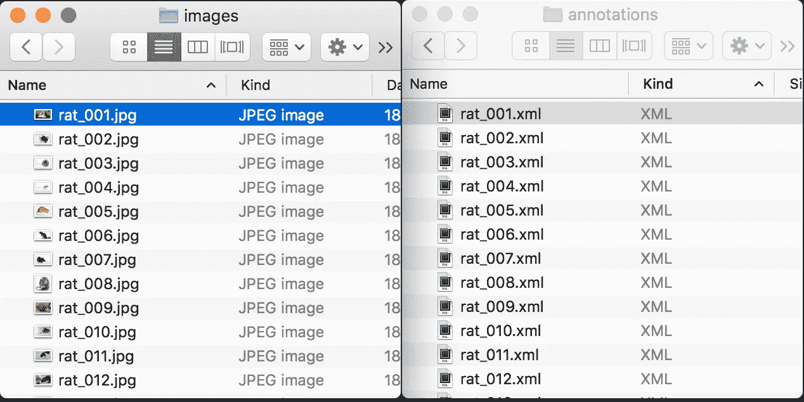
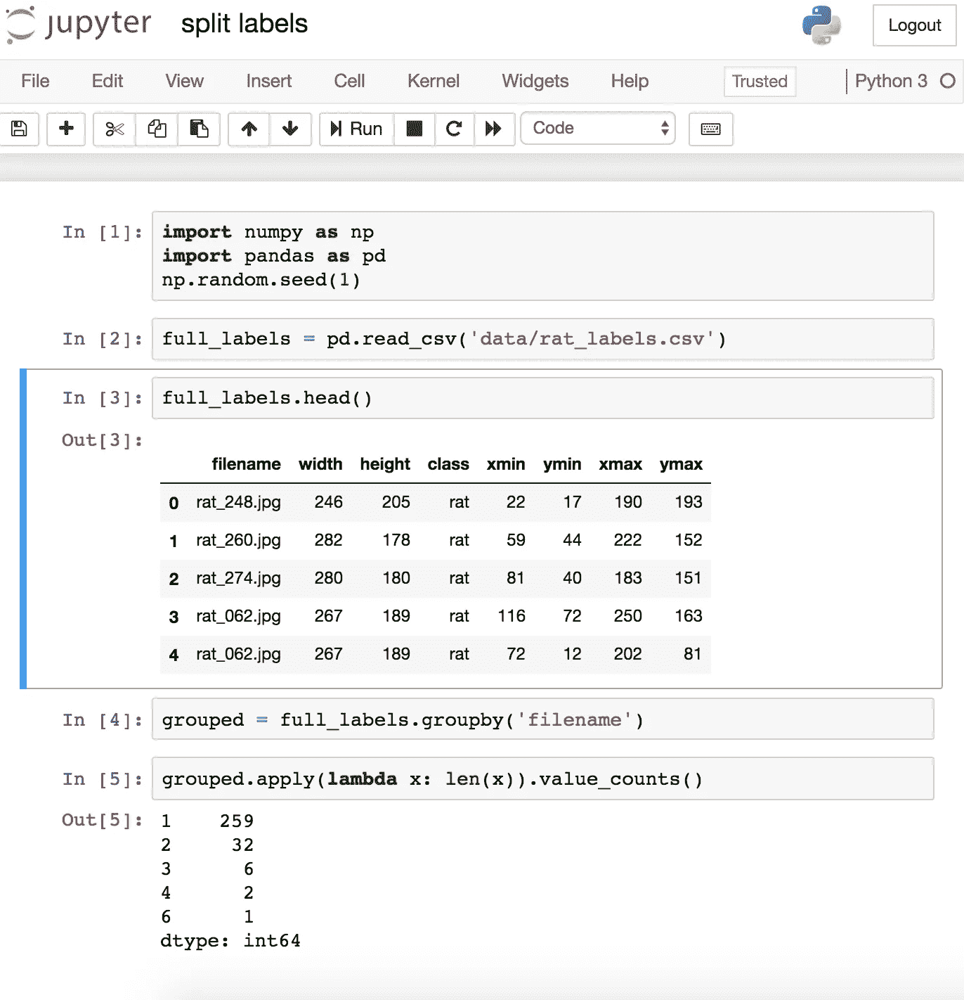

# 第 1 部分，共 3 部分:数据准备—在 Mac 上使用 tensorflow 的对象检测模型进行迁移学习

> 原文：<https://medium.com/coinmonks/part-1-2-step-by-step-guide-to-data-preparation-for-transfer-learning-using-tensorflows-object-ac45a6035b7a?source=collection_archive---------0----------------------->


本指南深受 Dat Tran 的文章的启发。我也主要使用其他人制作的现有工具来完成这项任务。在决定遵循本指南之前，也请注意我在做这件事时使用了 macOS High Sierra，以及至少两个版本的 python。我建议您修复本地计算机上的虚拟环境设置。

# 第一步。从网上下载图像

我用一个名为 ***的谷歌 chrome 扩展下载了几张老鼠图片，Fatkun 批量下载图片*** 。这个扩展允许你选择一个(或多个)google chrome 标签来下载图片。同样重要的是要知道图像只能以一种格式保存，在我们的例子中是 **jpeg，**并且图像被统一命名。对于我们来说，重要的是将其保存为 **jpeg** 格式，以便进行标记步骤。

确保有一个 google chrome 标签来加载想要检测的对象。在这种情况下，老鼠。


Figure 1\. Google image search on rats

点击 google chrome 浏览器右上方的 ***Fatkun 批量下载图片*** 按钮。


Figure 2\. Fatkun Batch Download Google Extension Icon

检查 ***更多选项*** 按钮，并确保切换 ***重命名基于*** 单选按钮选择，这样您就不必处理具有相同文件名或不想要的字符代码的图像。

你也可以打开或关闭图片，这取决于你是否想下载它。


Figure 3\. Toggle images on or off

确保 ***在下载前询问每个文件的保存位置*** 选项关闭，以便自动保存图像。


Figure 4\. Edit save settings

保存图像并检查将包含图像的输出文件夹。文件夹名称会是类似***rat _ Google Search****的东西。*

*注:您也可以从自己的视频中获取图像，只要您提取帧，为下一步标记做准备。*

# 第二步。标签图像

为了给下载的图片加标签，我用了[***LabelImg***](https://github.com/tzutalin/labelImg)。请注意，为避免可能出现的问题，请确保您的图像以 **jpeg** 格式保存。

克隆 [***标签***](https://github.com/tzutalin/labelImg) 储存库。在我的例子中，我使用了 Python 3.5.5 虚拟环境，并按照这里的说明为我的装有 macOS High Sierra 的笔记本电脑构建了。如果你有兴趣了解更多关于在 Mac 上设置虚拟环境的信息，这里有一个有用的指南。

```
# This is a comment
# Build for macOS High Sierracd build-tools
chmod +x ./build-for-macos.sh
./build-for-macos.sh
```

在本地机器上构建项目后，我继续 pip 安装所需的库。你也可以选择虔诚地遵循来自[原始资料库](https://github.com/tzutalin/labelImg)的指示。

```
# These are chosen parts from **Python 3 Virtualenv + Binary**pip install py2app
pip install PyQt5 lxml
make qt5py3
rm -rf build dist
```

完成上述步骤后，我通过运行`python labelimg.py`调用 **LabelImg**


Figure 5\. labelImg

现在，您可以开始标记图像。 ***打开目录*** 功能非常有用，因为我们把所有的图片都放在一个文件夹里。我还使用了 ***更改保存目录*** 功能将我所有的输出保存在一个地方。还要确保你的保存格式是 ***PscalVOC*** 。


Figure 6\. Choose save format

继续标记所有内容，直到得到类似如下的输出


Figure 7\. LabelImg output

# 第三步。将数据拆分为定型集和测试集

在分割数据之前，我需要一个包含所有标签的 csv 文件。对于这一部分，我使用了[中的`xml_to_csv.py`和这里的](https://github.com/datitran/raccoon_dataset)。首先，我必须把我所有的图片放在`raccoon_dataset/images`，所有的 xml 文件放在`raccoon_dataset/annotations`，并清空`raccoon_dataset/data`。`raccoon_dataset/data`将包含输出文件。您可以随意编辑，但请务必在`raccoon_dataset/xml_to_csv.py`上进行必要的更改。



Figure 8\. Annotations

对`raccoon_dataset/xml_to_csv.py`进行必要的修改，并通过运行`python xml_to_csv.py`创建您的 csv 文件。您的输出将类似于下图


Figure 9\. Sample output of xml_to_csv.py

为了分割数据，我使用了从[到](https://github.com/datitran/raccoon_dataset)的`split labels.ipynb`。确保读取每个单元块并编辑硬编码变量以满足您的需求。如果您不熟悉用户界面，请确保阅读更多关于 jupyter 笔记本以及如何在本地计算机上设置它的内容。



Figure 10\. Dat Tran’s split labels

成功运行`split labels.ipynb`后，应该有如下图所示的内容。对于我的数据，我将其分为 80–20，分别用于培训和测试。


Figure 11\. Sample output of `split labels.ipynb`

# 第四步。将图像转换为 TFRecord

此时，您的`raccoon_dataset/data`应该看下面写的包含以下文件。这意味着我们现在有了测试和培训标签，我们现在可以将数据转换为 TFRecord 格式。

```
rat_labels.csv
test_labels.csv
train_labels.csv
```

## 更新 PYTHONPATH

为此，我使用了由 Dat Tran 制造并在此处发布的(谢谢您，师父)。请注意您**需要 Tensorflow 的物体检测库**才能完成本部分。如果您正在使用 Mac (High Sierra)，请遵循我使用的[设置指南](/@viviennediegoencarnacion/how-to-setup-tensorflow-object-detection-on-mac-a0b72fbf470a)。

一旦您的 PYTHONPATH 包含 tensorflow 对象检测库，我们就可以开始转换了。

## 准备标签地图

相应编辑`raccoon_dataset/generate_tfrecord.py`的标签地图部分

```
# TO-DO replace this with label map
def class_text_to_int(row_label):
    if row_label == 'rat':
        return 1
    else:
        None
```

## 生成 TFRecord 文件

`raccoon_dataset/generate_tfrecord.py`中提供了一个用法示例:

```
Usage:
  # From tensorflow/models/
  # Create train data:
  python generate_tfrecord.py --csv_input=data/train_labels.csv  --output_path=train.record# Create test data:
  python generate_tfrecord.py --csv_input=data/test_labels.csv  --output_path=test.record
```

最后，为了确保正确生成 tfrecord 转换文件，请检查 tfrecord 文件的总大小，并将其与图像文件的总大小进行比较。它们应该差不多一样大。

# 来源

*   [https://www . quora . com/如何一次性从 Google-image-search-engine 下载所有图像](https://www.quora.com/How-can-I-download-all-images-from-Google-image-search-engine-at-once)
*   [https://towards data sciences . com/如何使用 tensorflow-object-detector-API-be 72 ecfe 1d 9 训练您自己的对象检测器](https://towardsdatascience.com/how-to-train-your-own-object-detector-with-tensorflows-object-detector-api-bec72ecfe1d9)
*   [https://media . com/@ viviennediegoencarnacion/management-python-virtual-environments-on-MAC-use-pyenv-5 FDD 34951 fcd](/@viviennediegoencarnacion/managing-python-virtual-environments-on-mac-using-pyenv-5fdd34951fcd)
*   [https://medium . com/@ viviennediegoencarnacion/how-to-setup-tensor flow-object-detection-on-MAC-a 0 b 72 fbf 470 a](/@viviennediegoencarnacion/how-to-setup-tensorflow-object-detection-on-mac-a0b72fbf470a)

> 加入 Coinmonks [电报频道](https://t.me/coincodecap)和 [Youtube 频道](https://www.youtube.com/c/coinmonks/videos)获取每日[加密新闻](http://coincodecap.com/)

## 另外，阅读

*   [复制交易](/coinmonks/top-10-crypto-copy-trading-platforms-for-beginners-d0c37c7d698c) | [加密税务软件](/coinmonks/crypto-tax-software-ed4b4810e338)
*   [网格交易](https://coincodecap.com/grid-trading) | [加密硬件钱包](/coinmonks/the-best-cryptocurrency-hardware-wallets-of-2020-e28b1c124069)
*   [密码电报信号](http://Top 4 Telegram Channels for Crypto Traders) | [密码交易机器人](/coinmonks/crypto-trading-bot-c2ffce8acb2a)
*   [最佳加密交易所](/coinmonks/crypto-exchange-dd2f9d6f3769) | [最佳加密交易所](/coinmonks/bitcoin-exchange-in-india-7f1fe79715c9)
*   开发人员的最佳加密 API
*   最佳[密码借贷平台](/coinmonks/top-5-crypto-lending-platforms-in-2020-that-you-need-to-know-a1b675cec3fa)
*   [免费加密信号](/coinmonks/free-crypto-signals-48b25e61a8da) | [加密交易机器人](/coinmonks/crypto-trading-bot-c2ffce8acb2a)
*   [杠杆代币](/coinmonks/leveraged-token-3f5257808b22)终极指南