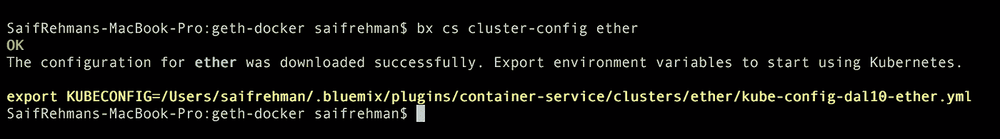

# 第 1 部分:IBM Cloud 上的以太坊区块链:-在 IBM Cloud 容器上部署私有以太坊区块链

> 原文：<https://medium.com/coinmonks/part-1-ethereum-blockchain-on-ibm-cloud-deploying-private-ethereum-blockchain-on-ibm-cloud-9d241afd3887?source=collection_archive---------0----------------------->


# **什么是 IBM 云？**

IBM Cloud 是 IBM 开发的云平台，基于 Cloud Foundry，运行 SoftLayer 基础设施。它支持各种编程语言、数据库、服务以及集成的 DevOps，使用 IBM Container service 在云上构建、运行、部署和管理应用程序。

# **先决条件**

## 注册 IBM Cloud 免费试用

> https://console.bluemix.net/registration/

## 安装 IBM Cloud cli

> [https://console . bluemix . net/docs/CLI/reference/bluemix _ CLI/get _ started . html](https://console.bluemix.net/docs/cli/reference/bluemix_cli/get_started.html)

## 安装码头工人

> [https://docs.docker.com/engine/installation/](https://docs.docker.com/engine/installation/)

## 安装和设置 Kubectl

> [https://kubernetes.io/docs/tasks/tools/install-kubectl/](https://kubernetes.io/docs/tasks/tools/install-kubectl/)

## 建立你的码头工人形象

克隆我的 Git 仓库

```
> git clone [https://github.com/SaifRehman/IBMCLOUD-Ethereum-Blockchain.git](https://github.com/SaifRehman/IBMCLOUD-Ethereum-Blockchain.git)
> cd IBMCLOUD-Ethereum-Blockchain/
```

从 Dockerfile 文件构建映像

```
> docker build -t myimage .
```


Will take some time to build the image :)

检查您的系统中是否有该图像

```
> docker images
```

## 登录 IBM Cloud &创建一个新容器

> [https://console.bluemix.net](https://console.bluemix.net)


IBM Cloud

通过选择容器服务，在 IBM Cloud 上创建一个 lite 容器。不要忘记给你的容器一个名字:)让我们把它命名为“以太”


Create a lite container for free. Wait for for some time it will take some time to deploy


After deploying you will see something like this

## 设置您的容器

除非您的容器已经完全部署，否则不要遵循这些步骤！

安装容器服务 bx 插件

```
> bx plugin install container-service -r Bluemix
```

登录您的 IBM Cloud 帐户。

```
> bx login -a https://api.ng.bluemix.net
```

为您的集群设置终端上下文

```
> bx cs cluster-config ether
```



You will see something like this, and configuration will be automatically downloaded

通过复制粘贴产生的黄色代码行，导出环境变量以开始使用 Kubernetes

```
> export KUBECONFIG=/Users/saifrehman/.bluemix/plugins/container-service/clusters/ether/kube-config-dal10-ether.yml
```

## 将映像从您的机器推送到 IBM Cloud Private Registery

标记图像以指向此注册表。选择本地映像、目标名称空间和目标存储库。

安装容器注册表插件。

```
> bx plugin install container-registry -r Bluemix
```

为您的第一个名称空间选择一个名称，并创建该名称空间。将此命名空间用于快速入门的其余部分。

> bx cr 名称空间-添加<my_namespace></my_namespace>

```
> bx cr namespace-add etherprivate
```

将您的本地 Docker 守护进程登录到 IBM Cloud Container 注册表中。

```
> bx cr login
```

> 码头工人标签<local_image>registry.ng.bluemix.net/<my_namespaces>/</my_namespaces></local_image>

```
> docker tag myimage registry.ng.bluemix.net/etherprivate/myimage
```

> 码头工人推 registry.ng.bluemix.net/<my_namespace>/</my_namespace>

```
> docker push registry.ng.bluemix.net/etherprivate/myimage
```


This will push the image to IBM Cloud Private image registry. This will take some time :)

## 将您的映像部署到 IBM Cloud 上的 Kubernetes 集群

设置 service.deployment.yml 文件


Configure your Kubernetes Cluster

部署:)

```
> kubectl create -f service-deployment.yml
```


You can now access your application through the public IP

测试您是否可以访问

```
curl http://169.47.252.115:30090
```

如果您没有看到任何输出，请不要担心，它不会返回任何内容:)

## 访问运行在 IBM 容器上的私有以太坊区块链

```
> geth attach http://169.47.252.115:30090
```


Cooool. You now have a ethereum blockchain spinning on IBM Cloud

## **我们开始开采乙醚吧！**

创建并解锁您的新帐户，开始采矿

```
> personal.newAccount('password')
> personal.unlockAccount(web3.eth.coinbase, "password", 15000)
```

开始挖掘，以获得足够的以太网，让我们在下一个教程中部署智能合同:-)

```
> miner.start()
```

检查你的乙醚平衡

```
> web3.fromWei(eth.getBalance(eth.coinbase), "ether")
```

停止采矿

```
> miner.stop()
```


> **祝贺您在 IBM Cloud 上成功设置了您的私有以太坊区块链！**

# 阅读更多信息:

1.  关注我更多:【https://www.engineerability.com 

> [在您的收件箱中直接获得最佳软件交易](https://coincodecap.com/?utm_source=coinmonks)

[](https://coincodecap.com/?utm_source=coinmonks)

## 然后

与 solidity 合作，在 IBM Cloud 上部署您的第一个以太坊智能合约，并在 Angular 4 上创建 Dapp 前端

[](https://medium.com/coinmonks/ethereum/home)

Click to know more about ethereum