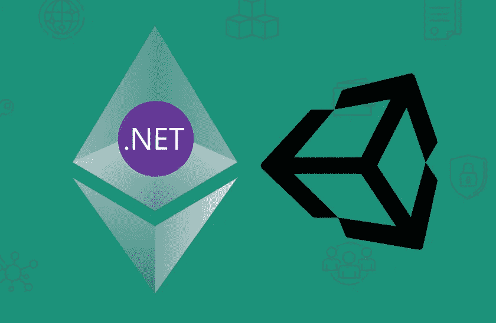
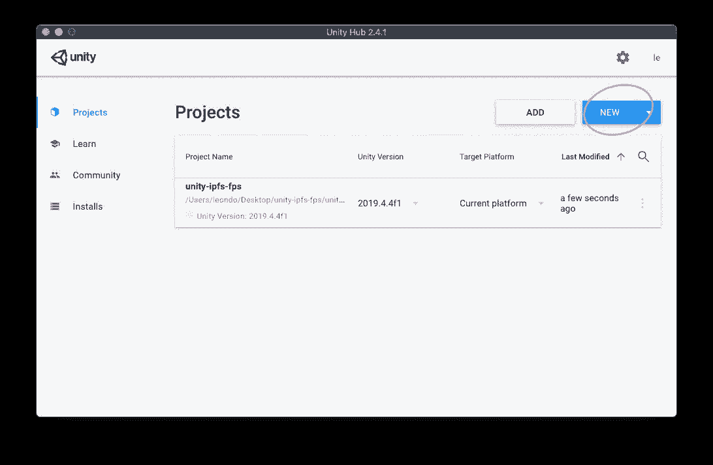
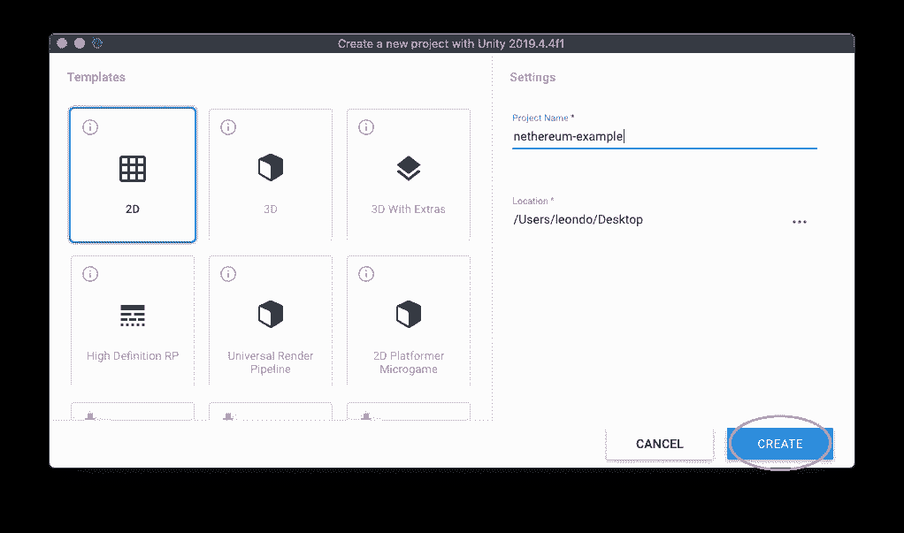
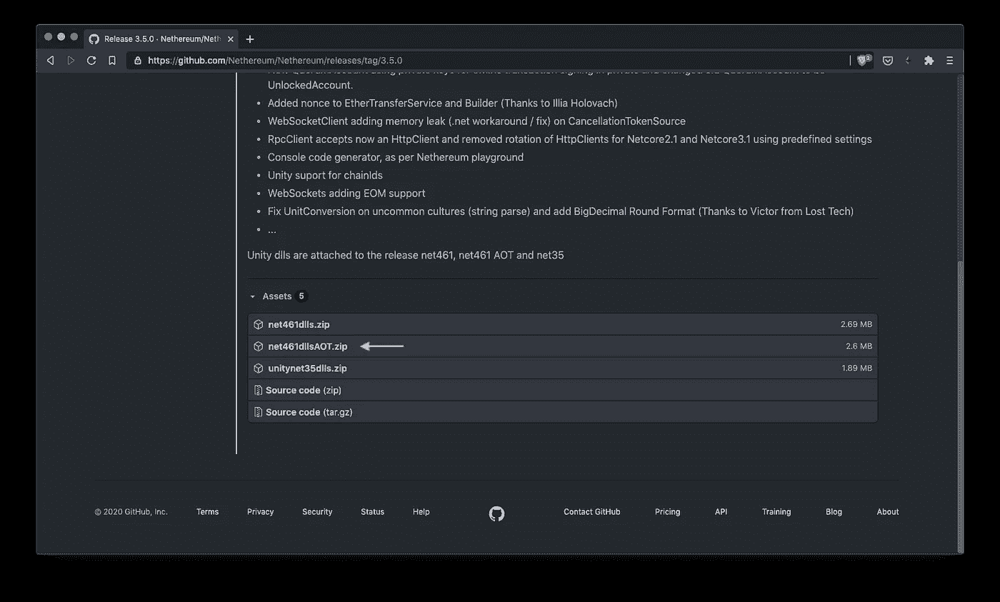
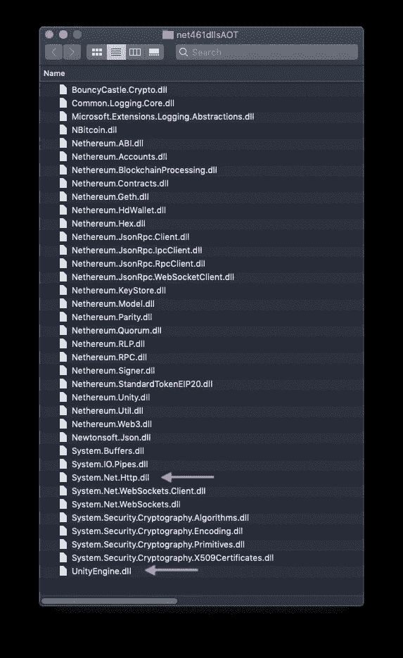
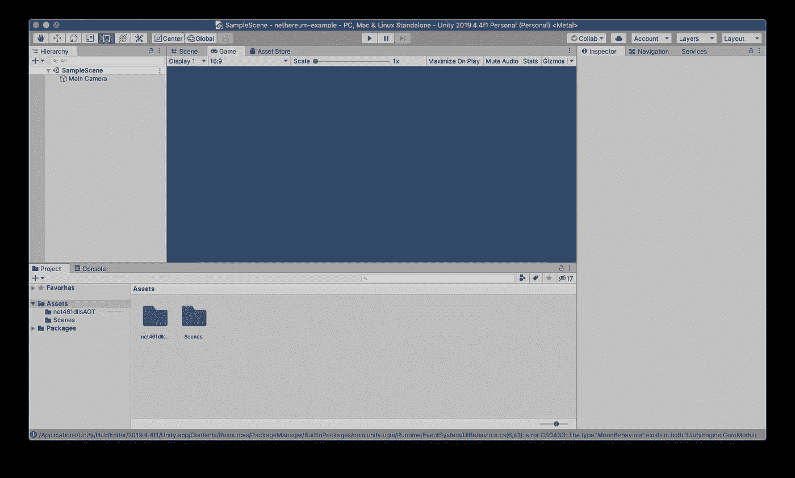
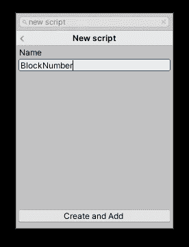
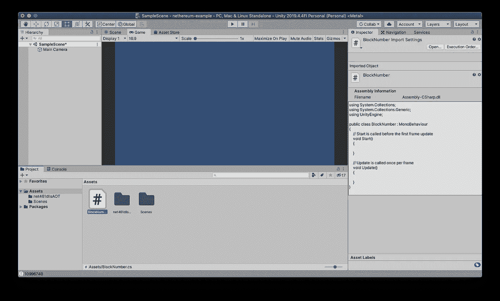
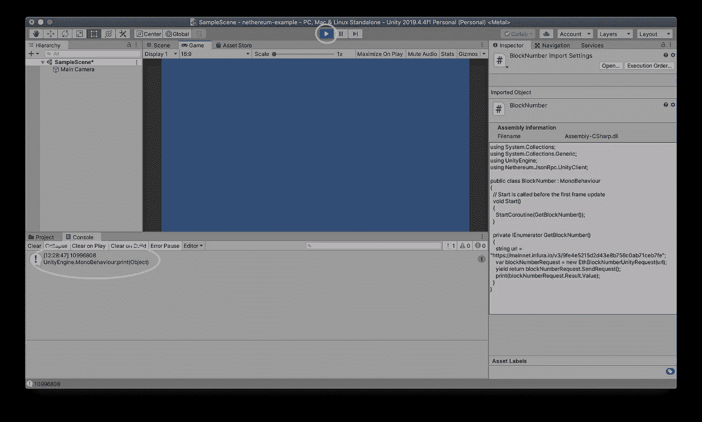

# 在 Unity 中导入尼瑟姆

> 原文：<https://medium.com/coinmonks/part-1-using-nethereum-in-unity-54e62f7e65d5?source=collection_archive---------0----------------------->

## 将 Unity games 连接到以太坊区块链

# 概观

本教程将把尼瑟姆导入 Unity 并获取当前的块号。

*   下载/创建 Unity 项目
*   下载尼瑟姆`.dll`
*   统一进口尼瑟姆
*   获取当前块高度

# 一致

安装 Unity:[https://unity.com/](https://unity.com/)

创建新的 Unity 项目。

# 使用尼瑟姆

有几种方法可以使用尼瑟姆图书馆。这个例子将从 Github 下载`.dll`。

访问:[https://github.com/Nethereum/Nethereum/releases/tag/3.5.0](https://github.com/Nethereum/Nethereum/releases/tag/3.5.0)

下载`net461dllsAOT.zip`

如果以后遇到错误，请删除

`System.Net.Http.dll`和`UnityEngine.dll`

将文件夹拖到“资产”下的 Unity 项目中。请随意重命名该文件夹。尼瑟姆图书馆现已开放。

# 获取块号

出于演示目的，在`Main Camera`中创建一个脚本

命名为`BlockNumber`

打开脚本

更新脚本

点击播放，查看控制台！

# 结论

本文为更复杂的交互奠定了基础，比如发送智能合约和与智能合约交互。对于另一个工作示例，请检查

 [## 尼瑟姆/unity 3d 简单示例

### 此示例演示了如何传输以太网以及与智能合约的交互(在此场景中为 ERC20…

github.com](https://github.com/Nethereum/Unity3dSimpleSample) 

## 另外，阅读

*   最好的[密码交易机器人](/coinmonks/crypto-trading-bot-c2ffce8acb2a)
*   [密码本交易平台](/coinmonks/top-10-crypto-copy-trading-platforms-for-beginners-d0c37c7d698c)
*   最好的[加密税务软件](/coinmonks/best-crypto-tax-tool-for-my-money-72d4b430816b)
*   [最佳加密交易平台](/coinmonks/the-best-crypto-trading-platforms-in-2020-the-definitive-guide-updated-c72f8b874555)
*   最佳[加密借贷平台](/coinmonks/top-5-crypto-lending-platforms-in-2020-that-you-need-to-know-a1b675cec3fa)
*   [最佳区块链分析工具](https://bitquery.io/blog/best-blockchain-analysis-tools-and-software)
*   [加密套利](/coinmonks/crypto-arbitrage-guide-how-to-make-money-as-a-beginner-62bfe5c868f6)指南:新手如何赚钱
*   最佳[加密制图工具](/coinmonks/what-are-the-best-charting-platforms-for-cryptocurrency-trading-85aade584d80)
*   [莱杰 vs 特雷佐](/coinmonks/ledger-vs-trezor-best-hardware-wallet-to-secure-cryptocurrency-22c7a3fd391e)
*   了解比特币的[最佳书籍有哪些？](/coinmonks/what-are-the-best-books-to-learn-bitcoin-409aeb9aff4b)
*   [3 商业评论](/coinmonks/3commas-review-an-excellent-crypto-trading-bot-2020-1313a58bec92)
*   [AAX 交易所审核](/coinmonks/aax-exchange-review-2021-67c5ea09330c) |推荐代码、交易费用、利弊
*   [Deribit 审查](/coinmonks/deribit-review-options-fees-apis-and-testnet-2ca16c4bbdb2) |选项、费用、API 和 Testnet
*   [FTX 密码交易所评论](/coinmonks/ftx-crypto-exchange-review-53664ac1198f)
*   [n 零审核](/coinmonks/ngrave-zero-review-c465cf8307fc)
*   [Bybit 交换审查](/coinmonks/bybit-exchange-review-dbd570019b71)
*   [3Commas vs Cryptohopper](/coinmonks/cryptohopper-vs-3commas-vs-shrimpy-a2c16095b8fe)
*   最好的比特币[硬件钱包](/coinmonks/the-best-cryptocurrency-hardware-wallets-of-2020-e28b1c124069?source=friends_link&sk=324dd9ff8556ab578d71e7ad7658ad7c)
*   最佳 [monero 钱包](https://blog.coincodecap.com/best-monero-wallets)
*   [莱杰纳米 s vs x](https://blog.coincodecap.com/ledger-nano-s-vs-x)
*   [bits gap vs 3 commas vs quad ency](https://blog.coincodecap.com/bitsgap-3commas-quadency)
*   [莱杰纳米 S vs 特雷佐 one vs 特雷佐 T vs 莱杰纳米 X](https://blog.coincodecap.com/ledger-nano-s-vs-trezor-one-ledger-nano-x-trezor-t)
*   [block fi vs Celsius](/coinmonks/blockfi-vs-celsius-vs-hodlnaut-8a1cc8c26630)vs Hodlnaut
*   Bitsgap 评论——一个轻松赚钱的加密交易机器人
*   为专业人士设计的加密交易机器人
*   [PrimeXBT 审查](/coinmonks/primexbt-review-88e0815be858) |杠杆交易、费用和交易
*   [埃利帕尔泰坦评论](/coinmonks/ellipal-titan-review-85e9071dd029)
*   [赛克斯·斯通评论](https://blog.coincodecap.com/secux-stone-hardware-wallet-review)
*   [BlockFi 审查](/coinmonks/blockfi-review-53096053c097) |赚取高达 8.6%的加密利息