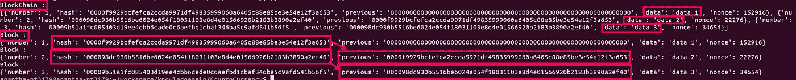

# 如何创建自己的加密货币！！！

> 原文：<https://medium.com/coinmonks/part-2-how-to-create-your-own-cryptocurrency-a4726d24c5ce?source=collection_archive---------2----------------------->

## 第 2 部分:积木和链接(区块链)


Photo by [Launchpresso](https://unsplash.com/@launchpresso?utm_source=medium&utm_medium=referral) on [Unsplash](https://unsplash.com?utm_source=medium&utm_medium=referral)

欢迎大家回来，让我们创建一个简单的区块链。希望每个人都看过我以前的博客，否则请浏览它，这样你就可以理解这一个。错过的人点击[这里](/@ananthkrish1998/how-to-create-my-own-cryptocurrency-84eb1246e39f)了解一些关于区块链的基本知识。

在这个博客中，我们将讨论创建块和链接在一起，以创建一个简单的区块链。谁想知道区块链的简单定义是一串积木(似乎是对一个学生的未知问题的回答😂😂).


Chain of blocks ([source](https://www.betterlives.world/blog/wp-content/uploads/2019/03/Genesis-block.jpg))

一个块可以有任何开发者想要的东西，通常，一个块会有前一个散列(前一个块的散列值)，数据和自身散列。那么，哈希在这里是什么意思🤔🤔？？散列是将字符和数字的输入转换成固定长度的加密文本的功能。有很多散列函数，这里我使用 SHA256 作为我的散列函数。如果有人想了解散列函数或 SHA256，请在评论中提及，我会为此写一个单独的博客。

我希望我们清楚这个博客的技术部分，让我们把工作交给键盘。我要用 python 语言来编码。

让我们编写一个包含数据、散列和先前散列的简单块

```
class Block():
    """A Block in BlockChain"""
    data = None
    hash = None
    nonce = 0
    previous_hash = "0" * 64
```

这里，所有内容都被初始化为零，而先前的散列用 64 位零初始化，因为 SHA256 的输出是 64 位，并且第一个块将不具有任何先前的散列。你发现上面的代码有什么奇怪的地方吗？如果没有，请现在就看一下，知道是什么吗？

nonce 是“仅使用一次的数字”的缩写，它是添加到区块链的散列/加密块中的数字，当重新散列时，满足难度级别限制。

```
def __init__(self,data,number=0):
        self.data = data
        self.number = number
```

上面的代码片段被称为块的构造函数，它将分别初始化数据和块号。这就是我们已经成功地创建了一个块让我们去散列。

```
def hash(self):
        return updateHash(
            self.previous_hash,
            self.number,
            self.data,
            self.nonce
        )
```

我为类块定义了另一个方法 hash，它将返回该块的 hash。往里面看它调用 updateHash 函数:

```
def updateHash(*args):
    hashing_text = ""
    h = sha256()
    for arg in args:
        hashing_text += str(arg)
    h.update(hashing_text.encode('utf-8'))
    return h.hexdigest()
```

updateHash 函数接受 n 个参数，这些参数将被附加到一个字符串中，该字符串由前一个块的哈希、块号、其中的数据和只使用一次的编号组成，命名为 hashing_text。如前所述，我使用的是 SHA256 hash，因此为它创建了一个实例，并将 hashing_text 更新为 utf-8 编码。现在，hexdigest()函数将为该块提供散列。

现在出于打印的目的，我将 __str__ 方法重写为:

```
def __str__(self):
        return str(
        "Block#: %s\nHash: %s\nPrevious: %s\nData: %s\nNonce: %s\n" %(
            self.number,
            self.hash(),
            self.previous_hash,
            self.data,
            self.nonce
            )
        )
```

干得好，我们已经使用 python 创建了块！！！..

让我们编写一个简单的区块链，区块链通常会有一个困难，这是一个简单的数字，提供了哈希应该在开头有那么多零的标准。难度越大，创建哈希所需的时间就越长。

```
class BlockChain(object):
    """Chain of Blocks"""
    difficulty = 4
```

现在我正在为上面的类创建一个构造函数，它初始化块链:

```
def __init__(self,chain=[]):
        self.chain = chain
```

如果我们有一个所有字段都已初始化的块，我们可以将该块添加到区块链中:

```
def add(self,block):
        self.chain.append({
                'Block Number' : block.number,
                'Hash':block.hash(),
                'Previous Hash' : block.previous_hash,
                'Data' : block.data,
                'nonce' : block.nonce
            })
```

否则，如果我们只有数据，那么我们必须挖掘数据以初始化所有字段:

```
def mine(self, block):
        try:
            block.previous_hash = self.chain[-1].get('hash')
        except IndexError:
            pass
        while True:
            if block.hash()[:self.difficulty] == "0" * self.difficulty:
                self.add(block)
                break
            else:
                block.nonce +=1
```

上面我们正在初始化一个块的 previous_hash，然后我们正在散列这个块，直到遇到困难。

干得好，伙计们，我们已经完成了我们的编码部分！！


Photo by [Alasdair Elmes](https://unsplash.com/@alelmes?utm_source=medium&utm_medium=referral) on [Unsplash](https://unsplash.com?utm_source=medium&utm_medium=referral)

让我们看看这是如何工作的

```
def main():
    blockchain = BlockChain()
    database = ["data 1", "data 2", "data 3"] num = 0
    for data in database:
        num += 1
        blockchain.mine(Block(data,num))
    print("BlockChain : ")
    print(blockchain.chain)for block in blockchain.chain:
        print("Block :")
        print(block)if __name__ == '__main__':
    main()
```

上面我为区块链类创建了一个实例，我们有 3 个数据，只有一个数字不同。“num”是指在添加块时将递增的块号。

将此代码另存为 **<文件名>。py** 要执行它，请转到它所在的位置并键入 **python <文件名>。py**

所以输出看起来像这样



抱歉，图像模糊，请右键单击并选择查看图像，以清楚地查看此图像。

在输出中需要注意的是:

1.  区块链:显示了块是如何与其中的数据连接在一起的。
2.  块:前一个散列的第一块将是 64 位零。第二个块先前散列将是先前块的散列
3.  最重要的是:我们只修改了数据的最后一位数，但是每个数据块的散列有许多不同之处。

需要源代码的可以查看[这里](https://github.com/AnanthaPerumal/BlockChain)

非常感谢您在我的博客中花费宝贵的时间。请以你认为值得的方式，以 1-50 的比率鼓掌来支持我。如果你对这个博客有任何疑问或改进的建议，请在下面评论并分享给那些想了解区块链的人。

你可以在这里找到下一个零件链接[。我会给你一些你能理解的简单的东西😉😉。](/@ananthkrish1998/part-3-how-to-create-your-own-cryptocurrency-bb6c75353218)

祝你愉快😊😊

## 另外，阅读

*   最好的[密码交易机器人](/coinmonks/crypto-trading-bot-c2ffce8acb2a)
*   [密码本交易平台](/coinmonks/top-10-crypto-copy-trading-platforms-for-beginners-d0c37c7d698c)
*   最好的[加密税务软件](/coinmonks/best-crypto-tax-tool-for-my-money-72d4b430816b)
*   [最佳加密交易平台](/coinmonks/the-best-crypto-trading-platforms-in-2020-the-definitive-guide-updated-c72f8b874555)
*   最佳[加密借贷平台](/coinmonks/top-5-crypto-lending-platforms-in-2020-that-you-need-to-know-a1b675cec3fa)
*   [最佳区块链分析工具](https://bitquery.io/blog/best-blockchain-analysis-tools-and-software)
*   [加密套利](/coinmonks/crypto-arbitrage-guide-how-to-make-money-as-a-beginner-62bfe5c868f6)指南:新手如何赚钱
*   最佳[加密制图工具](/coinmonks/what-are-the-best-charting-platforms-for-cryptocurrency-trading-85aade584d80)
*   [莱杰 vs 特雷佐](/coinmonks/ledger-vs-trezor-best-hardware-wallet-to-secure-cryptocurrency-22c7a3fd391e)
*   了解比特币的[最佳书籍有哪些？](/coinmonks/what-are-the-best-books-to-learn-bitcoin-409aeb9aff4b)
*   [3 商业评论](/coinmonks/3commas-review-an-excellent-crypto-trading-bot-2020-1313a58bec92)
*   [AAX 交易所评论](/coinmonks/aax-exchange-review-2021-67c5ea09330c) |推荐代码、交易费用、利弊
*   [Deribit 审查](/coinmonks/deribit-review-options-fees-apis-and-testnet-2ca16c4bbdb2) |选项、费用、API 和 Testnet
*   [FTX 密码交易所评论](/coinmonks/ftx-crypto-exchange-review-53664ac1198f)
*   [n 零审核](/coinmonks/ngrave-zero-review-c465cf8307fc)
*   [Bybit 交换审查](/coinmonks/bybit-exchange-review-dbd570019b71)
*   3Commas vs Cryptohopper
*   最好的比特币[硬件钱包](/coinmonks/the-best-cryptocurrency-hardware-wallets-of-2020-e28b1c124069?source=friends_link&sk=324dd9ff8556ab578d71e7ad7658ad7c)
*   最佳 [monero 钱包](https://blog.coincodecap.com/best-monero-wallets)
*   [莱杰纳米 s vs x](https://blog.coincodecap.com/ledger-nano-s-vs-x)
*   [bits gap vs 3 commas vs quad ency](https://blog.coincodecap.com/bitsgap-3commas-quadency)
*   [莱杰 Nano S vs 特雷佐 one vs 特雷佐 T vs 莱杰 Nano X](https://blog.coincodecap.com/ledger-nano-s-vs-trezor-one-ledger-nano-x-trezor-t)
*   [block fi vs Celsius](/coinmonks/blockfi-vs-celsius-vs-hodlnaut-8a1cc8c26630)vs Hodlnaut
*   Bitsgap 评论——一个轻松赚钱的加密交易机器人
*   为专业人士设计的加密交易机器人
*   [PrimeXBT 审查](/coinmonks/primexbt-review-88e0815be858) |杠杆交易、费用和交易
*   [埃利帕尔泰坦评论](/coinmonks/ellipal-titan-review-85e9071dd029)
*   [赛克斯石评论](https://blog.coincodecap.com/secux-stone-hardware-wallet-review)
*   [BlockFi 评论](/coinmonks/blockfi-review-53096053c097) |从您的密码中赚取高达 8.6%的利息