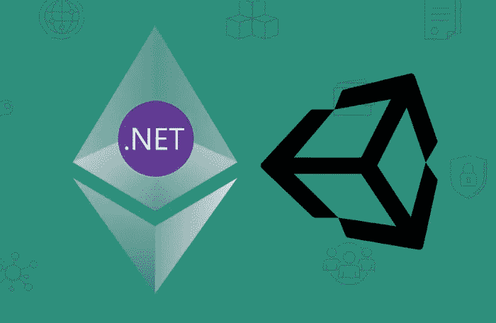
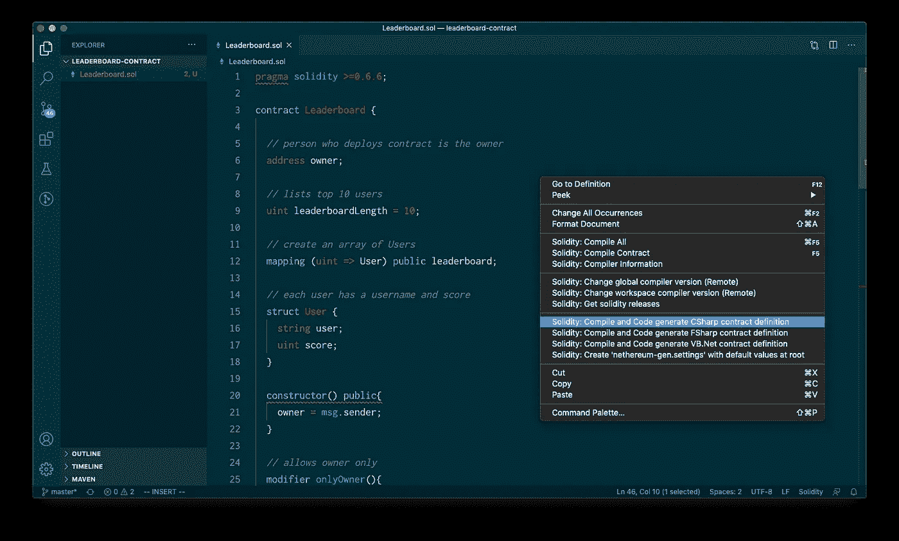
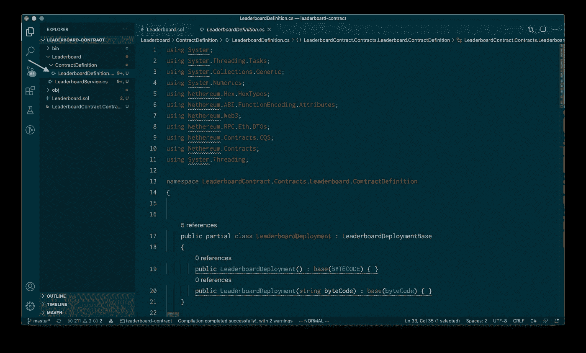
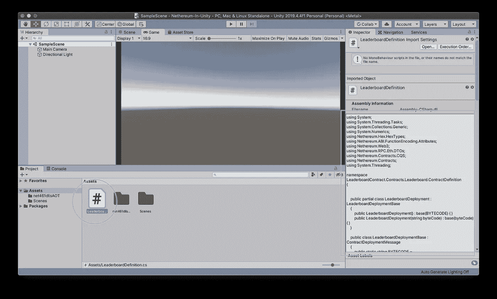
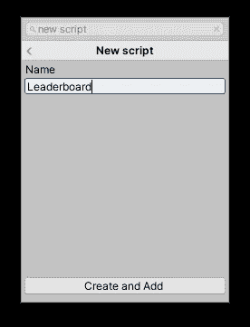
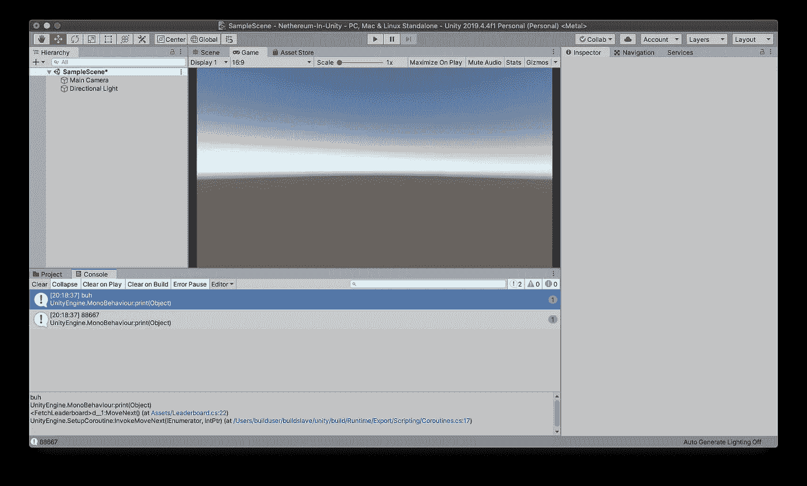

# 在 Unity 中获取 ETH 智能合同数据

> 原文：<https://medium.com/coinmonks/part-2-using-nethereum-in-unity-5b09f2d8c718?source=collection_archive---------1----------------------->

## 在 Unity 中获取区块链数据

# 概观

本文将介绍如何从 Unity 中的以太坊智能合约获取数据。

**先决条件**

*   创建了一个 Unity 项目
*   进口尼瑟姆图书馆
*   部署了智能协定:带有协定地址的代码
*   下载了 [VS 代码](https://code.visualstudio.com/)和 [Solidity 插件](https://marketplace.visualstudio.com/items?itemName=JuanBlanco.solidity)

如果您还没有完成先决条件，请查看[第 1 部分:在 Unity 中使用以太坊](/coinmonks/part-1-using-nethereum-in-unity-54e62f7e65d5)和[创建和部署以及以太坊排行榜](/coinmonks/create-and-deploy-an-ethereum-leaderboard-1ba60dba1495)。

# 创建 C#定义

在 VS 代码中打开[坚固性代码](https://gist.github.com/leon-do/d5850bf39fd7710bc365764d1c0d1c8d)。确保[坚固性插件](https://marketplace.visualstudio.com/items?itemName=JuanBlanco.solidity)已安装。右键单击合同并选择`Solidity Compile and Code generate CSharp contract definition`下面是一个[排行榜](https://github.com/IPFS-FPS/leaderboard-solidity-contract)合同的示例。

它应该在`/CONTRACT_NAME/ContractDefinition/CONTRACT_NAME_Definition.cs`下生成一个合同定义

这里有一个`LeaderboardDefinition.cs`的例子

通知`LeaderboardFunction`用于查看谁在第一、第二、第三等位置。该函数接受一个`uint`参数。

例如:

0 返回第一名

1 返回第二名

2 返回第三名

等等。

这个文件应该被复制到 Unity 项目中。

# 向 Unity 添加 C#定义

打开你的 Unity 项目，确保已经添加了 Nethereum `.dll`文件。如果未完成，检查[第 1 部分](/coinmonks/part-1-using-nethereum-in-unity-54e62f7e65d5)。

接下来，通过拖动文件将合同定义添加到 unity 项目中。

# 从以太坊契约中获取数据

现在一切都设置好了，创建一个脚本来从智能合约中获取数据。

出于演示目的，在`Main Camera`中创建一个脚本

命名为`Leaderboard`

打开`Leaderboard.cs`并更新脚本。

> `new LeaderboardFunction() {ReturnValue1 = 0}`
> 
> 方法
> 
> 谁在第一名？！

更多信息:[https://github . com/nether eum/unity 3d simple sample # query-smart-contract](https://github.com/Nethereum/Unity3dSimpleSample#query-smart-contract)

运行您的项目并检查控制台

恭喜你！你可以从分散的来源获取数据。

## 另外，阅读

*   最好的[密码交易机器人](/coinmonks/crypto-trading-bot-c2ffce8acb2a)
*   [密码本交易平台](/coinmonks/top-10-crypto-copy-trading-platforms-for-beginners-d0c37c7d698c)
*   最好的[加密税务软件](/coinmonks/best-crypto-tax-tool-for-my-money-72d4b430816b)
*   [最佳加密交易平台](/coinmonks/the-best-crypto-trading-platforms-in-2020-the-definitive-guide-updated-c72f8b874555)
*   最佳[加密借贷平台](/coinmonks/top-5-crypto-lending-platforms-in-2020-that-you-need-to-know-a1b675cec3fa)
*   [最佳区块链分析工具](https://bitquery.io/blog/best-blockchain-analysis-tools-and-software)
*   [加密套利](/coinmonks/crypto-arbitrage-guide-how-to-make-money-as-a-beginner-62bfe5c868f6)指南:新手如何赚钱
*   最佳[加密制图工具](/coinmonks/what-are-the-best-charting-platforms-for-cryptocurrency-trading-85aade584d80)
*   [莱杰 vs 特雷佐](/coinmonks/ledger-vs-trezor-best-hardware-wallet-to-secure-cryptocurrency-22c7a3fd391e)
*   了解比特币的[最佳书籍有哪些？](/coinmonks/what-are-the-best-books-to-learn-bitcoin-409aeb9aff4b)
*   [3 商业评论](/coinmonks/3commas-review-an-excellent-crypto-trading-bot-2020-1313a58bec92)
*   [AAX 交易所评论](/coinmonks/aax-exchange-review-2021-67c5ea09330c) |推荐代码、交易费用、利弊
*   [Deribit 审查](/coinmonks/deribit-review-options-fees-apis-and-testnet-2ca16c4bbdb2) |选项、费用、API 和 Testnet
*   [FTX 密码交易所评论](/coinmonks/ftx-crypto-exchange-review-53664ac1198f)
*   [n 零审核](/coinmonks/ngrave-zero-review-c465cf8307fc)
*   [Bybit 交换审查](/coinmonks/bybit-exchange-review-dbd570019b71)
*   [3Commas vs Cryptohopper](/coinmonks/cryptohopper-vs-3commas-vs-shrimpy-a2c16095b8fe)
*   最好的比特币[硬件钱包](/coinmonks/the-best-cryptocurrency-hardware-wallets-of-2020-e28b1c124069?source=friends_link&sk=324dd9ff8556ab578d71e7ad7658ad7c)
*   最佳 [monero 钱包](https://blog.coincodecap.com/best-monero-wallets)
*   [莱杰 nano s vs x](https://blog.coincodecap.com/ledger-nano-s-vs-x)
*   [Bitsgap vs 3 commas vs quad ency](https://blog.coincodecap.com/bitsgap-3commas-quadency)
*   [莱杰 Nano S vs 特雷佐 one vs 特雷佐 T vs 莱杰 Nano X](https://blog.coincodecap.com/ledger-nano-s-vs-trezor-one-ledger-nano-x-trezor-t)
*   [block fi vs Celsius](/coinmonks/blockfi-vs-celsius-vs-hodlnaut-8a1cc8c26630)vs Hodlnaut
*   [bits gap review](/coinmonks/bitsgap-review-a-crypto-trading-bot-that-makes-easy-money-a5d88a336df2)——一个轻松赚钱的加密交易机器人
*   为专业人士设计的加密交易机器人
*   [PrimeXBT 审查](/coinmonks/primexbt-review-88e0815be858) |杠杆交易、费用和交易
*   [埃利帕尔泰坦评论](/coinmonks/ellipal-titan-review-85e9071dd029)
*   [赛克斯·斯通评论](https://blog.coincodecap.com/secux-stone-hardware-wallet-review)
*   [BlockFi 评论](/coinmonks/blockfi-review-53096053c097) |赚取高达 8.6%的加密利息