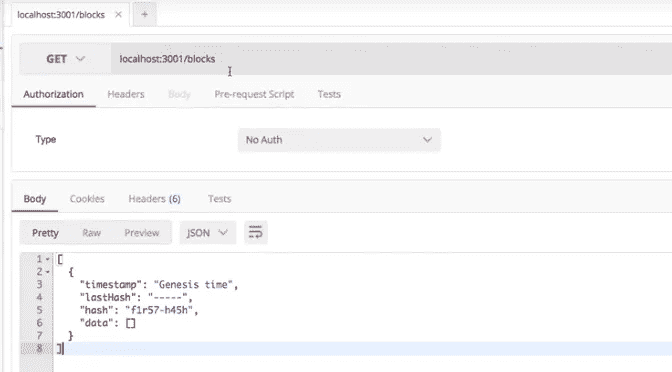
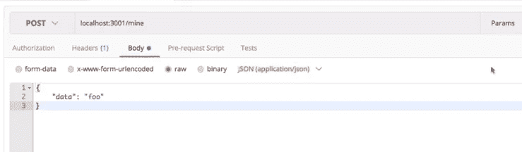
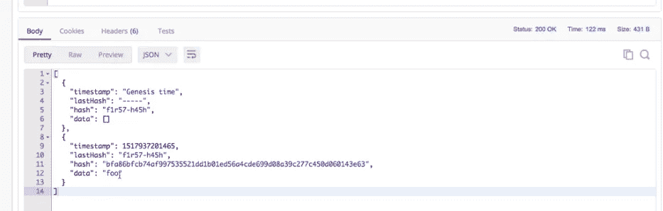

# 第 3 部分:用 PoW 共识算法实现区块链和加密货币

> 原文：<https://medium.com/coinmonks/part-3-implementing-blockchain-and-cryptocurrency-with-pow-consensus-algorithm-d9b8cb928e3e?source=collection_archive---------0----------------------->

## 在 node.js 中使用工作共识算法证明，小规模、易于理解、全面、逐步实施区块链和加密货币


Source: [Bitcoin Wiki](https://en.bitcoinwiki.org/wiki/Proof-of-work)

在[之前的文章](/coinmonks/implementing-blockchain-and-cryptocurrency-with-pow-consensus-algorithm-in-node-js-part-2-4524d0bf36a1)中，我们开始编写我们的区块链，并创建了我们的 block 类和区块链类。在本帖中，我们将通过添加多个贡献者或多个矿工的能力来扩展我们的区块链。此外，我们需要一个 API 来与我们的区块链交互，因此我们也将制作一个 express 应用程序。

为了增加对多个贡献者的支持，我们需要添加某种形式的验证。网络中的每个矿工可能在某个时间点有不同的链。为了实现一个共同的状态，我们需要验证我们收到的其他矿工的新链。在比特币中，使用的是最长链规则。其中，有效的链，即所有块都有效并且具有最大块数的链被认为是有效链。因此，所有矿工将他们的链替换为最长的链。

我们将把这个功能添加到我们的区块链中。

我们将在区块链类中创建一个`isValidChain(chain)`静态函数，它告诉我们这个链是否有效。在这个函数中，我们重新计算块的散列，并将其与块的给定散列进行比较。这将检查该块是否已被篡改。

在添加这个函数之前，我们需要一种方法来找到给定块实例的块的散列。让我们将此功能添加到 block 类中。

Handover a block, and I’ll hash it

现在我们可以在我们的`isValidChain()`函数中使用这个函数。

chain valid ? yes : no ;

继续前进。当我们收到一个有效的比我们的更长的新链时，我们必须使用那个链并丢弃我们的链，更正式地说，我们必须用新的更长的链替换我们的链。让我们添加这个功能。

在区块链类中创建一个函数`replaceChain(chain)`。这会将当前区块链对象的新链分配给作为参数接收的新链。

下面是更新后的 block.js 和 blockchain.js 文件的样子。

街区

区块链

接下来，我们将测试我们的`isValidChain()`函数。我们将在一个有效的链、一个无效的链、一个无效的 genesis 块上测试这个函数。让我们将以下测试案例添加到 blockchain.test.js 文件中。为了测试这个函数，我们将在`beforeEach` 函数中创建一个新链，并将其命名为`blockchain2`。我们将使用这个链与当前链进行比较。

为了测试`replaceChain()`函数，让我们添加一些测试案例，看看我们的区块链是否替换了有效的较长链并拒绝了无效的较小链。将以下测试案例添加到 blockchain.test.js

我们更新后的 blockchain.test.js 文件将如下所示

The blockchain test file

如果您运行这些测试，我们将有 9 个通过测试的案例。

太好了。

让我们继续围绕我们已经创建的这个区块链系统创建一个 web API。这些 API 将允许用户通过每个 HTTP 请求与区块链进行交互，由于我们很快就会有多链验证，我们将有多个 minorss 更新一个在整个网络上分散的区块链中共享的 minor。

在我们有我们的 web API 之前，让我们组织我们的项目，因为我们将很快在我们的项目中添加更多的文件。

创建一个名为区块链的新目录，并将块和区块链文件与测试文件一起移动到该目录中。

我们的文件项目结构应该如下所示

```
blockchain/
     blockchain.js
     blockchain.test.js
     block.js
     block.test.js
```

由于我们有同名的 blockchain.js 文件和文件夹区块链，我们可以将 blockchain.js 重命名为 index.js，并将 blockchain.test.js 重命名为 index.test.js

```
blockchain.js  => index.js
blockchain.test.js => index.test.js
```

*不要忘记将名称区块链改为测试文件中导入的索引。*

现在让我们为我们的应用程序创建一个单独的`app`文件夹。让我们在这个文件夹中创建一个新的`index.js` 文件。

为了制作我们的 API，我们将使用 express 模块。让我们安装它。

```
npm i express --save
```

为了在 post 请求中操作数据，我们需要一个 bodyparser 模块。所以把那个也装上。

```
npm i body-parser --save
```

我们将有多个用户运行我们的应用程序。为了在我们自己的机器上测试这个应用程序，我们需要在每次运行新实例时在不同的端口上运行这个应用程序。因此，我们必须在每次运行新的应用程序时提供一个新的端口。

我们将使用环境变量来实现这一点。我们可以从终端传递端口，并将其分配给运行应用程序的端口。默认情况下，我们将在端口 3000 上运行我们的应用程序。

```
const HTTP_PORT = process.env.HTTP_PORT || 3001;// we can run our app something like the following to run on a
// different portHTTP_PORT = 3002 npm run dev
```

我们还需要这个 API 中的区块链实例来发送和接收块数据。

```
const Blockchain = require('../blockchain');
const blockchain = new Blockchain();
```

我们还需要向我们的应用程序添加一个启动脚本。在 package.json 文件中，添加一个脚本来运行 app 目录中的 index.js 文件。

```
"dev": "nodemon ./app"
```

我们为应用添加了一些基本的端点:

Get `/blocks` —将链发送给用户。

Post `/mine` —在创建新块的请求中发送数据。

让我们创建我们的应用程序。

Plain simple APIs

太棒了。让我们在《邮差》中尝试一下。

发出 get 请求会给整个链。在我们的例子中，我们只有一个创世纪块。



Get request sends the entire chain

发出 post 请求将会生成一个新的块。因此，我们还需要传入一些数据。



Post request with data



The response has a new chain added to the blockchain

酷毙了。

到目前为止，我们已经创建了一个区块链，添加了多个验证功能，还在我们的区块链上制作了 API，以便使用 postman 与它进行交互。

在下一篇文章中，我们将使用 web 套接字创建一个 p2p 服务器。

[第四部分:用 PoW 共识算法实现区块链和加密货币](/coinmonks/part-4-implementing-blockchain-and-cryptocurrency-with-pow-consensus-algorithm-9201eb7e8a41)

*感谢您的阅读。* ***在下一部分中，我们将创建一个 p2p 服务器，它将用于广播事务和链，以便每个节点都有一个同步链*** *。希望你喜欢编码。如果你发现这很有帮助，请鼓掌。*

如果你对区块链、以太坊或整个世界有任何疑问，请发表评论。:)

> [直接在您的收件箱中获得最佳软件交易](https://coincodecap.com/?utm_source=coinmonks)

[](https://coincodecap.com/?utm_source=coinmonks)