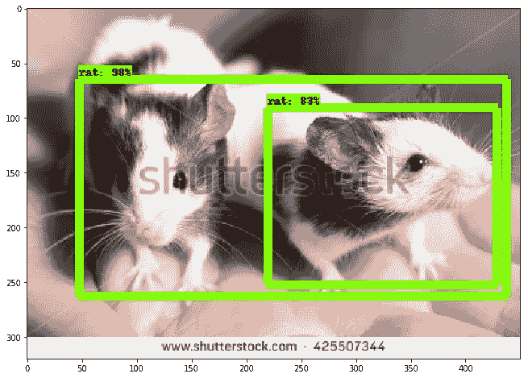

# 第 3 部分，共 3 部分:模型使用—在 Mac 上使用 tensorflow 的对象检测模型进行迁移学习

> 原文：<https://medium.com/coinmonks/part-3-of-3-model-usage-transfer-learning-using-tensorflows-object-detection-model-on-mac-c7a77aa5e0b2?source=collection_archive---------4----------------------->

## 使用 GCloud 机器学习引擎


本部分是[第 1 部分:数据准备](/coinmonks/part-1-2-step-by-step-guide-to-data-preparation-for-transfer-learning-using-tensorflows-object-ac45a6035b7a)和[第 2 部分:建模](/coinmonks/modelling-transfer-learning-using-tensorflows-object-detection-model-on-mac-692c8609be40)的延续。

# 第一步。从 GCP Bucket 下载评估输出和培训输出。

```
# From the directory where you want to copy the files# create local folder for evaluation output
mkdir eval
# copy evaluation output to local folder
gsutil cp gs://vivienne-artifacts/object_detection_rat/eval/* eval/# create local folder for training output
mkdir train
# copy training output to local folder
gsutil cp gs://vivienne-artifacts/object_detection_rat/train/* train/
```

训练输出由每个检查点的`.index`、`.data`和`.meta`文件组成。确保检查点三人组完整。


# 第二步。检查最新的检查点

下载并打开`checkpoint`文件。第一行将显示最新的检查点。这意味着`model.ckpt-20002`是最新的检查站

```
# Checkpoint file contains:model_checkpoint_path: "model.ckpt-20002"
all_model_checkpoint_paths: "model.ckpt-12316"
all_model_checkpoint_paths: "model.ckpt-14794"
all_model_checkpoint_paths: "model.ckpt-17271"
all_model_checkpoint_paths: "model.ckpt-19740"
all_model_checkpoint_paths: "model.ckpt-20002"
```

# 第三步。将模型检查点转换为原型模型

将模型检查点转换为 Protobuf，在我的例子中，我选择了最新的一个。

```
# from /PATH/TO/tensorflow/models/researchpython object_detection/export_inference_graph.py \
    --input_type image_tensor \
    --pipeline_config_path /PATH/TO/ssd_mobilenet_v1_coco.config \
    --trained_checkpoint_prefix /PATH/TO/model.ckpt-20002 \
    --output_directory /PATH/TO/rat_object_detection/vivi_model
```

上面的代码生成了一个包含以下文件的`vivi_model`目录:

```
checkpoint
frozen_inference_graph.pb
model.ckpt.data-00000-of-00001
model.ckpt.index
model.ckpt.meta
pipeline.config
saved_model/saved_model.pb
variables/
```

# 第四步。使用模型进行对象检测

我用[物体检测教程](https://github.com/tensorflow/models/blob/master/research/object_detection/object_detection_tutorial.ipynb)来测试我的模型是否导出正确，是否能检测到老鼠。本教程假设你知道如何使用`jupyter notebooks`。确保您的 jupyter 笔记本运行在您的对象检测项目的虚拟环境中。

```
# How to use your python virtual environment for your jupyter notebookworkon virtualenv_name
pip install ipykernel
ipython kernel install --user --name=virtualenv_name
```

替换`/PATH/TO/tensorflow/models/research/object_detection/test_images`中的图像


Figure 1\. Rat (Shutterstock) 2018


Figure 2\. Rat (Shutterstock) 2018

编辑模型的路径，并标注地图


Figure 3\. Model, and label map paths

运行所有程序，但跳过**下载模型**部分


Figure 4\. Download Model part of object_detection_tutorial.ipynb

以下是示例输入图像的输出


Figure 5\. Output image 1



Figure 6\. Output image 2

同样检查前面的部分: [**第一部分:数据准备**](/coinmonks/part-1-2-step-by-step-guide-to-data-preparation-for-transfer-learning-using-tensorflows-object-ac45a6035b7a) ， [**第二部分:建模**](/coinmonks/modelling-transfer-learning-using-tensorflows-object-detection-model-on-mac-692c8609be40) **。**

谢谢！

# 来源

*   [https://towards data science . com/build-a-Taylor-swift-detector-with-the-tensor flow-object-detection-API-ml-engine-and-swift-82707 F5 b4a 56](https://towardsdatascience.com/build-a-taylor-swift-detector-with-the-tensorflow-object-detection-api-ml-engine-and-swift-82707f5b4a56)
*   [https://medium . com/coin monks/part-1-2-step-by-step-guide-to-data-preparation-for-transfer-learning-using-tensor flows-object-ac45a 6035 b7a](/coinmonks/part-1-2-step-by-step-guide-to-data-preparation-for-transfer-learning-using-tensorflows-object-ac45a6035b7a)
*   [https://medium . com/coin monks/modeling-transfer-learning-using-tensor flows-object-detection-model-on-MAC-692 c 8609 be 40](/coinmonks/modelling-transfer-learning-using-tensorflows-object-detection-model-on-mac-692c8609be40)
*   [https://github . com/tensor flow/models/blob/master/research/object _ detection/object _ detection _ tutorial . ipynb](https://github.com/tensorflow/models/blob/master/research/object_detection/object_detection_tutorial.ipynb)
*   [https://github . com/tensor flow/models/blob/master/research/object _ detection/g3doc/exporting _ models . MD](https://github.com/tensorflow/models/blob/master/research/object_detection/g3doc/exporting_models.md)
*   [https://github.com/tensorflow/models/issues/2714](https://github.com/tensorflow/models/issues/2714)
*   致谢:[http://www . newcastleshow . com . au/WP-content/uploads/2015/01/mouse 1 . jpg](http://www.newcastleshow.com.au/wp-content/uploads/2015/01/mouse1.jpg)，访问日期:2018 年 7 月 8 日
*   shutterstock 2018 年 7 月 8 日
    <[https://www . shutterstock . com/image-photo/funny-white-rat-looking-out-cage-592100393？src = ngjpowhkxggr 3 kzcoykh 2w-1-26](https://www.shutterstock.com/image-photo/funny-white-rat-looking-out-cage-592100393?src=NgjpowHkxggr3KzCoYKH2w-1-26)>
*   shutterstock 2018 年 7 月 8 日
    <[https://www . shutterstock . com/image-photo/two-black-white-rats-on-human-425507344？src = mt 9 S2 gbz 5 rfw 1c cctiu 9 q-1-70](https://www.shutterstock.com/image-photo/two-black-white-rats-on-human-425507344?src=MT9S2CGbz5rFw1cCcTiu9Q-1-70)>