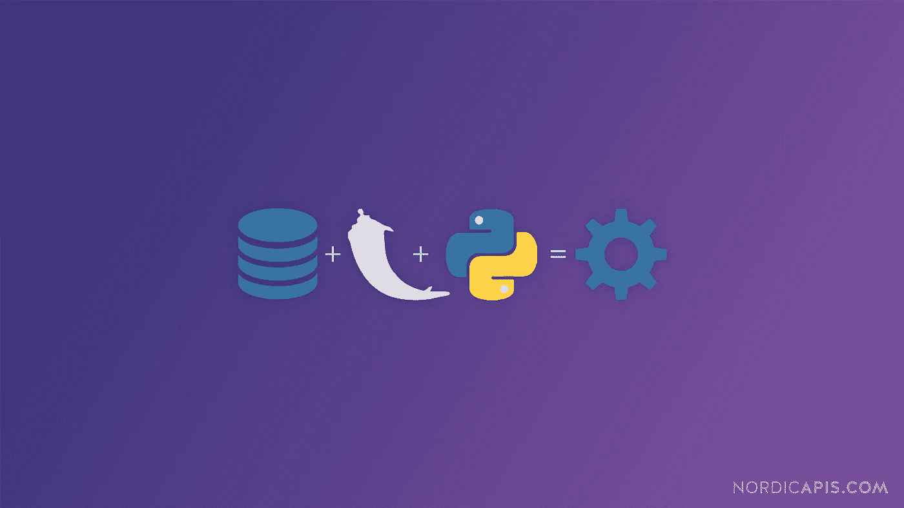

# 如何创建自己的加密货币！！！

> 原文：<https://medium.com/coinmonks/part-4-how-to-create-your-own-cryptocurrency-654b20ffc3a6?source=collection_archive---------4----------------------->

第 4 部分:创建数据库并托管我们的应用程序

欢迎回来，伙计们🤗🤗！！..在我以前的博客中，我们讨论了一些关于区块链的基本介绍，然后是 T2，区块链是如何形成的，最后我们讨论了 T4，区块链的数据几乎不可能改变。错过的人请看看我以前的博客，这样你会喜欢在这里阅读😊😊



pic source [here](https://nordicapis.com/wp-content/uploads/How-To-Create-An-API-From-A-Dataset-Using-Python-and-Flask.png)

好吧，这个博客有什么新内容？我们在这里能学到什么？我们将创建一个数据库来存储数据，并将托管我们的应用程序 woohoo🎉🎉...相信我，这是一个非常简单的任务。让我们进入博客。

# 设置数据库

我使用 MySQL 数据库来存储数据。让我们通过执行下面的命令登录到我们的数据库，这将弹出一个密码，一旦你输入

```
mysql -u root -p
```

密码按回车键开始。现在，您将登录到您的应用程序。让我们执行下面的命令来创建一个新用户。

> 注意:在下面的命令中，用你想要的命令替换<username>、<database_name>和<password>。</password></database_name></username>

```
CREATE USER '<username>'@'%';
```

让我们执行下面的命令，为用户单独授予对特定数据库的权限，并设置密码

```
GRANT ALL PRIVILEGES ON <database_name>.* To '<username>'@'%' IDENTIFIED BY '<password>';
```

**GRANT** -这是用于创建用户和授予数据库、表格等权限的命令。

**所有权限** -这表示用户将拥有所有标准权限。但是，这不包括使用 GRANT 命令的权限。

**<数据库 _ 名称>。*** -这指示 MySQL 在我们指定的整个数据库中应用这些权利。如果希望单独访问某个特定的表，可以用特定的表名替换*号。

**至<用户名>' @ ' % '**-**-**为用户提供权限。

**由“<密码>”**标识——正如您所猜测的，这会为该用户设置密码。

> 在执行上述命令之前，必须使用以下命令创建您将指定的<database_name></database_name>

```
create database <database_name>
```

现在执行下面的命令，让上面的命令生效

```
FLUSH PRIVILEGES;
exit;
```

现在使用我上面提到的命令用<username>和<password>登录。</password></username>

我们已经创建了一个数据库，要使用该数据库，我们必须执行下面的命令，以便当我们创建一个表时，它将在数据库中。

```
use <databasename>
```

让我们创建一个表来存储区块链信息，

```
create table blockchain(number bigint, hash varchar(64), previous varchar(64), data varchar(100), nonce bigint);
```

目前就这些了😅😅！！..

# 托管应用程序

我们将使用 Flask 框架来托管我们的应用程序，所以请在这里阅读。

上面我提到的博客提供了什么是 flask，如何设置环境以及简单 flask 应用的实践经验。

现在，让我们在 blockchain.py 文件所在的主目录下创建一个 app.py 文件，并将下面的代码复制粘贴到其中。

```
from flask import Flask
app = Flask(__name__)[@app](http://twitter.com/app).route("/")
def index():
    return "<h1>Web app hosted</h1>"if __name__ == '__main__':
    app.run(host='0.0.0.0',port=7070,debug = True)
```

正如这里讨论的，我已经使用 Flask 创建了一个简单的 web 应用程序，并在调试模式下将其托管在端口 7070。

现在让我们通过在命令提示符下执行' ***python app.py'*** 来测试我们的应用程序，它将为您提供以下输出

```
$ python app.py
 * Serving Flask app "app" (lazy loading)
 * Environment: production
   WARNING: This is a development server. Do not use it in a production deployment.
   Use a production WSGI server instead.
 * Debug mode: on
 * Running on [http://0.0.0.0:7070/](http://0.0.0.0:7070/) (Press CTRL+C to quit)
 * Restarting with stat
 * Debugger is active!
 * Debugger PIN: 843-354-301
```

如果您在同一台机器上访问，您可以通过 URL[http://localhost:7070](http://localhost:7070/)访问您的服务器，否则通过 http://<IP address>:7070 访问它。

干得好，伙计们，我们已经托管了应用程序。

想要源代码的可以在这里访问更新后的代码[。](https://github.com/AnanthaPerumal/BlockChain)

非常感谢您在我的博客中花费宝贵的时间。请以你认为值得的方式，以 1-50 的比率鼓掌来支持我。如果你对这个博客有任何疑问或改进的建议，请在下面评论并分享给那些想了解区块链的人。

你可以在这里找到下一部分。

关注我，以便在我发布新作品时获得通知。我会给你一些你能理解的简单的东西😉😉。

祝你愉快😊😊

## 另外，阅读

*   最好的[密码交易机器人](/coinmonks/crypto-trading-bot-c2ffce8acb2a)
*   [密码本交易平台](/coinmonks/top-10-crypto-copy-trading-platforms-for-beginners-d0c37c7d698c)
*   最好的[加密税务软件](/coinmonks/best-crypto-tax-tool-for-my-money-72d4b430816b)
*   [最佳加密交易平台](/coinmonks/the-best-crypto-trading-platforms-in-2020-the-definitive-guide-updated-c72f8b874555)
*   最佳[加密贷款平台](/coinmonks/top-5-crypto-lending-platforms-in-2020-that-you-need-to-know-a1b675cec3fa)
*   [最佳区块链分析工具](https://bitquery.io/blog/best-blockchain-analysis-tools-and-software)
*   [加密套利](/coinmonks/crypto-arbitrage-guide-how-to-make-money-as-a-beginner-62bfe5c868f6)指南:新手如何赚钱
*   最佳[加密制图工具](/coinmonks/what-are-the-best-charting-platforms-for-cryptocurrency-trading-85aade584d80)
*   [莱杰 vs 特雷佐](/coinmonks/ledger-vs-trezor-best-hardware-wallet-to-secure-cryptocurrency-22c7a3fd391e)
*   了解比特币的[最佳书籍有哪些？](/coinmonks/what-are-the-best-books-to-learn-bitcoin-409aeb9aff4b)
*   [3 商业评论](/coinmonks/3commas-review-an-excellent-crypto-trading-bot-2020-1313a58bec92)
*   [AAX 交易所评论](/coinmonks/aax-exchange-review-2021-67c5ea09330c) |推荐代码、交易费用、利弊
*   [Deribit 审查](/coinmonks/deribit-review-options-fees-apis-and-testnet-2ca16c4bbdb2) |选项、费用、API 和 Testnet
*   [FTX 密码交易所评论](/coinmonks/ftx-crypto-exchange-review-53664ac1198f)
*   [n 零审核](/coinmonks/ngrave-zero-review-c465cf8307fc)
*   [Bybit 交换审查](/coinmonks/bybit-exchange-review-dbd570019b71)
*   3Commas vs Cryptohopper
*   最好的比特币[硬件钱包](/coinmonks/the-best-cryptocurrency-hardware-wallets-of-2020-e28b1c124069?source=friends_link&sk=324dd9ff8556ab578d71e7ad7658ad7c)
*   最佳 [monero 钱包](https://blog.coincodecap.com/best-monero-wallets)
*   [莱杰纳米 s vs x](https://blog.coincodecap.com/ledger-nano-s-vs-x)
*   [bits gap vs 3 commas vs quad ency](https://blog.coincodecap.com/bitsgap-3commas-quadency)
*   [莱杰 Nano S vs 特雷佐 one vs 特雷佐 T vs 莱杰 Nano X](https://blog.coincodecap.com/ledger-nano-s-vs-trezor-one-ledger-nano-x-trezor-t)
*   [block fi vs Celsius](/coinmonks/blockfi-vs-celsius-vs-hodlnaut-8a1cc8c26630)vs Hodlnaut
*   Bitsgap 评论——一个轻松赚钱的加密交易机器人
*   为专业人士设计的加密交易机器人
*   [PrimeXBT 审查](/coinmonks/primexbt-review-88e0815be858) |杠杆交易、费用和交易
*   [埃利帕尔泰坦评论](/coinmonks/ellipal-titan-review-85e9071dd029)
*   [赛克斯石评论](https://blog.coincodecap.com/secux-stone-hardware-wallet-review)
*   [BlockFi 评论](/coinmonks/blockfi-review-53096053c097) |从您的密码中赚取高达 8.6%的利息