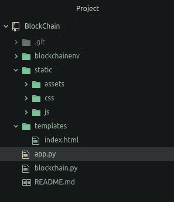
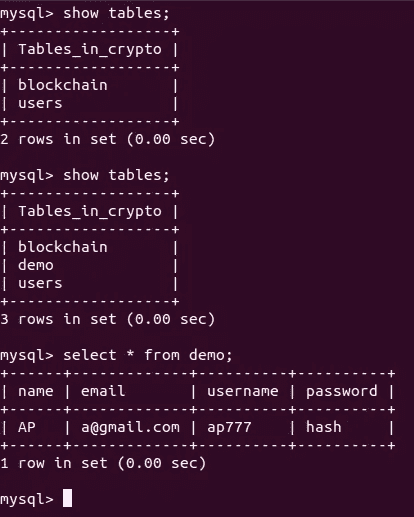

# 如何创建自己的加密货币！！！

> 原文：<https://medium.com/coinmonks/part-5-how-to-create-your-own-cryptocurrency-e05efaf067ec?source=collection_archive---------10----------------------->

## 第 5 部分:登录页面和数据库访问

欢迎回来，伙计们🤗🤗…在我以前的博客中，我们讨论了一些关于区块链的基本介绍，然后讨论了区块链是如何形成的，然后讨论了区块链的数据几乎不可能被改变，最后，我们讨论了用 flask 托管我们的应用的。那些错过的人请看看我以前的博客，这样你会喜欢在这里阅读😊😊。


pic source [here](https://www.google.com/url?sa=i&url=https%3A%2F%2Fwww.bmc.com%2Fblogs%2Fdbms-database-management-systems%2F&psig=AOvVaw1kdw3De6Vduzy6Gu9FbZ2C&ust=1612502711864000&source=images&cd=vfe&ved=0CAIQjRxqFwoTCKjR9u--z-4CFQAAAAAdAAAAABAJ)

我们的下一步是什么？我们将在这个博客中为我们的应用程序提供数据库访问💥💥并通过登录和注册页面将登录页面呈现给我们的应用程序，因此我设计了一个简单的登录页面，其中包含登录和注册选项。**这里有一个演示**[](https://cryptocurrency-landing-page.herokuapp.com/)****😍😍！！****

****在[之前的博客](/coinmonks/part-4-how-to-create-your-own-cryptocurrency-654b20ffc3a6)中，我们将网页硬编码为“<h1>Web app hosted</h1>”，推荐的方式是设计你的页面并渲染该页面。为了渲染，我们需要使用 ***flask*** 包中的***render _ template***函数，因此用下面的代码修改 *app.py* 中的代码来渲染一个网页。****

```
**from flask import Flask, render_template
def index():
    return render_template('index.html')**
```

****你需要在 index.html 文件中设计你的网页(你可以在这里 访问我的网页 [***)。Flask 需要将您的文件放在一个有定义名称的文件夹下，因此请遵循下面的文件夹命名。***](https://cryptocurrency-landing-page.herokuapp.com/)****

********

****Project Structure****

****约定是 render_template 中给定的文件必须在 *templates 文件夹*下，而 CSS、JS、images 等其他文件应该放在 static 文件夹下，并且应该在 href/src 中引用为“ *{{ url_for('static '，filename = '【T48]path>')} }”。*****

****执行命令 ***python app.py*** 可以看到你的网页渲染在 [http://localhost:7070](http://localhost:7070) 😎😎****

****让我们拿起动手键盘，我们将把 flask 应用程序与 MySQL 数据库连接起来💾为了连接，我们需要将一个包安装到我们的虚拟环境中。在终端执行下面的命令来安装' ***Flask-MySQLdb*** '。****

```
**pip install Flask-MySQLdb**
```

****我在 *app.py* 中添加了下面的代码来设置 MySQL 属性****

```
**app.config['MYSQL_HOST'] = 'localhost'
app.config['MYSQL_USER'] = 'root'
app.config['MYSQL_PASSWORD'] = ''
app.config['MYSQL_DB'] = 'crypto'
app.config['MYSQL_CURSORCLASS'] = 'DictCursor'mysql = MySQL(app)**
```

****在[之前的博客](/coinmonks/part-4-how-to-create-your-own-cryptocurrency-654b20ffc3a6)中，我们已经创建了一个表*‘区块链’*用于存储区块。同样，我们将通过执行以下命令来创建一个表，用于存储关于用户的信息。****

```
**use crypto; //remember to switch to our database
create table users (name varchar(30), email varchar(30), username varchar(30), password varchar(100));**
```

****让我们组织我们的代码，因此我们将有一个单独的文件*‘SQL helpers . py’*来维护数据库相关的功能。用下面的代码更新 sqlhelpers.py。****

****sqlhelpers.py****

****最后，我们的带有数据库访问的 app.py 将看起来像这样😍😍****

****app.py****

****因此，访问我们的应用程序将创建一个新表' *demo* '并在其中插入一个虚拟值。****

********

****Output Screenshot****

****上图解释了在访问 application @[http://localhost:7070](http://localhost:7070)后，最初没有名为“demo”的表，创建了一个新表，并填充了一些值。****

****干得好，伙计们，我们已经授予数据库访问我们的应用程序。****

****想要源代码的可以在这里访问更新后的代码[。](https://github.com/AnanthaPerumal/BlockChain)****

****非常感谢您在我的博客中花费宝贵的时间。请以你认为值得的方式，以 1-50 的比率鼓掌来支持我。如果你对这个博客有任何疑问或改进的建议，请在下面评论并分享给那些想了解区块链的人。****

****请继续关注下一部分，因为它将会更加有趣。你可以在这里找到下一部分的链接，当它出版的时候，或者跟随我得到通知。我会给你一些你能理解的简单的东西😉😉。****

****祝你愉快😊😊****

> ****加入 T21 电报集团，学习加密交易和投资****

## ****另外，阅读****

*   ****什么是[闪贷](https://blog.coincodecap.com/what-are-flash-loans-on-ethereum)？****
*   ****最好的[密码交易机器人](/coinmonks/crypto-trading-bot-c2ffce8acb2a) | [网格交易](https://blog.coincodecap.com/grid-trading)****
*   ****[3 商业评论](/coinmonks/3commas-review-an-excellent-crypto-trading-bot-2020-1313a58bec92) | [Pionex 评论](/coinmonks/pionex-review-exchange-with-crypto-trading-bot-1e459d0191ea) | [Coinrule 评论](https://blog.coincodecap.com/coinrule-review-a-perfect-trading-bot)****
*   ****[AAX 交易所评论](/coinmonks/aax-exchange-review-2021-67c5ea09330c) | [德里比特评论](/coinmonks/deribit-review-options-fees-apis-and-testnet-2ca16c4bbdb2) | [FTX 密码交易所评论](/coinmonks/ftx-crypto-exchange-review-53664ac1198f)****
*   ****[n 零审核](/coinmonks/ngrave-zero-review-c465cf8307fc)****
*   ****[Bybit Exchange 审查](/coinmonks/bybit-exchange-review-dbd570019b71) | [Bityard 审查](https://blog.coincodecap.com/bityard-reivew)|[inter tax 审查](https://blog.coincodecap.com/interdax-review)****
*   ****3Commas vs Cryptohopper****
*   ****最好的比特币[硬件钱包](/coinmonks/the-best-cryptocurrency-hardware-wallets-of-2020-e28b1c124069?source=friends_link&sk=324dd9ff8556ab578d71e7ad7658ad7c) | [BitBox02 回顾](/coinmonks/bitbox02-review-your-swiss-bitcoin-hardware-wallet-c36c88fff29)****
*   ****[莱杰 vs n rave](https://blog.coincodecap.com/ngrave-vs-ledger)|[莱杰 nano s vs x](https://blog.coincodecap.com/ledger-nano-s-vs-x)****
*   ****[密码拷贝交易平台](/coinmonks/top-10-crypto-copy-trading-platforms-for-beginners-d0c37c7d698c) | [比特码拷贝交易](https://blog.coincodecap.com/bityard-copy-trading)****
*   ****[Vauld 审查](https://blog.coincodecap.com/vauld-review) | [YouHodler 审查](/coinmonks/youhodler-4-easy-ways-to-make-money-98969b9689f2) | [BlockFi 审查](/coinmonks/blockfi-review-53096053c097)****
*   ****最好的[加密税务软件](/coinmonks/best-crypto-tax-tool-for-my-money-72d4b430816b) | [硬币追踪评论](/coinmonks/cointracking-review-a-reliable-cryptocurrency-tax-software-5114e3eb5737)****
*   ****最佳[加密贷款平台](/coinmonks/top-5-crypto-lending-platforms-in-2020-that-you-need-to-know-a1b675cec3fa)****
*   ****[莱杰纳米 S vs 特雷佐 1 vs 特雷佐 T vs 莱杰纳米 X](https://blog.coincodecap.com/ledger-nano-s-vs-trezor-one-ledger-nano-x-trezor-t)****
*   ****[BlockFi vs 摄氏](/coinmonks/blockfi-vs-celsius-vs-hodlnaut-8a1cc8c26630) | [Hodlnaut 回顾](https://blog.coincodecap.com/hodlnaut-review)****
*   ****[Bitsgap 审查](/coinmonks/bitsgap-review-a-crypto-trading-bot-that-makes-easy-money-a5d88a336df2) | [四种货币审查](/coinmonks/quadency-review-a-crypto-trading-automation-platform-3068eaa374e1)****
*   ****[埃利帕尔泰坦评论](/coinmonks/ellipal-titan-review-85e9071dd029) | [赛克斯斯通评论](https://blog.coincodecap.com/secux-stone-hardware-wallet-review)****
*   ****[DEX Explorer](https://explorer.bitquery.io/ethereum/dex) 和[区块链 API](https://explorer.bitquery.io/graphql)****
*   ****[最佳区块链分析工具](https://bitquery.io/blog/best-blockchain-analysis-tools-and-software)****
*   ****[加密套利](/coinmonks/crypto-arbitrage-guide-how-to-make-money-as-a-beginner-62bfe5c868f6)指南:新手如何赚钱****
*   ****最佳[加密制图工具](/coinmonks/what-are-the-best-charting-platforms-for-cryptocurrency-trading-85aade584d80) | [最佳加密交易所](https://blog.coincodecap.com/crypto-exchange)****
*   ****了解比特币的[最佳书籍有哪些？](/coinmonks/what-are-the-best-books-to-learn-bitcoin-409aeb9aff4b)****

> ****[直接在您的收件箱中获得最佳软件交易](/coinmonks/newsletters/coinmonks)****

****[](https://medium.com/coinmonks/newsletters/coinmonks)****