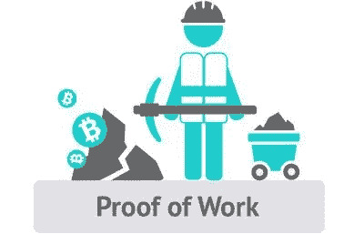

# 第 5 部分:用 PoW 共识算法实现区块链和加密货币

> 原文：<https://medium.com/coinmonks/part-5-implementing-blockchain-and-cryptocurrency-with-pow-consensus-algorithm-a7f8853d23dc?source=collection_archive---------2----------------------->

在 node.js 中使用工作共识算法证明，小规模、易于理解、全面、逐步实施区块链和加密货币



Source: [Bitcoin Wiki](https://en.bitcoinwiki.org/wiki/Proof-of-work)

在[之前的文章](/coinmonks/part-4-implementing-blockchain-and-cryptocurrency-with-pow-consensus-algorithm-9201eb7e8a41)中，我们创建了一个 p2p 服务器来创建一个分散的网络并发送数据。我们还添加了将链更新为最长链的功能。

在这篇文章中，我们将改进我们的工作证明算法，并实现 nonce 和难度的概念。

现在，我们将完成我们的工作证明算法，并为其添加更多功能。之前，我们刚刚添加了创建新块和链接先前块的链的功能。在这里，我们将添加所谓的 nonce 和困难。

简单回顾一下，工作系统的证明是这样的，

对于难度= 6 的区块链中的块，块的散列应该具有等于难度的前导零。

前导零等于难度的哈希是有效的哈希。

为了生成新的散列，我们需要改变块中的一些值，以给出与以前不同的相应散列。为此，块中有一个名为 nonce 的变量。

随机数与块数据一起用于生成新的块哈希，也存储在块中。挖掘器必须调整或增加随机数，并再次生成哈希，直到我们得到前导数字为 0 的哈希。

这需要巨大的计算能力。这就是所谓的挖矿。

如果我们降低难度，挖掘时间也会减少。比特币使用了动态难度的概念，即根据上一个区块调整当前区块的难度。

让我们从在 block.js 文件中实现 nonce 值开始。

在块的`constructor()`和`toString()`函数中添加随机数，在`hash()`和`blockHash()`函数中也添加随机数。最后，我们将在 genesis 函数中添加一个默认的 nonce 值 0。

让我们在`mineBlock()`中做些改变，这里我们将创建一个局部变量 nonce，并持续计算块哈希，直到前导零与难度匹配。

现在，为了访问难点，我们将使用一个 `const DIFFICULTY`变量，并将其设置为 4。

现在让我们将循环添加到我们的`mineBlock()`函数中。

```
static mineBlock(lastBlock,data){let hash;let timestamp;const lastHash = lastBlock.hash;let { difficulty } = lastBlock;let nonce = 0;//generate the hash of the blockdo {nonce++;timestamp = Date.now();hash = Block.hash(timestamp,lastHash,data,nonce);// checking if we have the required no of leading number of zeros} while(hash.substring(0,DIFFICULTY) !== '0'.repeat(DIFFICULTY));return new this(timestamp,lastHash,hash,data,nonce);}
```

好吧。

现在我们将编写一些代码来实现动态难度。我们可以通过降低当前块的难度来实现这一点。如果生成该块所用的时间超过了某个特定的时间，类似地，对于相反的情况，我们将增加它。

为了检查之前的块生成是快还是慢，我们将创建一个名为`MINE_RATE`的常数，它是创建块所需的额外时间(以毫秒为单位)。把这当作一个门槛。

为了保持代码的整洁，让我们将两个常量移到一个`config.js` 文件中，并要求它们进入`block.js`文件。

由于我们需要访问前一个块的难度，我们将在构造函数中添加一个默认值为`DIFFICULTY`的难度，然后在`toString()`、`hash()`和`blockHash()`函数中添加难度。

我们将在 mineBlock()函数中使用最后一个块的难度，并根据这个难度和时间戳调整难度。

```
let { difficulty } = lastBlock;
```

为了调整难度，我们将调用函数`adjustDifficulty(difficulty,currentTime)`，它将返回一个新的调整后的难度。因此，每次生成新的散列时，我们都必须不断地调用这个函数。因为当我们生成一个新的散列时，时间戳也会改变，所以我们也必须在我们的`timestamp` 变量中获得一个新的时间。

dynamic difficulty

这是最终的矿块功能的样子

the mine function

总而言之，如果前一个块的生成花费了很多时间，那么我们的下一个块将会很快生成。此外，我们已经快速计算了前一个区块，我们当前的区块将需要更多的时间。

让我们通过制作一些测试案例来测试我们的现时性和难度。将这些添加到 block.test.js 中

如果你运行这些测试，你将有 12 个测试通过。

请注意，这一次测试将比以前运行得慢，这是由于我们刚刚实现的挖掘。

The block class

非常酷！

我们已经完成了工作算法的验证。

在下一篇文章中，我们将在区块链中添加事务和事务池。

[第六部分:用 PoW 共识算法实现区块链和加密货币](/coinmonks/part-6-implementing-blockchain-and-cryptocurrency-with-pow-consensus-algorithm-87b274e86ce4)

*感谢您的阅读。* ***在下一部分中，我们将为事务创建一个类，并创建一个事务池来存储这些事务。*** *希望你喜欢编码。如果你发现这很有帮助，请鼓掌。*

如果你对区块链、以太坊或整个世界有任何问题，请发表评论。:)

> [直接在您的收件箱中获得最佳软件交易](https://coincodecap.com/?utm_source=coinmonks)

[](https://coincodecap.com/?utm_source=coinmonks)