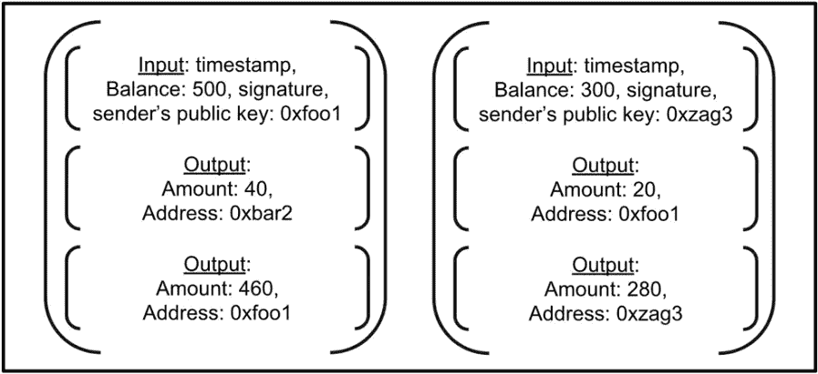

# 第 6 部分:用 PoW 共识算法实现区块链和加密货币

> 原文：<https://medium.com/coinmonks/part-6-implementing-blockchain-and-cryptocurrency-with-pow-consensus-algorithm-87b274e86ce4?source=collection_archive---------0----------------------->

在 node.js 中使用工作共识算法证明，小规模、易于理解、全面、逐步实施区块链和加密货币


Source: [Bitcoin Wiki](https://en.bitcoinwiki.org/wiki/Proof-of-work)

到目前为止，我们已经创建了我们的区块链和 p2p 服务器，这就完成了区块链。在这一部分，我们将创建事务。

接下来，我们将在刚刚创建的区块链上制作一种加密货币。还记得块中的数据字段吗？这就是交易进行的地方。

为了创造一种加密货币，我们需要一个钱包。钱包将有两个密钥，即公钥和一个对应的私钥。公钥/私钥对是不对称加密的一部分，我们将使用它来创建数字签名。

数字签名允许用户验证创建区块和交易的矿工。一旦使用私钥对数据进行了签名/加密，就只能使用公钥对其进行验证/解密。

*注意:公钥是网络已知的，私钥是矿工私有的。*

在我们继续之前，让我们了解一下区块链中的事务是如何工作的。

交易是脚本的集合，指示哪个人向谁发送多少钱。

在区块链，事务主要有两个脚本，输入脚本和输出脚本。

输入脚本包括时间戳、发送者的余额和发送者的公钥。

输出脚本包括我们希望发送给发送者的金额和发送者的公钥



A basic transaction

在这个图中，我们在左边有一个交易，发送方 0xfoo1 有一个余额 500，发送 40 到 0xbar2。但是还有另一个输出脚本，它是针对发送者本身的。注意，输出脚本中的金额总和等于输入脚本中提到的余额。这里真正发生的是，发送者将他所有的货币发送到一个交易中，交易的一部分，即第一个输出脚本到达接收者，第二个返回发送者。最初，他可能会发送他的全部余额，但后来他会收到与他发送的差额相等的货币。

Miner 使用这些输出脚本来确定自己的余额，然后使用更新后的余额来创建新的输入脚本。

使用这些输出脚本，可以验证输入脚本中矿工的平衡是否正确。他们只需将输出脚本中的金额相加，并与输入脚本中的金额进行比较。

好吧，让我们创建一个钱包。

在根目录中创建一个单独的文件夹 wallet，并添加一个`index.js`文件，我们将在其中创建我们的 wallet 类。

我们的钱包将有 3 个主要属性，余额、密钥对和公钥。测试我们的应用程序将从 500 英镑的初始余额开始。为了简洁地做到这一点，让我们在`config.js`中添加一个常量，并将其命名为`INITIAL_BALANCE`，并在我们的 wallet 类中要求这样做。

## 钱包

The wallet

为了创建一个密钥对(公钥和私钥),我们将使用一个叫做椭圆的模块。让我们安装它。

```
npm i elliptic --save
```

让我们在根目录下创建一个名为`chain-util.js`的新文件，它将保存与加密货币相关的函数。我们将使用刚刚安装的这个模块，我们将在我们的应用程序中使用基于`ec`曲线的算法。所以在 chainUtil.js 中需要来自椭圆的 ec 算法，并使用`secp256k1`创建一个实例，因为比特币使用的是相同的。

```
const EC = require('elliptic').ec;
const ec = new EC('secp256k1');// secp256k1 is the algorithm to generate key pair
```

让我们在`chainUtil` 类中创建一个函数，我们将在应用程序中使用它来生成密钥对。

```
class ChainUtil{static genKeyPair(){
        return ec.genKeyPair();
    }
}module.exports = ChainUtil;
```

现在我们可以在我们的 wallet 类中使用这个函数，并使用`getPublic()`函数来获取 public 并将它编码成十六进制格式。

```
this.keyPair = ChainUtil.genKeyPair();this.publicKey = this.keyPair.getPublic().encode('hex');
```

每笔交易都需要一个唯一的 id。为了生成这些唯一的数字，我们将使用一个名为`uuid`的模块

```
npm i uuid --save
```

让我们在 chain-util.js 文件中创建这个模块的一个实例。

```
const uuidV1 = require('uuid/v1');// version 1 use timestamp to generate unique ids
```

让我们创建一个函数来生成 id。

```
static id(){
        return uuidV1();
}
```

好吧。有了惟一的 id，我们现在可以创建我们的事务类。

让我们在 wallet 目录中创建一个文件 transaction.js。我们需要一个 chainUtil 类的实例。

我们将用 id、输入和输出作为属性进行类事务。

```
const ChainUtil = require('../chain-util');class Transaction{
    constructor(){
        this.id = ChainUtil.id();
        this.input = null;
        this.outputs = [];
    }
}module.exports = Transaction;
```

输入将是一个对象，输出可以是多个，所以它的对象数组。

让我们创建一个函数来创建一个事务。这个函数将接收发送者的钱包实例、发送的金额和接收者的地址。

它将检查发送方是否有足够的余额，然后在输出数组中推送一个输出脚本。输出脚本将包含收款人的金额和地址。

```
static newTransaction(senderWallet,recipient,amount){if(amount > senderWallet.balance){
            console.log(`Amount : ${amount} exceeds the balance`);
            return;
        }// call to the helper function that creates and signs the
// transaction outputsreturn transaction.outputs.push(...[
            {amount: senderWallet.balance -amount,address:
             senderWallet.publicKey},
            {amount: amount,address: recipient}
        ]);
}
```

我们的事务现在需要一个输入对象。我们将使用 wallets 密钥对对交易进行签名，并将签名和其他相关信息一起添加到输入对象中。

让我们在`wallet/index.js`文件中添加一个符号函数

```
sign(dataHash){return this.keyPair.sign(dataHash);}
```

当我们创建一个新的事务时，我们将在`transaction.js`文件中使用这个函数。让我们在 transaction 类中添加一个名为`signTransaction()`的函数。该函数将获取 transaction 和 senders wallet 的实例，并在 transaction 中创建一个签名输入。

请注意，我们多次使用散列函数。我们可以将其抽象成 chain-util.js，使我们的代码更加可重用。让我们在`chainUtil`中创建一个`hash(data)`函数并使用它，而不是直接使用`SHA256`

```
static hash(data){ return SHA256(JSON.stringify(data)).toString();}
```

让我们也在 block.js 文件中进行这些更改。

好的，接下来我们将在 transaction.js 中创建`signTransaction(senderWallet,transaction)`函数

现在在`newTranasaction()`函数中，我们可以用参数调用`signTransaction()`作为当前交易和发送者的钱包。

我们还需要验证交易真实性的功能。

让我们创建一个验证事务函数，它将验证事务的散列和数字签名。

为了验证一个签名，我们需要使用公钥解密它。`ec`内置了这一功能。让我们在 chainUitl 类中创建一个函数 verifySignature()，我们稍后将使用它。

```
static verifySignature(publicKey,signature,dataHash){return ec.keyFromPublic(publicKey,'hex').verify(dataHash,signature);}
```

现在，在 Transaction 类中，让我们创建一个名为`verifyTransaction()`的函数，其中我们将使用刚刚创建的 verifySignature 函数。

酷毙了。

我们还有一件事要做。想象一个场景，您在系统中进行了一个事务，但是它还没有被发送或添加到一个块中(*这意味着它存在于事务池中)。与此同时，你与其他人进行了另一笔交易，但这次你创建了一笔不同的交易。请注意，我们已经有一个尚未发送的事务，我们可以通过更新输出和重新生成签名来优化流程。*

现在，我们将创建一个 update()函数，该函数将找到发送者的输出，更新金额，创建一个新的输出，并对更新后的事务进行签名。

太棒了。

这是我们到目前为止创建的 transaction.js 文件。

让我们测试一下我们的钱包和交易。在 wallet 目录中创建一个 transaction . test . js 文件，并添加一些测试用例。

运行 jest 测试运行程序，现在您将看到 20 个测试通过。厉害！

我们已经在我们的区块链中实现了事务。

在下一篇文章中，我们将在区块链中添加事务池。

[第七部分:用 PoW 共识算法实现区块链和加密货币](/coinmonks/part-7-implementing-blockchain-and-cryptocurrency-with-pow-consensus-algorithm-bf9a16063ec1)

*感谢您的阅读。* ***在下一部分中，我们将为事务轮询创建一个类，在其中存储所有尚未添加到块中的事务。*** *希望你喜欢编码。* ***如果你发现这很有帮助，请鼓掌。***

如果你对区块链、以太坊或整个世界有任何问题，请发表评论。:)

> [在您的收件箱中直接获得最佳软件交易](https://coincodecap.com/?utm_source=coinmonks)

[](https://coincodecap.com/?utm_source=coinmonks)