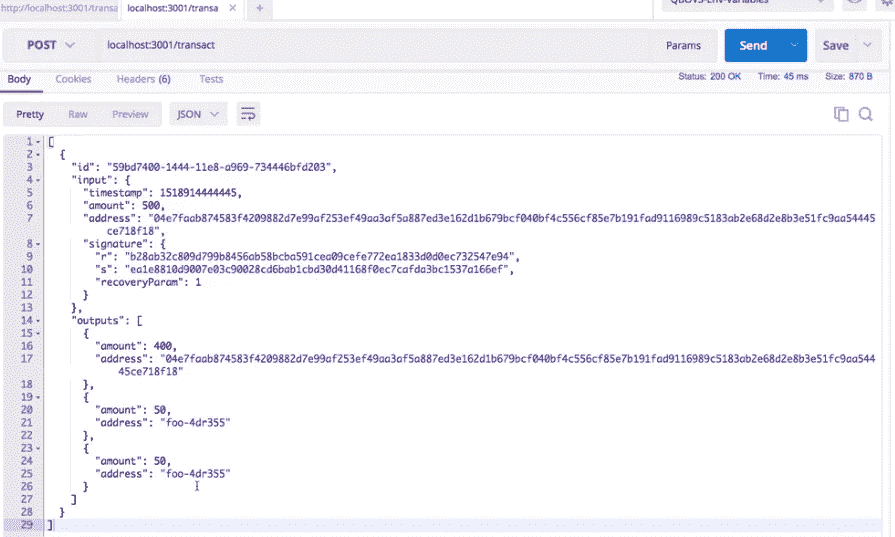

# 第 7 部分:用 PoW 共识算法实现区块链和加密货币

> 原文：<https://medium.com/coinmonks/part-7-implementing-blockchain-and-cryptocurrency-with-pow-consensus-algorithm-bf9a16063ec1?source=collection_archive---------1----------------------->

在 node.js 中使用工作共识算法证明，小规模、易于理解、全面、逐步实施区块链和加密货币


Source: [Bitcoin Wiki](https://en.bitcoinwiki.org/wiki/Proof-of-work)

在[之前的帖子](/coinmonks/part-6-implementing-blockchain-and-cryptocurrency-with-pow-consensus-algorithm-87b274e86ce4)中，我们创建了事务。在现实生活中，区块链系统是不同步的，因此矿工将在不同的时间收到交易。我们需要一个地方来存储这些事务，直到我们创建一个块或者一个新的块被添加到链中。这就是为什么我们的系统中有事务池。

由于多个个人使用他们的钱包在加密货币上创建交易，因此需要一种方法来包含这些交易的组，我们现在将使用交易池的概念。事务池将是一个实时更新的对象，包含网络中所有挖掘者提交的所有新事务。

用户将创建事务，然后将每个事务提交到池中。池中出现的这些新交易将被视为未确认交易。

挖掘器从该池中取出一组事务，并创建块，使事务得到确认。

为了更新我们的事务池，我们将使用我们创建的 p2p 服务器，并向网络广播事务。当我们收到新的交易时，我们会将其添加到我们的池中。

但是首先，让我们在 wallet 目录中创建一个文件`transaction-pool.js`并创建一个`TransactionPool`类。

这个类只有一个属性事务数组。

```
this.transactions = [];
```

让我们向池中添加一些方法。

首先，让我们添加一个方法来添加事务。请注意，我们可能会收到池中已经存在的交易，因此我们也需要事先进行检查。我们收到的交易也可能被更新，即输出脚本被更改，因此我们也将处理这种情况。

创建一个函数，`updateOrAddTransaction(transaction)`这个方法将检查事务是否已经存在。如果是，它将在检查输入 id 并添加新的输出(如果有)后用新的事务替换该事务。如果事务不存在，它会简单地将事务添加到池中

我们现在结合几个概念。

让我们创建一个函数来创建一个新的交易，使用我们的 wallet 对其进行签名，并将其添加到我们的交易池中。我们将使用上面创建的所有函数。如果任何事务已经存在，该函数也应该更新事务。

让我们在 wallet 类中创建一个`createTransaction()`函数来完成这项工作，因为我们需要更新事务池，我们需要在 wallet 构造函数中有一个事务池实例。

为了使我们的代码简洁，创建一个函数`existingTransaction(address)`,它将检查给定地址是否存在事务。

```
existingTransaction(address){return this.transactions.find(t => t.input.address === address);}
```

让我们制作`createTransaction()`函数

最后，让我们添加一些测试来确保一切正常。

让我们测试我们的事务池

现在让我们测试一下我们的钱包

运行测试，您将有 24 个测试通过。

太棒了。

我们将在主应用程序中使用我们的钱包和交易池。

在 app/index.js 文件中，创建一个 wallet 实例和一个`transactionPool`实例。

```
const Wallet = require('../wallet');const TransactionPool = require('../wallet/transaction-pool');// create a new walletconst wallet = new Wallet();// create a new transaction pool which will be later// decentralized and synchronized using the peer to peer serverconst transactionPool = new TransactionPool();
```

现在创建一个 get 端点 `‘/transactions’`

```
// api to view transaction in the transaction poolapp.get('/transactions',(req,res)=>{res.json(transactionPool.transactions);});
```

运行应用程序并打开 postman

```
npm run dev
```

点击 API，您将得到一个空数组作为响应，这正是我们所期望的。

让我们创建一个 post 请求 `‘/transact’` 来创建一个新的事务

```
// create transactionsapp.post('/transact',(req,res)=>{const { recipient, amount } = req.body;const transaction = wallet.createTransaction(
                                  recipient,
                                  amount,
                                  blockchain,
                                  transactionPool);res.redirect('/transactions');});
```

在 postman 中用收件人的地址和金额< 500 测试这个 API，点击几次 send，您将得到一个交易列表，作为一个非常令人满意的响应。



The Transaction

太棒了。

现在我们可以创建事务了，让我们编写代码将事务广播到网络。我们将把事务池添加到 p2p 服务器中。

在`P2server`类中，我们将在其构造函数中添加另一个属性，即事务池实例。

```
constructor(blockchain,transactionPool){ this.blockchain = blockchain; this.sockets = []; this.transactionPool = transactionPool;}
```

我们还需要更新我们在 app/index.js 文件中创建的实例，并将`transactioPool` 实例传递给`p2pserver` 实例。

```
const p2pserver = new P2pserver(blockchain,transactionPool);
```

现在让我们创建一个方法来处理 p2pserver 类中的事务。该方法将非常类似于我们现在已经拥有的同步链功能，该功能同步连接到该应用程序套接字的每个人的链。

为了处理多种消息类型，我们将在 p2pserver 类中创建一个对象 MESSAGE_TYPE。

```
const MESSAGE_TYPE = {chain: 'CHAIN',transaction: 'TRANSACTION'}
```

每当创建新的事务时，该方法都会将事务发送到每个连接的套接字。

所以，让我们在 p2pserver 类中创建一个函数`broadcastTransaction(transaction)`。这个函数将把事务发送到每个套接字。为了保持代码的整洁，我们可以创建另一个名为`sendTransaction(socket,transaction)`的函数，只向单个套接字发送一个事务，并为每个套接字调用这个函数。

类似地，我们也将使用 MESSAGE_TYPEs 来发送链。所以也更新一下`sendChain` 功能。

```
sendChain(socket){ socket.send(JSON.stringify({ type: MESSAGE_TYPE.chain, chain: this.blockchain.chain}));}
```

好了，现在我们可以广播新的交易了。让我们也编写代码来处理发送给我们的事务。

由于我们有不同类型的消息，我们需要不同地处理它们，而不是创建多个函数，我们将使用 switch 语句来根据消息类型选择句柄。

在我们的消息处理程序中，对于作为数据的链，我们将调用`replaceChain` 函数，对于作为事务的数据，我们将调用`updateOrAddTransaction` 函数。

然后，我们将这个消息处理程序注册到每个套接字

```
connectSocket(socket){ this.sockets.push(socket); console.log("Socket connected"); this.messageHandler(socket); this.sendChain(socket);}
```

最后，我们将在 API 中使用广播事务函数。当我们在 API 中创建新的事务时，我们将调用`broadcastTransaction` 函数。

```
app.post('/transact',(req,res)=>{const { recipient, amount } = req.body;const transaction = wallet.createTransaction(recipient,
            amount,blockchain,transactionPool);p2pserver.broadcastTransaction(transaction);res.redirect('/transactions');});
```

现在，事务实际上将在网络上广播，我们的消息处理程序将把它们添加到事务池中。

您可以通过打开两个终端并运行两个应用程序实例来测试这一点。在其中一个终端中创建一组事务，然后我们将点击另一个应用程序实例的 get transactions 端点。

你会看到交易实际上正在向网络广播。

通过为第三个实例创建事务来测试功能，并使用第一个实例的端点来查看这些事务。

太好了。现在，我们可以创建事务，将它们存储到事务池中，并向网络广播事务。

在下一篇文章中，我们将创建 miner 类。此外，我们还将实现 miner 因创建块而获得的奖励。

[第八部分:用 PoW 共识算法实现区块链和加密货币](/coinmonks/part-8-implementing-blockchain-and-cryptocurrency-with-pow-consensus-algorithm-74e839158f1b)

*感谢您的阅读。在下一部分中，我们将为矿工创建一个类，在这个类中，我们将使用到目前为止已经创建的所有功能，并且还将添加奖励的概念。* *希望你喜欢编码。如果你发现这很有帮助，请鼓掌。*

如果你对区块链、以太坊或整个世界有任何问题，请发表评论。:)

> [直接在您的收件箱中获得最佳软件交易](https://coincodecap.com/?utm_source=coinmonks)

[](https://coincodecap.com/?utm_source=coinmonks)