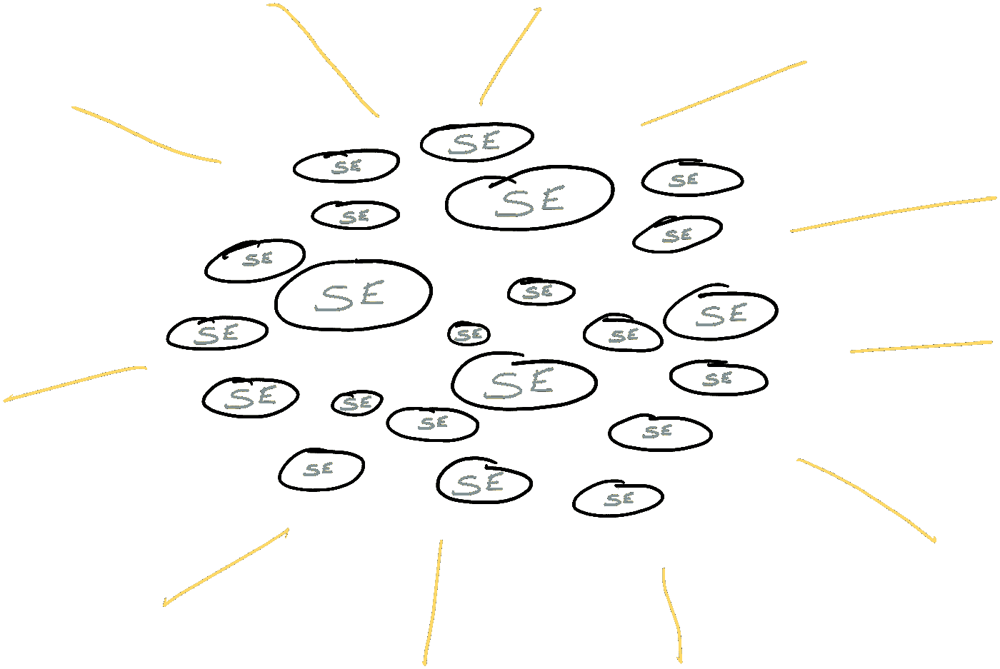
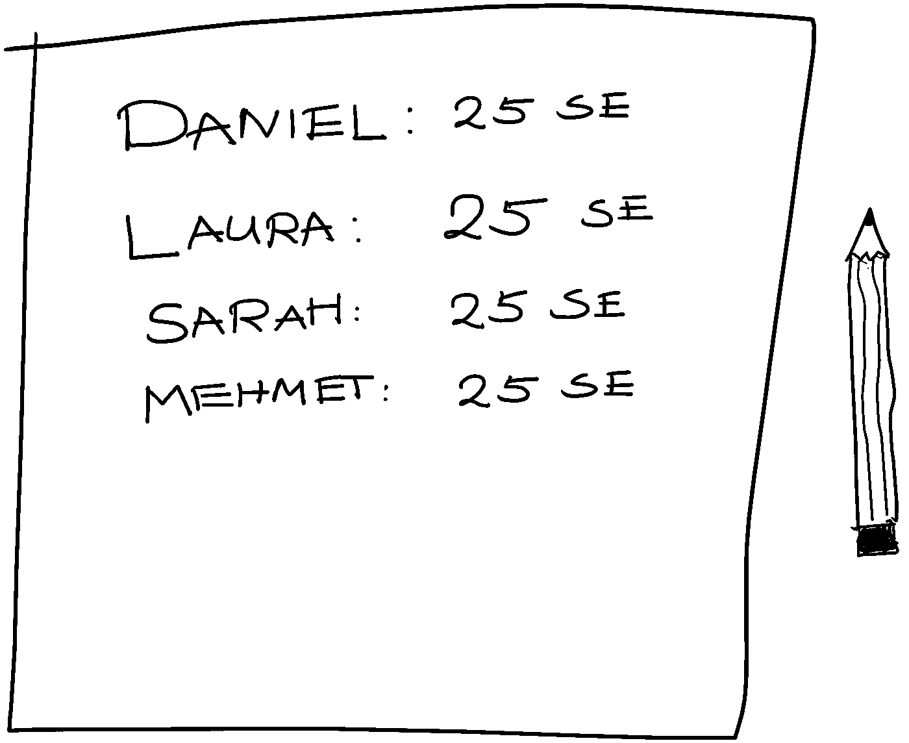
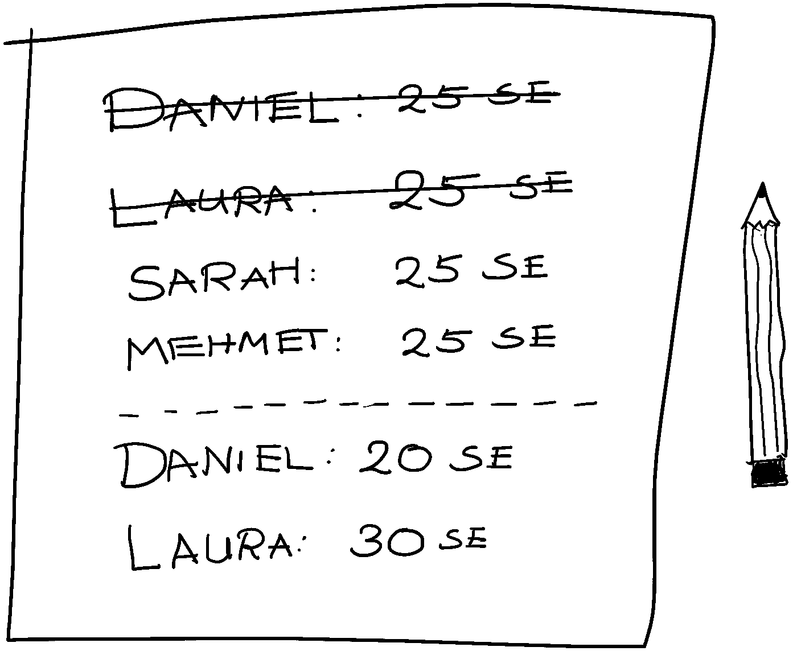

# 第一部分——区块链 101:21 世纪最具突破性创新的简单介绍

> 原文：<https://medium.com/coinmonks/part-i-blockchain-101-a-simple-introduction-to-the-most-groundbreaking-innovation-of-the-21st-c81d5fa16e8e?source=collection_archive---------3----------------------->

比特币、加密货币、NFT——如果你在关注媒体，你可能会以某种方式听说过这些概念。最近几乎没有任何其他话题将公众分为狂热分子或怀疑者两大阵营，很少有介于两者之间的。但是最初是什么导致了这场争论的发生呢？要回答这个问题，我们必须跳过辩论，专注于这些概念背后的基础:区块链。区块链到底是什么，它是如何工作的？好消息是:你事先知道的越少，你就越容易理解区块链。通过一个简单的类比，你将了解这项令人兴奋的技术的基本原理，然后能够自己观察和判断。

*第一篇博文是一个引入类比的寓言，这将是该系列其余部分的主线。这是理解技术的基础，所以请相信我——最终会变得更加容易。*

Photo by [Ales Nesetril](https://unsplash.com/@alesnesetril?utm_source=medium&utm_medium=referral) on [Unsplash](https://unsplash.com?utm_source=medium&utm_medium=referral)

让我们从一个空白的盘子开始。忘记你迄今为止可能听到的一切——忘记采矿、工作证明、去中心化、分布式账本、数字令牌、密码学以及任何其他你与区块链相关的东西。

让我们在一个我们年轻时都知道并喜欢的地方见面——儿童游乐场，更确切地说，是沙箱。想象一下那些你玩玩具、建城堡、烤沙饼、吃想象中的饼干的日子。为了清楚起见，让我们也介绍一下你的朋友:劳拉，穆罕默德和丹尼尔。你的名字是莎拉。

你们四个人想象出一个虚拟的商店，在那里你们向顾客出售你们的手工制品:你们分发沙饼和饼干，并从顾客那里收到虚拟的钱。你的朋友劳拉发挥想象力，想出了一种新的货币，并称之为“沙盒欧元”(简称“SE”)，你用它来为你的沙饼和饼干定价。为了让它更真实一点，Mehmet 决定收集 100 个小鹅卵石，它们现在代表物理沙盒——欧元，用来买卖沙饼和饼干。

Using pebbles to represent your made-up currency for exchanging stuff you produce makes the shopping/buying game feel very realistic (illustration by author).

所以现在的购物体验感觉很真实:沙盒里每个人都有一些用来买东西的鹅卵石。每种产品都有自己的价格——一块饼干要 5 鹅卵石，一块沙饼要 10 鹅卵石，如果一种产品特别美味或漂亮，它也会更贵。

很快，服务出现了。丹尼尔需要帮助建造他自己的沙屋，所以他问你是否能帮忙。他甚至准备付给你 5 沙盒欧元。你觉得这很划算，就同意了，一起建沙家，大家都开心。

但是渐渐地，一个问题出现了。随身携带你的钱(鹅卵石)是令人疲惫的，因为沙盒欧元太重了。为了解决这个问题，你的朋友穆罕默德观察了这种情况。

Mehmet 观察他的朋友生产、销售和购买商品和服务很长一段时间，这时他突然想到一个主意。他想:“我真的需要一直带着我所有的沙盒欧元吗？”不，他觉得，但他现在不知道如何想出一个更好的办法。

然后他突然想到。他把你们所有人聚集在他周围，解释道:“好吧，伙计们，我有一个好主意。我们都厌倦了带着那些沉重的鹅卵石到处走，对吗？”

“嗯，是的”，你们都同意。

“嗯，”Mehmet 说，“我有一个想法:如果我们可以玩我们的购物游戏，而不实际分发和接收沙盒-欧元？一切都会保持原样，除了周围不再有鹅卵石。”

“什么意思？”你疑惑的问。

"你说我应该卖掉我的手工制品，却不收鹅卵石作为回报？"丹尼尔是怀疑论者。

“让我详细解释一下我的想法。但首先，我们需要数一数我们所有的沙盒-欧元。我会从我的开始。”买买提把手伸进口袋，拿出所有的鹅卵石，放在地上，数了数。“……和 45。好吧，我有 45 沙盒欧元。你呢？”

仍然有点困惑，劳拉，丹尼尔和你拿出你的沙盒-欧元，并通过数它们。

“我有 15 个，”丹尼尔说。

“这里 22”，劳拉数着。

“我有 18 个”，你说。

“好像我是这里最富有的人。现在让我们检查一下我们是否总共还有 100 颗鹅卵石。45 加 15 加 22 加 18…是的，那总共是 100 颗鹅卵石。太好了，现在我们重新开始游戏。这意味着我们所有人都将从同样多的钱开始——每人 25 沙盒欧元。但是，既然这仅仅意味着我将失去我的财富，而你们所有人从现在起将拥有更多，我想你们不会太难过，是吗？”

“一点也不”，你笑着说。

“不客气，顺便说一句。现在事情变得有趣了:从现在开始，我妈妈会试着记住每个人的沙盒余额-欧元。所以，因为我们刚刚重新开始我们的游戏，我妈妈知道每个人都拥有 25 沙盒欧元。当你们中的任何人卖或买什么东西时，你去找我妈妈，告诉她你们交易的细节。例如，如果莎拉卖给丹尼尔一个沙饼，你们俩告诉我妈妈，丹尼尔的余额将减少一个沙饼的价格(10 沙盒-欧元)，同时莎拉的余额将增加相同的金额。结果是丹尼尔在购买沙饼后的余额是 15 沙盒欧元，莎拉是 35 沙盒欧元。好吗，妈妈？你明白吗？”

“好吧，我明白了。但是我需要把它写下来，否则我可能会迷失方向，把事情搞混”，Mehmet 的母亲说。在她的手提包里找到一张纸和一支笔后，她写下了下面几行字:

Writing down the balances on a piece of paper eliminates the need to carry around physical money (illustration by author).

"等等，那么现在你的意思是你母亲将管理我们的收支平衡？"丹尼尔问道。

“对，一点不错！”买买提点点头。

"那就是说我们不再需要交换真正的鹅卵石了？"你惊讶地问。

“没错。事实上，为什么我们不收集所有的鹅卵石，然后把它们给我妈妈呢？我们不再需要它们，因为她会记下所有余额。”买买提建议。

“嗯，我还没有完全信服。这怎么行？”劳拉表达了她的怀疑。

“我知道这听起来有点疯狂，但是，嘿，我们为什么不试一试，亲自尝试一下，看看是否可行？”穆罕默德说道。

“好吧，既然你的想法让我比以前更富有，我愿意为你尝试一下。”劳拉咯咯笑着，丹尼尔和你微笑着同意，同时把所有的鹅卵石交给买买提的母亲。

“太好了，那我们继续玩游戏吧。”Mehmet 正式重启购物游戏。

现在新的系统已经就位，你们所有人都继续你们的游戏。每当有人想把东西卖给另一个孩子时，这两个人就会去找买买提的母亲，告诉她交易的细节。

具体来说，劳拉想以 5 沙盒欧元的价格向丹尼尔出售一块饼干。所以，他们两个去找 Mehmet 的母亲，她查了 Laura 和 Daniel 的当前余额，把他们的名字写在新的一行上，新的余额在他们名字的旁边。劳拉现在的余额是 30 沙盒欧元，丹尼尔的余额是 20 沙盒欧元。此外，她划掉了旧行，其中两者都有 25 沙盒欧元的余额:

After a transaction occurs, the new balance of the transactors are written down (illustration by author).

起初，这种新的销售方式对你来说有点奇怪。但是很快，你就习惯了，因为你看到销售产品和赚钱是多么优雅和容易，现在再也不需要实物交换鹅卵石了。这显然比鹅卵石有优势。

让我们在这里休息一下。你可能已经注意到了——利用这个类比，我们刚刚介绍了货币和银行的概念，它们是现代社会的支柱之一。

总结一下:

*   通过引入沙盒欧元，孩子们找到了一种定价和交换商品和服务的方法。
*   通过使用鹅卵石作为沙盒欧元的实物代理，Mehmet 创造了现金货币。
*   将 Mehmet 的母亲作为一个实体来跟踪每个人的余额构成了银行的概念。每个孩子的余额信息都存储在他们各自的名下，也就是说，存储在他们的账户中。
*   买买提的母亲在账户之间转移的“虚拟”货币被称为账面货币，与现金相对。

到目前为止，这些概念您可能已经很熟悉了。在下一部分中，我们最终将介绍区块链的概念——就这么简单！

这个系列的第二部分可以在这里找到:[第二部分](https://kiranbanakar.medium.com/part-ii-blockchain-101-a-simple-introduction-to-the-most-groundbreaking-innovation-of-the-21st-26e66bb3da17)。

> 加入 Coinmonks [电报频道](https://t.me/coincodecap)和 [Youtube 频道](https://www.youtube.com/c/coinmonks/videos)了解加密交易和投资

## 也阅读

 [## 最佳加密交易所| 2021 年十大加密货币交易所

### 编辑描述

blog.coincodecap.com](https://blog.coincodecap.com/crypto-exchange)  [## 2021 年最佳加密借贷平台| 6 大比特币借贷平台

### 获得比特币和其他加密货币的最佳贷款利率

medium.com](/coinmonks/top-5-crypto-lending-platforms-in-2020-that-you-need-to-know-a1b675cec3fa)  [## 2021 年最佳免费加密交易机器人

### 2021 年币安、比特币基地、库币和其他密码交易所的最佳密码交易机器人。四进制，位间隙…

medium.com](/coinmonks/crypto-trading-bot-c2ffce8acb2a)  [## 最佳 4 个加密交易信号电报通道

### 这是乏味的找到正确的加密交易信号提供商。因此，在本文中，我们将讨论最好的…

medium.com](/coinmonks/best-crypto-signals-telegram-5785cdbc4b2b)  [## 5 个最佳社交交易平台[2021] | CoinCodeCap

### 编辑描述

blog.coincodecap.com](https://blog.coincodecap.com/best-social-trading-platforms)  [## BlockFi 评论 2021:利弊和利率| CoinCodeCap

### 编辑描述

blog.coincodecap.com](https://blog.coincodecap.com/blockfi-review)  [## 如何在印度购买比特币？2021 年购买比特币的 7 款最佳应用[手机版]

### 如何使用移动应用程序购买比特币印度

medium.com](/coinmonks/buy-bitcoin-in-india-feb50ddfef94)  [## 加密税务软件——五大最佳比特币税务计算器[2021]

### 不管你是刚接触加密还是已经在这个领域呆了一段时间，你都需要交税。

medium.com](/coinmonks/best-crypto-tax-tool-for-my-money-72d4b430816b)  [## 存储比特币的最佳加密硬件钱包[2021] | CoinCodeCap

### 编辑描述

blog.coincodecap.com](https://blog.coincodecap.com/best-hardware-wallet-bitcoin)  [## Pionex 评论 2021 |免费加密交易机器人和交换

### Pionex 是为交易自动化提供工具的后起之秀。Pionex 上提供了 9 个加密交易机器人…

medium.com](/coinmonks/pionex-review-exchange-with-crypto-trading-bot-1e459d0191ea)