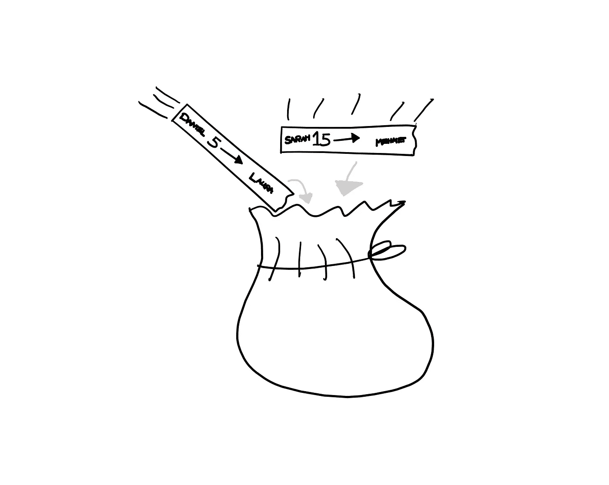
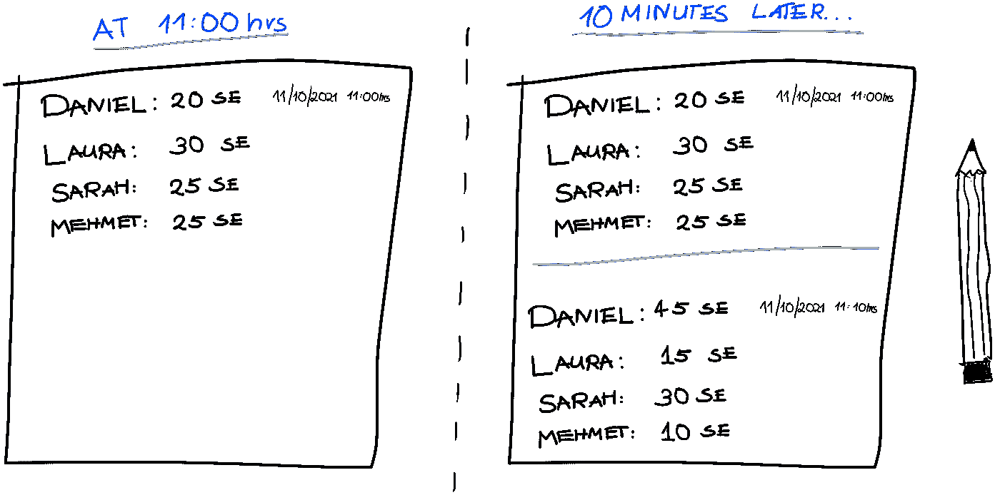
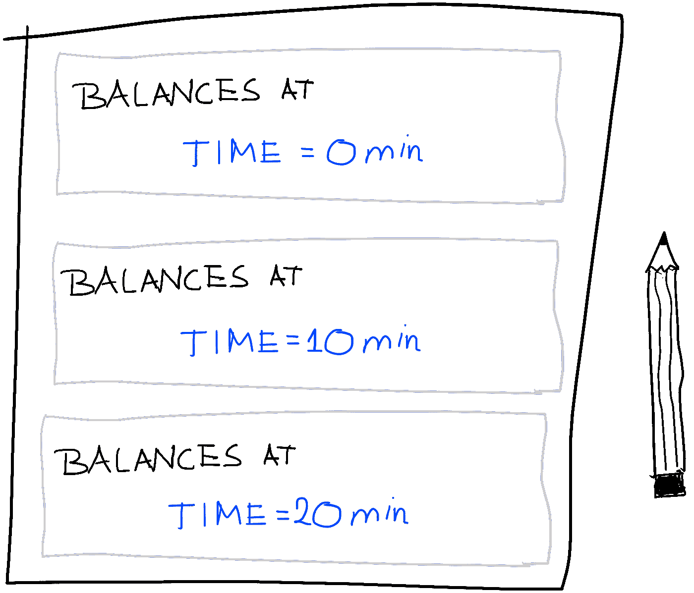
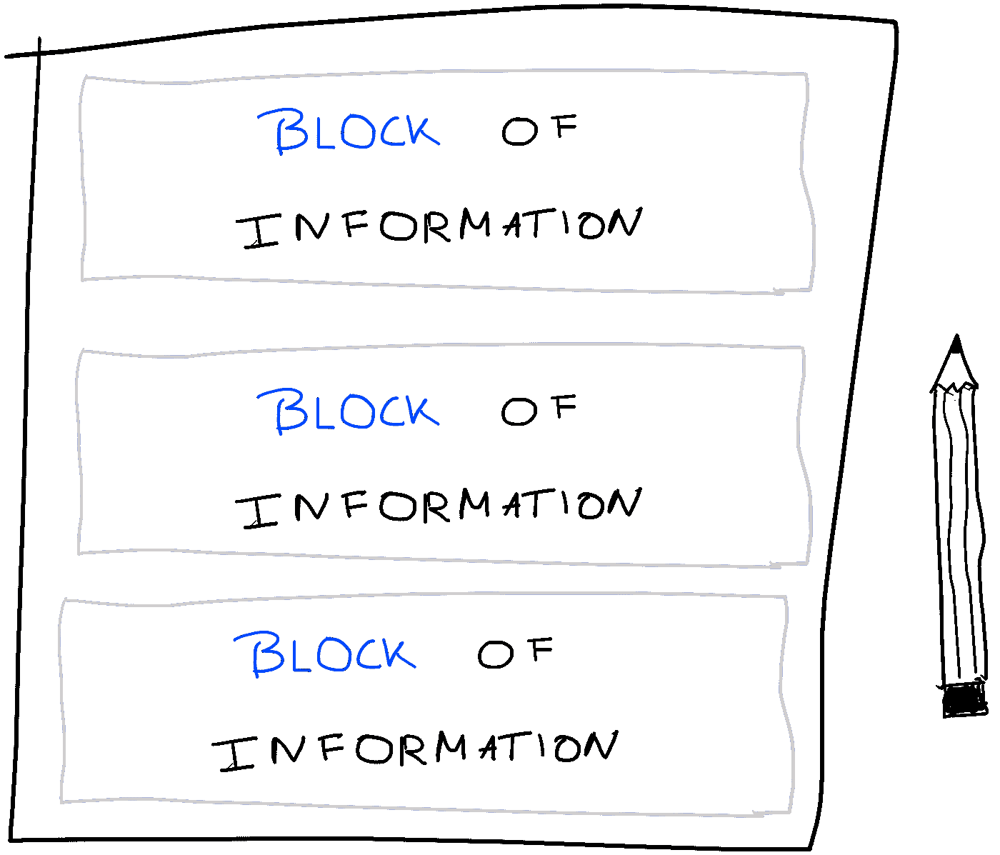
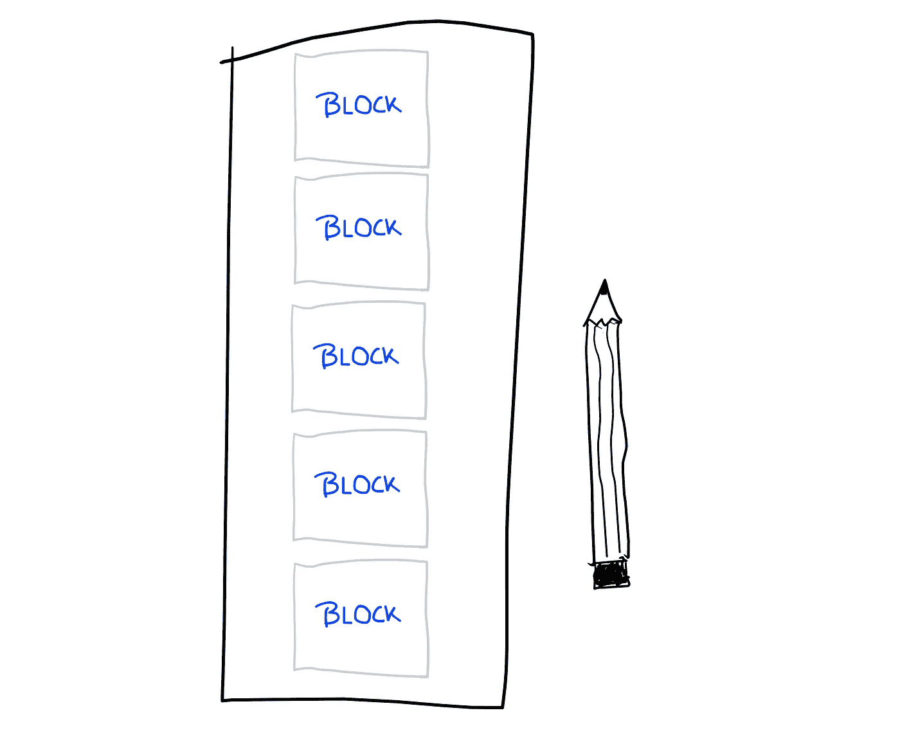

# 第二部分——区块链 101:21 世纪最具突破性创新的简单介绍

> 原文：<https://medium.com/coinmonks/part-ii-blockchain-101-a-simple-introduction-to-the-most-groundbreaking-innovation-of-the-21st-26e66bb3da17?source=collection_archive---------6----------------------->

*在本系列的* [*上一篇*](https://kiranbanakar.medium.com/part-i-blockchain-101-a-simple-introduction-to-the-most-groundbreaking-innovation-of-the-21st-c81d5fa16e8e) *中，我们用一个儿童游乐场的典型场景的比喻，介绍了货币和银行的概念。我们开始熟悉一个组织实体(银行)，账面资金相对于现金的优势，以及将账面资金转移到彼此账户的简单性。但是这一切和区块链技术有什么关系呢？实际上，很多，所以让我们回到正题。*

Photo by [Miltiadis Fragkidis](https://unsplash.com/@_miltiadis_?utm_source=medium&utm_medium=referral) on [Unsplash](https://unsplash.com?utm_source=medium&utm_medium=referral)

“买买提的想法太棒了！”劳拉在把她的第十块饼干卖给丹尼尔后大声说道。起初持怀疑态度的劳拉现在忍不住称赞这种相互转账的新系统。再也不用带着鹅卵石到处走了——有了 Mehmet 的母亲整理他们的账户，Laura 也感到安全了。

Mehmet 简单而聪明的想法让每个人的生活变得更容易。

真的每个人的生活？不，因为某人的生活变得更麻烦了。

在你的小世界里，商业的步伐慢慢加快。每个人都生产、销售和消费更多的产品。这也意味着更多的沙盒欧元在所有账户之间转移，给 Mehmet 的母亲带来了更多的工作来组织和跟踪一切。买买提的母亲计算和更新余额的速度极快。然而，有一件事让她很恼火:总是随叫随到地接受孩子们的命令。由于总是准备更新账户，她无法与坐在她旁边的朋友继续对话。压力越来越大，直到有一天，她非常恼火，以至于停止了游戏。

“孩子们，我们必须停下来。我不能干坐着等你的命令。这个工作太枯燥，效率太低，我连和朋友说话都不会。我们需要改变一些事情。”Mehmet 的母亲要求，你们都同意，因为你理解她。

原来丹尼尔事先就注意到了买买提母亲的问题，并暗中研究如何解决这种情况。他害羞地举起手说:“我想我找到了一个更好的方法。”

“太好了，丹尼尔，请告诉我你的想法。”买买提的母亲说，印象深刻。

“嗯，我观察到你们处理所有交易的速度相当快。如此之快，事实上，你只需要一瞬间就能计算出每个人的新余额。我不知道你是怎么做到的，但是计算清楚不是你的问题。已经是超高效了。然而，我发现等待我们的订单浪费了你很多时间。所以我们为什么不为你简化一下:每次交易需要发生时，买卖双方拿一张小纸条，写下参与交易双方的名字和要转账的金额。然后我们把这张纸放进一个小袋子里。每 10 分钟，你拿出所有收集的纸片，计算每个人的新余额，并把它们写在你的清单上。这意味着在这 10 分钟里，你将有 9 分 30 秒的自由时间。您每 10 分钟只花 30 秒来更新我们的余额。你怎么看？”丹尼尔好奇地问道。

“这听起来不错！简单而高效。我们试一试吧！”买买提的妈妈迫不及待地融入了这个概念。

Bundling transactions and processing them all at once increases efficiency (illustration by author).

你们四个继续玩丹尼尔的新游戏。事情现在进展得更快了，因为游戏中有了更多的结构。此外，很明显，除了计算速度快之外，Mehmet 的母亲也非常擅长记忆信息。每次处理小包里的订单时，她都是一个一个地读，即时计算新的余额，从来不做笔记。完成计算后，她只在列表中过期条目下写下更新的余额。此外，她将每一批新信息与计算更新的确切日期和时间结合起来，这样每个人都知道哪一批是最新的。这样，就省去了大量的笔记，只有相关的信息会被写在列表上。

Keeping track of everyone’s balance every 10 minutes reduces complexity, because every transaction does not have to be recorded (illustration by author).

“我们这个小世界的又一个伟大发明——这个感觉很专业！”你认为。

在不知不觉中，丹尼尔发明了区块链技术。惊讶吗？让我们仔细看看这是如何发生的。

关键因素是 Mehmet 的母亲更新列表的方式。每隔 10 分钟，她就用一批新的信息更新她的列表，也就是每个账户最近的余额。此外，她不会删除旧信息，而是在列表底部添加新的一批信息。通过包含添加新一批信息的确切日期和时间，我们就有了所有帐户的时间顺序历史。

Taking a step back, we see that every 10 minutes a new snapshot of everyone’s balance is being added, with the youngest snapshot being the most up-to-date (illustration by author).

也许你已经自己做出了结论，但是如果没有，为了清楚起见，让我们重复一下:每 10 分钟，一批新的信息被添加到旧的信息下面。

用稍微修改过的话来说:每 10 分钟，一个新的信息块被添加到旧的信息块下面。

Another way of looking at the architecture: every 10 minutes, a new block of information gets added (illustration by author).

退一步来看我们的构建，很明显我们看到的是一个按时间顺序排列的信息块链——或者你可以称之为区块链。

Zooming out makes it clear that we are looking at an ever-growing chain of blocks, or, in other words, a Blockchain (illustration by author).

给你。我们到达了我们系列的中心:不祥的区块链。

现在，我们就到此为止吧。以下是我们从这部分系列中获得的主要知识的简要回顾。在下一部分中，我们将更仔细地研究这项技术的复杂性，以便每个部分都有各自的位置。到那时，我们的精神框架将会建立并运行。

总结一下:

*   当一个时间间隔内的所有事务被集中起来，然后一次处理时，效率会提高。
*   在每个时间间隔(在我们的例子中是 10 分钟)之后，一个新的信息块被添加到先前的信息块中。
*   信息块仅包含更新的余额，但不包含产生这些余额的实际交易。
*   由于新块总是添加在旧块的下方，因此会按时间顺序显示，最老的块在顶部，最年轻的块在底部。添加时间戳提供了额外的时间信息。
*   从宏观的角度来看，我们看的是一个信息区块链，也就是区块链。

恭喜你。如果你理解了这个非常核心的元素，你就已经掌握了 80%的区块链技术。

万一你需要重读第一部分，这里有链接:[第一部分](https://kiranbanakar.medium.com/part-i-blockchain-101-a-simple-introduction-to-the-most-groundbreaking-innovation-of-the-21st-c81d5fa16e8e)。

下面是下一部:[第三部](https://kiranbanakar.medium.com/part-iii-blockchain-101-a-simple-introduction-to-the-most-groundbreaking-innovation-of-the-21st-a6c303ddff12)。

> 加入 Coinmonks [电报频道](https://t.me/coincodecap)和 [Youtube 频道](https://www.youtube.com/c/coinmonks/videos)了解加密交易和投资

## 也阅读

 [## 最佳加密交易所| 2021 年十大加密货币交易所

### 编辑描述

blog.coincodecap.com](https://blog.coincodecap.com/crypto-exchange)  [## 2021 年最佳加密借贷平台| 6 大比特币借贷平台

### 获得比特币和其他加密货币的最佳贷款利率

medium.com](/coinmonks/top-5-crypto-lending-platforms-in-2020-that-you-need-to-know-a1b675cec3fa)  [## 2021 年最佳免费加密交易机器人

### 2021 年币安、比特币基地、库币和其他密码交易所的最佳密码交易机器人。四进制，位间隙…

medium.com](/coinmonks/crypto-trading-bot-c2ffce8acb2a)  [## 最佳 4 个加密交易信号电报通道

### 这是乏味的找到正确的加密交易信号提供商。因此，在本文中，我们将讨论最好的…

medium.com](/coinmonks/best-crypto-signals-telegram-5785cdbc4b2b)  [## 5 个最佳社交交易平台[2021] | CoinCodeCap

### 编辑描述

blog.coincodecap.com](https://blog.coincodecap.com/best-social-trading-platforms)  [## BlockFi 评论 2021:利弊和利率| CoinCodeCap

### 编辑描述

blog.coincodecap.com](https://blog.coincodecap.com/blockfi-review)  [## 如何在印度购买比特币？2021 年购买比特币的 7 款最佳应用[手机版]

### 如何使用移动应用程序购买比特币印度

medium.com](/coinmonks/buy-bitcoin-in-india-feb50ddfef94)  [## 加密税务软件——五大最佳比特币税务计算器[2021]

### 不管你是刚接触加密还是已经在这个领域呆了一段时间，你都需要交税。

medium.com](/coinmonks/best-crypto-tax-tool-for-my-money-72d4b430816b)  [## 存储比特币的最佳加密硬件钱包[2021] | CoinCodeCap

### 编辑描述

blog.coincodecap.com](https://blog.coincodecap.com/best-hardware-wallet-bitcoin)  [## Pionex 评论 2021 |免费加密交易机器人和交换

### Pionex 是为交易自动化提供工具的后起之秀。Pionex 上提供了 9 个加密交易机器人…

medium.com](/coinmonks/pionex-review-exchange-with-crypto-trading-bot-1e459d0191ea)