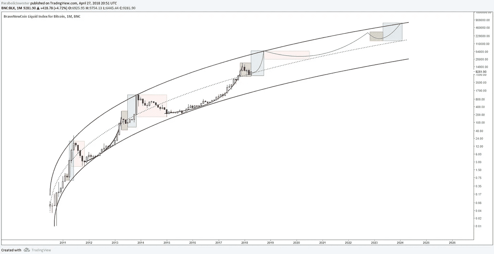

# 第二部分。比特币的抛物线超级趋势——FCV 和比特币三连胜

> 原文：<https://medium.com/coinmonks/part-ii-the-parabolic-supertrend-in-bitcoin-fcv-and-the-bitcoin-trifecta-7a573ecdb63?source=collection_archive---------1----------------------->

## 关于比特币估值的更多细节

在我关于这个话题的前一篇文章中，我描述了我认为在检查[抛物线轨迹](https://medium.com/u/aa1e573dda8b?source=post_page-----7a573ecdb63--------------------------------)的超级趋势图时要记住的一个有用的图像，如下图所示。

Figure 1: The Bitcoin Supertrend (courtesy: [Parabolic Trav](https://medium.com/u/aa1e573dda8b?source=post_page-----7a573ecdb63--------------------------------))