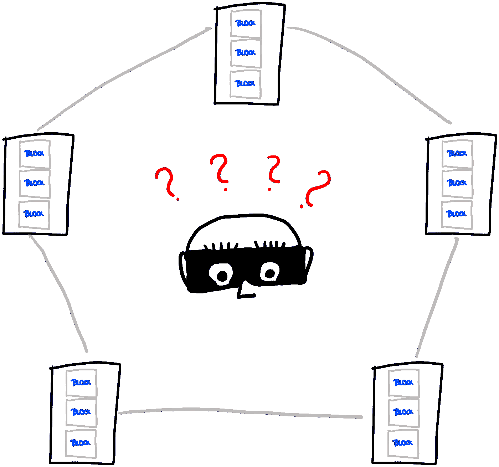

# 第三部分——区块链 101:21 世纪最具突破性创新的简单介绍

> 原文：<https://medium.com/coinmonks/part-iii-blockchain-101-a-simple-introduction-to-the-most-groundbreaking-innovation-of-the-21st-a6c303ddff12?source=collection_archive---------6----------------------->

以高潮结束最后一篇文章尤其重要，因为这有望让你停下来重新阅读思路——最终看到一连串的信息块。如果你不记得了，请在这里 *刷新你的* [*知识。*](https://kiranbanakar.medium.com/part-ii-blockchain-101-a-simple-introduction-to-the-most-groundbreaking-innovation-of-the-21st-26e66bb3da17)

我们将直接跳回我们的场景，无缝地继续。

*第一部分:* [*点击这里*](https://kiranbanakar.medium.com/part-i-blockchain-101-a-simple-introduction-to-the-most-groundbreaking-innovation-of-the-21st-c81d5fa16e8e) *。*

*第二部分:* [*点击这里*](https://kiranbanakar.medium.com/part-ii-blockchain-101-a-simple-introduction-to-the-most-groundbreaking-innovation-of-the-21st-26e66bb3da17) *。*

Photo by [Clint Adair](https://unsplash.com/@clintadair?utm_source=medium&utm_medium=referral) on [Unsplash](https://unsplash.com?utm_source=medium&utm_medium=referral)

“伙计们，我们走了很长的路！”默罕默德说，思考着在他们小小的沙盒宇宙中一切是如何顺利运转的。

“是的，我没想到我们会有这么复杂的系统”，Laura 说。

“复杂，是的，但是每个概念本身都很简单，如果我诚实的话”，你意识到。

“真实的莎拉，非常简单。它始于劳拉提出我们自己的货币，沙盒欧元。然后 Mehmet 收集鹅卵石来代表真正的物理沙盒-欧元。然后，Mehmet 想到让他的母亲来照看我们的虚拟沙盒——欧元”, Daniel 回忆道。

“但是丹尼尔，你在 10 分钟内收集每笔交易，然后交给我妈妈一次性处理的发明也很聪明。这么简单的想法！”买买提赞赏地说。

“谢谢！”丹尼尔说，冲洗。

当你回想你的旅程时，一个年轻人走近了现场。小心不被任何人注意，他设法接近包含每个人的帐户信息的列表。在一个不为人知的瞬间，他突然伸出手，抓起名单，然后跑开了。劳拉迅速做出反应，跳起来追着他跑。看着她追赶那个男人，你们三个看着劳拉追上小偷。小偷，意识到他不能从她那里逃跑，让纸滑落，改变方向，跑掉了。自从她索回了清单，劳拉停止了追赶那个男人，捡起清单，大步走向沙箱。

Any digital system faces the threat of adversarial attacks — so how do we ensure security? (illustration by author)

“这太疯狂了，劳拉！”丹尼尔大喊完全敬畏。

“如果我们没有你，那个人会抢走我们珍贵的名单，里面有我们游戏的所有重要信息。太感谢你了，劳拉！”你说，紧紧地拥抱你的朋友。

“谢谢，伙计们。太累人了。现在让我喘口气。”劳拉低声说，仍然气喘吁吁。

“小朋友，发生什么事了？”买买提的母亲加入了现场。

“哦妈妈，你什么都没注意到吗？”买买提说，恼火了。“这太典型了。有个小偷想偷我们的名单！你其实应该留意的名单！”

“我很抱歉！我和我的朋友交谈时完全迷失了。从现在开始我会守护名单的，我保证！”穆罕默德的母亲保证。

“我希望你这样做，妈妈。如果劳拉没有她那么快，我们就会失去比赛中最重要的元素。幸运的是，我们拿回了名单。”买买提冷静下来。

“等等，再说一遍，买买提！”受到打击，一个想法出现在买买提的母亲身上。

“什么？你的意思是，如果劳拉没有她那么快，我们就会失去比赛中最重要的元素？”买买提惊讶地重复道。

“是的！就是这样！我有一个完美的解决方案来防止将来出现这样的情况！”买买提的母亲跳起来，兴奋地奔向她的车，打开后备箱，开始四处摸索。

“我不知道她到底出了什么事。有时候，我觉得我妈有点疯。”买买提小声告诉他的朋友。

时间流逝，买买提的母亲没有回到沙盒。相反，她正狂热地工作在一些你从远处看不到的东西上。丹尼尔请求穆罕默德母亲的朋友暂时扮演组织者的角色，这样你就可以继续玩你的游戏了。

30 分钟后，买买提的母亲从车里出来，手里拿着五片药片。惊讶之余，你们都聚集在她周围。

“妈妈，到底是怎么回事？你在我们车的后备箱里做了什么？”买买提不耐烦地问道。

“等一下。我现在会向你们所有人解释一切。但首先，让我给你们每人一片。”买买提的母亲把药片分发给每个孩子，自己留了一片。

“现在，我只是给这些平板电脑编了程序。只有一个安装了特定功能的程序。我会解释的。”大家仔细听着，买买提的母亲开始了。“当你说列表是你游戏中最重要的元素时，Mehmet，这真的给我敲响了警钟。我们需要确保列表的安全，对吗？”买买提的母亲问，你们都默默地点头。“好吧，如果我们让小偷无法偷到名单呢？当然，这是我们一直在想的，但让我们想想我一直在更新的这个列表。”买买提的母亲拿起名单，举着它。“如果我们的货币系统只基于这一个副本，窃取我们的货币系统是相当容易的，因为只有一个攻击点。”

"….啊啊！！！我想我知道你在暗示什么！”劳拉惊叹道，对这个想法感到兴奋。“你的意思是，如果有多份名单，小偷将有更多的困难来窃取我们的货币系统，因为他必须收集所有未完成的副本？”

“劳拉，你学得真快！”买买提的妈妈笑了。“是的，劳拉说的也是我想到的。如果我们的清单有多个副本，小偷就不会像只有一个副本那样容易地窃取我们的货币系统。”

Storing multiple copies of the same Blockchain makes it hard to attack the currency system (illustration by author).

“但这应该怎么做呢？你打算同时更新多个列表吗？这对你来说是不是有点太多了？”丹尼尔感兴趣地问道。

“说得好，丹尼尔。所以我给了你们每人一片药片。从现在开始，我会在我的平板电脑上更新名单，你们所有人的平板电脑上都有一份名单的精确副本。平板电脑通过网络连接，所以每次我更新列表，你的副本都会实时更新。”买买提的母亲解释道。

“好的，那太好了！我明白。”买买提缓缓说道。“但是妈妈，当你是组织实体时，我们为什么要带着平板电脑呢？难道我们不能把平板电脑存放在您这里吗？”

“不，买买提，”——“买买提的妈妈开始说，但是你打断了她。

“不，将所有平板电脑存放在一个地方并不是一个好主意，因为这将再次成为单点攻击，而这正是我们想要避免的。在这种情况下，小偷可以一次拿到所有的平板电脑。另一方面，如果我们在不同的地方分发药片，小偷几乎不可能在我们之前没有注意到的情况下收集所有药片。”你说，完成解释穆罕默德的母亲正要给。

“这里有这么多聪明的孩子——你说得对，萨拉！这正是我想要的。”买买提的母亲很感激。

“嗯，好的，我明白了。但是如果一个小偷真的偷了一个平板电脑会怎么样呢？那不会损害我们的货币体系吗？”丹尼尔怀疑地问道。

“这将损害我的财务状况，因为我将不得不购买一台新的平板电脑，但我们的资金系统不会受到影响，因为我们仍然会在您的平板电脑上保留四份相同的备份。”买买提的母亲解释道。

“啊，我明白了。你会买一个新的平板电脑，从我们的一个平板电脑上复制列表，然后把它拖到新的平板电脑上，对吗？”丹尼尔说。

“一点不错。你猜对了。”

A theft of one individual copy of the blockchain does not have serious consequences if the whole system is managed in many different places (illustration by author).

“太好了，我们的游戏又增添了一个优雅的元素。我们试试这个，好吗？”你不能再等待继续你的游戏，现在感觉很专业。你们四个继续你们的游戏，很明显，Mehmet 母亲的发明为你们的货币系统建立了很多安全措施。它不再容易操作了，而且，作为一个附件，它甚至变得更加透明，因为你们所有人都拥有一份名单，因此可以随时检查每个人的余额。这种透明度会让你对你的资金系统产生信任，这也有助于彼此做生意。

让我们在这里休息一下。

在本系列的这一部分中，我们介绍了分布式分类帐和分散化的概念。买买提的母亲给每个孩子发了一片药片。换句话说，她给孩子们分发账簿。

此外，由于列表没有单一的存储点，换句话说，就是区块链，而是多个存储位置，我们正在寻找一个分散的系统。

所有这些措施都是建立安全和透明度的关键因素。

总结一下:

*   通过分配分类账，建立了一个分散的系统。
*   去中心化系统的特点是有多个地方存储区块链的相同副本。
*   此外，由于货币现在是数字化存储的，我们正在处理一种数字货币。这种数字货币的一个单位叫做代币——数字代币。

我们的系列已经过半；但一些关键概念缺失，如共识机制、挖掘和数字令牌。然而，要真正理解这些概念，我们必须先绕道而行，了解一些技术问题的核心:密码学、哈希和随机数。本系列的下一部分将讨论这些技术概念，为本系列的最后一部分奠定基础。

如果要重启系列，[从这里开始](https://kiranbanakar.medium.com/part-i-blockchain-101-a-simple-introduction-to-the-most-groundbreaking-innovation-of-the-21st-c81d5fa16e8e)。

[点击此处观看第二部分](/coinmonks/part-ii-blockchain-101-a-simple-introduction-to-the-most-groundbreaking-innovation-of-the-21st-26e66bb3da17)。

[点击这里看第四部](/coinmonks/part-iv-blockchain-101-a-simple-introduction-to-the-most-groundbreaking-innovation-of-the-21st-8e6faeb0c80d)。

> 加入 Coinmonks [电报频道](https://t.me/coincodecap)和 [Youtube 频道](https://www.youtube.com/c/coinmonks/videos)了解加密交易和投资

## 也阅读

 [## 最佳加密交易所| 2021 年十大加密货币交易所

### 编辑描述

blog.coincodecap.com](https://blog.coincodecap.com/crypto-exchange)  [## 2021 年最佳加密借贷平台| 6 大比特币借贷平台

### 获得比特币和其他加密货币的最佳贷款利率

medium.com](/coinmonks/top-5-crypto-lending-platforms-in-2020-that-you-need-to-know-a1b675cec3fa)  [## 2021 年最佳免费加密交易机器人

### 2021 年币安、比特币基地、库币和其他密码交易所的最佳密码交易机器人。四进制，位间隙…

medium.com](/coinmonks/crypto-trading-bot-c2ffce8acb2a)  [## 最佳 4 个加密交易信号电报通道

### 这是乏味的找到正确的加密交易信号提供商。因此，在本文中，我们将讨论最好的…

medium.com](/coinmonks/best-crypto-signals-telegram-5785cdbc4b2b)  [## 5 个最佳社交交易平台[2021] | CoinCodeCap

### 编辑描述

blog.coincodecap.com](https://blog.coincodecap.com/best-social-trading-platforms)  [## BlockFi 评论 2021:利弊和利率| CoinCodeCap

### 编辑描述

blog.coincodecap.com](https://blog.coincodecap.com/blockfi-review)  [## 如何在印度购买比特币？2021 年购买比特币的 7 款最佳应用[手机版]

### 如何使用移动应用程序购买比特币印度

medium.com](/coinmonks/buy-bitcoin-in-india-feb50ddfef94)  [## 加密税务软件——五大最佳比特币税务计算器[2021]

### 不管你是刚接触加密还是已经在这个领域呆了一段时间，你都需要交税。

medium.com](/coinmonks/best-crypto-tax-tool-for-my-money-72d4b430816b)  [## 存储比特币的最佳加密硬件钱包[2021] | CoinCodeCap

### 编辑描述

blog.coincodecap.com](https://blog.coincodecap.com/best-hardware-wallet-bitcoin)  [## Pionex 评论 2021 |免费加密交易机器人和交换

### Pionex 是为交易自动化提供工具的后起之秀。Pionex 上提供了 9 个加密交易机器人…

medium.com](/coinmonks/pionex-review-exchange-with-crypto-trading-bot-1e459d0191ea)