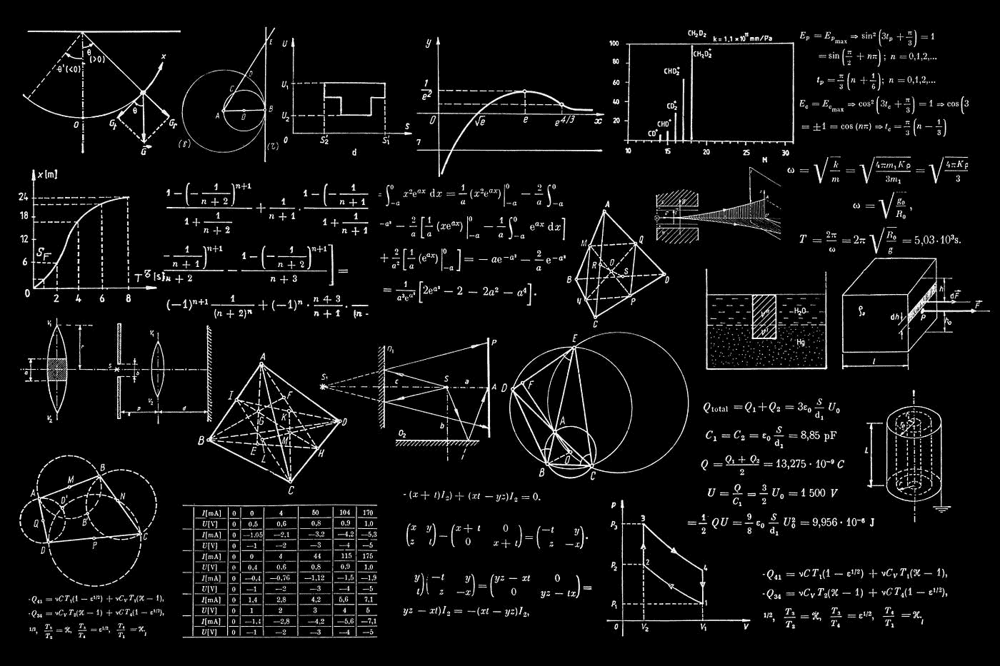

# 第四部分——区块链 101:对 21 世纪最具突破性的创新的简单介绍

> 原文：<https://medium.com/coinmonks/part-iv-blockchain-101-a-simple-introduction-to-the-most-groundbreaking-innovation-of-the-21st-8e6faeb0c80d?source=collection_archive---------7----------------------->

到目前为止，我们已经走了很长的路。从 [*第一部分*](https://kiranbanakar.medium.com/part-i-blockchain-101-a-simple-introduction-to-the-most-groundbreaking-innovation-of-the-21st-c81d5fa16e8e) *中的货币和银行基础知识开始，我们扩展到区块链的构造(* [*第二部分*](https://kiranbanakar.medium.com/part-ii-blockchain-101-a-simple-introduction-to-the-most-groundbreaking-innovation-of-the-21st-26e66bb3da17) *)，然后我们在* [*第三部分*](https://kiranbanakar.medium.com/part-iii-blockchain-101-a-simple-introduction-to-the-most-groundbreaking-innovation-of-the-21st-a6c303ddff12) *中阐述了去中心化和分布式总账的概念。在我们系列的这一部分中，我们将探索一些技术和数学主题——但是以一种非常抽象和简单的方式，所以你将能够从高层次的角度理解这个问题。这些元素构成了我们系列最后一部分的基础，在这里我们将处理剩余的概念。*

与本系列的前几部分不同，这一部分没有使用沙盒类比。我们将直入实质。我们走吧！

Photo by [Dan-Cristian Pădureț](https://unsplash.com/@dancristianp?utm_source=medium&utm_medium=referral) on [Unsplash](https://unsplash.com?utm_source=medium&utm_medium=referral)

想象一个黑盒，它接受一个输入，对它施加一些魔法，然后输出一个输出。这个黑盒被称为哈希函数。

Basically, a hash input simply takes an input and transforms it into a specified output (illustration by author).

明白了吗？太好了，我们继续。

…实际上，不是。尽管我刚才给你的定义基本上概括了散列函数的工作原理，但我们必须更仔细地研究它。我们不会关注黑盒内部发生的奇迹，而是会放大黑盒内部发生的事情(输入)和输出的事情(输出)。

输入是字母、数字和符号形式的信息——实际上是任何可以用标准 QWERTY 键盘书写的东西。其中包括字母“A-Z”(大写和小写)、数字“0–9”和符号，如！$ % & ?*".

什么类型的信息符合有效输入的条件？再说一次，真的什么都可以。像“H”这样的单个字母和整个句子一样都是输入(“你好，我是 Kiran。”).人们甚至可以选择莎士比亚全集或只包含数字的电子表格。输入的形式、长度和内容没有标准或条件。

另一方面，输出具有标准化的形式、长度和内容，称为哈希。在我们的例子中，我们将散列的长度限制在 10 个字符，只包含数字和字母(大写和小写)。这些数字和字母是随机组合的。

A hash function can take an input of any length, form and content and transforms it into a standardized output called a hash (illustration by author).

哈希真的是随机生成的吗？有点，是的，但是有一个警告。它是随机的，但是确定的。这意味着:如果您输入单词“Hello ”,关闭程序，重新启动您的 PC，重新启动程序，然后再次输入“Hello ”,您将在两种情况下获得相同的输出。

换句话说，散列可能看起来像数字和字母的随机连续，但它们遵循一种逻辑。这种逻辑被称为密码术，代表黑盒内部不祥的魔力，我向你保证，我们不会进入这个兔子洞——所以让我们回来看看输出。

我们能识别一种模式，以便我们能根据他们的输入预测输出吗？不，这才是有趣的地方。如果你比较“Hello”和“Hell”的哈希值，它们之间有字母“o”的区别，你不能挑出区别因素(“o”)的影响。哈希看起来完全不同，有不同的数字和字母序列。

此外，如果比较三个散列，甚至没有可识别的模式，它们的输入通过递增地添加相同的字母(或数字)而不同。换句话说，“Hell”、“Hello”和“Helloo”的哈希值是完全不同的，尽管我们只是递增地添加了字母“o”。因此，我们正在处理一个产生随机但确定的输出的黑盒。

It is not possible to spot a regularity between the output and the incrementally changed input (illustration by author).

让我们转换一下视角。有可能根据输出识别输入吗？同样，没有。我们没有办法重建输入，因为我们没有任何关于长度、形式或内容的信息，只是通过查看散列。我们不可能知道我们面前的散列是仅仅代表字母“X ”,还是莎士比亚、J. K .罗琳或 J. R. R .托尔金的作品集，或者这些作者的所有作品的总和。这些输入场景的散列总是具有相同的形式:10 个字母和数字以随机但确定的顺序组合在一起。

Constructing an input just by looking at an output hash is not possible because we don’t have any information about form, length or content of the input beforehand (illustration by author).

有了这些知识，让我们从头开始更新我们对哈希函数的定义:想象一个黑盒，它接受一个未指定的输入，对它应用一些魔法(密码术)，并吐出一个标准化的、随机确定的输出(哈希)。这个黑盒被称为哈希函数。

概括一下:

*   哈希函数接受未指定的输入，对其应用加密，并输出标准化的哈希。
*   散列是数字和字母的随机确定的连续。
*   哈希的生成并不遵循某种模式，而是遵循一种称为加密的逻辑。
*   仅仅通过查看输入来预测散列是不可能的。
*   同时，也不可能根据给定的散列来预测输入。
*   只需更改输入中的一个小字母、数字或符号，就会生成一个全新的散列。换句话说，输入数据的增量变化会导致根本上不同的哈希，而不是增量变化。

很好，我们已经为系列赛的决赛打下了基础。在这一部分，我们熟悉了散列函数。在下一部分中，我们将最终看到哈希函数在我们的系统中扮演什么样的工具角色。

如果你需要重启这个系列，你可以这样做:[第一部分](https://kiranbanakar.medium.com/part-i-blockchain-101-a-simple-introduction-to-the-most-groundbreaking-innovation-of-the-21st-c81d5fa16e8e)，[第二部分](https://kiranbanakar.medium.com/part-ii-blockchain-101-a-simple-introduction-to-the-most-groundbreaking-innovation-of-the-21st-26e66bb3da17)，[第三部分](https://kiranbanakar.medium.com/part-iii-blockchain-101-a-simple-introduction-to-the-most-groundbreaking-innovation-of-the-21st-a6c303ddff12)。

第五部分可以在这里找到。

> 加入 Coinmonks [电报频道](https://t.me/coincodecap)和 [Youtube 频道](https://www.youtube.com/c/coinmonks/videos)了解加密交易和投资

## 也阅读

 [## 最佳加密交易所| 2021 年十大加密货币交易所

### 编辑描述

blog.coincodecap.com](https://blog.coincodecap.com/crypto-exchange)  [## 2021 年最佳加密借贷平台| 6 大比特币借贷平台

### 获得比特币和其他加密货币的最佳贷款利率

medium.com](/coinmonks/top-5-crypto-lending-platforms-in-2020-that-you-need-to-know-a1b675cec3fa)  [## 2021 年最佳免费加密交易机器人

### 2021 年币安、比特币基地、库币和其他密码交易所的最佳密码交易机器人。四进制，位间隙…

medium.com](/coinmonks/crypto-trading-bot-c2ffce8acb2a)  [## 最佳 4 个加密交易信号电报通道

### 这是乏味的找到正确的加密交易信号提供商。因此，在本文中，我们将讨论最好的…

medium.com](/coinmonks/best-crypto-signals-telegram-5785cdbc4b2b)  [## 5 个最佳社交交易平台[2021] | CoinCodeCap

### 编辑描述

blog.coincodecap.com](https://blog.coincodecap.com/best-social-trading-platforms)  [## BlockFi 评论 2021:利弊和利率| CoinCodeCap

### 编辑描述

blog.coincodecap.com](https://blog.coincodecap.com/blockfi-review)  [## 如何在印度购买比特币？2021 年购买比特币的 7 款最佳应用[手机版]

### 如何使用移动应用程序购买比特币印度

medium.com](/coinmonks/buy-bitcoin-in-india-feb50ddfef94)  [## 加密税务软件——五大最佳比特币税务计算器[2021]

### 不管你是刚接触加密还是已经在这个领域呆了一段时间，你都需要交税。

medium.com](/coinmonks/best-crypto-tax-tool-for-my-money-72d4b430816b)  [## 存储比特币的最佳加密硬件钱包[2021] | CoinCodeCap

### 编辑描述

blog.coincodecap.com](https://blog.coincodecap.com/best-hardware-wallet-bitcoin)  [## Pionex 评论 2021 |免费加密交易机器人和交换

### Pionex 是为交易自动化提供工具的后起之秀。Pionex 上提供了 9 个加密交易机器人…

medium.com](/coinmonks/pionex-review-exchange-with-crypto-trading-bot-1e459d0191ea)