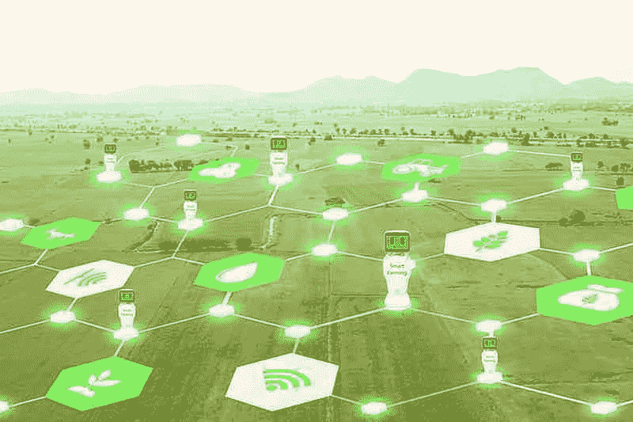

# 第四部分——量子网络！

> 原文：<https://medium.com/coinmonks/part-iv-the-qubic-network-94a953f928d2?source=collection_archive---------1----------------------->

***前言****——我个人仍然不认为有人完全知道 Qubic 网络到底会是什么样子，或者最终版本之上会构建什么样的应用。部分原因只是因为这是一个新的范式，我们必须将我们的思维从传统经济转移到新的机器经济。在这篇文章中，我试图描述的不是这个例子在技术上是否正确，而是它可能是什么。* …