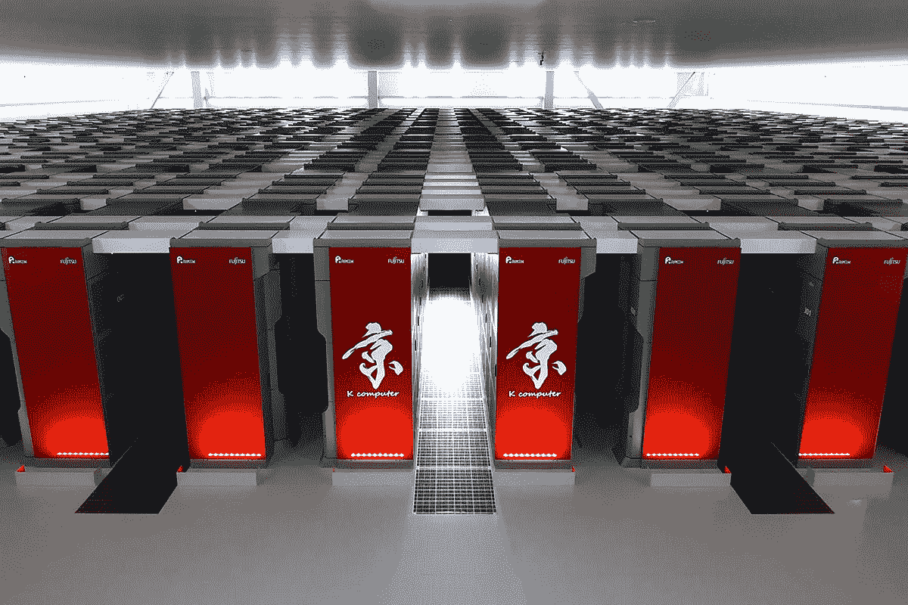
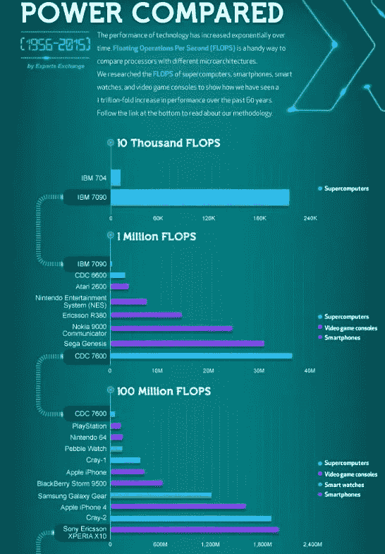
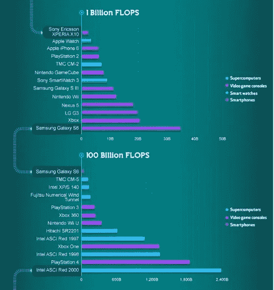
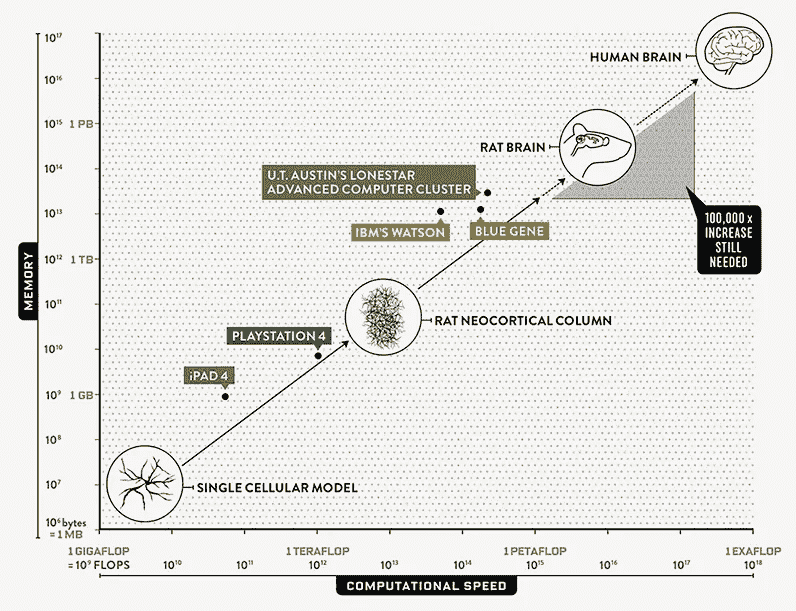
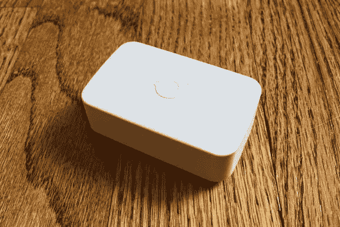
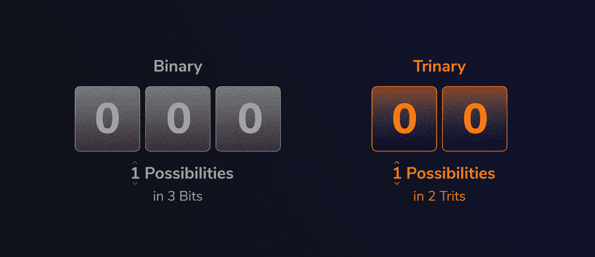
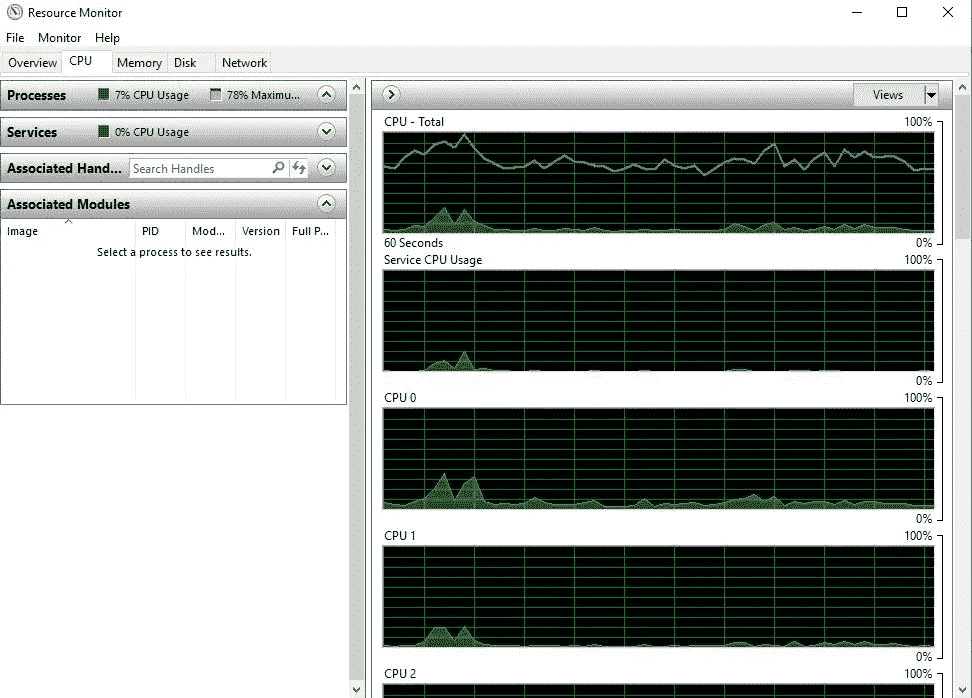
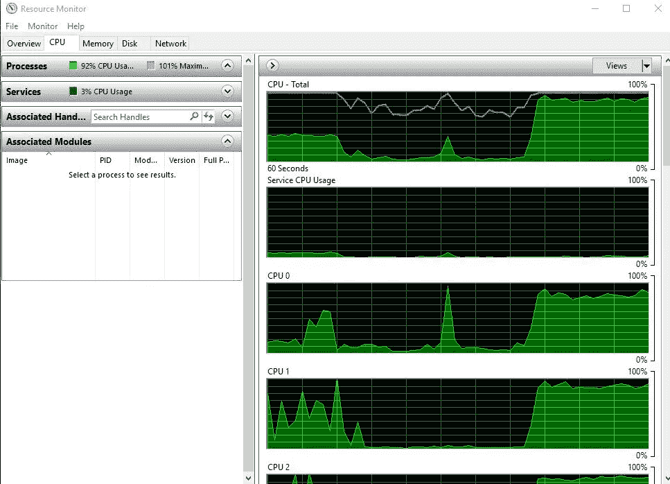

# 第五部分——但是计算资源呢？数字领域的天然气转石油！

> 原文：<https://medium.com/coinmonks/part-v-but-what-about-the-computational-resource-the-natural-gas-to-oil-in-the-digital-realm-bd67064ce954?source=collection_archive---------0----------------------->

当石油这种引发工业革命的资源被发现时，钻井时还发现了一种副产品。与石油一样，天然气也存在于基岩储层中，但最初被发现是无用的。井架和炼油厂最初只是燃烧从地下涌出的天然气，这样他们就可以获得石油。

正如我们所见，数据是推动第四次工业革命的石油，数字化数据的副产品是计算资源。采取物理行动的连接设备，如环境温度、饱和度、市场价格、机器行动等。将物理世界数字化为数据流的将是互联设备。所有这些都是通过使用 CPU、FPGA 和 GPU 的计算资源来完成的。我们收集大量数据的传感器、汽车和机器都处于闲置状态，不积极使用时什么也不做。由于 Qubic 网络是一个已经建立的网络，使用安全缠结来创建一个无感觉支付的数据市场，因此创建一个计算资源市场也并不困难。正如工业革命创造了石油和天然气等商品一样，物联网和第五次工业革命将创造数据和计算资源等商品。

首先，让我们看看千兆次浮点运算的定义。[Technopedia.com](https://www.techopedia.com/definition/14130/gigaflop)指出*“一个千兆次浮点运算等于每秒十亿次浮点运算。浮点运算是浮点数的计算。像“gigaflop”这样的术语通常用于理解处理器速度以及计算机如何处理数据密集型操作，这些操作在某些类型的科学或定量过程中很常见。*免责声明，我不是一个技术人员，我只是试图传达一个非常宽泛的概念，即未来会带来什么，以及 IOTA、Tangle 和量子网络如何成为一个解决方案。因此，在下面的例子中，让我们将浮点运算视为一种非常松散的量化方法，将计算视为一种资源。这可能是不正确的，或者可能不是最终使用的方法，而只是让讨论点使用浮点运算。

K 计算机是由富士通和 FYI 制造的超级计算机，它基于“开源”Linux 内核。它由 80，000 个计算机节点组成，每个节点由八核 SPARC64 VIIIfx 处理器组成，总共有 705，024 个内核。K 计算机加在一起每秒可以完成 10.51 千万亿次浮点运算。目前领先的超级计算机是美国 Summit，为 143.5 petaFLOPS(基于[维基百科 TOP500](https://en.wikipedia.org/wiki/TOP500) )。此外，在同一页上还指出，前 10 名超级计算机使用 Linux 操作系统。当然，Linux 是一个由非营利 Linux 组织支持的开源平台。

[https://www.visualcapitalist.com/visualizing-trillion-fold-increase-computing-power/](https://www.visualcapitalist.com/visualizing-trillion-fold-increase-computing-power/)

现在，为了比较起见，这里是“*一些非常粗略的估计*”。由于我的个人时间有限，很遗憾，我目前没有时间深入研究硬件处理基础。然而，这里有一个简单展示大画面的尝试。在 Nick Routley 的文章中，“ [*可视化计算能力的万亿倍增长*](https://www.visualcapitalist.com/visualizing-trillion-fold-increase-computing-power/) *r* ”中，Apple Watch 可以产生大约 30 亿次 FLOPS，而 iPhone 6 可以产生 80 亿次 FLOPS。以一个可以进行 12000 亿次浮点运算的 PlayStation 4 为例。从你手腕上的简单手表、传感器、智能手机、电脑和游戏系统，一切都有一个可以进行计算的资源。

来自' [*第一部分——那么什么是物联网？*](/@jamesjdsutton/part-i-so-what-is-the-internet-of-things-7752c52c66da)*’*我们发现，2020 年将有 307.3 亿台联网设备，这相当于人均 4.04 台设备。假设有些人有电脑，有些人有 PlayStation，而在第三世界国家，只有智能手机是他们的连接设备，我们可以假设每个设备的计算能力是不同的。如果我们从空气中取出一个随机数，并假设每个设备的平均功率为 3.5 亿次浮点运算，这将相当于 10.7555 万亿次浮点运算的全球组合计算资源(10.7555 的 18 次方)。在约翰·蒂莫尔于 2011 年*、*撰写的 Wired.com 文章[、*、*、*、*中，他指出*、*行星组合资源每秒可进行 640 亿次运算，而 GPU 占其中的 97%(**、*注*、**、*:超级计算机的能力不包括在本分析中*)。考虑到这篇文章是在 2011 年写的，粗略估计 10.7555 万亿次浮点运算是当今全球计算资源的组成部分似乎不是不可能的。](https://www.wired.com/2011/02/world-computer-data/)

[https://www.visualcapitalist.com/visualizing-trillion-fold-increase-computing-power/](https://www.visualcapitalist.com/visualizing-trillion-fold-increase-computing-power/)

拥有 10.7555 万亿次浮点运算，这相当于全球计算资源由以下两者之一组成: **a)** 1，023 台联合 K 超级计算机或 **b)** 74.94 倍于世界上最强大的超级计算机 American Summit。现在让我们考虑一下，据粗略估计，美国 Summit 超级计算机的建造成本为 2 亿美元，K 超级计算机每年的运行成本为 1000 万美元。因此，如果世界拥有 74.94 Summit 的计算能力和 1，023 K 台超级计算机，这相当于 149.88 亿美元的建造成本(74.94 x 2 亿美元)和 102.3 亿美元的年运行成本(1，023 x 1，000 万美元)。这些数字是正确的，甚至是接近的吗？不，绝对不是！然而，我们可以看到，计算能力作为一种资源，毫无疑问在世界范围内具有非常高的价值。更重要的是，仅通过互联设备，世界上就有大量的这种资源。下一个合乎逻辑的想法是，“如果我们能把这种全球资源提供给一个数字市场会怎么样？”

量子比特网络的一部分是使用 *'* [*量子比特计算模型(QCM)*](https://blog.iota.org/eli9-the-qubic-computation-model-623417f94777) *'* 的过程，其中[纳文·拉马钱德兰](https://blog.iota.org/welcome-navin-ramachandran-to-the-iota-foundation-8c3315116ce3)用*这种通俗易懂的术语描述了量子比特如何在 QCM 上运行。通过使用量子和 QCM，这并不一定意味着，我个人也没有读过，有一个量化的方法来将计算分类为一种资源。也就是说，如果人(a)请求购买 *N* 数量的 FLOPS、hashes 或 epochs，则提供该资源的人或设备(B)可以量化该资源并给出价格。这里重要的是，Eric Hop、IOTA 基金会和社区已经找到了解决方案，并且正在创建量子计算模型。Eric 写了一个 6 部分的文章系列， [*Qubic:解释 Qubic 计算模型*](https://blog.iota.org/explaining-the-qubic-computation-model-part-1-13c9e5820ed) *。*虽然如果你不能理解纳文的文章，你肯定也不能理解埃里克的。即便如此，我还是恳求你读一读这两本书。两者都表明，他们已经建立了基础。对于一个不断发展的数字市场来说，这就像社区和经济力量构建的应用程序寻找价格平衡和用例一样简单。不是打死马，但事实表明，不仅计算能力是一种资源，而且世界上还有丰富的资源。就像在第四部 中的加利福尼亚的例子一样，我们发现一些人会在他们的房子周围安装传感器，浪费数据。世界上同样数量的人将拥有联网设备，浪费他们的计算能力。正如我们看到了可以使用未使用数据的用例一样，我们也将创建可以使用未使用计算资源的用例。*

*我们不要忘记这是关于物联网和互联设备的。约翰·蒂莫尔发现，2007 年地球上有 640 亿次运算，这是第二次运算的总和。然而，其中 97%是用 GPU 完成的。现在，我们的智能手机有 GPU，但大多数物联网专用的联网设备没有。大多数物联网传感器和连接设备将专注于两个目标: **1)** 节能和 **2)** 计算轻量化。这两者非常互补，因为如果一个设备在计算上是轻量级的，它也将是节能的。*

**

*比如你有 SmartThings 或者 Alexa 吗？甚至是塞莫普罗？这三样我都有。我把 SmartThings 温度和水传感器放在我的地下室，还有外面的 ThermoPro 传感器。我很快发现，水传感器在 8 个月内烧穿了它的电池，而 ThermoPro 仪表板在 11 个月内耗尽了它的电池。由于物联网为我们提供了传感器可以数字化物理世界的数字空间，不仅是发送数据的操作，而且还发送安全数据(可以加密散列的数据)，设备使用大量能量来进行计算。能效是互联设备和边缘设备的重中之重。*

**

*连接的设备通过其计算操作损失了大部分电池能量。因此，通过使用以三进制编程编写的量子计算模型(-1，0，1 /标准编程是二进制(0，1))，最终结果是一个非常节能的硬件。或者换句话说，指导电子硬件如何动作的编程语言(凯西)创建了量子计算模型。当与实际的三进制硬件结合时，这种硬件语言产生了大约 30%到 40%的能效。所有这些都开始变得技术化，但概念是，缠结、量子网络和量子计算模型都是专为物联网设计的。因此，你不必每 8 个月更换一次水传感器或土壤饱和度传感器的电池，而只需每 4 年更换一次。或者，如果传感器上有一个非常小的太阳能电池，它可能永远也不需要改变。*

*八个月后，我家地下室的水传感器电池没电了。我有一个非常安全的路由器，SmartThings hub，一个水传感器，一个智能手机，可以在我的地下室进水时接收警报，但是，如果设备的电池没电了，整个系统就会失效。嗯，同样，当考虑电池寿命时，我们发现了单点故障。为了减轻这种纠结，量子网络被特别设计来提供一种方法，使设备的能效大幅提高。我在谷歌上快速搜索了一下*[*www . whats 5g . info(energy-consumption)*](https://whatis5g.info/energy-consumption/)*，*“我们的能源计算显示，到 2015 年，无线云将消耗高达 43 TWh，与 2012 年的 9.2 TWh 相比，增长了 460%”。在 [*维基百科*](https://en.wikipedia.org/wiki/World_energy_consumption) *，*上，他们称，2011 年，全球范围内的能源支出总计超过 6 万亿美元。这相当于每小时 6.85 亿美元！想象一下，如果我们能够在物联网的连接设备中减少 35%的能源使用，会怎么样？这会降低多少成本并拯救世界？6 万亿美元相当于 2.1 万亿美元的储蓄。此外，43 太瓦时的能源节省 35%相当于节省 15.05 太瓦时。节省 15.05 太瓦时会降低多少二氧化碳的增加，并支持对抗全球变暖？事实是，世界每年都变得更加互联，更加数字化，需要变得更加节能和安全。因此，IOTA、Tangle 和量子网络的开发不一定是为了今天的需要，而是专门为了明天的需要。**

# ****那么计算资源浪费了吗？****

********

****Left:** CPU usage on my desktop writgin an article at 7% **Right:** CPU usage on my desktop writing an article and running a 12 thread CPU mining program**

**问题是，当你在电脑上的时候，你的电脑是否使用了所有可用的资源，尤其是当你不在的时候？你的 iPhone、iWatch、电视、Alexa 或恒温器怎么样？上面两张图片显示了我的 CPU 在使用它的计算资源时，以及在使用它的同时还在后台运行 CPU 加密挖掘程序时的差异。在常规使用中，它以 7%的速度运行，少数峰值可达 30%；而当它运行采矿程序时，它运行 90%以上。现在，我不会经常长时间运行超过 80%的 CPU，我只是想表明我们的计算机和设备有大量的资源没有被使用。如果我愿意，我可以使用我的一半线程(大约 50%的 CPU 能力)运行 CPU 挖掘应用程序，以及 GPU 节流到 50%的 GPU 挖掘程序，这甚至不会启动风扇，产生那么多热量，或增加我的计算机的声音。换句话说，如果我想，我可以利用未使用的权力。问题是，我有吗？我曾经；然而，我意识到，区块链和采矿只允许非常小的利润，除了浪费电力和破坏环境之外什么也不做。所以作为一个普通的乔矿工，我不这样做。然而，如果有一种方法可以将我计算资源卖给一所大学、一家企业，甚至是我居住的城市，我会这么做。我不仅会提供一种可以为量子网络提供动力的资源，而且这些未使用的资源实际上可以用于一项有益的事业，如尝试解决癌症，支持物联网的发展并帮助社会提高效率。**

**不过，让我们来谈谈利用这种资源能带来什么。让我们来讨论一些我知道每个人都经历过的事情，癌症。亚伦·德布劳在《赫芬顿邮报》上引用了一个事实，即我们有 40%的机会被诊断患有癌症。这意味着，如果你的家庭中有超过 3 个人，或者如果你在世界上认识超过 3 个人，你很可能与某人有联系，并在疾病过程中遭受痛苦。找到癌症的治疗方法就是找到一个特定问题的数学和科学的解决方案。研究人员和科学家面临的许多问题之一是如何获得计算资源，以模拟治疗是否有效。**

**在丹·尼尔关于 Cancertherapyadvisor.com 的文章中， [*“量子计算:癌症研究的未来？”*](https://www.cancertherapyadvisor.com/home/archive/oncology-features/quantum-computing-the-future-of-cancer-research/) *，*丹写道，“加州斯坦福大学的微生物学和免疫学教授加里·诺兰发现自己对现有超级计算能力的有限使用权感到沮丧。排队等候的科学家太多了，排队等候的项目太多了”。丹还写道，“诺兰同意。如果癌症研究中最慢的方面，通常是计算时间，可以移植到像量子计算机这样的并行系统上，它会把几个小时的问题变成几分钟。”他说。**

**目前，IBM 的沃森超级计算机正在接受培训，并用于癌症研究和解决方案，凯西·罗斯和艾克·斯威特里兹在 Statnews.com 讨论了这些问题。 ”差远了。正如 Ross 和 Swetlitz 所写的那样，有许多不同的问题正在阻碍 Watson 成功解决许多医疗问题，部分原因是数据量有限，以及 Watson 需要花费数年时间来改善其人工智能。这篇文章非常清楚地指出了一些事情。文章称，“在回答 STAT 的问题时，IBM 表示，沃森在医疗保健和其他领域仍处于上升轨道，并且“已经是其 200 亿美元分析业务的重要组成部分”。医疗保健是沃森企业的重要组成部分。IBM 的沃森健康部门雇用了 7000 名员工，并认为该行业在未来几年将是一个 2000 亿美元的市场。毫无疑问，沃森正在帮助医疗专业人士，但我们也看到这是一个市场。沃森的计算能力是一种宝贵的资源，目前由一家公司 IBM 控制。是的，这是正确的，一个提供利润和被控制的数字资源。同样，在 19 世纪和 20 世纪，特别是在第三次工业革命期间，我们看到了这种对油气的控制。**

**那么这告诉我们什么呢？**

1.  **世界上有许多对计算资源的需求，这些资源不仅可以解决癌症，还可以解决疾病，解决宇宙的问题，潜在地解决一个创造无尽清洁能源供应的问题。从字面上看，只要有足够的计算能力，任何问题都可以解决。阿基米德说过，“给我一根足够长的杠杆和一个支点，我可以撬动地球”。数据和计算能力相结合就是杠杆，量子网络就是支点。通过利用世界上“未使用的”计算能力，我们可以改变世界。**
2.  **在维基百科文章' [*【沃森(计算机)*](https://en.wikipedia.org/wiki/Watson_(computer)) '中写道，“根据约翰·雷尼…它的 Linpack 性能达到了 80 万亿次浮点运算。正如我们之前所讨论的，世界上有 10.7555 万亿次浮点运算，这相当于 134，443 台沃森超级计算机。在同一篇维基百科文章中，它指出“IBM Watson 的前业务主管 Manoj Saxena 表示，该领域 90%使用 Watson 的护士现在都遵循其指导”。因此，简而言之，世界上有成千上万的超级计算机组合在我们经常连接的设备中，却没有被使用。**
3.  **这是事实。毫无疑问，科学家、研究人员和知识分子都认为，无法获得超级计算机的计算资源限制了进步。需求超过了“T4”集中拥有和控制的强大机器的有限供应。那么，如果有一种方法可以集成所有连接的设备，并使用世界上提供的丰富的计算资源，并且以一种分散、安全和分布式的方式做到这一点，会怎么样呢？有一个答案，这个答案可能是 IOTA、缠结和量子网络。**
4.  **边缘计算正在快速发展。这些非常有限的资源连接设备将不能进行计算工作。仅这一点很难解释，将在后面的文章中解释。然而，需求是存在的，正如我们正在看到农民之间交易水的数据市场的形成，我们也将看到使用 QCM 通过 Qubic 网络外包计算，最终，有人将创建一个成为市场的应用程序。**

# ****结论:****

****

**我们知道，从非常模糊的意义上来说，计算就像天然气之于石油。数据是新的石油，当需要它时，就有资源产生；也就是计算能力。我们可以善加利用它，而不是让它闲置和浪费。正如我们通过 Qubic 网络看到的那样，一个数字市场随着时间的推移而演变。对威尔来说，计算能力的市场也在发展。如图所示，通过使用 QCM(量子计算模型)和整个物联网中的连接设备，量子网络可以共同创建一个非常高效的网络，节省 30%至 40%的能源使用。这无疑是对物联网设备的需求。能够通过屏蔽认证消息(MaM)将数据加密保护到匿名流中，从而不必定期更换传感器，并降低电池故障的风险。更重要的是，这为基础层奠定了基础，使计算能力能够作为一种资源在全球范围内获得。一旦有了基础，只需要社区或公司开发应用程序来利用这种宝贵的资源。当这种联合力量能够以一种安全和分散的方式被利用后，一些行业、科学、政府和组织将会从中受益。再一次，将所有这些结合在一起允许分布式全球超级计算机比十万台超级计算机更强大。如此强大的力量只能以分散、分布式、安全和开源的方式构建。**

*   **第 1 部分——那么什么是物联网？**
*   **[第二部分——物联网和集中化解决方案……](https://medium.com/p/78498dbac25f/edit)**
*   **[第三部分——物联网需要免费吗？物联网需要开源吗？](/@jamesjdsutton/part-iii-does-the-internet-of-things-need-to-be-feeless-169ee115fe02?postPublishedType=repub)**
*   **[第四部分 Qubic 项目！](/p/part-iv-the-qubic-network-94a953f928d2?source=email-36f97abac343--writer.postDistributed&sk=358b4d1ebd026ab66b49b43febae4f37)**
*   **第五部分——但是计算资源呢？数字领域的天然气转石油！**
*   **[第六部分——人工智能& AiGarth](/@jamesjdsutton/part-vi-aigarth-a-distributed-artificial-intelligence-ae6c45a46014?source=friends_link&sk=c5f3f6a6dbfcdd2d8731a8e3059f70df)**
*   **第七部分——生活在边缘！金，最后一块拼图。当这些都聚集在一起时，会产生什么？**

> **[直接在您的收件箱中获得最佳软件交易](https://coincodecap.com/?utm_source=coinmonks)**

****