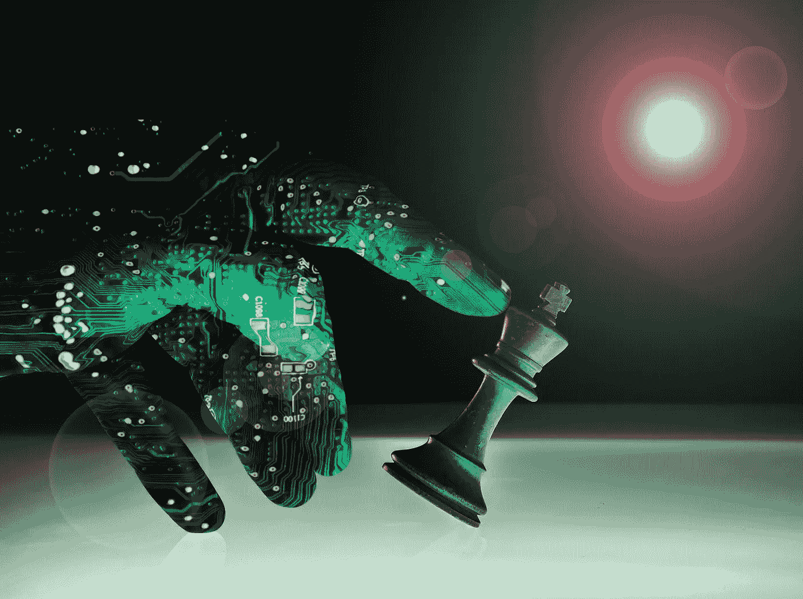
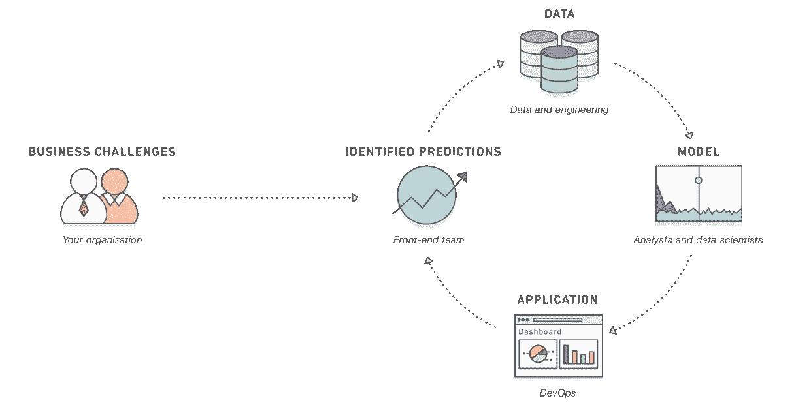
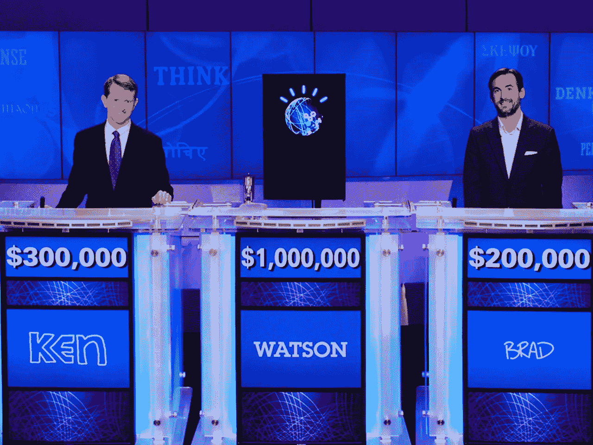
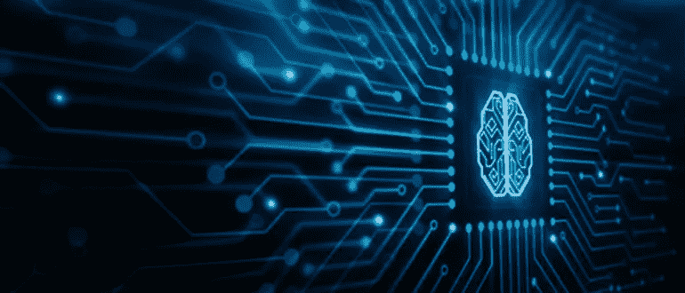

# 第六部分——ai garth……一个分布式人工智能

> 原文：<https://medium.com/coinmonks/part-vi-aigarth-a-distributed-artificial-intelligence-ae6c45a46014?source=collection_archive---------1----------------------->

***前言:*** *从这一点来看事情还没有变得完全公开。比如，AiGarth 到底是什么，它将如何与 IOTA 和 Tangle 相互作用。或者，IOTA、Tangle 和 Qubic 的基础层如何开始结合在一起，为世界资源(如数据和计算能力)创建一个生态系统？同样，群体智能在哪里？拼图在哪里？*

要明白，以下只是一个简单的思想实验。例如，如果人工智能有一个安全的消息传递协议，输入经过处理和可消化的数据，这种类型的人工智能会变成什么样。或者它能做什么？如果这些是构建模块，那么从它们可以发展出什么样的应用呢？在这篇文章中，我将讨论人工智能以及一个安全的无感觉分布式网络如何支持人工智能的发展，并使一个没有任何政府或公司可以拥有其最大份额的系统成为可能。我将讨论人工智能如何不会成为终结者，它如何不会取代每个人的工作，以及人工智能应该如何由多数人控制，而不是少数人。同样，我可能在某些方面是不正确的。我自己不是一个技术人员，但我只是试图激发思考和讨论，关于未来的 a 可能是什么。同样，如何 IOTA 和纠结是一个关键的力量，保持少数人的权力，而是为许多人。

# 让我们来定义人工智能

在拜伦·里斯(Byron Reese)所著的《第四时代》(The four Age)一书中，他描述了如何存在两种类型的人工智能(AI)。

*   人工狭义智能
*   人工通用智能(AGI)

他描述说，电影中描述的将成为奇点的人工智能机器人，一个可以立即变得比人类更聪明和更强大的机器人，不是我们社会中当前的人工智能。我们在《黑客帝国》中看到的使用人类作为能源的人工智能，被称为人工通用智能(AGI)。这个人工智能与我们今天拥有的人工智能有很大不同。在你自己的口袋里，如果你有一部较新的 iPhones，你就有了一部支持人工智能的联网设备。来自 2018 年的一篇文章， [*苹果最新的 iphone 充满了人工智能*](https://www.wired.com/story/apples-latest-iphones-packed-with-ai-smarts/) 汤姆·西蒙尼特(Tom Simonite)在 Wired.com 说，“周三宣布的三款 iphone 都包括一款名为 A12 的新芯片，由苹果内部设计。它有一个称为神经引擎的单元，专门用于运行最近机器理解语音和图像能力进步背后的神经网络软件。”阅读这篇文章的许多人现在正在一个人工狭义智能(ANI)硬件连接设备上这样做。

如果你看看你的手机，你认为它能接管世界吗？这就是 AGI 和阿尼的区别。那么问题就变成了，如果他们创造了阿尼，社会能创造 AGI 吗？人们争论这个问题不一定是从“AGI 能否被创造出来”的角度，但更可能是在我们的有生之年，或者在我们必须害怕它的足够短的时间内被创造出来。我个人的看法是，ANI 本身会帮助我们研究、分析并最终创造一个安全可控的 AGI。现在，有人会说，“一旦 AGI 被创造出来，就无法阻止它，它会认为人类没有效率，让我们成为他们的奴隶。我们会成为他们的蚂蚁！”。如果上述说法是真的，那么我们就完了。事实是某个国家、某个公司或某个人毫无疑问会有一天(也许在 200 年后)，但有一天会建造一个 AGI(如果可能的话)。我个人的想法是，有一天 AGI 会被创造出来，但在那之前，我们应该专注于提高我们的 ANI 技术能力，这可能只是我们研究和分析创造一个安全和可控的 AGI 的解决方案所需的强大资源。换句话说，人工狭义智能是存在的，而且会一直存在。

# 但是 AI 真的在这里吗？！？

在 [*第五部分*](/coinmonks/part-v-but-what-about-the-computational-resource-the-natural-gas-to-oil-in-the-digital-realm-bd67064ce954?source=friends_link&sk=e4e56ac062c1b23577ba449b6cf69375) 中，我们讨论了全世界的计算资源不仅宝贵，而且被浪费。此外，政府和企业如何拥有超级计算机，并控制和监管对它们的访问。我们看到人工智能需要大量的数据和计算能力才能正确工作，例如超级计算机，或者提供计算资源访问的分布式网络。因此，像 IBM 这样的公司和沃森、或者像美国这样的政府正在利用这些可以运行人工智能程序的超级计算机。比赛开始了。即使是现在，美国能源部(DoE)宣布将拨款 6 亿美元建造世界上最快的超级计算机 Frontier，每秒可完成 1.5 万亿次计算，比目前最快的超级计算机 Summit 快 10 倍左右。

人们总是认为人工智能需要严格的参数来编程，正如我们在 Alpha Go 中看到的那样。那种狭隘，在描述人工狭隘智能时是非常狭隘的。然而，Alpha Zero (Alpha Go 的继任者)向我们展示了，通过简单地编程一组规则，AI 程序就可以简单地自学。它没有通过向人工智能程序提供人类策略来学习，而是简单地自学并创造了自己的游戏策略。它不仅能够做到这一点，而且在围棋比赛中多次击败它的前辈。 [*围棋，*](https://en.wikipedia.org/wiki/Go_(game)) 是 2500 多年的中国游戏。可能的棋盘位置或不同游戏位置的下限估计是(2×10 的 170 次方)。作为比较，在已知的宇宙中有 10 的 80 次方个原子。所以有比我们能想象到的更多的指数运动。换句话说，人工智能计算机不能简单地学习动作，而是必须教会自己一种策略。

那么，这到底是人工广义智能还是人工狭义智能呢？其实就是阿尼。它再擅长教自己围棋，也还是只会编程下围棋。这种人工智能绝不可能简单地决定接入万维网，改变它的程序，在所有连接的设备中分发它自己，然后最终接管世界。这些人工智能程序虽然强大，但在解决什么问题上仍然非常特别。关键是，他们解决问题极其出色！事实上，他们解决问题不仅比人类更好，而且比其他人工智能更好！事实证明，不仅人工智能在特定任务上的表现比人类更好，甚至人工智能也比其他人工智能表现更好。

# 所以人工狭义智能会一直存在，…现在呢？

Implementing Machine Learning In Your Organization (from aws.amazon.com/machine-learning/whatis-ai/)

那么 ANI 能为我们做些什么呢？[Aws.amazon.com，*什么是人工智能？机器学习和深度学习*](https://aws.amazon.com/machine-learning/what-is-ai/)*’；*他们指出，“机器学习(ML)是一个通常用于模式识别和学习的贝叶斯技术的名称。在其核心，机器学习是一系列算法的集合，这些算法可以从记录的数据中学习并根据记录的数据进行预测，在不确定的情况下优化给定的效用函数，从数据中提取隐藏的结构，并将数据分类为简洁的描述。”“使用正确的数据，ML 模型可以分析具有数十亿个示例的高维问题，以找到可以预测给定输入结果的最佳函数。”

Amazon 继续指出用例有:异常检测、欺诈检测、客户流失和内容个性化。然而，我们随处可见人工智能。我们在谷歌上看到并使用它进行搜索，我们的智能手机使用人工智能，医疗行业，视觉图形，科学，制药，体育，银行，营销行业，金融行业，等等。差不多，*每个*单一行业目前都在使用人工狭义智能。

人工智能本身就是一种宝贵的资源，市场价值数百亿美元。在 2017 年的一篇杂志文章中的[orange-business.com](https://www.orange-business.com/en/magazine/who-is-in-control-of-ai)上，他们表示，2017 年认知和人工智能系统的全球收入将达到 120 亿美元，自 2016 年以来增长 59%。他们进一步表示，公司正在进行整合，例如微软在 2017 年早些时候收购了初创公司 Maluuba 的人工智能专业知识。正如 [*第五部分*](/coinmonks/part-v-but-what-about-the-computational-resource-the-natural-gas-to-oil-in-the-digital-realm-bd67064ce954) 所说，正如天然气成为一种资源一样，计算能力也将成为一种资源。公司已经在人工智能资源上获得了市场份额。

亚马逊是一个明显的例子，表明数据对其机器学习过程是有价值的。在第五部分中，我们还讨论了 IBM 的超级计算机 Watson 如何很好地帮助医疗行业，以至于该领域 90%的护士都听从 Watson 的指导。此外，我们发现，拥有足够数据的超级计算机或巨大的计算能力，最终将支持人工智能解决癌症治疗等社会问题。我们看到人工智能程序是由分布式计算能力驱动的应用程序。喂养这些程序不仅能推动人类进入下一个层次，还能推动人类进入下一个时代！

# 所以 AI 是聪明的，它在这里。会夺走我的工作吗？！？

所以问题变成了，这种将推动下一次工业革命的新应用会让人类失业吗？这是一个有争议的话题，我个人以前认为，人工智能“会”让人类失业，直到我读到拜伦·里斯的《第四时代》。Reese 在第九章中指出，“技术是网络工作破坏者的指责已经争论了很长时间。16 世纪 80 年代，李浩发明了织袜机。他利用一些关系，安排向伊丽莎白女王展示他的设备，希望获得皇家专利。王后认为这个装置很狡猾，但告诫李说，你想想这个发明会对我可怜的臣民产生什么影响。这肯定会给他们带来毁灭，剥夺他们的就业，从而使他们成为乞丐。”

事实上，李不得不离开英国，因为霍西尔的愤怒。这比蒸汽机发明早了 100 多年！从字面上看，400 多年来，技术进步一直是一个永恒的话题，机器将使工人失业，最终成为乞丐！所以，你能告诉我，你知道有多少 hosiers 在街头乞讨？里斯阐述了许多其他的例子；不仅仅是技术和机器在过去的一千年里是如何进步的，更是主要的进步。比如火的发明，蒸汽机，计算机，最后是人工智能。他指出，在所有这些年里，是的，人们可能失去了工作，但每一项新发明都创造了新的工作，不仅取代了旧的工作，而且创造了比以前更多的工作。事实是，有历史证明，机械和认知行业的机器和技术进步只是让人类表现得更好！我们变得越有效率，我们能完成的任务就越多，政府和组织通过这种技术援助获得的资源就越多。这提供了更多的机会和资源，从而为人们创造了更多的工作和活动。

所以，不，人工智能不会让 50%的员工永远失业，那不会发生。社会将会像过去 500 年机械和认知机器兴起时一样进行调整。然而，有一点是肯定的，人类对人工智能的访问越多，人工智能对处理过的数据的访问就越多，这仅仅意味着人类和社会的生产力和效率可以更高。

# 人工智能:集中还是分散？

我们现在知道，人工智能不仅仅是一个小小的计算机程序。这是一个绝对强大的应用程序，正在成为一个更有价值的资源。因此，问题就变成了，这个应用程序应该由一个中央实体来构建和控制，还是应该构建在一个“任何人”都可以免费使用的分散和分布式安全网络之上？别忘了，在 [*第二部分—物联网和集中化解决方案……*](/@jamesjdsutton/part-ii-the-internet-of-things-and-the-solution-to-centralization-78498dbac25f)*，*中，我讨论了物联网如何不能建立在集中式协议层上，这只会导致网络弱点和中心故障点。

Siemens FABRIC — [https://vimeo.com/345494979](https://vimeo.com/345494979)

*以上视频是西门子 FABRIC 的一个片段。我不太了解它，但它表明西门子正在创建一个记录、访问和分析数据的系统，以创建一个新的“智能城市”。它清楚地显示了他们称之为“模式”或数据的宝贵资源。这些城市的模式只是人工智能可以处理和分析的数据。正如他们所说，这种织物将开发一个数字生态系统。再说一次，人工智能在这里，问题变成了我们希望像西门子、脸书或亚马逊这样的公司控制它们吗？*

Tangle 提供了一种去中心化、分布式和安全协议的解决方案，物联网可以建立在这种协议之上。在 [*第四部分——量子网络！*](/coinmonks/part-iv-the-qubic-network-94a953f928d2) *，*我展示了 Qubic 网络如何建立在安全的分散协议之上，提供无缝的数据处理方法，不仅可以验证，还可以为应用程序提供可消化的数据。第五部分——但是计算资源呢？数字领域的天然气转石油！ *，*我描述了 Qubic 网络如何将物联网专用的三元编程语言编写的 QCM 用于轻量级边缘设备；此外，ABRA 还提供了一种语言来支持 QCM，这为世界计算资源创造了一个分散的市场。现在，我们可以开始看到这些拼图是如何开始无缝拼接在一起的。我们有一个安全的分散协议，一个处理和数据验证层，特定的编程语言，以允许访问计算能力的世界分布式资源，当你把所有这些放在一起，什么样的应用程序可以运行？答案， [*艾加斯*](/@comefrombeyond/introduction-of-aigarth-f40e741e256c) 。

其中一个主要的远见者想象了一个世界，在那里全球计算资源可以被利用并用于人工智能，一种如此强大的力量，它只应该与全人类共享。这是一种宝贵的资源，不应由少数企业集团或政府控制。其中一位远见卓识者是谢尔盖·伊万格洛，又名来自远方的 T2，T3，T4。他相信他和其他创始人能够完成这个挑战，即使困难重重。然而，让我们看看事实。我们已经看到公司是如何成为全球网络的中心失败点的，但是政府呢？他们会用仁慈还是贪婪来管理 AI 这样的资源？

theverge.com 的詹姆斯·文森特在文章中讨论，“普京说在人工智能方面领先的国家‘将成为世界的统治者’”。

不仅行业理解人工智能的力量和重要性，政府也是如此。

“人工智能是未来，不仅是俄罗斯，而是全人类的未来，”普京在接受 RT. The Verge 采访时表示，“近年来，人工智能的发展越来越成为一个国家安全问题。中国和美国(而不是俄罗斯)被视为两个领跑者，中国最近宣布了到 2030 年成为人工智能研究全球领导者的雄心。”他们在文章的后面写道，“普京指出，俄罗斯不希望看到任何一个国家‘垄断’这一领域，而是说:”如果我们成为这一领域的领导者，我们将与整个世界分享这一技术，就像我们今天分享我们的核技术一样。“所以我们必须想象一下，如果政府拥有如此先进的技术，会是什么样子。他们会用它来支持社会，还是仅仅用它来提升自己的控制力和权力？

看看美国，当他们拥有比其他国家更强大的技术时。观看电影《斯诺登》,看看美国国家安全局是如何追踪，以及目前追踪任何人和所有人的数据的！

中国怎么样？正如 The Verge 所说，他们希望在 2030 年成为人工智能技术的世界领导者？*描述了中国的情况，目前正在追踪工人的脑电波！没错，他们让员工在头上戴一个设备，这样公司和政府就可以跟踪他们的脑电波数据。他们可以评估工人是否疲劳、注意力集中、快乐、悲伤或疲劳。另一个故事*商业内幕*写道，中国已经实施了 [*社会信用体系*](https://www.businessinsider.com/china-social-credit-system-punishments-and-rewards-explained-2018-4) 。众所周知，中国对数据有着无法满足的渴望，并将其视为控制其公民和其他国家的一种资源。*

*那么普京和他的评论怎么样，“如果我们成为这一领域的领导者，我们将与整个世界分享这一技术，就像我们今天分享我们的核技术一样。”这里有一个问题，俄罗斯政府在切尔诺贝利灾难之前和之后有没有试图保守任何秘密？*

**

*答案是肯定的！HBO 电视台的《切尔诺贝利》( Chernobyl )(切尔诺贝利)是一个很好的例子，说明了俄罗斯不仅对自己的同胞隐瞒了反应堆的核技术缺陷，还试图对世界隐瞒切尔诺贝利事故。*

*这几个事实简单地表明，当政府拥有极其强大的资源时，他们经常不能采取正义和道德的行动，而几乎总是以贪婪和不道德的方式行事。看到微软收购人工智能初创公司，IBM 专注于获得认知行业的市场份额，西门子专注于智能城市，很明显，谷歌和脸书这样的公司不仅试图控制数据和人工智能，而且他们经常无法保持数据和资源的安全。*

*当他们无法保护像 AI 这样强大的资源时，会发生什么呢？未能建立一个安全的人工智能全球网络有可能导致灾难性的后果。答案是，人工智能应该是一个建立在分散和分布式协议之上的应用程序，这样每个人都有访问的自由，每个人都可以看到彼此是如何使用它的。这样，我们可以避免像切尔诺贝利这样的数字灾难，并试图从老大哥的窥探中获得一些隐私，至少，试图阻止中国记录我们的想法！*

# *那么艾加斯是什么？！？*

*事实是我不知道！然而，如果我试图专注于缠结和量子网络的可能性，我们可以想象它带来了几个变量，可以让人工智能成长和繁荣。想象一下，如果人工智能是分散的，并且能够被所有人以安全的方式访问，那会是什么样子？*

*在第四部分，我们讨论了农民如何利用数据和量子信息更有效地种植作物。正如我们所发现的，数据安全地通过量子网络处理的缠结。有了经过处理的安全数据，这就创造了人工智能可以利用的信息领域。基本上是花园，大规模的农场，以及人工智能需要喂养和生长的领域。*

*我们在第五部分中也看到了量子计算模型如何为人们提供一个市场来放置他们未使用的计算资源。世界的资源现在可以为人工智能提供动力，以处理他们的算法，并在全球范围内进行学习。医生们不再需要排队等候使用超级计算机，政府也不再对他们的权力保密。相反，人工智能可以在一个全球数字世界中蓬勃发展，这个世界充满了难以想象的数据量，并以相当于数十万台超级计算机的能力为动力。医生和科学家可以畅通无阻地使用人工智能技术来解决社会问题。像脸书和谷歌这样买不起大型超级计算机的小公司可以创造自己的商业人工智能，并在行业内竞争。寻求通过监视政府来保护公民的非营利组织可以使用人工智能来确保政府不会不道德地使用他们的人工智能。人工智能作为一种资源太珍贵了，不能由少数人来保管。*

*此外，通过集群和 Qubic 管理者控制的环境，可以在这些受控的私人缠结中测试人工智能。任何人都可以先测试它们，确保它们的完整性，然后将它们发布到主网上，而不是简单地将它们公开发布。AiGarth 是一个人工智能生态数字环境，允许人工智能诞生、学习、成长，并解决人类和机器希望解决的问题。*

# *结论:*

*当前世界的数据、计算资源和人工智能应用不仅被少数几个政府和少数几个公司控制，而且没有一个政府和公司可以自由地连接、共享和合作以改善社会。相反，我们看到政府囤积权力，公司寻求获得市场份额。有了 Tangle、Qubic Network 和 AiGarth，我们可以拥有一个安全的、无许可的分散式网络来处理数据，并实现一个数字计算市场，以便全球的 AI 可以由世界上的每个人自由访问和驱动。*

*通过一点研究，我们还发现，人工智能不会取代所有人的工作。正如在 16 世纪，技术进步使人类成为…嗯…更好的人类。社会和人类作为一个整体将变得更加熟练和高效的人工智能。然而，如果这种力量被少数人控制，那么只有少数人会进步。这最终只会扩大“富人”和“穷人”之间的差距。*

*我们在 Siemens FABRIC 视频中看到，可以收集、处理和分析整个城市的数据以获得“模式”。这是不断增长的人口的基本需求。所有这些数据都可以由人工智能处理，并提供难以想象的进步和效率，让所有人的生活更美好。这才是真正的物联网！这是大局。最重要的是:IOTA、Tangle、Qubics 和 AiGarth 可以解决许多来自集中数据和人工智能技术的问题。世界进步的唯一真正途径是通过权力下放。只有这样，人工智能才能帮助“所有”人，而不仅仅是少数人。*

*然而还有最后一个问题，最后一个挑战。我们如何在源头确保数据的完整性？我们如何在边缘对物联网设备中的数据进行加密散列，并潜在地减少不良因素？这是一个大问题。这些类型的操作有巨大的功率限制，以确保在源处的这种数据完整性。此外，面对数量庞大的数据点和资源有限的设备，它们能一起行动吗？他们能分割和分配大型计算，然后加入一个群体吗？他们能与每个个体的小智能一起工作，并把它们组合成一个数字群体智能吗？我相信这就是最终拼图所展示的。有了 Jinn、the Tangle、Qubics 和 AiGarth，机器经济可以开始随着群体智能进化，确保自始至终的数据完整性，并改变我们所知的社会。我将在第七部分——生活在边缘——尝试解释这些方面。Jinn &蜂群。最后一块拼图。当这些都聚集在一起时，会产生什么？*

*   *[第一部分——那么什么是物联网？](/coinmonks/part-i-so-what-is-the-internet-of-things-7752c52c66da?source=friends_link&sk=92b8b8e786ab7bc827b5162860688bd3)*
*   *[第二部分—物联网和集中化解决方案……](https://medium.com/p/78498dbac25f/edit)*
*   *第三部分——物联网需要免费吗？物联网需要开源吗？*
*   *[第四部分 Qubic 项目！](/p/part-iv-the-qubic-network-94a953f928d2?source=email-36f97abac343--writer.postDistributed&sk=358b4d1ebd026ab66b49b43febae4f37)*
*   *第五部分——但是计算资源呢？数字领域的天然气转石油！*
*   ***第六部——人工智能&艾加斯***
*   *第七部分——生活在边缘！精灵和蜂群。最后一块拼图。当这些都聚集在一起时，会产生什么？*

> *[在您的收件箱中直接获得最佳软件交易](https://coincodecap.com/?utm_source=coinmonks)*

**