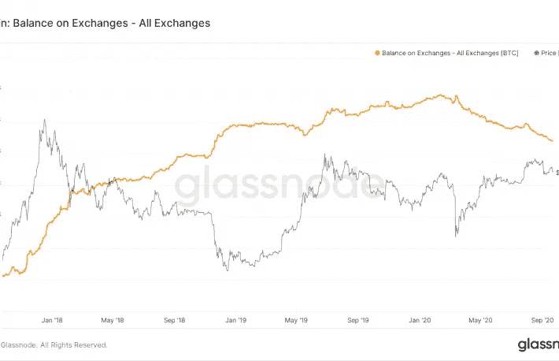
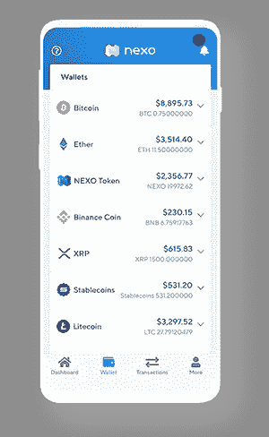

# 加密货币的被动收入 2021 |经验和建议

> 原文：<https://medium.com/coinmonks/passive-earning-of-cryptocurrencies-experience-and-recommendations-9d83da6cae98?source=collection_archive---------0----------------------->

Photo by [Clifford Photography](https://unsplash.com/@cliffordgatewood?utm_source=unsplash&utm_medium=referral&utm_content=creditCopyText) on [Unsplash](https://unsplash.com/s/photos/crypto?utm_source=unsplash&utm_medium=referral&utm_content=creditCopyText)

在这篇短文中，我想与你分享我使用集中服务赚取利息的经验，如 Celsius、BlockFi、Crypto.com 或 Nexo。这些平台允许你通过将比特币或以太坊等加密货币存入它们的平台来赚取可观的利息(大约每年 5%)。大多数这些服务都是通过移动应用程序来操作的，通过提供实时的收益率估计，根据平台的不同，每天、每周或每月支付利息，使利息赚取变得非常容易和有趣。

# 什么是加密货币生息？

就像过去的好银行在客户将菲亚特存入储蓄账户时支付利息一样，新兴的加密货币经济平台/银行也开始提供类似的服务。想法很简单:你让他们控制你的加密货币，他们让它们工作，从中获利，并与你分享一定比例的利润(通常约为 5%的 APY——年收益率)。您有权随时提取您的加密货币(取决于条件，更多信息请见下文)，所以一般来说:没有任何附加条件。

这些平台的存在是最近几个月币安等热门交易所持有的加密货币数量稳步下降的原因之一，原因是用户将他们的资金转向私人地址、收益农场和借贷平台。

Cryptocurrency held in exchanges decreases while price increases

# 这些公司如何赚钱来支付给我们 5%的 APY？

经过一番调查，这些公司的主要收入来源如下:

## **1。对机构和个人的贷款**

这是主要的收入来源。一些公司，如 Celsius，严重依赖机构借款人，他们需要提供高达 2-3 倍的借款加密货币，作为现金或其他加密货币的抵押品。这有助于在借入资产的波动性出现峰值的情况下控制风险，在这种情况下，Celsius 和客户在收到追加保证金通知之前有足够的保证金进行操作。出于好奇，你可以在这里找到对 Celsius 首席执行官非常直接的点对点采访，其中提供了一些关于该公司如何运营的细节:【https://www.youtube.com/watch?v=_VB8j8yl8YU】T2&t = 725s。

像 Nexo 这样的其他公司有另一种方法，他们专门针对零售客户，提供他们所谓的信用额度。本质上，一旦你存入你的加密货币，根据该加密货币的估值，你有权获得一定数量的法定货币，他们称之为信用额度。例如，我存入链接，我可以获得 500 美元的潜在信用额度。如果我申请信用额度，Nexo 将通过银行转账借给我 500 美元，我的密码将被锁定，直到我偿还债务和一些利息。我认为这项服务是用户获得流动性的一种便捷方式，而不必摆脱加密货币，这有点像一个加密典当行，在那里你锁定你的资产以换取现金，因为你知道从长远来看加密货币将比法定货币更有价值。

## 2.加密货币挖掘

这些平台利用用户存款的另一种不太为人知的方式是通过赌注(股权证明)赚取加密货币，这是一种加密货币挖掘形式，替代了比特币广受欢迎的工作证明。它目前适用于一小部分加密货币，如 Cardano(即将推出以太坊！)并且本质上涉及锁定加密货币以成为网络验证器。网络验证器被赋予验证块的任务，这反过来为它们提供挖掘奖励和费用。

## 3.低产农业

分散金融(DeFi)中一个新的流行趋势是向所谓的流动性池提供流动性，例如像 Tether 这样的加密货币。这些是运行在以太坊上的智能合约，作为一个分散的交易所，因为它们允许任何有权访问以太坊的用户交换令牌和以太坊，而不依赖于像比特币基地或币安这样的集中交易所。这些智能合约使用一个非常特殊的等式来自动平衡出售资产的价格，它们有一个非常有趣的系统，通过该系统，购买或出售加密货币的费用直接交给流动性提供商。因此，如果你作为一个用户或本文中提到的任何一个平台，将特定数量的代币(例如和戴)存入其中一个流动性池，你将获得 5%到 15%的的费用回报。因此，这些公司也利用这个系统赚取一些额外的现金似乎是合理的。

# 有什么风险？

当然，每一项投资都有风险，这也解释了为什么它们能提供高利息。这些服务的主要风险是:

1.  **集权**。你可能听说过:“不是你的钥匙，不是你的加密货币”。这些公司与比特币基地等任何托管解决方案没有什么不同，因此它们拥有访问加密货币的私钥。这意味着，当你同意赚取利息时，你就同意让他们完全使用你的资金。除了与依赖集中服务相关的道德或伦理问题(这是 crypto 成为完全分散经济的目标)，这意味着该公司可以用你的资金做任何他们想做的事情，比如和他们一起去巴哈马。这就是为什么做自己的研究很重要(DYOR ),并且只信任有信誉的公司。
2.  **黑掉**。任何托管解决方案都有被黑客攻击的风险，这意味着你的资产可能会被盗。不幸的是，这些公司中的大多数没有保险以防被盗，这部分是由于缺乏对加密空间的监管。
3.  **默认**。公司可能会破产，在这种情况下，你的资金可能无法获得或只能部分退还。

意识到这些问题非常重要，所以如果你愿意通过这种方式获得利益，我的建议有两点:

1.  做你自己的研究，确保你只投资我提到的那些有信誉的公司:Celsius，BlockFi，Nexo，Crypto.com 等。
2.  多样化:不要把所有的鸡蛋放在同一个篮子里。大多数平台的利率非常相似，因此明智的做法是将加密货币分散到不同的平台，以减轻其中一个平台出现问题的影响。

# 这些公司如何支付利息？

每个公司都有自己的条件，一些公司要求冻结你的资产 1、3 或 6 个月(Crypto.com)，其他公司允许你取出你的钱(Celsius，BlockFi，Nexo)，但警告说，如果你在利息支付日之前取出，你将不会获得该周或该月的利息。每家公司的支付期限都不同:Nexo 按日支付，Celsius 按周支付，BlockFi 按月支付，Crypto.com 在锁定期结束时支付。

请注意，这些公司中的大多数将允许您以实物(您将在您存放的同一密码中收到您的收入)或他们自己的令牌的形式获得密码。用自己的代币支付(比如 CEL 代表 Celsius，Nexo 代表 NEXO)通常意味着额外的 1-2% APY，但要注意，与比特币相比，代币的效用和波动性可能不值得。我个人的经验是投资一大笔钱在 Crypto.com 的 CRO 代币上，由于公司糟糕的管理和代币相关条件的急剧变化，几周内价格下跌了 50%。在我看来，你最好从比特币这样的流行密码中获得回报，比特币作为人类历史上最大的升值资产，其增长很难被这些平台提供的本地代币取代。

# 怎么才能入门？

Nexo interface

所有提到的平台都提供移动应用程序，使注册、KYC(如有必要)、存放加密货币和开始赚钱变得极其容易。比如左边是 Nexo 的界面。

只需前往 google Play 或 IOS 应用商店下载应用程序。

最后一个建议:关注 reddit 和 twitter 中的所有这些平台，它们经常发布更新，社区非常强大。

## 感谢阅读！

我希望这篇文章对你有用！如果你喜欢它并想支持我，请在注册时使用这些推荐代码/链接。我们将**都收到 20 到 40 美元**:

*   摄氏:1800329 度 20 分
*   区块链:【https://blockfi.com/?ref=5bf8de85 
*   Crypto.com: d7d68apq6c

如果你有任何问题，你可以在这里找到我:【www.linkedin.com/in/gerard-martinez-rosell 

## 另外，阅读

*   最好的[密码交易机器人](/coinmonks/crypto-trading-bot-c2ffce8acb2a)
*   [Deribit 审查](/coinmonks/deribit-review-options-fees-apis-and-testnet-2ca16c4bbdb2) |选项、费用、API 和 Testnet
*   [FTX 密码交易所评论](/coinmonks/ftx-crypto-exchange-review-53664ac1198f)
*   最好的比特币[硬件钱包](/coinmonks/the-best-cryptocurrency-hardware-wallets-of-2020-e28b1c124069?source=friends_link&sk=324dd9ff8556ab578d71e7ad7658ad7c)
*   [密码本交易平台](/coinmonks/top-10-crypto-copy-trading-platforms-for-beginners-d0c37c7d698c)
*   最好的[加密税务软件](/coinmonks/best-crypto-tax-tool-for-my-money-72d4b430816b)
*   [最佳加密交易平台](/coinmonks/the-best-crypto-trading-platforms-in-2020-the-definitive-guide-updated-c72f8b874555)
*   最佳[加密贷款平台](/coinmonks/top-5-crypto-lending-platforms-in-2020-that-you-need-to-know-a1b675cec3fa)
*   [莱杰 vs 特雷佐](/coinmonks/ledger-vs-trezor-best-hardware-wallet-to-secure-cryptocurrency-22c7a3fd391e)
*   [block fi vs Celsius](/coinmonks/blockfi-vs-celsius-vs-hodlnaut-8a1cc8c26630)vs Hodlnaut
*   Bitsgap 评论——一个轻松赚钱的加密交易机器人
*   为专业人士设计的加密交易机器人
*   [PrimeXBT 审查](/coinmonks/primexbt-review-88e0815be858) |杠杆交易、费用和交易
*   [在线评论](/coinmonks/haasonline-review-d8d1a3400419)享受九折优惠
*   Bitmex 上的[保证金交易的白痴指南](/coinmonks/the-idiots-guide-to-margin-trading-on-bitmex-dbbd7742c6fc?source=friends_link&sk=7bfa99d2a181142510c8442c8ddb0786)
*   [eToro 评论](/coinmonks/etoro-review-78807ddeb33c) |交易股票、密码、交易所交易基金、差价合约和商品
*   [Bitmex 高级保证金交易指南](/coinmonks/bitmex-advanced-margin-trading-guide-2270c195ce25?source=friends_link&sk=1d986cca731f5084b9a2db4a4bc4a7ad)
*   开发人员的最佳加密 API
*   [最佳区块链分析工具](https://bitquery.io/blog/best-blockchain-analysis-tools-and-software)
*   [加密套利](/coinmonks/crypto-arbitrage-guide-how-to-make-money-as-a-beginner-62bfe5c868f6)指南:新手如何赚钱
*   顶级[比特币节点](https://blog.coincodecap.com/bitcoin-node-solutions)提供商
*   最佳[加密制图工具](/coinmonks/what-are-the-best-charting-platforms-for-cryptocurrency-trading-85aade584d80)
*   了解比特币最好的[书籍有哪些？](/coinmonks/what-are-the-best-books-to-learn-bitcoin-409aeb9aff4b)

> [直接在您的收件箱中获得最佳软件交易](https://coincodecap.com?utm_source=coinmonks)

