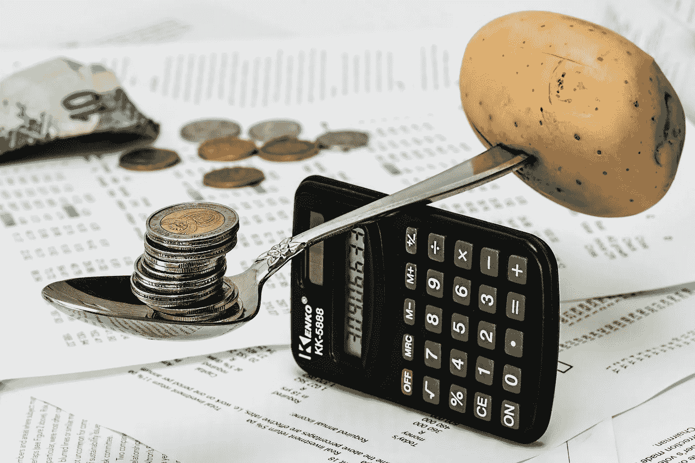

# 被动收入和产量农场优化

> 原文：<https://medium.com/coinmonks/passive-income-and-yield-farm-optimizers-34a146d33c3e?source=collection_archive---------2----------------------->

Yield Farms allow anyone with an internet connection a way to earn passive income. But yield farms don’t come without risk, such as impermanent loss and flash loan hacks.

我为银行感到难过。嗯……不尽然。我的意思是——分散金融，或称 DeFi，是传统银行业的主要破坏者。传统银行将不得不快速发展，以保持竞争力，应对目前世界上任何有互联网连接的地方 DeFi 可能性的升级。