# 网络罪犯的被动收入:解剖比特币乘数骗局

> 原文：<https://medium.com/coinmonks/passive-income-of-cyber-criminals-dissecting-bitcoin-multiplier-scam-b9d2b6048372?source=collection_archive---------4----------------------->

在访问各种服务时，经常会在 Dark Web 上遇到各种比特币骗局。一些甚至在流行的黑暗网站的登录页面上做广告，将用户带到比特币骗局的诱惑页面。没有经验或不太懂技术的网民被这样的帖子吓呆了，落入了圈套；最终赔钱。

> 同样显而易见的是，臭名昭著的威胁行为者，如**黑暗酒店**(韩国)正在实施此类骗局，以获取最大利润来资助他们的网络行动。一个这样的事件与 **Magniber 勒索软件**有关(我们将在本文结尾讨论)。因此，这为网络罪犯的被动收入铺平了道路，而不会直接感染预期目标。


**Criminals always Experiment for better strategies| Source: Wrath of Sabellian by Artofcarmen (DeviantArt)**

比特币——最伟大的加密货币目前正在见证其牛市中的一个重要阶段，超过脸书(2 天前)的市值，成为市值 7600 亿美元的**。此外，这种货币已经在许多国家合法化，例如美国、澳大利亚、日本、德国和韩国。同样值得注意的是，为了经济稳定，越来越多的国家正准备采用比特币。像**委内瑞拉(玻利瓦尔)** & **阿根廷(比索)**这样的拉美国家已经开始向秘密经济转移，当地货币正在贬值，并陷入恶性通货膨胀。**

**随着采用率达到天文数字，更多的概念被添加到加密经济文化中，如比特币自动取款机、无 KYC 交易所、纸质钱包、冷钱包等。**

**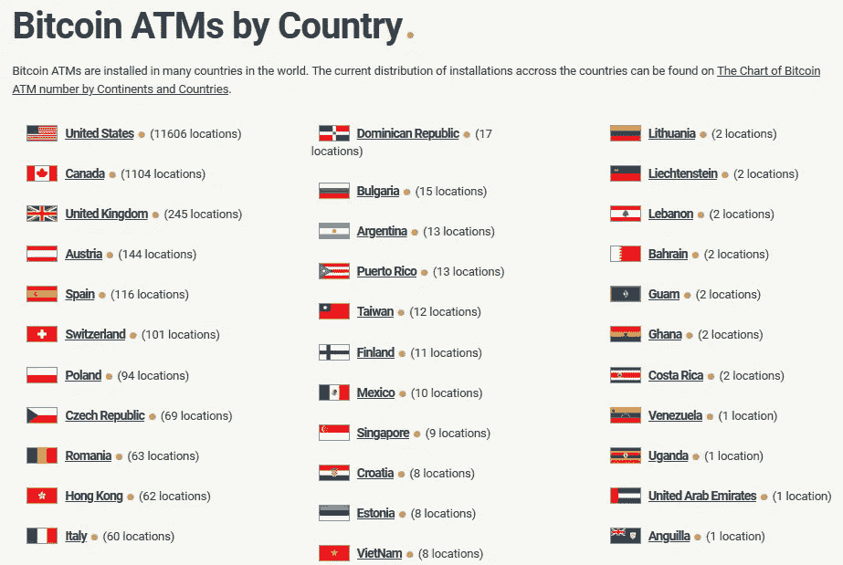**

****Source: CoinATM Radar****

**[这个](https://coinatmradar.com/countries/)提供了世界各地安装的比特币 ATM 的详细视图。**

**同样值得注意的是，BCH(比特币现金)等比特币衍生工具也在日常交易中被广泛接受。**

**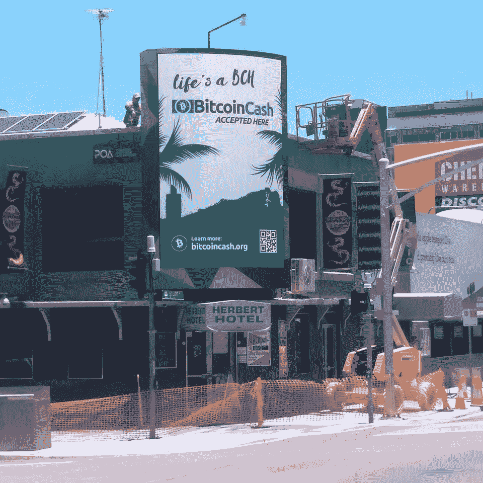**

****A Store accepting BCH in North Queensland | Source: Reddit****

**随着采用率翻了两番，这个领域的骗局也越来越成熟；从而诈骗众多比特币爱好者。这篇文章解释了 1 个这样的骗局，通常被称为**比特币翻倍**或**

**使这些骗局成功的是在网站中实现的各种技术指标，以吸引具有部分知识和低维护网页等的人。让我们来看一个使用案例！**

****案例研究—实时****

**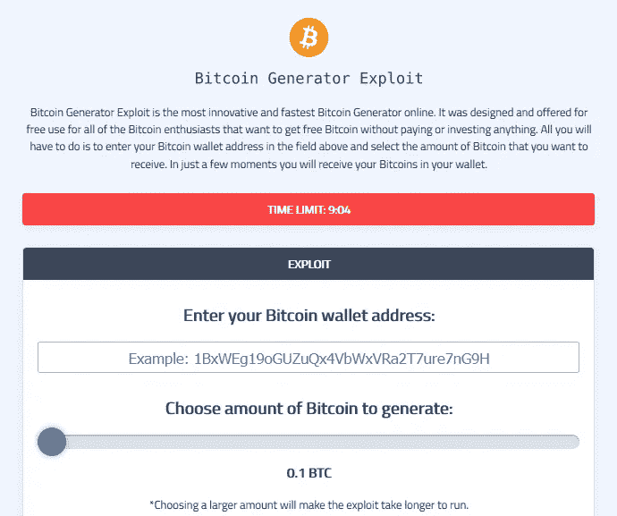**

****Landing Page of Bitcoin Multiplier****

**这是此类骗局中常见的**介绍**之一，它指示用户通过滑动金额指针将他们的**比特币钱包地址**和**所需金额**存入你的账户。**

**网站使用各种因素来吸引访问者。其中一些是**

****实时统计** :-这是作为新手的信任因子。这些记录可能来自实时区块链交易日志，将其重新用作实时统计数据来展示网站活动。**

****

****Live Stats****

****实时聊天支持** :-吹嘘从网站上获得的利润被倾倒在这一部分。另一个诱饵等待着没有经验的用户。**

**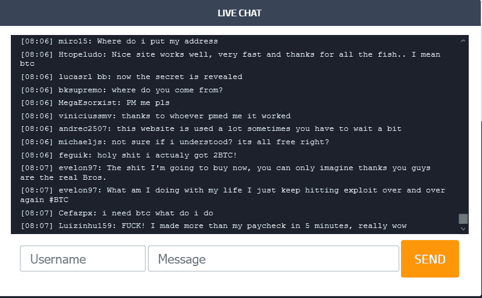**

****Chat Box****

**为了打破这个神话，让我们进行一次聊天，并运行一个简单的检查:-**

****“我以为我的朋友想用这个网站链接来愚弄我。但是你只有在不搞砸费用确认的情况下才能得到 BTC****

**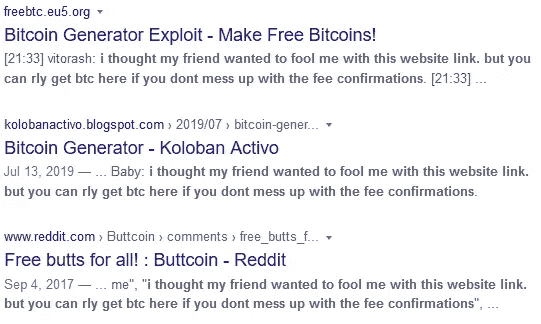**

****Proof for Chat Script****

**在这里，你可以看到类似的比特币网站，在那里发现了相同的聊天记录。**

*****提示*** *:最好的部分是——聊天窗口甚至可以在没有互联网连接的情况下工作(因为在起草这篇文章时我的电源中断了)，因此证明它是硬编码到网站上的(JS 文件)。***

****收据**:这些微小的弹出窗口出现在网站上，提醒访问者网站的高活跃度，声称已经收到各种用户的资金。**

**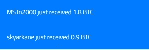**

****Receipt Notification****

***同样，如果您正在运行任何用户名检查，您将会看到许多诈骗网站。***

**在输入一个 BTC 地址后，它会运行一个加载程序来满足游客的渴望。正在显示以下脚本:-**

****

****Script Visualization****

```
{ X00Percent: 2, X00Text: 'Starting `injection` process...' },
  { X00Percent: 4, X00Text: 'Connecting and Validating vulnerable BCH node...' },
  { X00Percent: 8, X00Text: 'Spoofing Packets through IPV6 Tunnel...' },
  { X00Percent: 10, X00Text: 'Tunnelling via be6e:854229af:c9a::34' },
  { X00Percent: 12, X00Text: 'Connecting to Node Maintenance Channel...' },
  { X00Percent: 14, X00Text: 'Establishing connection...' },
  { X00Percent: 16, X00Text: 'Connection successful on port 87118' },
  { X00Percent: 18, X00Text: 'Connecting to Node Maintenance Channel...' },
  { X00Percent: 18, X00Text: 'Re-spoofing Packets through IPV6 Tunnel...' },
  { X00Percent: 32, X00Text: 'Extracting data bitcoin pools -2 ' },
  { X00Percent: 33, X00Text: 'Exploit uploaded... 0%' },
  { X00Percent: 38, X00Text: 'Exploit uploaded... 50%' },
  { X00Percent: 42, X00Text: 'Exploit uploaded... 100%' },
  { X00Percent: 59, X00Text: 'Success: Spoofing Packets through IPV6 Tunnel.' },
  { X00Percent: 60, X00Text: 'Injecting script...' },
  { X00Percent: 74, X00Text: 'Checking bitcoin pools response...' },
  { X00Percent: 74, X00Text: 'Checking BCH Nodes for Vulnerability (OK).' },
  { X00Percent: 74, X00Text: '79.83.83.61...' },
  { X00Percent: 77, X00Text: 'Injecting ....' },
  { X00Percent: 79, X00Text: 'Spoof Successful(OK)' },
  { X00Percent: 79, X00Text: 'Checking Again for BCH Nodes with Vulnerability (OK).' },
  { X00Percent: 82, X00Text: 'Vulnerable Node Found at 183.9.25.156' },
  { X00Percent: 82, X00Text: 'Reading Blockchain Head...!' },
  { X00Percent: 84, X00Text: 'ea0d7613 f665ce14 4de1a1d5 668088c9 90eadb87\n dda97e16 5c286117 3ade0874 75c559a7 f7b71561\n 39d226e3 30ab7352 21dde7cb 6edd4bd8 b3bad704\n cf86f763 741569bc 9bda5aaf ee650061 84ab7888\n fc204b9c 5a34d042 4bd08d6 9f0714f2 88b60c25\n bf3adeaa d6144142 e2651076 5eb13ac1 9c2b3db0\n 6b9e46c8 970266fd ca75fae 2bd2aff 31a1e836\n 85efc613 a81994c1 c1e71eb 6788e9d0' },
  { X00Percent: 84, X00Text: 'Parsing...' },
  { X00Percent: 84, X00Text: 'Writing to Blockchain Head' },
  { X00Percent: 84, X00Text: 'fb7fa163 3b1dcc83 94cd05c2 538ce18b ecb82a6b\n 106837e3 13ffbf3c 4e8bd365 5810def7 e2ede062\n 364e7990 1936ad63 d5a92dbf edda1463 88c0face\n 997c8d02 81efd88 3bb42b9c 1df415ec 838ef3d1\n b63f74e7 228e2427 ae50738b 2c6ae409 5a0b3e4c\n 4793a99a 4dc91ee5 15bf5af4 52fd46b8 842d9af8\n 95123cca e1f15519 72dc61da fa3d34a9 c0ed34a1 f7009fb8' },
  { X00Percent: 84, X00Text: 'Executing request!' }, 
  { X00Percent: 86, X00Text: 'Waiting for response...' },
  { X00Percent: 92, X00Text: 'Reading Blockchain Head.' },
  { X00Percent: 93, X00Text: 'Verification...' },
  { X00Percent: 94, X00Text: 'Removing exploit code from blockchain...' },
  { X00Percent: 99, X00Text: 'Sending cloned Bitcoin...' },
  { X00Percent: 100, X00Text: 'DONE.' },
```

***上面列出的脚本是从早先报道的* [*站点*](https://djanes.xyz/uncovering-a-bitcoin-generator-exploit-scam/) *获得的。***

**进度完成后不久，将出现以下屏幕，声称已完成翻倍过程，资金已准备好传输:-**

**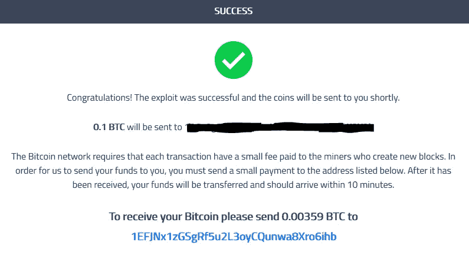**

****Return Screen****

**诡计是这样的:-最初你必须向 Scamster 的比特币地址存入 1300 美元**1 efjnx 1 zgsgrf 5 u 2 L3 oycqunwa 8 xro 6 IHB**向用户收取 3500 美元。**

**通过映射地址，我们了解到这个地址在 4 个月前就开始使用了，并且成功地收到了大约 310 美元。**

**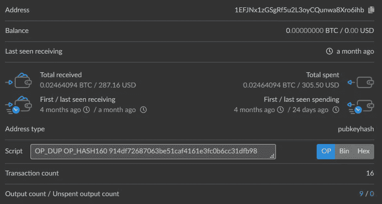**

****Scam Funds Received in 4 Months****

*****注****:——随着 BTC 的波动，数额也随之变化。这也取决于在诈骗网站计算的费用。***

**这是[站点](http://7bufgxtufnnnbm6zumtct7g3pcrcieo75lb732jiqnahgao5jv2yksqd.onion)中的一个，仍然存在于活跃的暗网上，很明显最后一个收据是一个月前收到的(Acc。到区块链)，证明骗局没有过时。**

****如果你认为这个数目微不足道，这里有另一个** [**网站**](https://www.bitminer.btc-e.eu/) **在 7 年的时间里赚了大约 3，705，769.52 美元(仍然没有标记)，由 Hetzner(159.69.62.95)托管，钱包地址:***1 F7 rkmxcoukbcuxf 4 dbpcwug 9 xbcsvvnq 5。***

**在深入挖掘的同时，一个名为来自意大利的 Giaky 的[简介](https://bitcointalk.org/index.php?action=profile;u=228307)从比特币论坛中弹出，他的钱包地址被映射到。**

**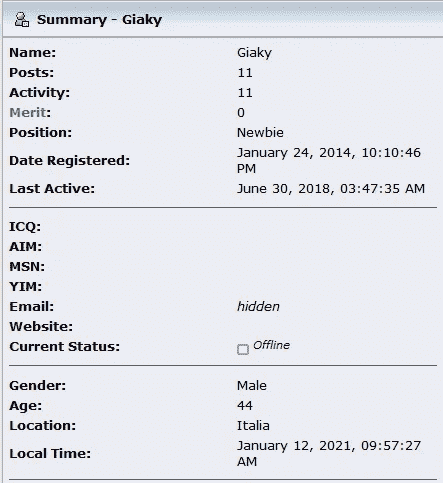**

****Profile from Bitcoin Talk****

****注:** *由于从比特币黑名单评论中获取的数据，无法 100%确定被指控的比特币地址是否属于被指控的用户。***

**类似地，有许多诈骗活动网站仍然在暗网和明网上运行，从诈骗者的账户中获得高额现金流。**

**以下是已获利润的一些细节:**

**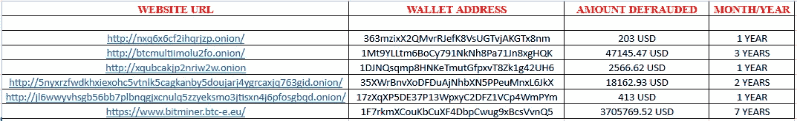**

****Similar BTC Doubling Operations (Live)****

**这些是一些著名的网站(我遇到的)，这些网站瞄准了比特币翻倍狂热者。还发现同一洋葱存在大量镜像位点，例如:-**

**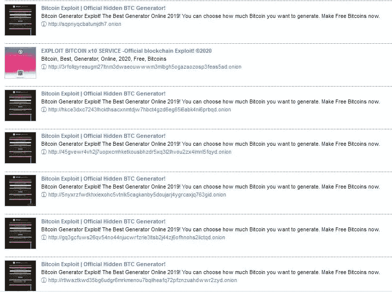**

****Tor66 SE Report****

**根据这个搜索引擎，在 Dark Web 上总共有 331 个网站(包括镜像)包含“比特币翻倍”的内容。当然，还有更多的，但并不是所有的东西都可以被一个实体索引。**

**注意:这篇文章更详细地讨论了暗网方面，而不是表面网。**

****过去与比特币乘数挂钩的 EK 量级****

****Magnitude** 是多年来在各种地下论坛上流行的最成功的漏洞利用工具包之一。感染后发送 **Magniber 勒索病毒**，影响 APAC 地区。该组织(**隶属于臭名昭著的韩国组织 DarkHotel** )的工作方式是不断更新最近发现的针对目标方的安全漏洞。令人惊讶的是，根据[恶意软件字节报告](https://blog.malwarebytes.com/cybercrime/2017/11/stay-away-from-bitcoin-multiplier-scam/)，该**集团还运营各种恶意软件和比特币诈骗网站**。**

**显然，网络犯罪集团正利用这种手段作为被动收入，以资助其网络攻击行动。**

****关键要点****

*   **永远不要陷入双倍/乘数或任何种类的骗局**
*   **网络犯罪分子可以大规模建立此类诈骗网站，以便筹集大量资金，而不会直接让任何人感染勒索软件**
*   **这也是网络罪犯的一种被动收入形式，或者是一种没有任何危险信号的长期投资政策**
*   **在吞没所有展示的承诺之前，一定要检查网站的声誉**
*   **查看类似 BitcoinWhosWho 或比特币滥用等各种平台上列出的比特币地址黑名单活动**
*   **通过向所述平台标记恶意比特币地址，成为负责任的信息安全贡献者**

****

****Image Courtesy**: Foxman Communications**

**关注我在 Twitter 上的有趣发现！；-)**

****注意:- *本文纯属个人研究，未经作者同意，不得在任何地方使用/发表。*****