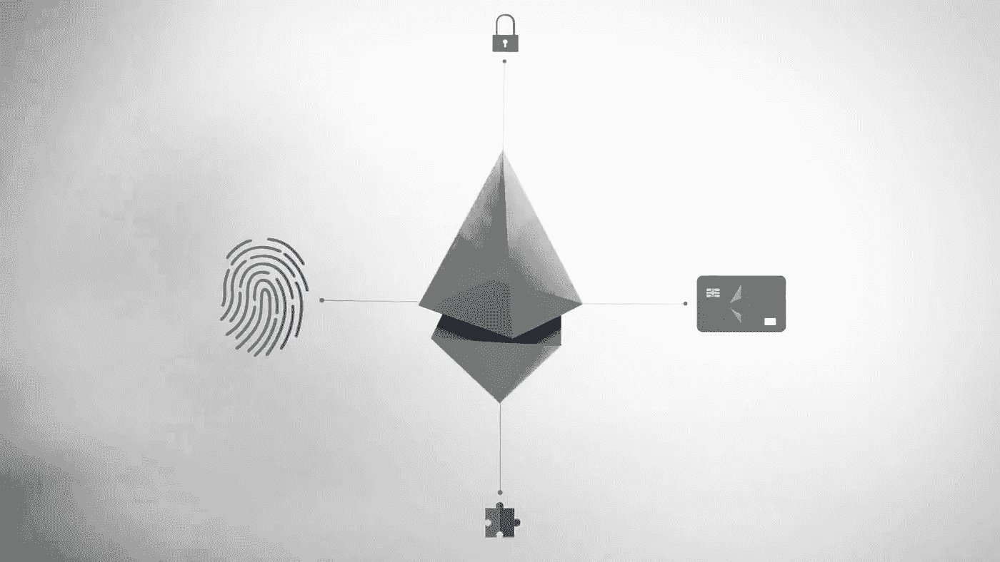
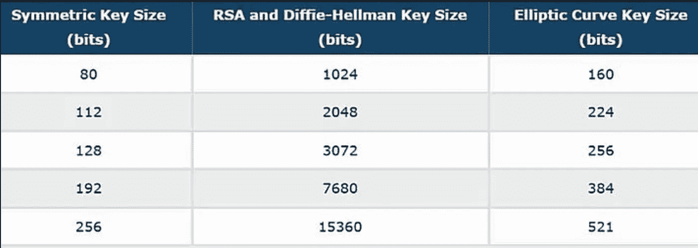
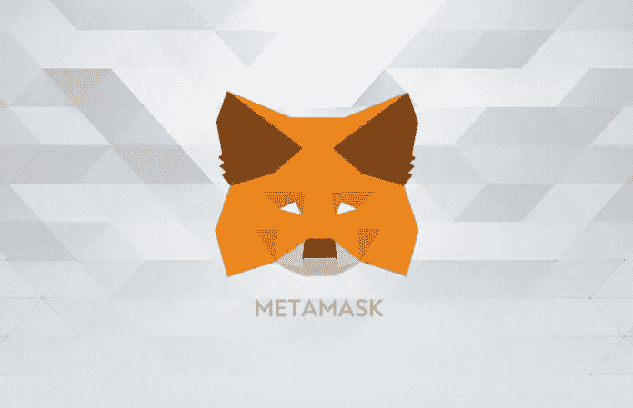
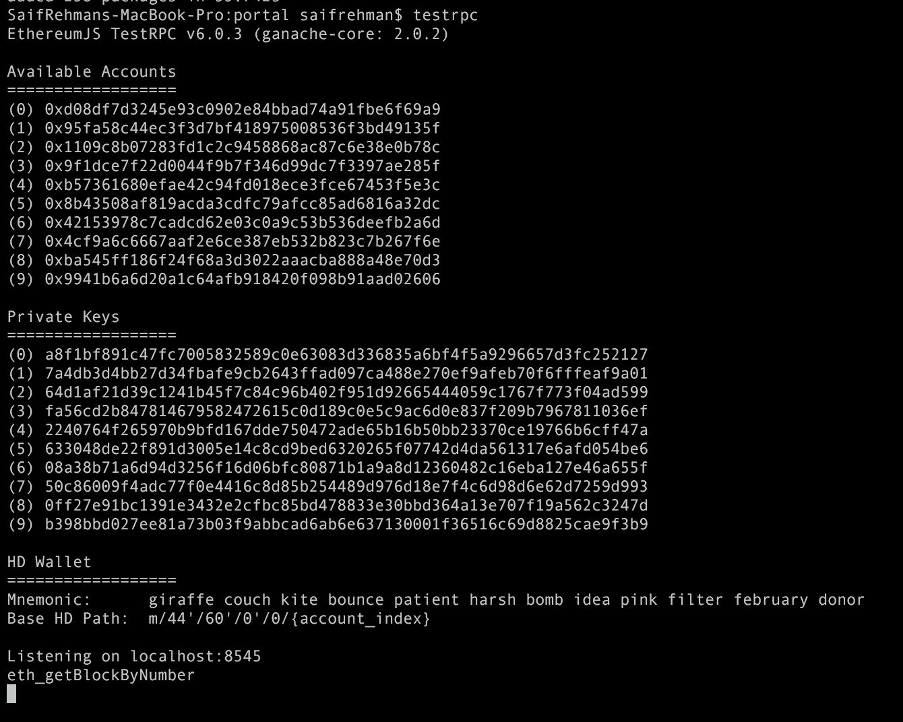
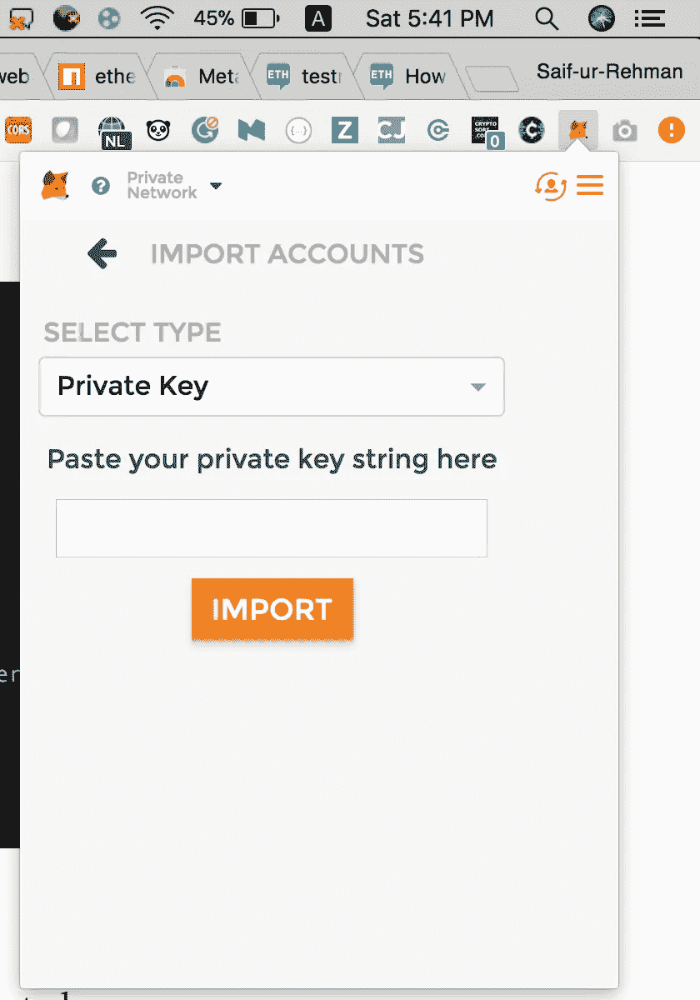
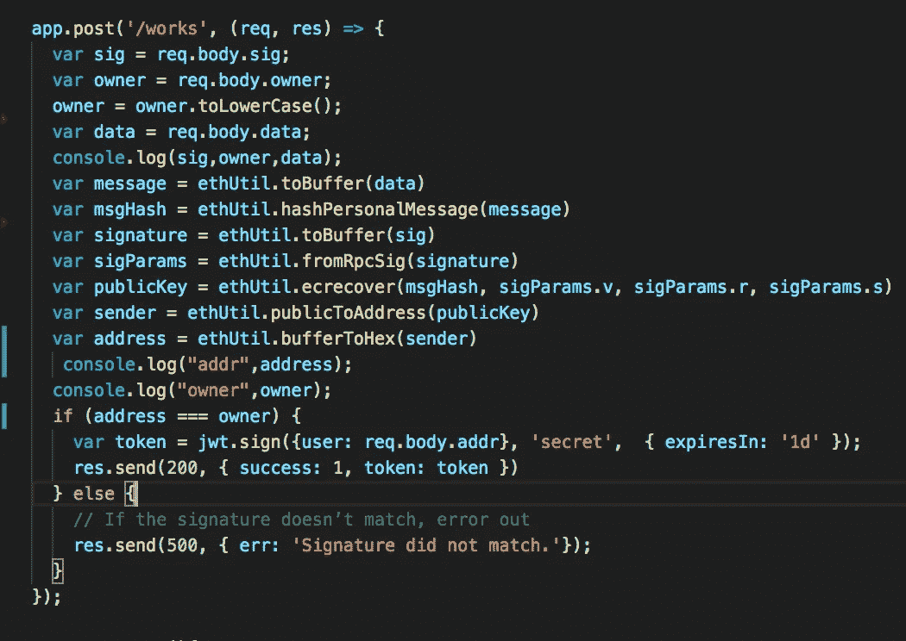
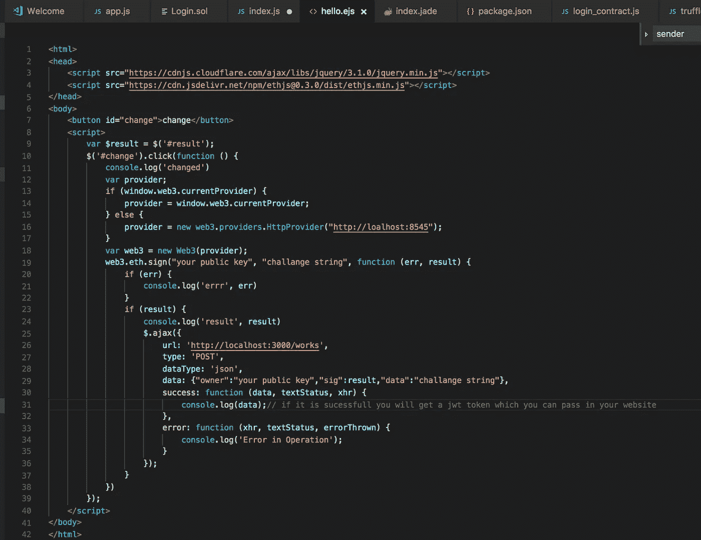
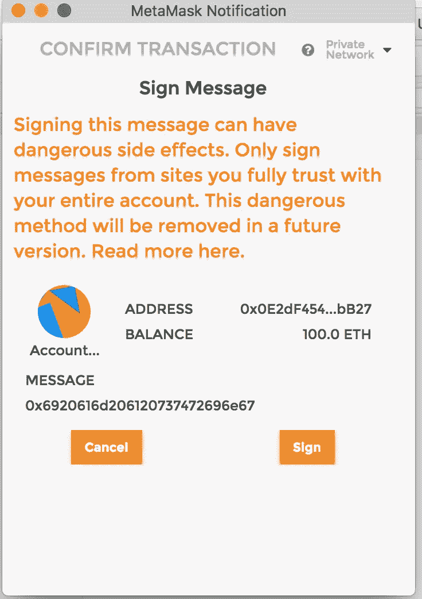
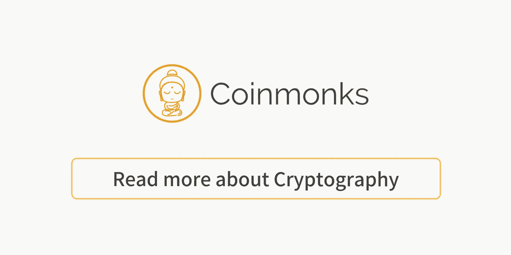

# 基于区块链的椭圆曲线密码无密码认证。

> 原文：<https://medium.com/coinmonks/password-less-authentication-using-elliptic-curve-cryptography-on-blockchain-e1ef89c65c36?source=collection_archive---------0----------------------->



# 传统登录系统的问题

区块链技术已被用于解决各种领域的重大问题，包括许多商业用例。遗憾的是，与这些系统的交互是基于传统的 web 登录(用户名和密码)，如果没有出于安全考虑进行适当的开发，就容易受到许多攻击。

## 对传统网络登录的著名攻击

1.  2011 年，7700 万索尼 Playstation 的密码遭到泄露
2.  2012 年，40 万个雅虎密码被黑
3.  2014 年在线发布了 500 万个 Gmail 密码
4.  苹果公司的 ICloud 登录系统遭到破坏，泄露了臭名昭著的名人照片

LastPass 或 OnePass 等允许用户生成和管理密码的流行密码管理器也可能受到攻击。这些第三方应用程序将您的密码存储在一个中央服务器中，这很容易让攻击者危及您的登录。2015 年，LastPass 经历了一次数据泄露，黑客暴露了用户的电子邮件地址和加密密码

## 为什么密码易受攻击？

1.  这年头猜密码太容易了。它可以是你的名字、电话号码、生日等等
2.  字典攻击可以用来破坏普通密码
3.  用户名和密码，并存储在中央服务器中，这使得黑客可以灵活地攻击特定的服务器
4.  困难的密码被写在某个容易记住的地方，这使得它更容易受到攻击
5.  许多密码在其他网站中重复使用。因此，如果攻击者知道您登录某个网站的详细信息，攻击者就有可能使用相同的登录信息访问您的网站。

## 传统网络登录系统中的常见漏洞

1.  **SQL 注入:**根据[开放 web 应用安全项目(OWASP)](http://owasp.com/index.php/Main_Page) SQL 注入被评为现代 Web 领域的头号安全隐患。在这种情况下，攻击者可以手工创建结构化查询语言(SQL)命令，迫使数据库泄漏有意义的信息。
2.  **XSS(跨站点脚本):** XSS 是一种攻击方式，攻击者可以注入恶意脚本，渗透到网站访问者的计算机中。当开发人员没有正确地测试他们代码，并允许一个循环漏洞在他们的应用程序中插入 XSS 脚本时，就会发生这种情况

# 区块链来拯救！去无通行证！


存储用户名和密码的数据库的集中式架构是黑客攻击和漏洞的根本原因，如果它被黑客攻击，所有数据都会受到损害。不幸的是，即使双因素认证(2FA)也被证明可以通过社会工程渗透[。](https://www.wired.com/2016/06/hey-stop-using-texts-two-factor-authentication/)

在区块链的帮助下，无密码网络登录迅速普及。它始于 Satoshi 实验室，那里开发了 Trezor Connect，允许用户只需插入你的硬件钱包就可以登录到参与网站。通过利用比特币中使用的加密技术(椭圆曲线),我们可以创建比传统网络登录更安全的无密码登录。

## 什么是椭圆曲线密码？

椭圆曲线加密基于公钥和私钥加密，如 RSA，但 ECC 以代数结构表示。然而，与 RSA 相比，ECC 提供了相同的安全性，但占用空间更小。此外，它对 cpu 的占用也较少，非常适合创建更快的网络，并适用于移动设备。



RSA vs ECC

> 在数学中，**椭圆曲线**是由以下形式的方程定义的平面代数**曲线**。那是非单数的；也就是说，它没有尖点或自交。

# 理论说够了，让我们来点实际的吧！

## 使用以太坊区块链、Web3 和元掩码创建无密码授权



1.  安装以太坊测试 RPC 客户端，模拟以太坊区块链

```
> npm install -g ethereumjs-testrpc
```

2.安装 Metamask chrome 插件以与您的区块链应用程序交互

> 链接:[https://chrome . Google . com/web store/detail/meta mask/nkbihfbeogaeaoehlefnkodbefgpgknn？hl=en](https://chrome.google.com/webstore/detail/metamask/nkbihfbeogaeaoehlefnkodbefgpgknn?hl=en)

3.插入密码短语(种子短语)以激活您的元掩码并访问您的帐户。

4.奔跑

```
> testrpc
```



It generates for you 10 accounts by default

5.使用私钥将您的一个帐户与元掩码连接。点击你账户中的 metamask 图标，然后点击导入新账户。粘贴您的私钥以导入您的帐户



6.快速 API 示例



api 需要 3 个信息

*   Signature: Signature 是由您的私钥签署的数据。
*   所有者:哪个是您的公钥
*   质询字符串:这是用于创建签名的质询字符串。该签名可以变化，它仅用于用您私钥创建唯一的签名

> [直接在您的收件箱中获得最佳软件交易](https://coincodecap.com/?utm_source=coinmonks)

[](https://coincodecap.com/?utm_source=coinmonks)

该代码对生成的签名进行解密，并揭示签名人的公钥。如果公钥与个人原始密钥匹配，这意味着用户已经验证了自己。通过使用 ECC，我们可以用密码证明地址属于签署数据的人。

7.使用元掩码触发签名的示例前端



在这段代码中，您通过使用质询字符串用您的有效私钥签名来生成签名。生成签名后，当签名被解密并与验证您身份的公钥进行比较时，我们将该签名传递给服务器端 api。通过身份验证后，后端会向用户发出一个 JWT，允许用户访问网站。否则，如果用户未被认证，则不发布 JWT。



Signing the challenge string with metamask

# 阅读更多信息:

1.  关注我更多:[https://www.engineerability.com](https://www.engineerability.com)

# 结论

通过利用以太坊区块链技术、椭圆密码和 Metamask，我们可以绕过并认证自己，而不需要任何密码，它比传统的基于用户名和密码的登录系统具有更好的安全性。为了冒充用户，黑客必须知道用户的公钥和私钥。此外，他需要 seedphrase 来登录他的元掩码。常见的攻击，如 XSS，SQL 注入是防弹的，将无法抵御这种技术，因为没有中央服务器的登录信息存储。即使猜测私钥和公钥的正确组合也会失败，因为主以太网中的气价，每次用户签名都要支付气价，最终黑客需要尝试各种组合，这将花费他很多。通过这种技术，我们有更少的忘记密码，非常安全的登录，和快乐的用户群:)

> 我们使用区块链成功创建了身份即服务(IDAAS)

# 参考

github:【https://github.com/SaifRehman/identity/tree/master/myapp 

[](https://medium.com/coinmonks/cryptography/home)

Click to know more about cryptography