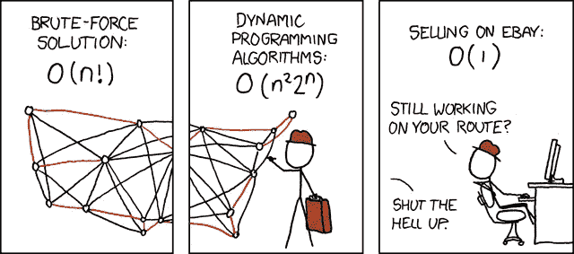

# 探路者-显示最佳路径的网络应用程序

> 原文：<https://medium.com/coinmonks/pathfinder-web-app-that-shows-optimal-path-9c7030849f69?source=collection_archive---------1----------------------->

***大纲-*** [*旅行推销员问题*](https://simple.wikipedia.org/wiki/Travelling_salesman_problem) *是一类非常特殊的问题。在这里，一个推销员必须在 N 个城市之间旅行。他不关心这样做的顺序，只要他在旅行中访问每一个，并在他开始的地方结束。每个城市都通过城市或者节点与另一个城市相连，通过* [*飞机*](https://simple.wikipedia.org/wiki/Airplane) *，或者通过* [*公路*](https://simple.wikipedia.org/wiki/Road) *或者* [*铁路*](https://simple.wikipedia.org/wiki/Railway) *。这是一种困难的优化问题。我们可以从下面给出的图中看出其复杂性-*

Time Complexities of Travelling Salesman Problem

显然，使用强力方法解决这个问题需要 O(n！)时间，采用动态规划法，其时间复杂度为 O(n *2^n).所以很难优化这个问题。对于近似优化，我使用了遗传算法，这是一种近似算法。

***目标-*** 构建 web 应用程序，显示访问者/用户输入的一组目的地的最佳路径。我给了下面这个项目的 Github 链接-

**Github-**[https://github.com/HACKERSHUBH/Path-Finder](https://github.com/HACKERSHUBH/Path-Finder)

**先决条件-** *HTML、CSS、Javascript*

> 我用两种方式开发了这个项目——静态目的地方式和动态目的地方式

S *静态目的地方式*——Python 脚本，采用城市/地标/游览地的数据集，预测覆盖数据集中所有城市的最佳路径。

D

# 我们开始吧！

首先，我想向你们展示这个项目的工作演示。

# 实现上面的问题——

目录结构看起来像这样-

遗传算法对于寻找复杂搜索问题的解决方案是很棒的。由于它们能够在大量的参数组合中进行搜索，找到最佳匹配，因此它们被用于创造高质量的产品。他们可以搜索不同的材料和设计组合，找到两者的完美结合，从而打造出更坚固、更轻便、整体更好的最终产品。遗传算法是基于自然界中观察到的自然选择的进化过程。

## ***遗传算法的基本参数-***

遗传算法的基本过程是:

1.  *初始化* —创建初始群体。这个群体通常是随机产生的，可以是任何期望的大小，从几个个体到几千个个体。
2.  *评估* —然后对群体中的每个成员进行评估，我们计算出该个体的“适合度”。适应性值是根据它与我们期望的要求的符合程度来计算的。这些要求可能很简单，“更快的算法更好”，或者更复杂，“更强的材料更好，但不应该太重”。
3.  *选择* —我们希望不断提高我们人口的整体健康水平。选择有助于我们做到这一点，通过丢弃不好的设计，只保留种群中最好的个体。有一些不同的选择方法，但基本思想是相同的，使我们的下一代更有可能选择更适合的个体。
4.  *交叉* —在交叉过程中，我们通过组合所选个体的各个方面来创建新的个体。我们可以认为这是在模仿自然界中的性行为。希望通过结合两个或更多个体的某些特征，我们将创造出一个更“健康”的后代，它将继承父母双方的最佳特征。
5.  *突变*——我们需要在我们的种群遗传基因中加入一点随机性，否则我们可以创造的每一种解决方案组合都将存在于我们的初始种群中。突变通常是通过对个体基因组进行非常小的随机改变来实现的。
6.  *重复！* —现在我们有了下一代，我们可以从第二步重新开始，直到达到终止条件。

## 结束

有几个原因可以解释为什么你想要终止你的遗传算法继续寻找解决方案。最可能的原因是您的算法已经找到了一个足够好的解决方案，并且满足预定义的最低标准。提供终止的原因可以是诸如时间或金钱的约束，或者我们可以预先定义算法运行的迭代次数。

解决上述问题时，有两条重要的规则要记住:

1.  每个城市只需要被访问一次
2.  我们必须回到出发城市，所以我们的总距离需要相应地计算

## 方法

让我们从几个定义开始，在 TSP 的上下文中重新表述:

*   **基因:**一个城市(用(x，y)坐标表示)
*   **个体(又名“染色体”):**满足上述条件的单一途径
*   **人口:**可能路线的集合(即个体的集合)
*   **Parents:** 两个路由组合在一起创建一个新路由
*   **交配池:**用来创造我们下一个种群(从而创造下一代路线)的亲代集合
*   **Fitness:** 一个告诉我们每条路线有多好的函数(在我们的例子中，距离有多短)
*   **变异:**通过随机交换路线上的两个城市，在我们的人口中引入变异的一种方式
*   精英主义:将最优秀的个体带入下一代的一种方式

由于用户是在标记的帮助下在谷歌地图上选择目的地点，所以我们需要距离矩阵。

如果用户想要他们的当前位置，那么他们必须点击网站上提供的“位置”按钮。我也使用不同类型的旅行方式，比如-

*   *汽车*
*   *自行车*

我也在使用用户是否必须在旅行期间覆盖高速公路，所以也有高速公路启用或禁用模式。然后，我为不同类型的出行模式创建持续时间数据数组。这个的代码是-

现在来了**遗传算法**带参数的代码——

> 现在我们将变异、交叉应用于当前种群，并返回后代种群。之后，我们在每次迭代中寻找最适合的个体，我们应用锦标赛选择，然后选择最适合的个体指数。

这就完成了求解旅行商问题的遗传算法代码。虽然它是一种寻找最短路径的近似算法，但是与其他方法相比，它的时间复杂度非常低。

# 参考文献-

*   [http://www . the projectspot . com/tutorial-post/applying-a-genetic-algorithm-to-traveling-salesman-problem/5](http://www.theprojectspot.com/tutorial-post/applying-a-genetic-algorithm-to-the-travelling-salesman-problem/5)
*   [https://www.hindawi.com/journals/cin/2017/7430125/](https://www.hindawi.com/journals/cin/2017/7430125/)
*   [https://www . cs . Indiana . edu/~ vgucht/Genetic _ Algorithms _ for _ the _ traveling _ Salesman+problem . pdf](https://www.cs.indiana.edu/~vgucht/Genetic_Algorithms_for_the_Travelling_Salesman+Problem.pdf)
*   [https://link.springer.com/article/10.1023/A:1006529012972](https://link.springer.com/article/10.1023/A:1006529012972)
*   https://en.wikipedia.org/wiki/Travelling_salesman_problem

> [在您的收件箱中直接获得最佳软件交易](https://coincodecap.com/?utm_source=coinmonks)

[**Click to read today’s top story**](http://bit.ly/2G71Sp7)