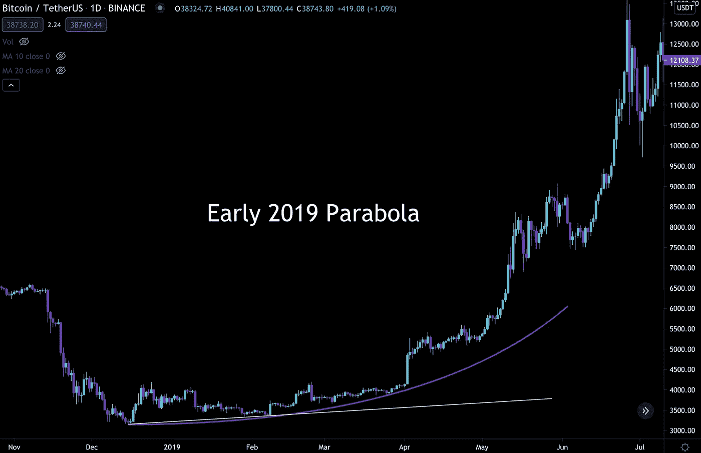
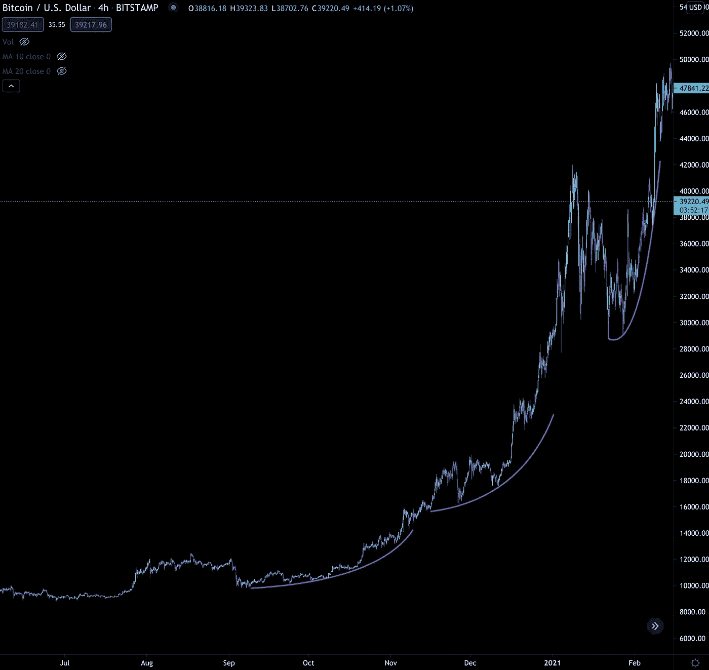
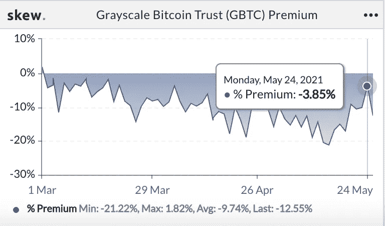
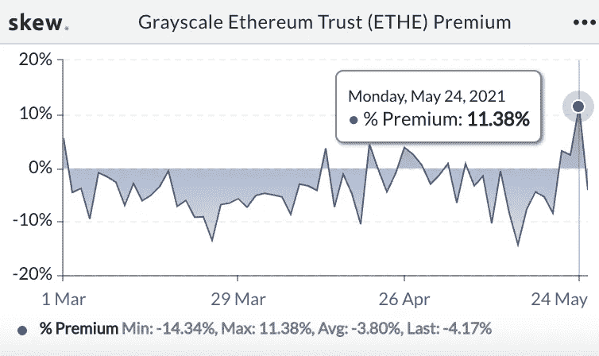
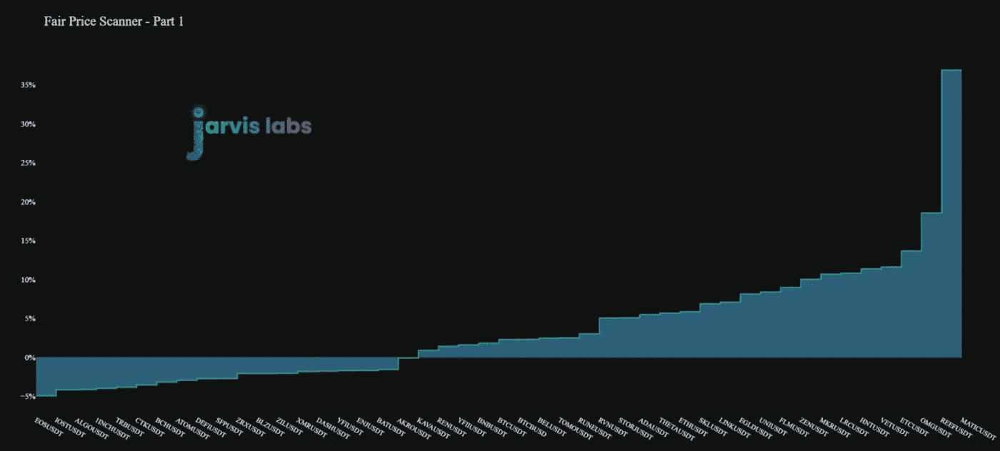
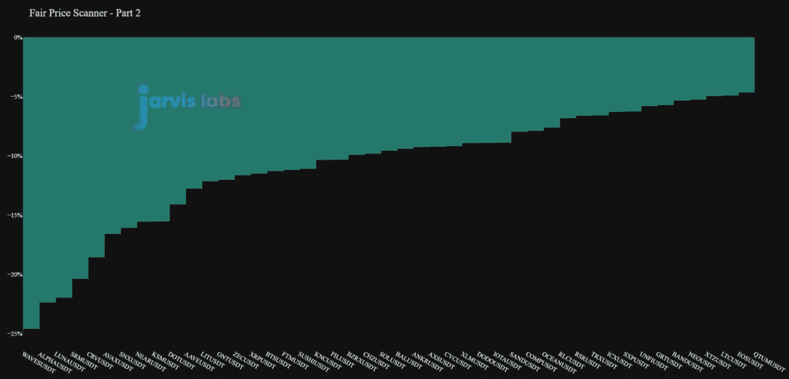

# 病人抛物线

> 原文：<https://medium.com/coinmonks/patient-parabolas-f9515509fe9e?source=collection_archive---------4----------------------->

市场推动者流露出耐心。

这并不一定是帮助他们成为市场推动者的特征。这是一种出于需要的特性。

拥有大笔资金意味着你不能仅仅在北海巨妖、库科恩或双子星上开一个账户，然后把 5000 万美元扔进订单簿。

你会被熏死的。流动性和利差根本不存在。这意味着你试图在一个交易所购买 5000 万美元的比特币，在你的第三个或第四个 25 万美元订单完成后，你会被发现。

这就是为什么随着更多的资本涌入这个领域，prime 服务变得越来越受欢迎。需要大量的积累策略。

这些方法不同于日内交易者使用的方法，实现这些方法的心态也不同。

为了转移大笔资金，买家需要耐心在一个窗口或价格范围内进行调整。让价格运行一点，慢慢地回来再加多一点，让它再运行一点，再加多一点…

否则，买方将导致价格运行，最终他或她将失去他们的进入。

一个微妙的，有条不紊的，有耐心的方法让他们留在范围内，积累更长的时间。

如果你要看一张图表，你知道它会是什么样子吗？

一系列更高的低点。

作为交易者，我们经常听到这样的话…价格形成更高的低点。这可以在任何时间尺度上发生。

但最终，当市场在一系列更高的低点形成时变得有点过热时，一些独特的东西开始形成。

这是一条抛物线。当你知道你已经到了这个积累阶段的终点，几个玩家为了在订单簿运行之前完成他们的订单而相互争斗。

在我看来，它是所有模式之母。

它告诉你那些主要买家何时开始不耐烦。对于任何期货交易者来说，这是你参与行动的信号。

当市场中出现不耐烦时，波动性开始扩大，你需要投入资金的时间处于绝对最小值。

从链上流动的角度来看，这意味着资本开始越来越快地涌入。当这些抛物线在长期积累模式的末端形成时，价格将会有巨大的上升空间。

为了直观地展示它的样子，这里是 2019 年初的抛物线。

这是一个巨大的五个月的扩张。

它们可以在任何地方、任何时间被发现。其实这里有几个从去年 9 月到今年 2 月…

随着我们当前价格区间的实现，这是值得关注的。后期出现圆底或抛物线形态，我不会感到意外。

那是因为我们昨天偶然发现的数据。更大的钱包开始再次积累。

这可能需要一段时间才能完全展开。并且圆形底部和/或细微的抛物线形状将反映背景中展开的这种活动。

但这需要一些时间。

对于这里的大多数读者来说，你可能对近期发生的事情更感兴趣。

嗯，我们得到了一些有趣的消息…

昨天我们得到了第一个看涨信号。事实证明，看多的生活确实存在于链条上。

这之后很快出现了一些不错的价格上涨活动…然后很快又出现了熊市。

这可能看起来令人沮丧，但这是好的。似乎我们怀疑作为阻力的 40-42，000 美元的区间开始巩固。

现在我们将看到看涨信号何时开始再次出现。因为这将给我们一个好主意，什么价格将被捍卫。

在我们名为“[无人区](https://jarvislabs.substack.com/p/no-mans-land)”的文章中，我们讨论了 40-42k 美元的链上阻力范围…我们还使用相同的链上支撑/阻力图表发现了 33k 美元。

所以这就是我们怀疑得到保护的区域。

尽管 3.3 万美元看起来很诱人，但我们将拭目以待。市场开始变得有点偏向空头。我们知道这一点，几天前我们向你们展示的负融资利率，它们根本没有消退。

这可能会加剧挤压。如果发生这种情况，我们很有可能还会继续努力积累。

但问题是。一旦这些融资利率逆转，有一件事要记住。从过度看跌到过度看涨的融资利率变化将对这一指标产生很大影响…

或者更好的是，这个。(注意，有些消息来源说他们没有溢价交易，有些是。我个人认为它没有，但不要陷入其中，只要知道它的交易接近 NAV，即使没有任何 FOMO)

正如我们昨天偶然发现的那样，现在的条件比灰度发挥最大作用的时候要好。我们已经看到下降是如何影响折扣的。

根据我们对比特币市场可追踪的链上部分的解读，这种溢价很可能会回归。

也就是说，问题可能很快会从溢价会回到……这一次能涨到什么程度？

与此同时，随着当前交易区间的展开，让我们保持耐心。

有了这份耐心，当时机成熟时，考虑加入一些替代硬币。这是一个内部指标，我们称之为公平价格扫描器。

我们最终会揭开这一切的帷幕，只要知道这是一种相对于鲸鱼积累价格来评估价格的方式。

这里有更贵的硬币..

便宜的…

去列表上找到你最喜欢的项目，看看它在哪里。看看加到包里有没有意义。

但是记住，无论如何，都要练习耐心。

市场仍在摸索中。但是，潜流开始出现，积累正在发生。

时间看起来站在我们这边…至少现在是这样。

你的脉搏在加密，

本·莉莉

## 也阅读

*   [莱杰 vs Ngrave](/coinmonks/ledger-vs-ngrave-zero-7e40f0c1d694) | [莱杰 nano s vs x](/coinmonks/ledger-nano-s-vs-x-battery-hardware-price-storage-59a6663fe3b0) | [币安评论](/coinmonks/binance-review-ee10d3bf3b6e)
*   [Bybit Exchange 审查](/coinmonks/bybit-exchange-review-dbd570019b71) | [Bityard 审查](/coinmonks/bityard-review-7d104239be35) | [CoinSpot 审查](https://blog.coincodecap.com/coinspot-review)