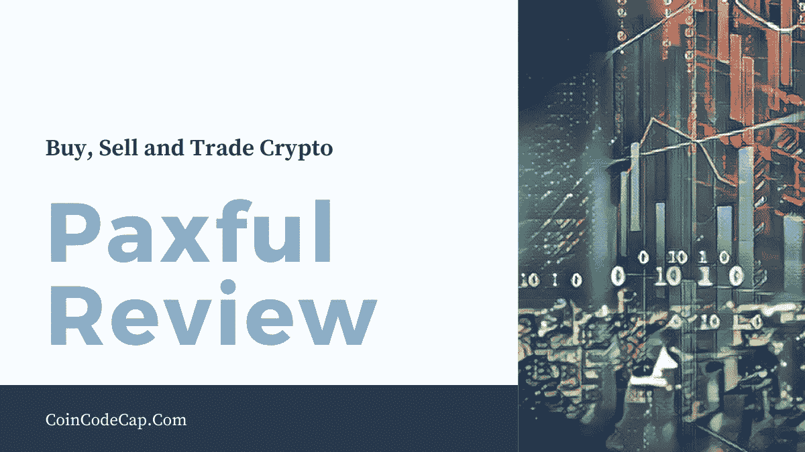
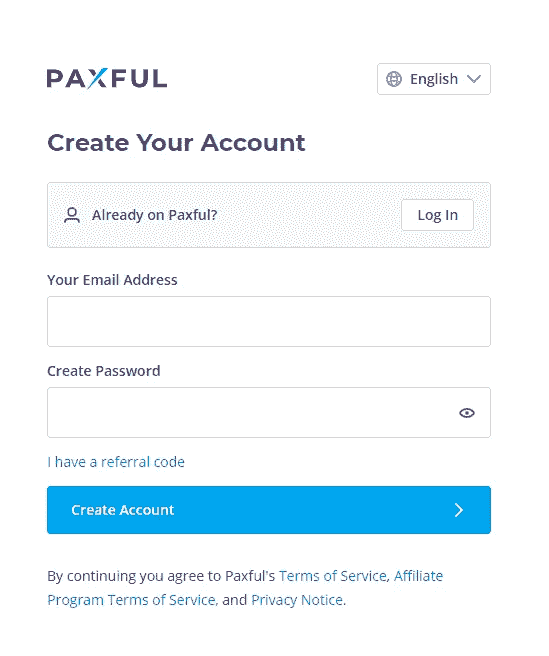
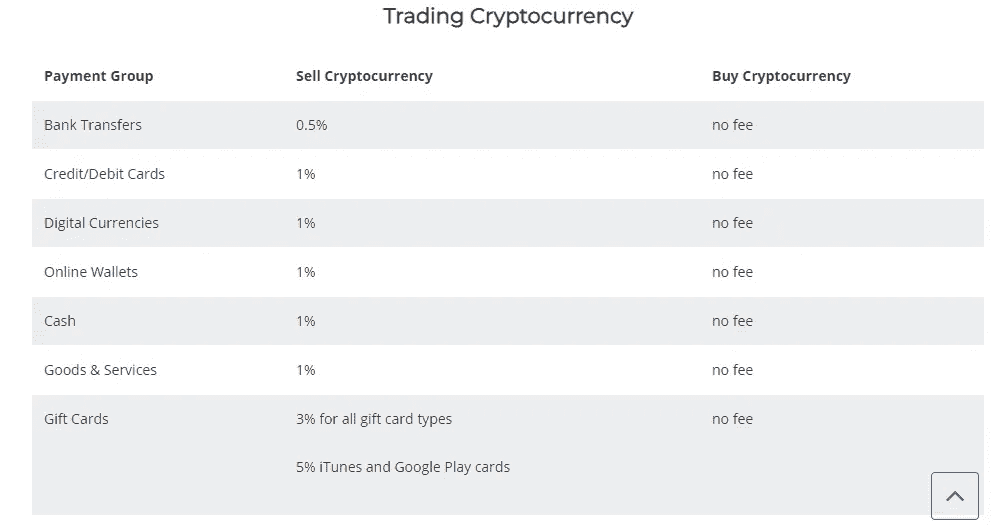
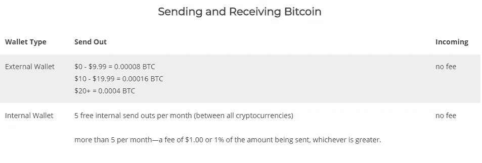
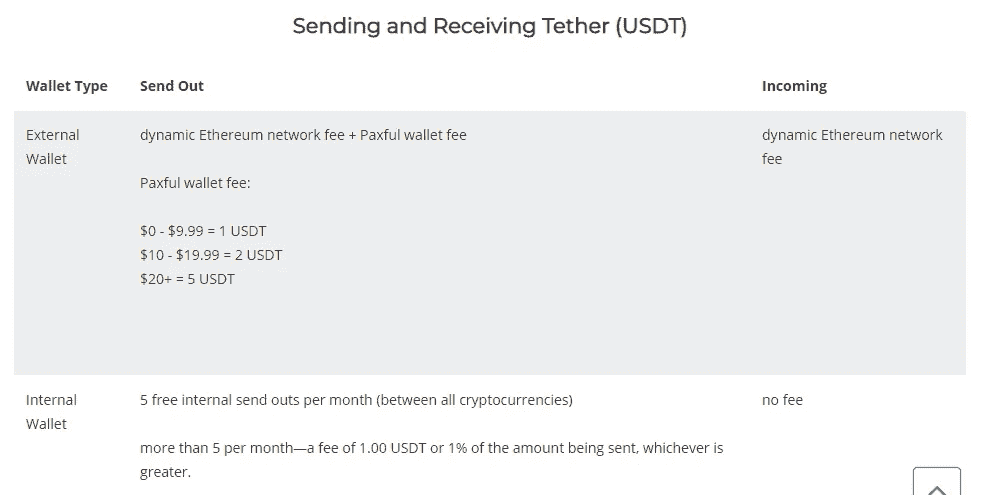
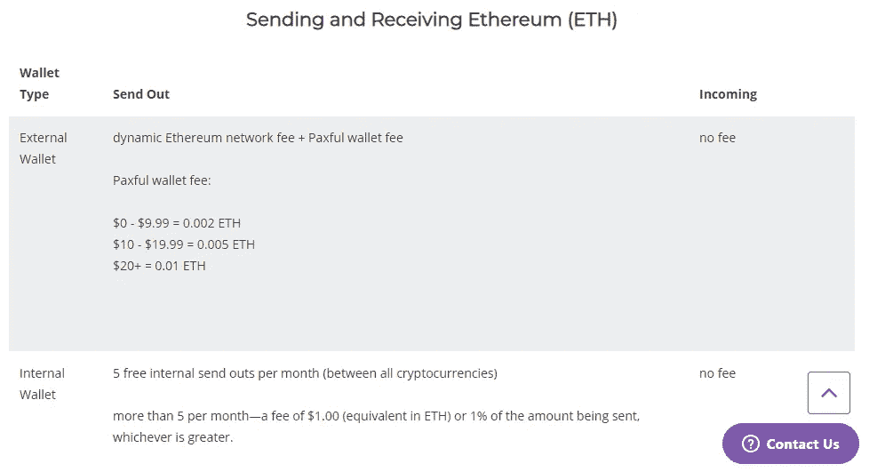
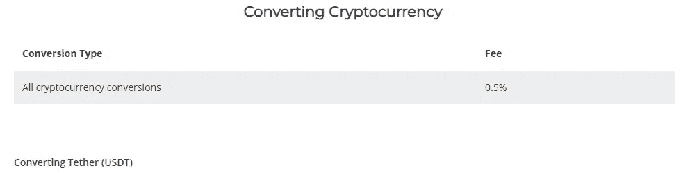
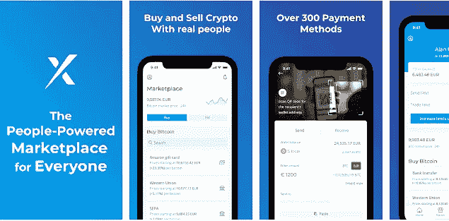

# Paxful Review 2021 |购买、出售和交易加密货币

> 原文：<https://medium.com/coinmonks/paxful-review-4daf2354ab70?source=collection_archive---------9----------------------->

在本文中，我们将回顾 [Paxful](https://blog.coincodecap.com/go/paxful) ，这是一个购买、出售和交易加密货币的点对点平台。

阿图尔·沙巴克和雷·优素福在 2014 年创立了 EasyBitz。EasyBitz 随后改名为 [**Paxful**](https://blog.coincodecap.com/go/paxful) 。 [Paxful](https://blog.coincodecap.com/go/paxful) 是最好的交易加密货币的点对点金融平台之一。这个平台就像一个市场，买家和卖家在这里联系业务。

[Paxful](https://blog.coincodecap.com/go/paxful) 有 300 多种付款方式，让您轻松找到合适的优惠。Paxful 打算让用户完全控制他们的钱。这个平台的点对点系统消除了边界和限制。用户几乎可以在世界任何地方汇款和购物。这就是用户使用 Paxful 的方式。Paxful 的社区拥有超过 480 万用户，并且还在持续增长。

# Paxful 审查:摘要

*   [**Paxful**](https://blog.coincodecap.com/go/paxful) 是最好的交易加密货币的点对点金融平台之一。
*   它以两种形式提供市场服务:虚拟信息亭链接和 Paxful 支付。'
*   在 Paxful 上创建账户后，Paxful 确实会提供一个安全且免费的比特币钱包。
*   它有四个验证级别。每个级别都有不同的购买限额。
*   你可以在 Paxful 上购买比特币，方法是找到一个订单，开始交易，最后收到比特币。购买过程是相同的(泰瑟 USDT)。
*   你可以在 Paxful 上出售比特币，方法是设定你的要求，审查报价，开始交易，最后留下反馈。对于(泰瑟 USDT)来说，销售过程是相同的。
*   这个点对点平台只在很大程度上迎合了比特币和系绳的买卖。Paxful 的卖家接受 300 多种付款方式。
*   这个平台确实为每一笔比特币交易提供托管服务。
*   Paxful 移动应用程序允许随时随地与任何人进行转账。这是 Paxful 平台的终极配套工具。
*   Paxful 提供全天候客户支持。您可以通过联系表格联系 Paxful 的支持团队。

# Paxful 服务

[**Paxful**](https://blog.coincodecap.com/go/paxful) 以两种形式提供其市场服务。Paxful 有一个“虚拟信息亭链接”任何网站所有者或个人都可以使用它。实质上，虚拟信息亭是 Paxful 的附属计划。它允许人们传播这个平台的信息，并从任何购买金额中获得 2%的收入。

Paxful 还提供‘用 Paxful 支付’。这种支付处理功能可以添加到网站。它允许商家通过其网站上的 Paxful 小工具接受 Paxful 的 300 多种支付选项中的任何一种。

# 如何开始使用 Paxful？

以下是 Paxful 的入门步骤。

## 创建一个 Paxful 帐户并登录

访问 Paxful，点击顶部的“开始”。之后，点击“创建账户”填写您的所有详细信息，然后点击“创建帐户”很快，您将在您的电子邮件地址中收到验证链接。点击它来确认你的电子邮件。完成此过程后，您可以首次登录 Paxful。

## Paxful 帕克思钱包

[**Paxful**](https://blog.coincodecap.com/go/paxful) 确实会在你在 Paxful 上创建一个账户后提供一个安全免费的比特币钱包。

## Paxful 的验证和购买限制

[**Paxful**](https://blog.coincodecap.com/go/paxful) 确实有四个验证等级。每个级别都有不同的限制:

*   **第一级**:电话和邮件验证。在这里，限额是 1000 美元。
*   **二级**:一级要求+身份验证。这里的限额是 10，000 美元。
*   **三级**:二级需求+地址验证。在这里，限额是 5 万美元。
*   **四级**:三级要求+强化尽职调查。这个水平没有限制。

美国用户必须完成 1 级、2 级和 3 级才能在 Paxful 上交易。

# 如何在 Paxful 上购买比特币？

1.  **寻找优惠:**在 Paxful 上创建账户后，选择支付方式、您打算购买的[比特币](https://blog.coincodecap.com/a-candid-explanation-of-bitcoin)金额以及您喜欢的货币。之后，点击“搜索优惠”查看报价列表，选择最符合您规格的一个。然后，查看卖家的条款。请检查卖家设定的价格以及他们的反馈和信誉评分，以评估他们的可信度。
2.  **开始交易:**当你对卖家的条款满意时，插入你打算购买的比特币数量。然后，开始交易。在此之后，将打开与卖家的实时聊天。按照卖家的指示付款并确认。
3.  **接收比特币:**卖家会将比特币直接放入你的 Paxful 钱包。

## Paxful 点评:如何在 Paxful 上购买系绳(USDT)？

买 Tether (USDT)的流程和在 [Paxful](https://blog.coincodecap.com/go/paxful) 上买比特币的流程一样。

# 如何在 Paxful 上销售比特币？

1.  **设定你的要求:**选择你偏好的支付方式，以及你打算出售的比特币最高金额。您也可以指明您的首选货币和您的位置。完成后，点击“搜索优惠”然后你会看到一个报价列表。
2.  **查看报价:**你必须查看买家的重要信息，比如他们的名字、信誉、验证等级、每比特币的费率等。找到合适的报价后，点击“出售”这不会开启交易，但会引导你完成买方设定的报价条件和条款。
3.  **开始交易:**当你对买家的条件满意时，填写你准备交易的金额，然后点击“立即出售”这将打开一个实时交易聊天，并将您的比特币转移到 Paxful 的安全托管账户。请仔细阅读所有提供的说明并遵照执行。你的买家也会完成他们的交易。然后，你可以在收到付款后释放比特币。交易结束后，下载一份公开收据。
4.  **留下反馈:**一旦你卖出了你的比特币，一定要记得给你的交易伙伴反馈。这对 Paxful 来说至关重要，因为它有助于建立用户的声誉。

## 如何在 Paxful 上销售(USDT)？

卖系绳的流程和在 Paxful 上卖比特币的流程是一样的。

# 巨额费用

## 交易费用

## 购买加密货币

当您在 [Paxful](https://blog.coincodecap.com/go/paxful) 上从另一位顾客处购买加密货币时，您是在以顾客设定的价格购买加密货币。这些汇率取决于多种因素，如您的支付方式、验证状态、订单大小和货币对(如美元、欧元、CNY)

## 出售加密货币

交易开始时，保管暨代付款金额会从你的 Paxful 钱包中扣除。 [Paxful](https://blog.coincodecap.com/go/paxful) 在交易成功完成后收取托管费。如果交易没有完成，那么 Paxful 不收取费用。

## 收发比特币的费用

*   [Paxful](https://blog.coincodecap.com/go/paxful) 确实对每次从 Paxful 钱包向外部比特币地址发送收取钱包发送费。
*   给定费用包括 Paxful 钱包基础设施的维护和相关的矿工费用。
*   向 Paxful 客户发送比特币是免费的。但是，在每月完成前五笔交易后，将向您收取费用。在你的前五次交易(发送比特币)后，你将被收取 1.00 美元或你发送金额的 1%的费用。在这些费用中，金额较大的将适用于每笔交易。费用以比特币收取，并根据当时比特币的市场汇率计算。如果你不拥有相当于 1.00 美元的比特币，那么你就不能发送资金。

## 发送和接收系绳的费用(USDT)

*   从外部地址接收(存入)USDT 到 Pax ful Pax ful Tether 钱包需要付费。这个费用就是网费。该网络费用由存款合并费乘以当前以太坊费率组成。
*   一旦您点击接收，您将能够在您的系绳钱包中看到费用的粗略估计。实际费用在押金到账后计算。该费用可能与之前看到的估计金额不同。这种差异是以太坊价格不断变化的结果。
*   对于从外部钱包传入的系绳交易，除了以太坊网络费用之外，不收取额外费用。
*   假设资金是从一个 [Paxful](https://blog.coincodecap.com/go/paxful) 系绳钱包里寄给你的。在这种情况下，将 USDT 存入 Pax ful Pax ful Tether 钱包是免费的。

## 发送和接收以太坊(ETH)的费用

## Paxful 上转换加密货币的费用

# 安定的和平

您从 Stablecoin 交易对手处获得的报价包含所有费用。此价格可能包括 Stablecoin 交易对手收取的额外费用或/和第三方费用，这些费用也是促成此交易所必需的。

# Paxful 的货币和支付方式

这个点对点平台只在很大程度上迎合了比特币和系绳的买卖。这个平台不为用户持有法定货币，因为钱是直接寄给卖家的。Paxful 的卖家接受 300 多种付款方式。最著名的方法是贝宝、亚马逊礼品卡、电汇和西联汇款。请记住，不同的支付方式将导致不同的汇率。例如，允许退款的支付方式(信用卡、PayPal)会花费更多。相比之下，不可退款的支付方式(现金、银行转账)通常会有较低的汇率。

# 第三方托管

这个平台确实为每一笔比特币交易提供托管服务。在买家找到卖家，卖家接受报价后，比特币从卖家的钱包中转移到第三方托管。在此之后，卖家将无法取消交易。然而，买方只有一点时间把钱寄给卖方。如果买方未能在规定时间内完成交易，交易将被视为不完整。因此，比特币会回到卖家的钱包里。交易必须经过双方的确认。

假设在任何一点上有争议。在这种情况下，Paxful 的主持人将根据可用的细节做出谨慎的决定。比特币将被相应地交给卖家或买家。大多数情况下，由于这个平台的严格控制，交易进行得很顺利。

# 如何安全使用 Paxful？

你可能会把 Paxful 的诚信误认为卖家的诚信。然而， [**Paxful**](https://blog.coincodecap.com/go/paxful) 就像一个市场。这意味着一些卖家不值得信任，可能是骗子。在 Paxful 上交易时，请记住以下几点:

*   不要在 Paxful 之外进行任何交流。请确保在系统中记录所有内容。因为如果有争议，版主可以帮助你。
*   确保与您交易的用户在线。这是因为未回复的订单会在短时间内自动取消。
*   如果你不能完全控制付款，请不要从代管帐户中释放付款。这意味着它应该在您的帐户中得到确认。
*   丢不起的钱请不要送。

# Paxful 移动应用

[**Paxful**](https://blog.coincodecap.com/go/paxful) 手机应用程序允许随时随地与任何人进行转账。这是 Paxful 平台的终极配套工具。您可以安全地将您的密码存储在您自己的[移动加密货币钱包](https://blog.coincodecap.com/best-btc-wallets-for-android)中。随时检查您的余额。以下是下载该应用程序的链接:

*   [**安卓 app**](https://play.google.com/store/apps/details?id=com.paxful.wallet&hl=en)
*   [**iOS app**](https://apps.apple.com/us/app/paxful-bitcoin-wallet/id1443813253)

使用 **qWQbe6BZnkA** 转介代码获得费用折扣。

# Paxful 审查:支持的国家

[Paxful](https://blog.coincodecap.com/go/paxful) 除伊朗、伊拉克、黎巴嫩、利比亚、朝鲜、刚果共和国、索马里、南苏丹相关制裁、苏丹及达尔富尔、叙利亚、也门、布隆迪、中非共和国制裁、古巴、克里米亚地区等国家外，全球均可使用。

# Paxful 审查:联系支持

[Paxful](https://blog.coincodecap.com/go/paxful) 提供全天候客户支持。您可以通过联系表格联系 Paxful 的支持团队。

# Paxful 审查:结论

Paxful 赋予人们出售、购买和交易数字货币的权力。它有 300 多种支付方式。它还提供托管服务。值得注意的是，Paxful 提供了无缝体验，因为它是一个易于使用的平台。

# 常见问题

**Pax ful 合法吗？**

是的，Paxful 是绝对合法的。Paxful 还为其用户的安全提供托管服务。

**如何联系 Paxful？**

Paxful 提供全天候客户支持。您可以通过联系表格联系 Paxful 的支持团队。

Paxful 上有骗局发生吗？

即使有 Paxful 的强力保护，它仍然是一个市场。这意味着一些卖家不值得信任，可能是骗子。如果你遵守 Paxful 上给出的所有规则，那么你将在 Paxful 上保持安全。

> 加入 coin monks[Telegram group](https://t.me/joinchat/EPmjKpNYwRMsBI4p)学习加密交易和投资

## 另外，阅读

*   什么是[闪贷](https://blog.coincodecap.com/what-are-flash-loans-on-ethereum)？
*   最好的[密码交易机器人](/coinmonks/crypto-trading-bot-c2ffce8acb2a) | [网格交易](https://blog.coincodecap.com/grid-trading)
*   [3 商业评论](/coinmonks/3commas-review-an-excellent-crypto-trading-bot-2020-1313a58bec92) | [Pionex 评论](/coinmonks/pionex-review-exchange-with-crypto-trading-bot-1e459d0191ea) | [Coinrule 评论](https://blog.coincodecap.com/coinrule-review-a-perfect-trading-bot)
*   [AAX 交易所评论](/coinmonks/aax-exchange-review-2021-67c5ea09330c) | [德里比特评论](/coinmonks/deribit-review-options-fees-apis-and-testnet-2ca16c4bbdb2) | [FTX 交易所评论](/coinmonks/ftx-crypto-exchange-review-53664ac1198f)
*   [n ave 零点回顾](/coinmonks/ngrave-zero-review-c465cf8307fc) | [Phemex 回顾](/coinmonks/phemex-review-4cfba0b49e28) | [PrimeXBT 回顾](/coinmonks/primexbt-review-88e0815be858)
*   [Bybit Exchange 审查](/coinmonks/bybit-exchange-review-dbd570019b71) | [Bityard 审查](https://blog.coincodecap.com/bityard-reivew) | [CoinSpot 审查](https://blog.coincodecap.com/coinspot-review)
*   [3 commas vs crypto hopper](/coinmonks/3commas-vs-pionex-vs-cryptohopper-best-crypto-bot-6a98d2baa203)|[赚取加密利息](/coinmonks/earn-crypto-interest-b10b810fdda3)
*   最好的比特币[硬件钱包](/coinmonks/the-best-cryptocurrency-hardware-wallets-of-2020-e28b1c124069?source=friends_link&sk=324dd9ff8556ab578d71e7ad7658ad7c) | [BitBox02 回顾](/coinmonks/bitbox02-review-your-swiss-bitcoin-hardware-wallet-c36c88fff29)
*   [总帐 vs n 平均](https://blog.coincodecap.com/ngrave-vs-ledger) | [总帐 nano s vs x](https://blog.coincodecap.com/ledger-nano-s-vs-x)
*   [加密复制交易平台](/coinmonks/top-10-crypto-copy-trading-platforms-for-beginners-d0c37c7d698c) | [比特码复制交易](https://blog.coincodecap.com/bityard-copy-trading)
*   [Vauld 评论](https://blog.coincodecap.com/vauld-review) | [YouHodler 评论](/coinmonks/youhodler-4-easy-ways-to-make-money-98969b9689f2) | [BlockFi 评论](/coinmonks/blockfi-review-53096053c097)
*   最好的[加密税务软件](/coinmonks/best-crypto-tax-tool-for-my-money-72d4b430816b) | [CoinTracking 评论](/coinmonks/cointracking-review-a-reliable-cryptocurrency-tax-software-5114e3eb5737)
*   最佳[加密借贷平台](/coinmonks/top-5-crypto-lending-platforms-in-2020-that-you-need-to-know-a1b675cec3fa) | [杠杆代币](/coinmonks/leveraged-token-3f5257808b22)
*   [莱杰纳米 S vs 特雷佐 one vs 特雷佐 T vs 莱杰纳米 X](https://blog.coincodecap.com/ledger-nano-s-vs-trezor-one-ledger-nano-x-trezor-t)
*   [block fi vs Celsius](/coinmonks/blockfi-vs-celsius-vs-hodlnaut-8a1cc8c26630)|[Hodlnaut 评论](https://blog.coincodecap.com/hodlnaut-review)
*   [Bitsgap 审查](https://blog.coincodecap.com/bitsgap-review) | [Quadency 审查](/coinmonks/quadency-review-a-crypto-trading-automation-platform-3068eaa374e1) | [Bitbns 审查](https://blog.coincodecap.com/bitbns-review)
*   [埃利帕尔泰坦评论](/coinmonks/ellipal-titan-review-85e9071dd029) | [赛克斯斯通评论](https://blog.coincodecap.com/secux-stone-hardware-wallet-review)
*   [DEX Explorer](https://explorer.bitquery.io/ethereum/dex) | [本地比特币评论](https://blog.coincodecap.com/localbitcoins-review)
*   最佳[区块链分析](https://bitquery.io/blog/best-blockchain-analysis-tools-and-software)工具| [赚比特币](https://blog.coincodecap.com/earn-bitcoin)
*   [加密套利](/coinmonks/crypto-arbitrage-guide-how-to-make-money-as-a-beginner-62bfe5c868f6)指南| [如何做空比特币](https://blog.coincodecap.com/short-bitcoin)
*   最佳[加密制图工具](/coinmonks/what-are-the-best-charting-platforms-for-cryptocurrency-trading-85aade584d80) | [最佳加密交易所](/coinmonks/crypto-exchange-dd2f9d6f3769)
*   [如何在印度购买比特币](https://blog.coincodecap.com/buy-bitcoin-app-india)？
*   [印度比特币交易所](/coinmonks/bitcoin-exchange-in-india-7f1fe79715c9) | [比特币储蓄账户](https://blog.coincodecap.com/bitcoin-savings-account)
*   [尤霍德勒 vs 科恩洛 vs 霍德诺特](https://blog.coincodecap.com/youhodler-coinloan-hodlnaut)

> [直接在您的收件箱中获得最佳软件交易](/coinmonks/newsletters/coinmonks)

*原载于 2021 年 3 月 9 日 https://blog.coincodecap.com**T21*[。](https://blog.coincodecap.com/paxful-review)