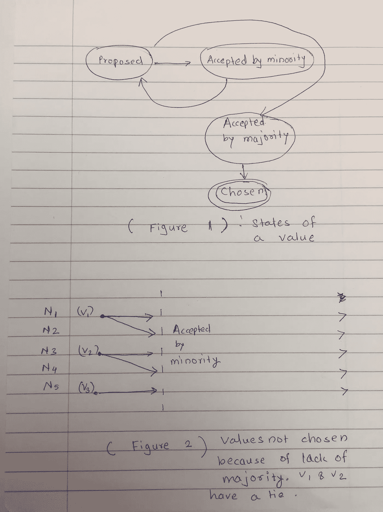
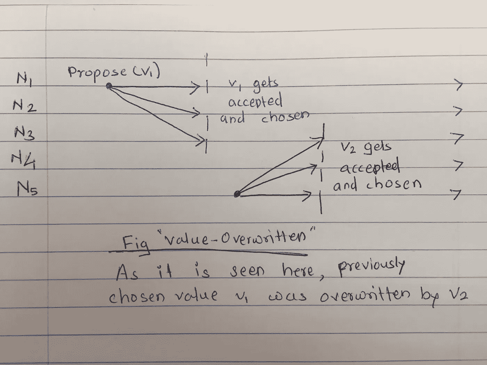
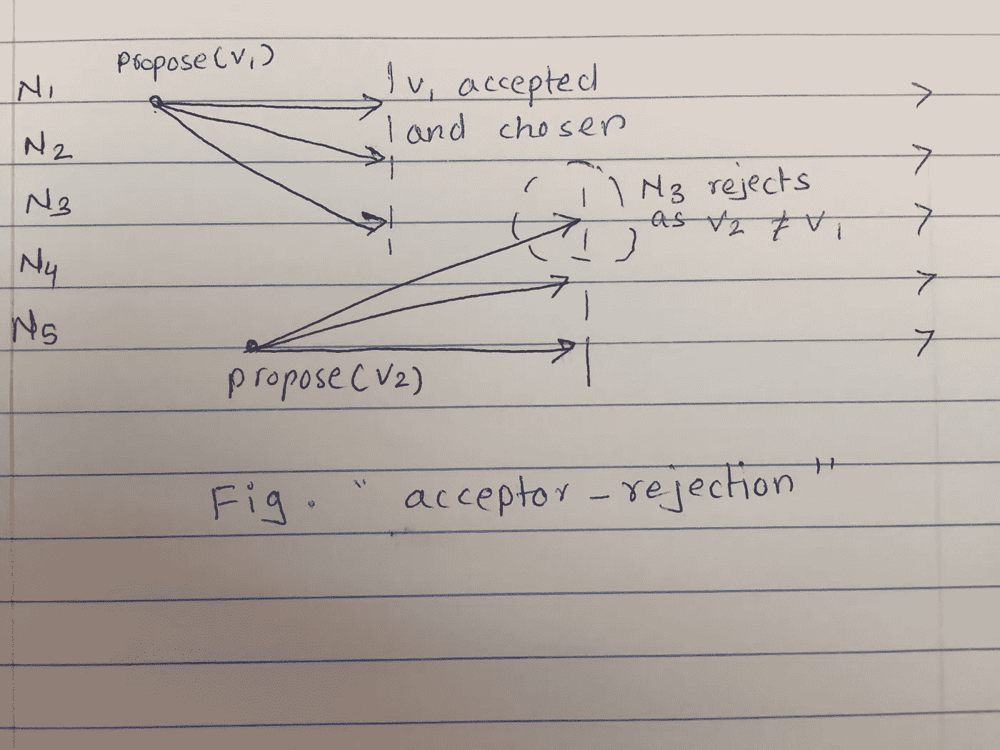
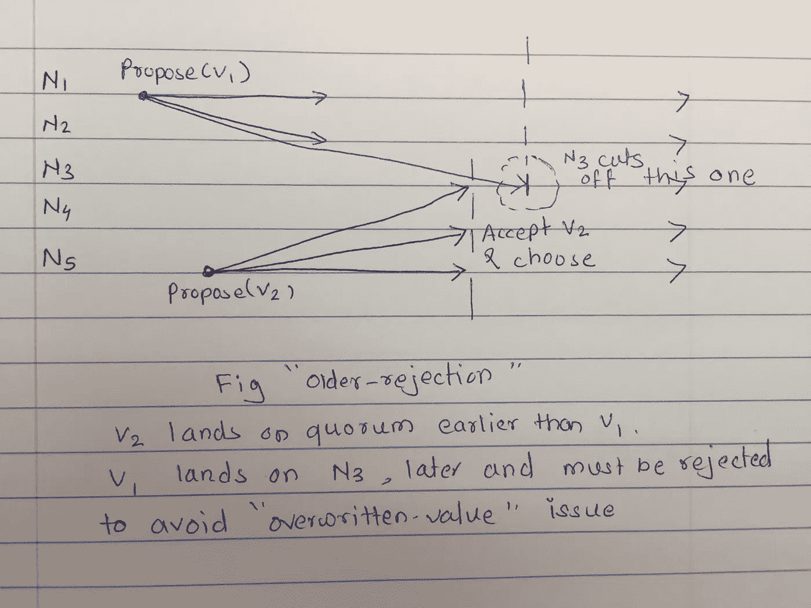

# 简单的 Paxos 帕克索

> 原文：<https://medium.com/coinmonks/paxos-made-simple-3b83c05aac37?source=collection_archive---------1----------------------->

## 摘要

Paxos 帕克索在展示图表/图片时非常简单。(Lamport 对本文的摘要只有一行文字:Paxos 算法，用简单的英语表述，非常简单)

## 介绍

分布式系统使用许多商用机器来实现高可用性和可伸缩性。这样的机器不是可靠的实体，它们经常出现和消失。在这种系统中，通常需要就“某些事情”达成一致，即达成共识。这里的“某物”取决于上下文。例如:

在一个在许多分支机构运营并进行许多交易的数字化系统(如银行)中，需要对所有账户有一个一致的看法。在给定的时间点，银行有一个一致的状态，这反过来又转化为所有银行账户中的正确金额。实现这一点的一种方法是在一定数量的服务器节点上维护有序的操作日志(一个服务器节点是不够的，因为它可能会停机，从而影响可用性和可伸缩性)。这些服务器节点上有序日志的一致视图确保了系统中所有账户的一致视图:基本上，银行成为一个状态机，它将所有账户的当前状态和调整账户以反映最新交易的有序操作日志作为输入。从这里开始，我们将只担心这些需要维护有序日志一致性的服务器节点。

因此，每个服务器节点都有自己的日志，当用户从自己的账户中存钱或取钱时，节点可以相互通信以建立订单。这样，一个客户端可以连接到一个服务器，而另一个客户端可以连接到不同的服务器，并且仍然可以获得银行当前状态(即帐户值)的相同视图。此外，请记住，故障是非拜占庭式的，即银行中的服务器节点不会受到合谋和恶意更改日志的激励。(这里需要注意的是，比特币网络也需要解决类似的问题，但由于节点的不信任性质，故障可能是拜占庭式的)

现在，让我们看看所有节点如何能够在一致的日志视图上达成一致。一个更简单的问题是，首先要弄清楚节点如何能在一个不变的值上达成一致，即事务 X 和 y(这里事务 X 是日志的索引。让我们暂时忽略它)，Y 是节点网络需要在所有节点上的日志中的索引 X 处达成一致并提交的值。让我们称之为基本的 Paxos。一旦我们建立了这一点，我们就可以使用它作为构建块来实现分布式有序日志。

> 交易新手？试试[加密交易机器人](/coinmonks/crypto-trading-bot-c2ffce8acb2a)或者[复制交易](/coinmonks/top-10-crypto-copy-trading-platforms-for-beginners-d0c37c7d698c)

## 共识问题定义—基本共识

1.  即使提出了单个值，网络最终也会识别并选择它。(C1)
2.  一旦网络选择了该值，它就不能被覆盖。(C2)
3.  节点听不到一个值被选择，除非它真的被网络选择了。(C3)

## 建议值的组成部分和状态

在这个算法中，有两个主要部分:提议者(P)和接受者(A)。还有一个听者(L)，但是对于讨论的大部分来说就没那么有趣了。每个节点充当所有三个节点。提议者根据客户的要求提出价值，比如存放一些钱。接受者接受值，当有多数/法定人数时，建议的值被选择并提交到日志。因此，建议值会经历以下状态。选择状态是值的最终状态，在值被选择之前，在 P 和 A 之间可能有很多来回。参见下面的图 1。

**States of a proposed “Value” and Lack of majority scenarios**

**图表上的命名:**

1.  N1 和 N2 是服务器节点。
2.  随着时间的推移，图从左到右显示了每台服务器正在做什么。
3.  点通常代表给定节点在时间尺度上的给定时间的值的建议。
4.  提议/准备和接受/选择是同义词。

图 2 解释了在网络中缺乏多数是如何发生的。由于没有多数，一个选定的价值观不会出现。

## 提议者(P)和接受者(A)的角色

提议者提出价值，接受者接受价值。让我们定义初始 RPC 来达成共识。

1.  p 调用在所有 As 上准备(v) RPC。有些 A 会返回一些值，但是我们暂时忽略这些。
2.  一旦多数 A 返回，P 可以调用 accept(v)给那些 A(取决于从 1 返回的值)。有可能返回值不会导致共识，然后 P 将不得不再次进行新一轮的准备(Vnew)。

## 进化算法

基于“共识问题定义”一节中的问题定义，算法需要具有以下特性:

*调整 1*

任何一个 A 都必须接受它收到的第一个值来满足 C1。当只有一个 prepare(v)调用时，这样做很好。如果提出了一个以上的值，那么就会导致上面图 2 中提到的问题——“缺乏多数”。

*调整 2*

因此，为了补救这一点并达成某种共识，A 必须接受不止一个值。这会导致之前选择的值被覆盖的问题，这违反了问题定义中定义的 C2。见图“值-覆盖”:在这个 N5 提出 v2，在一个值 v1 已经被多数同意之后。

Value overwritten when a node can accept more than one value

*调整 3*

因此，为了补救 2，在上面的同一个图中，当 N5 将要提议/准备 v2 时，它可以检查是否有先前选择的值。如果有，那么它将建议(v1)而不是 v2。这被称为两阶段协议——先检查，然后提议。

*调整 4*

这个解决方案仍然有一些问题。这些取决于 N5 提案何时开始。它可以在接受或选择任何值之前开始。这种情况可能发生在提议者或接受者身上。见图“接受者-拒绝”。在这种情况下，N3 拒绝 v2，因为后来的提议覆盖了已经达成的共识。

*调整 5*

关于 N5 第二个提案的时间安排的另一个问题如图“旧提案-拒绝”所示。这里 v2 首先到达法定人数，然后 v1 和 N1:propose(v1)稍后到达。当 N5 开始时，没有达成共识，所以它不可能知道 v1，而不是 v2。

为了解决这个问题，节点 N3 需要拒绝较旧的提议，即较早开始的提议——N1:v1。这可以通过为每个提案指定一个全球唯一的序列号来实现:

1.  <counter><node-id>即低位保存 node-id，高位保存单调递增的计数器。</node-id></counter>
2.  或者给每个服务器节点分配一些不连续的唯一 id 集，然后它们可以单调增加。
3.  服务器需要将这些值保存到磁盘上，这样它们就可以从崩溃中恢复，并且总是从它们的终端发出更高的建议号。
4.  接受者必须在磁盘上记住编号最高的提议和他们接受的价值。

## 形式化算法

有两个重要的项目需要跟踪。一个是提案编号本身，第二个是提案的价值。请记住，当你通读时，这两个是不同的实体。

1.  提议者发送提议号 n，并使用 prepare 方法将其广播到所有节点。
2.  接受者查看该建议，并承诺不接受任何更低的建议，即数量小于 n。如果接受者看到更高的建议数量，则拒绝该建议。
3.  此外，一旦接受者接受建议**值**，它将只接受来自更高建议编号的相同建议值。
4.  如果大多数接受者回复，那么接受者使用它回复的最高建议号的值 v。当多数人不同意时，那么算法需要回到步骤 1。
5.  提议者现在创建一个具有数字 n 和值 v 的接受消息，并将其发送给在步骤 2 中响应的接受者。
6.  接受者将接受此建议**编号**和**值**，如果他们尚未回复更高的建议编号。

## 关键要点

1.  “准备和接受”的两阶段方法确保唯一能够获胜的**值**是既准备好又被接受的值。只要一些 P 可以在大多数节点上获得其准备和接受消息，基本的 paxos 将返回该值。
2.  **僵局:**他的方法的问题是，它仍然会遇到没有法定人数的情况。如果序列是这样的，这些消息到达节点 N3，并由 N1 和 N5 发送:*:N1:准备(1)，N5:准备(2)，N1:接受(1)，N1:准备(3)，N5:接受(2)。*这里 N5:prepare(2)覆盖 N1:prepare(1)并切断 N1:accept(1)。在 N5 可以执行 N5:accept(2)之前，N1 带着 N1 的更高编号的提议:prepare(3)回来，并切断 N5:Accept(2)。

## 如何打破僵局

最后一节中的僵局问题似乎是一个大问题，但它可以很容易地解决。节点可以在执行准备呼叫之前使用一些随机延迟。这将有助于一些提议者进入其准备和接受呼叫。虽然，对每条消息都这样做可能有点多。因此，兰波特建议使用“杰出提议者”的概念。该组节点可以使用基本 paxos(和随机延迟)本身来选举一个杰出的提议者，然后使该唯一节点成为提议者节点，从而避免持续的僵局。

## 扩展基本 Paxos 以生成复制日志

回到前面的银行复制日志的例子，需要发生的是所有服务器节点需要就日志的状态达成一致。日志中的每个索引代表一个事务。一些事务可以而且将会并行发生，因此服务器可以接受多个请求并将这些请求提交给不同的索引——只要有仲裁。*确保银行账户一致性的关键是状态转换应该按顺序应用——一个接一个。*

因此，关注复制的日志:

1.  每个节点可以运行一个与日志中每个索引对应的基本 paxos 实例。
2.  每个节点可以同时选择多个指数，并就该指数的对数值达成一致。
3.  领导人选举有助于减少对提议价值的争论
4.  领导者可以将针对多个日志索引的批量准备调用合并到单个准备调用中，从而消除大多数准备调用。
5.  可能需要一个心跳消息系统来发现一个领导者已经不在了，然后其他人需要成为领导者和提议者。当领导者倒下时，系统无法前进。

**结论**

我发现约翰·奥斯特胡特对 Basic- paxos 的解释非常有用。这篇笔记中的数字是受他的演讲的启发。他进一步详细介绍了多 Paxos，以及配置变化(即添加服务器)如何影响 paxos，我现在不打算介绍这些内容。一般来说，分布式复制日志在许多应用程序中似乎是一个有用的概念。这可能值得阅读更多的实际实现，以及他们遇到了什么问题。

> 加入 Coinmonks [电报频道](https://t.me/coincodecap)和 [Youtube 频道](https://www.youtube.com/c/coinmonks/videos)获取每日[加密新闻](http://coincodecap.com/)

## 另外，阅读

*   [复制交易](/coinmonks/top-10-crypto-copy-trading-platforms-for-beginners-d0c37c7d698c) | [加密税务软件](/coinmonks/crypto-tax-software-ed4b4810e338)
*   [网格交易](https://coincodecap.com/grid-trading) | [加密硬件钱包](/coinmonks/the-best-cryptocurrency-hardware-wallets-of-2020-e28b1c124069)
*   [密码电报信号](http://Top 4 Telegram Channels for Crypto Traders) | [密码交易机器人](/coinmonks/crypto-trading-bot-c2ffce8acb2a)
*   [Bookmap 评论](https://coincodecap.com/bookmap-review-2021-best-trading-software) | [美国 5 大最佳加密交易所](https://coincodecap.com/crypto-exchange-usa)
*   [如何在 FTX 交易所交易期货](https://coincodecap.com/ftx-futures-trading) | [OKEx vs 币安](https://coincodecap.com/okex-vs-binance)
*   [CoinLoan 评论](https://coincodecap.com/coinloan-review) | [YouHodler 评论](/coinmonks/youhodler-4-easy-ways-to-make-money-98969b9689f2) | [BlockFi 评论](https://coincodecap.com/blockfi-review)
*   [XT.COM 评论](https://coincodecap.com/profittradingapp-for-binance) | [币安评论](https://coincodecap.com/xt-com-review)
*   [最佳加密交易所](/coinmonks/crypto-exchange-dd2f9d6f3769) | [印度最佳加密交易所](/coinmonks/bitcoin-exchange-in-india-7f1fe79715c9)
*   [开发人员的最佳加密 API](/coinmonks/best-crypto-apis-for-developers-5efe3a597a9f)
*   最佳[密码借贷平台](/coinmonks/top-5-crypto-lending-platforms-in-2020-that-you-need-to-know-a1b675cec3fa)
*   杠杆代币的终极指南