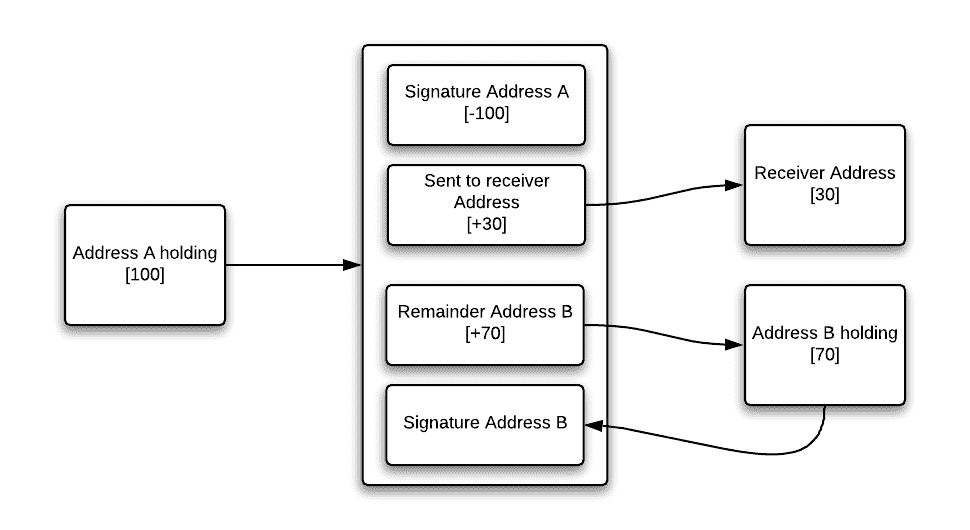

# 股份支付

> 原文：<https://medium.com/coinmonks/pay-with-stake-8c77f135d58e?source=collection_archive---------1----------------------->

## 不再需要共识

在本文中，我简要描述了一种在分布式分类帐中提供即时支付的无投票和无共识机制。一种可以添加到大多数分类帐中的机制。

这里的想法是在隐私和安全之上提供可用性(比如 0 块确认)。

## 共识；一致

共识，分布式账本技术的圣杯。就是‘商定什么’的过程。当有东西需要投票时，这个过程就开始了。比如比特币有两笔交易试图花同样的钱。共识是选择的机制，它挑选。它是主动的(投票)还是被动的(通过随机预言确定)。

## 好处

共识通常被认为是一个必要条件，因为对手可以从试图影响选择中获得利益。就像获得真实世界的资产，但由于共识选择了不相关的交易，交易被撤销。换句话说，产生了双重支出。

通过这些简短的陈述，我声明:

> 如果没有利益可得，就不需要共识。

## 引入股权支付。

这里的主要思想是，当发出的交易和确认所有代币/硬币/信用/任何被烧毁的东西之间发生冲突时。简单地销毁，递归地直到源事务被记入贷方。

对此的要求是，下一次交易中的所有权证明必须以剩余地址的形式包含在内。

Pay-with-stake

如果地址 A 上出现任何冲突，所有的令牌都会被递归销毁。因为我们知道地址 B 是下一个所有者，我们在上面的图片中看到付款拥有 70%的股份。如果我因为讨厌咖啡而花双倍的钱去买咖啡，那我会花更多的钱，而我会拒绝他们。

这不是万无一失的，但有这样一个机制可以让商店强制即时支付 50%的股份，他们根本不会接受未经确认的股份支付交易作为来源的交易。

简单而有效的方式提供即时支付，如果出了问题，所有人都输了。所以不需要投票！

## 恢复

当然，这种在地狱中燃烧的方法有点苛刻，但是对于这种机制，你不需要任何共识。当然，如果没有任何一方打算让交易走向毁灭，事情可能会出错。

因此，所有各方都可以共同签署一项恢复交易，扭转燃烧，可以说是凤凰城的交易。对于这个恢复事务，您将需要投票开销，以防发生冲突。或者你可以说，你有一次机会，如果失败了，凤凰也死了。

## **结论**

我认为这种机制对任何潜在的加密项目都有很大的好处。我很清楚这不是一个简单的实现机制，即使它很容易推理。尤其是递归积分。

当然，这个机制还有更多细节，但这是它的主要要点。如果您想联系我，请在此回复或:

 [## Olaf van Wijk -技术专家- SpronQ -让我们一起创造积极的影响| LinkedIn

### 查看 Olaf van Wijk 在世界上最大的职业社区 LinkedIn 上的个人资料。奥拉夫有 7 个工作列在他们的…

www.linkedin.com](https://www.linkedin.com/in/ovanwijk)  [## 奥拉夫·范维克

### Olaf van Wijk 的最新推文(@ovanwijk)。设计蚂蚁，而不是蚁群

twitter.com](https://twitter.com/ovanwijk) 

当然，强制捐赠地址:

BTC:37 C3 f 99 DDN 4 qv7m 44 bsg 2 xsv 9 wxj 7 xvqqq

乙醚:0x 854 f 4 fc 5917 dc9e 17647 bef 58571 df 9b 47 af 4a 7 a

IOTA:ywkhlvcbeskhkgorfpgobzuzbxbepgebsjxfuwajdev 9 svswyttszx 9 nqrovivhagbxddefgiwiht quzz 9 kzpdxyc

> [在您的收件箱中直接获得最佳软件交易](https://coincodecap.com/?utm_source=coinmonks)

