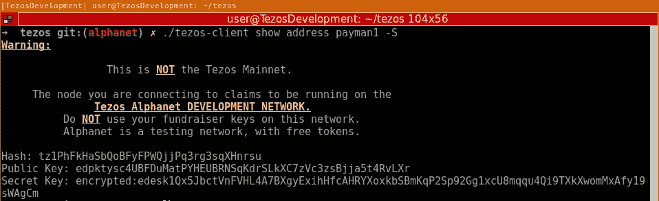
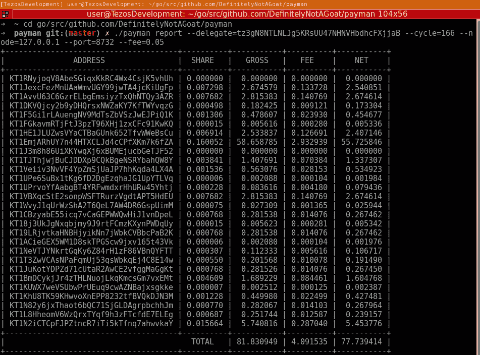
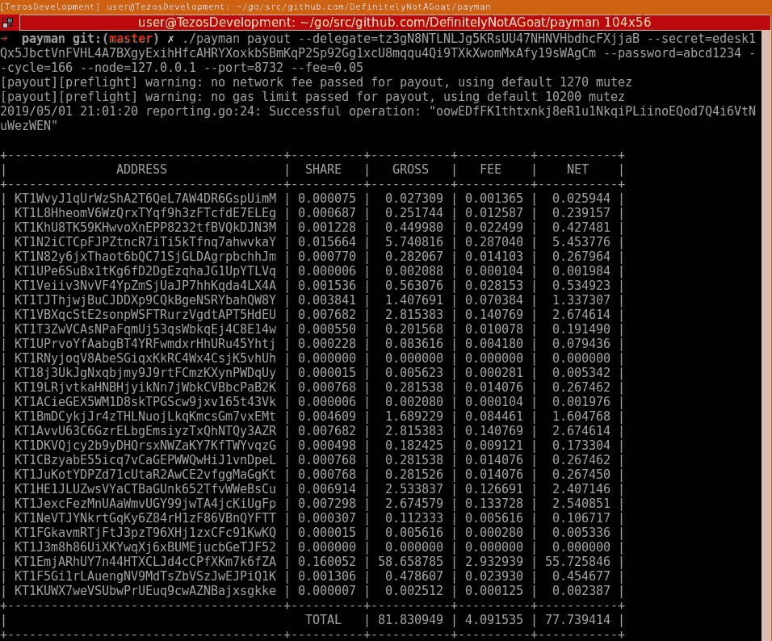
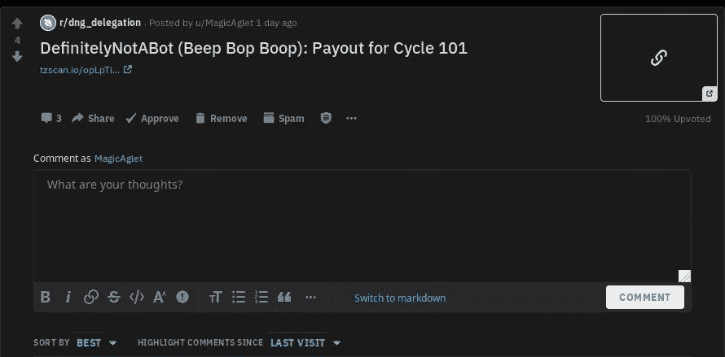
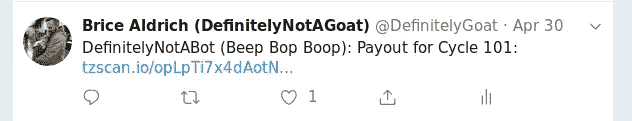

# payman——Tezos 批量支付工具

> 原文：<https://medium.com/coinmonks/payman-a-tezos-batch-payment-tool-5d1276c045c4?source=collection_archive---------1----------------------->


# 摘要

如果你是目前或即将加入 Tezos 的面包师，本教程可能会有所帮助。本教程将重点介绍如何使用 Payman 向您的代表团支付批量付款。Tezos 生态系统中已经有一些工具在做同样的事情，但是我相信 Payman 更容易使用，也更容易配置。

> Payman 是麻省理工学院许可下的开源免费工具。

# 动机

我制作 Payman 的主要动机是展示 [go-tezos](https://github.com/DefinitelyNotAGoat/go-tezos) 的神秘能力。Payman underneath the hood 使用的是我个人和许多贡献者一起开发的 Golang Tezos 库。作为一个额外的奖励，Payman 本身使用 GoLang 并发模型比竞争对手更快地进行支付。

# 装置

## 发布安装

```
wget [https://github.com/DefinitelyNotAGoat/payman/releases/download/v1.0.0/payman_linux_amd64](https://github.com/DefinitelyNotAGoat/payman/releases/download/v1.0.0/payman_linux_amd64)
sudo mv [payman_linux_amd64](https://github.com/DefinitelyNotAGoat/payman/releases/download/v1.0.0/payman_linux_amd64) /usr/local/bin/payman
sudo chmod a+x /usr/local/bin/payman
```

## 源安装

```
[git clone https://github.com/DefinitelyNotAGoat/payman](https://github.com/DefinitelyNotAGoat/payman)
cd payman
git checkout tags/v1.0.0
go build
sudo mv /usr/local/bin/payman
```

# 使用

## 先决条件

在我们深入研究 Payman 的不同功能之前，了解如何使用 tezos-client CLI 来获取您的钱包信息非常重要。Payman 依赖于你支付的钱包的加密密钥和密码。Payman 不会在任何地方保存这些信息，也不会恶意使用这些信息。你可以通过阅读代码来验证。

当你使用 Payman 支付你的钱包凭证时，你一定要小心。就像任何支付工具，甚至是 tezos-client 本身一样，当您向工具提供凭证时，您的钱包将在工具运行时存在于内存中。在这一点上，请确保运行 Payman 时，你是从一个安全的计算机这样做。

获取您钱包的秘密密钥:

```
./tezos-client show address <alias> -S
```

使用别名为`payman1`的钱包使用 alphanet 执行此操作的示例:



## 生成报告

我想演示的第一件事是如何使用 Payman 生成一个支出报告，而不是实际支付。

```
./payman \
   report \
   --delegate=<delegate_public_key> \
   --cycle=<cycle_number> \
   --node=<address> \
   --port=<port_number> \
   --fee=<fee_as_float>
```

上面的命令将调用`payman report`,它使用传递的信息计算支出，然后通过打印一个表并在当前工作目录中生成一个包含当前数据和时间的 csv 文件来报告支出。

Alphanet 的例子:



## 周期支出

接下来我要演示的是支付特定周期的费用。

```
./payman \
   payout \
   --delegate=<delegate_public_key> \    
   --secret=<encrypted_secret_to_wallet> \
   --password=<password_to_encrypted_wallet> \
   --cycle=<cycle_num> \
   --node=<address> \
   --port=<port_number> \
   --fee=<fee_as_float>
```

Alphanet 的例子:



正如你从上面看到的，当你使用支付命令时，你将得到与使用报告命令相同的表，但是在此之前，你也将得到你成功支付的操作散列。

## 使用 Reddit 机器人

要使用 reddit 机器人，您需要获得访问 reddit 的 API。这超出了本教程的范围，但是通过一个简单的谷歌搜索，你就可以搞定了。要添加您的 reddit 访问权限以使用`payman payout`创建机器人，您需要传递以下标志:

```
--reddit=<reddit_agent_file> \
--reddit-title=<pretitle_to_reddit_post>
```

代理文件包含您的 reddit 凭据，格式如下:

```
user_agent: "DNG_DELEGATION:BAKINGBOT:0.0.1 (by /u/magicaglet)"
client_id: <from_api_access>
client_secret: <from_api_access>
username: "MagicAglet"
password: <password>
```

首先你会看到`user_agent`，这是你分配给你的机器人的唯一 id。然后从您的 reddit 帐户传递 client_id 和 secret。用您的用户名替换 MagicAglet，并添加您的密码。

举个例子，我的 reddit 机器人使用了`DefinitelyNotABot (Beep Bop Boop):`作为`--reddit-title`，它发布了:



## 使用推特机器人

twitter 机器人将会很像 reddit 机器人。

```
--twitter 
--twitter-title=<pretitle_to_reddit_post>
```

上述标志将打开 twitter bot，并在当前目录中查找包含 api 密钥的`twitter.yml`配置文件。如果您希望`twitter.yml`文件不在当前目录下，您可以通过`--twitter-path=/path/to/file/`添加路径。

您的`twitter.yml`文件必须如下所示:

```
consumerKey: ""
consumerKeySecret: ""
accessToken: ""
accessTokenSecret: ""
```

一旦你获得 twitter 开发者账户[https://developer.twitter.com/](https://developer.twitter.com/)的批准，你就可以很容易地找到上面的价值观。

举个例子，我的 twitter 机器人，使用`DefinitelyNotABot (Beep Bop Boop):`作为`--twitter-title`，发布了:



## 支付服务器

最后，Payman 功能的最后一部分是支付服务器。支付服务器将在以后的每个周期支付。你必须确保你的钱包为每一次支付提供资金，这是对所有支付服务器脚本的警告。

```
./payman \
   payout \
   --delegate=<delegate_public_key> \    
   --secret=<encrypted_secret_to_wallet> \
   --password=<password_to_encrypted_wallet> \
   --cycle=<cycle_num> \
   --node=<address> \
   --port=<port_number> \
   --fee=<fee_as_float> \
   --serve
```

注意`--serve`命令。您仍将从正常支付中获得所有正常输出，包括 csv 日志。

# 结论

如果你是一个面包师，你需要一个支付脚本，这可能是你正在寻找的。它易于使用，开发者友好，高度可配置。

## 路标

*   黑名单
*   纳税申报

## 源代码

*   [https://github.com/DefinitelyNotAGoat/payman](https://github.com/DefinitelyNotAGoat/payman)

> [直接在您的收件箱中获得最佳软件交易](https://coincodecap.com/?utm_source=coinmonks)

[](https://coincodecap.com/?utm_source=coinmonks)