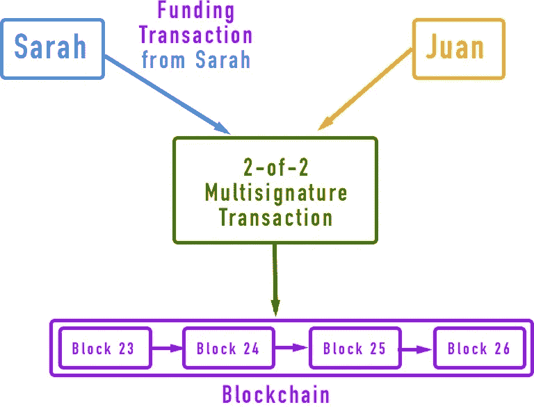
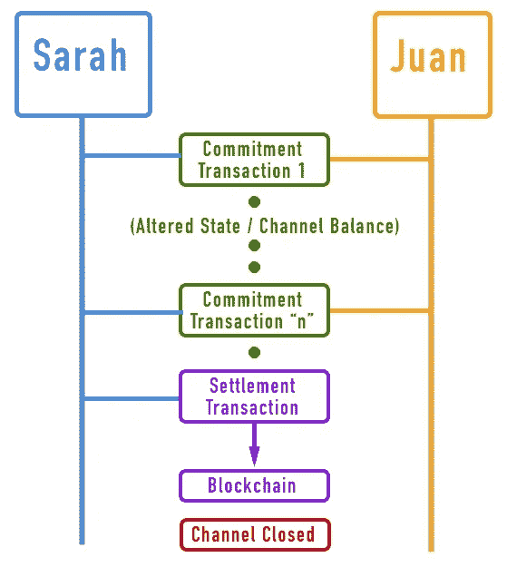
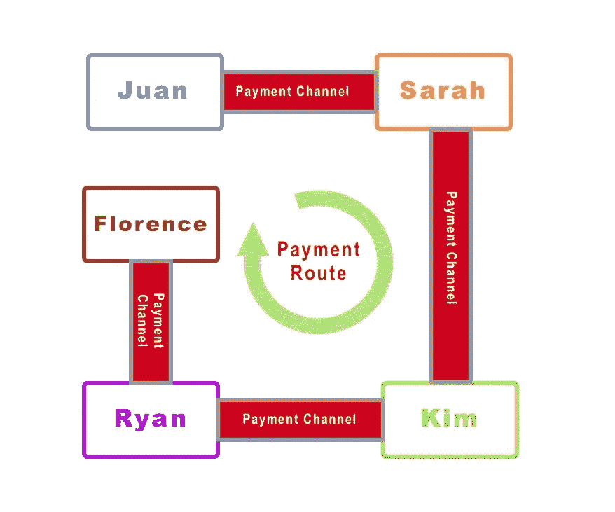

# 比特币的支付渠道

> 原文：<https://medium.com/coinmonks/payment-channels-in-bitcoin-470b28e47bb0?source=collection_archive---------1----------------------->

支付渠道是一个独立的解决方案，称为**第二层解决方案**。这是可能发展的，因为比特币网络有一定的保证，允许应用程序建立在它的基础上。支付渠道(例如闪电网络)是最受欢迎的渠道之一。允许支付渠道(和其他区块链应用)的比特币网络的一些保证是:

*   **控制法定人数**:通过脚本中的多重签名约束，比特币网络确保有法定人数来管理多个用户控制的资金。
*   **时间锁:**这确保了脚本只能在指定的时间锁之前或之后执行。
*   **没有双重花费**:这是这种分散共识算法的最重要的基础之一，任何 UTXO 都不能花费两次
*   **未过期**:一个有效的事务不会过期，所以它可以永远等待，直到被选中添加到区块链。
*   审查阻力**:任何拥有私钥的人都可以在没有任何审查的情况下使用 UTXO。**
*   **授权**:通过提供数字签名，网络只允许授权地址管理资金。

# **什么是支付渠道？**

> 支付通道是一种不可信的机制，用于在比特币区块链之外的双方之间交换比特币交易。

简而言之，它们是减轻区块链负担的机制，通过将大量交易移出区块链，转移到用户之间的私人路由通道，但仍依赖区块链的安全性。

## 现在让我们看看 ***状态通道*** 如何工作来说明基本概念:

1.  状态通道由双方通过锁定区块链上共享状态的事务建立。该交易被称为 ***【资金交易】*** 或 ***【锚定交易】。*** 这笔交易必须在区块链(mined)结算才能建立渠道。
2.  一旦资金交易已经结算，双方可以开始交换交易，称为 ***【承诺交易】*** 。这些交易在渠道关闭前保持‘离线’。当交换承诺交易时，双方使先前的状态无效，因此最后的状态或最新的交易状态是可以在区块链上兑现的状态。
3.  最后，可以通过向区块链提交最终的 ***【结算交易】*** 或者通过任一方向区块链提交最后的承诺交易来合作关闭通道。

只有两笔交易在区块链上结算，即***‘资金交易***’和***‘结算交易’***。在这两者之间，可以有尽可能多的*【承诺事务】，它们将改变共享状态，总是保持最后一个状态，以便在需要时随时准备好在区块链上结算。*

## ***支付渠道实例***

*让我们假设胡安和莎拉建立了一个支付渠道。莎拉想学习编码，胡安使用一种自动使用支付通道的流媒体软件，以每小时 0.25 比特币的价格教她。莎拉用 1 个比特币( ***【资助交易】)*** 资助通道。Sarah 使用她的 UTXO，并用 Juan 的地址生成一个多重签名输出。一旦交易被发送到区块链并被开采，通道就“有效”,然后教学会话开始。一个小时后，软件自动生成一个 ***承诺交易*** ，该交易改变渠道余额，将 0.25 比特币存入胡安的地址，并将 0.75 比特币退还给莎拉。当两个小时过去后，另一个 ***承诺事务*** 改变共享状态，导致 0.5 btc 总计到 Juan 的地址，0.5 BTC 到 Sarah 的地址。之后，Sarah 厌倦了所有的编码，并决定停止会话，Juan 或 Sarah 可以在区块链上传输最终的结算状态事务。这最后一笔交易( ***结算交易*** )向 Juan 支付了两个小时的编码会话，并向 Sarah 退还了资金交易的剩余比特币。这笔交易在区块链结算。请注意，资金交易只有一个比特币，因此在这种情况下，这是 ***【通道容量】*** 意味着该通道只允许 Juan 最多教授 4 个小时。*

**

*Funding transaction of a state channel*

**

*Series of transactions on a state channel*

> ***旁注:**这个例子有个问题。因为这些渠道需要一方提供资金交易，这可能导致不信任问题。假设莎拉上了 3 个小时的课，那么余额将是 0.75 比特币给胡安，0.25 比特币给莎拉，但是她为什么要将最后的余额作为结算交易传送给区块链呢？她可以发送第一笔交易(0.25 给胡安，0.75 给她)，并且当她有 3 节课时只支付一个小时的课时。这类问题可以用**【时间锁】****【非对称可撤销承诺】来解决。**我们不会在这篇博客文章中看到细节，但它基本上意味着该渠道上的每笔交易都有一个锁定的时间，如果时间锁过期，交易可以退款，交易还包括一个密钥，如果一方作弊，另一方可以惩罚。*

# ***哈希时间锁合约(HTLC)***

*如果我们想深入了解支付渠道的机制，我们必须了解什么是 **HTLC** 。 **HTLC** 是一种特殊的智能合约，用于支付渠道，允许参与者将资金投入到一个具有到期时间的可赎回秘密中。假设莎拉想要通过一个已经开放的支付渠道支付给胡安一个比特币。首先，Juan 必须生成一个只有 Juan 知道的秘密。其次，他将使用哈希函数对“ **R** ”秘密进行哈希运算，得到一个“ **H** ”哈希。*

> ***哈希(" R") = "H"***

*第三，他可以将散列“ **H** ”发送给莎拉，她可以进行交易，并将**“H”**散列放入锁脚本中，并带有指示赎回资金的时限的标志。现在，只有知道满足哈希条件的秘密**“R”**的人才能兑换比特币。时间限制是因为如果秘密**【R】**不被泄露， **HTLC** 的付款人可以在有限的时间过去后，或者更准确地说，在一定数量的区块后获得退款。*

# ***闪电网络(LN)***

*LN 是比特币区块链的扩展方法之一。这是一个端到端连接的双向支付渠道的路由网络，这意味着任何参与者都可以在渠道之间路由支付，而无需使用任何中介。*

*让我们看一个有五个参与者的例子；我们有不同的渠道连接胡安和莎拉，莎拉和金，金和瑞安，瑞安和佛罗伦萨。*

*因此， **Juan 想要支付 Florence 一个比特币**，但是他并没有直接连接到 Florence，并且他不想打开一个新的到 Florence 的直接通道，因为他必须投入更多的钱来打开 LN 通道。Juan 的 Lightning Node 有能力连接到 Sarah 的并发现支付通道之间的新路由，它也有能力通过互联网连接到 Florence 的 Node。正如我们之前看到的，**佛罗伦萨产生了一个只有她知道的秘密“R”**。她对其进行哈希处理，并将**哈希“H”**发送到胡安的节点。*

**

*The LN channels connection example*

*现在，胡安的节点创建了一个 **HTLC** ，支付给知道可以解决哈希**“H”**的秘密的人，带有 **10 块退款超时，**的金额为 **1.003** 比特币。你可能会问，我们为什么需要额外的 003 比特币？这笔额外的钱将用于补偿中间节点参与支付的路由。*

*胡安将 **HTLC** 发给莎拉；发送给莎拉的 **HTLC** 意味着，如果莎拉知道秘密，胡安将把他的频道余额的 1.003 支付给莎拉，或者如果 10 个街区过去，将退还给莎拉。莎拉并不知道索要被胡安锁定的 1.003 英镑的秘密，相反，她在给金姆的支付通道上创建了另一个 **HTLC** 。在这个 HTLC **上，莎拉将 1.002 比特币**交给一个知道秘密的人，以解决 **9 个区块**的哈希 **H** 。以同样的方式，Kim 将 1.001 的 HTLC 提交给她与 Ryan 的频道的 8 个块的散列“ **H** ”。从 Sarah 和 Kim 的角度来看，如果秘密**“R”**被知道，他们将各获得 0.001，如果不被知道，他们什么也不会失去。最后，Ryan 向 Florence 提供了一个 HTLC，用 1 个比特币兑换 7 个区块来散列“ **H** ”。**至此，佛罗伦萨知道了解决哈希“H”的秘密“R”！因此，她可以从瑞恩那里得到 HTLC。**她将“R”秘密发送给 Ryan** 并获得 1 个比特币。现在 Ryan 有了秘密**【R】**，所以他可以在他们的通道上要求 Kim 提交的 HTLC，并在他们的通道余额上获得 0.001 比特币。通过路线流回的秘密**“R”**允许每个参与者要求他们的通道余额的差异。这是参与者路由支付的激励，他们将“赌注”放在他们的个人渠道余额上(加上费用)，如果秘密被知道，他们可以索回他们的“赌注”并赚取费用。***

> *胡安已经付给弗洛伦斯 1 个比特币，却没有给她开通直接通道。支付路径中的中间方没有一方相互信任，他们会因帮助支付路径而赚取少量费用。很漂亮不是吗？无红利(ex-dividend)*

*这篇文章试图向你介绍支付渠道和闪电网络。我相信，在深入了解 LN 之前，对支付渠道有一个基本的了解是有好处的。网上有很多专门关于闪电网的信息，所以我就在这里完成这篇帖子。我希望你学到了一些新东西，你可以在 twitter 上关注我，了解区块链相关的新闻、话题和见解。*

# ***行动号召***

*如果你想深入了解，这里有更多关于 LN 的链接:*

*   *闪电网统计: [https://shabang.io](https://shabang.io)*
*   *LN 测试网 explorer & stats:【https://explorer.acinq.co *
*   *starblocks——在 LN 上用比特币买一杯咖啡！！(测试网):[https://starblocks.acinq.co/#/](https://starblocks.acinq.co/#/)*
*   *闪电网络拓扑视图:[https://lnmainnet . gaben . win](https://lnmainnet.gaben.win)*

> *如果您想了解更多关于区块链的信息，请加入我们的每周简讯，了解加密领域的所有新闻。*

> *[直接在您的收件箱中获得最佳软件交易](https://coincodecap.com/?utm_source=coinmonks)*

**